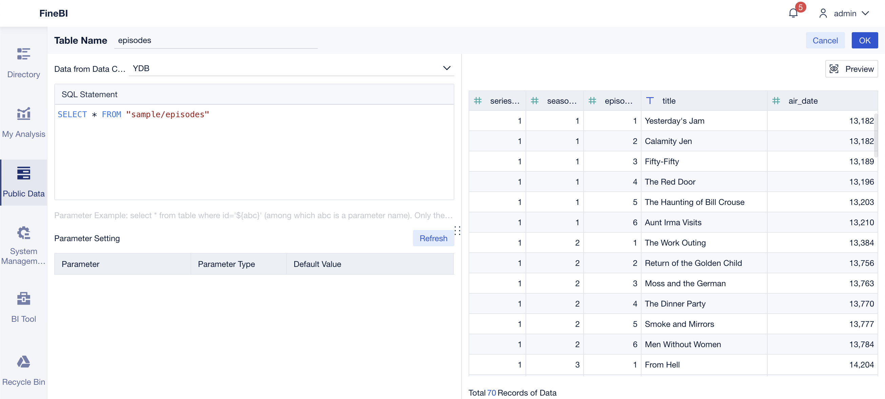
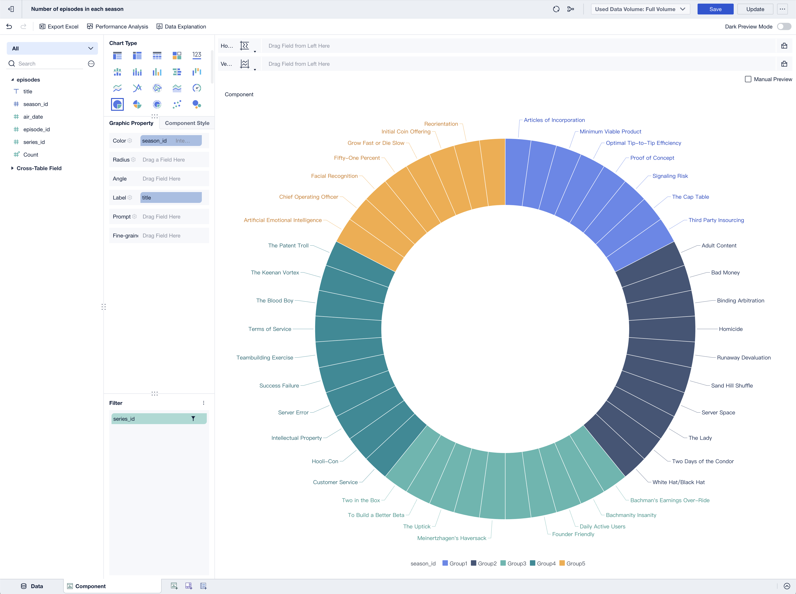

# FineBI

FineBI — это мощный инструмент для анализа больших данных. FineBI дает возможность организациям анализировать данные и делиться ими для принятия информированных решений. Он позволяет визуализировать необработанные данные, отслеживать ключевые показатели эффективности (KPI), идентифицировать тренды и прогнозировать будущие результаты.

[Режим совместимости с PostgreSQL в {{ ydb-short-name }}](../../postgresql/intro.md) позволяет использовать [FineBI](https://intl.finebi.com/) для выполнения запросов и визуализации данных из {{ ydb-short-name }}. В этом случае FineBI работает с {{ ydb-short-name }} как с PostgreSQL.



## Пререквизиты

Для работы понадобятся:

* [FineBI](https://intl.finebi.com/);
* PostgreSQL JDBC-драйвер, загруженный в FineBI.

    

    Скачать актуальный PostgreSQL JDBC-драйвер можно со [страницы загрузки](https://jdbc.postgresql.org/download/) сайта PostgreSQL. Чтобы загрузить JDBC-драйвер для PostgreSQL в FineBI, следуйте [инструкции](https://help.fanruan.com/finebi-en/doc-view-1540.html) в документации FineBI.

    

## Создание подключения к {{ ydb-short-name }} {#add-database-connection}

Чтобы создать подключение к {{ ydb-short-name }} из FineBI с использованием сетевого протокола PostgreSQL, выполните следующие шаги:

1. Войдите в аккаунт `admin` на FineBI.

1. Перейдите в **System Management** > **Data Connection** > **Data Connection Management**.

1. Нажмите кнопку **New Data Connection**.

1. Чтобы найти иконку PostgreSQL, в поле **Search** введите `postgresql`.

1. Нажмите иконку PostgreSQL.

1. Введите данные для подключения к {{ ydb-short-name }} в следующие поля:

    * **Data Connection Name** — наименование соединения с {{ ydb-short-name }} в FineBI.

    * **Driver** — драйвер для подключения FineBI к {{ ydb-short-name }}.

        Выберите `Custom` и установленный JDBC-драйвер `org.postgresql.Driver`.

    * **Database Name** — путь к [базе данных](../../concepts/glossary.md#database) в кластере {{ ydb-short-name }}, к которой будут выполняться запросы.

        

        Специальные символы в пути к базе данных должны быть [закодированы](https://en.wikipedia.org/wiki/Percent-encoding). Например, убедитесь, что все слэши (`/`) заменены на `%2F`.

        

    * **Host** — [эндпоинт](../../concepts/connect.md#endpoint) кластера {{ ydb-short-name }}, к которому осуществляется подключение.

    * **Port** — порт эндпоинта {{ ydb-short-name }}.

    * **Username** — логин для подключения к базе данных {{ ydb-short-name }}.

    * **Password** — пароль для подключения к базе данных {{ ydb-short-name }}.

    

1. Нажмите кнопку **Test Connection**.

    Если данные для подключения указаны верно, появится сообщение об удачном установлении соединения.

1. Чтобы сохранить подключение, нажмите кнопку **Save**.

    Созданное подключение к {{ ydb-short-name }} появится в списке **Data Connection**.

## Создание набора данных (SQL dataset) {#create-dataset}

Чтобы создать набор данных из таблицы {{ ydb-short-name }}, выполните следующие шаги:

1. В FineBI откройте вкладку **Public Data**.

1. Выберите папку, в которой вы хотите создать набор данных.

    

    У вас должны быть права [Public Data Management](https://help.fanruan.com/finebi-en/doc-view-5734.html) для выбранной папки в FineBI.

    

1. Нажмите кнопку **Add Dataset** и выберите **SQL Dataset** в выпадающем списке.

1. В поле **Table Name** введите наименование набора данных.

1. В выпадающем списке **Data from Data Connection** выберите подключение к YDB.

1. В поле **SQL Statement** введите текст SQL-запроса на получение всех колонок из таблицы {{ ydb-short-name }}. Например, `SELECT * FROM <YDB_table_name>`.

    

    Если вы хотите создать набор данных из таблицы, которая расположена в поддиректории {{ ydb-short-name }}, необходимо указать путь к таблице в самом наименовании таблицы. Например:

    ```yql
    SELECT * FROM "<path/to/subdirectory/table_name>";
    ```

    

1. Нажмите кнопку **Preview**, чтобы проверить SQL-запрос. Если SQL-запрос составлен правильно, появится таблица с данными в правой части страницы.

    

1. Чтобы сохранить набор данных, нажмите кнопку **OK**.

После создания наборов данных вы можете использовать данные из {{ ydb-short-name }} для создания диаграмм в FineBI. См. документацию [FineBI](https://help.fanruan.com/finebi-en/).


## Создание диаграммы {#create-chart}

Теперь давайте создадим пример диаграммы с использованием набора данных из таблицы `episodes`, [создание](../../dev/yql-tutorial/create_demo_tables.md) и [наполнение данными](../../dev/yql-tutorial/fill_tables_with_data.md) которой описано в [Туториале по YQL](../../dev/yql-tutorial/index.md). Мы создадим круговую диаграмму, в которой будет видно, сколько серий содержит каждый сезон сериала.

Таблица `episodes` содержит следующие колонки:

* `series_id`;
* `season_id`;
* `episode_id`;
* `title`;
* `air_date`.

Чтобы создать диаграмму, выполните следующие шаги:

1. В FineBI откройте вкладку **My Analysis**.

1. Нажмите кнопку **New Subject**.

    Откроется диалоговое окно **Select Data**.

1. В открывшемся окне **Select Data** выберите набор данных для таблицы `episodes` и нажмите кнопку **OK**.

1. Откройте вкладку **Component** внизу страницы.

1. На панели **Chart Type** нажмите иконку **Pie Chart**.

1. В списке колонок набора данных `episodes` нажмите стрелку рядом с колонкой `episode_id` и выберите пункт **Convert to Dimension** в выпадающем списке.

    

1. Перетащите колонку `season_id` в поле **Color**.

1. Перетащите колонку `title` в поле **Label**.

1. Перетащите колонку `series_id` в поле **Filter**.

    Откроется диалоговое окно **Add Filter to episodes.series_id**.

1. В открывшемся окне **Add Filter to episodes.series_id** выберите пункт `Detailed Value` и нажмите кнопку **Next Step**.

1. Укажите следующее условие:

    `series_id` `Equal To` `Fixed Value` `2`

1. Нажмите кнопку **OK**.

    Диаграмма будет использовать данные только для сериала с идентификатором `2`.

    

1. Нажмите кнопку **Save**.