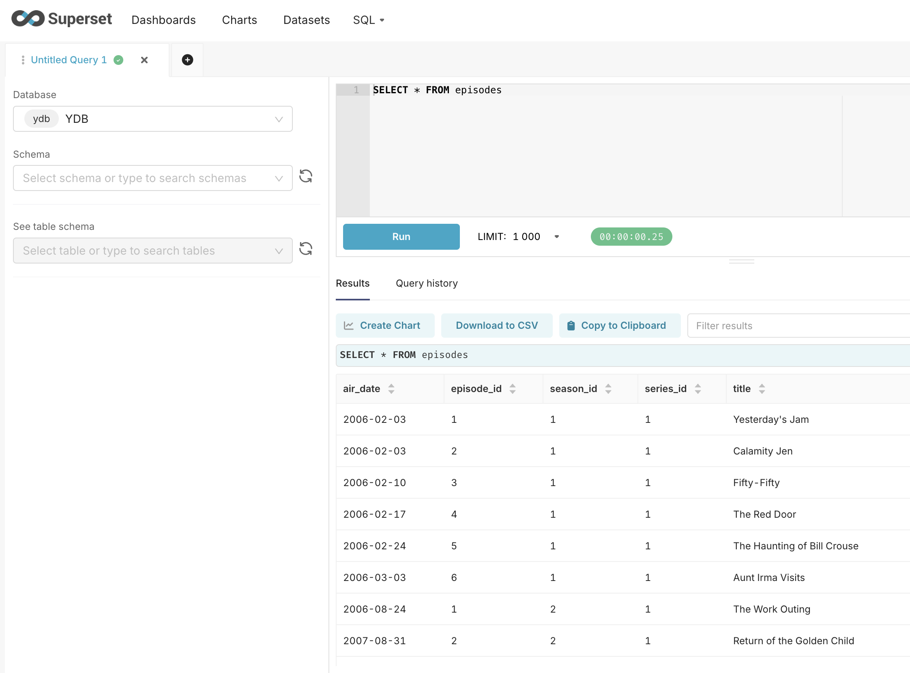

# Apache Superset

Apache Superset — это современная платформа для анализа и визуализации данных.

## Установка необходимых зависимостей

Для работы с {{ ydb-short-name }} необходимо установить драйвер [ydb-sqlalchemy](https://pypi.org/project/ydb-sqlalchemy).

В зависимости от инсталляции Superset сделать это можно разными способами, обратитесь к [официальной документации](https://superset.apache.org/docs/configuration/databases/#installing-drivers-in-docker-images) за дополнительной информацией.

## Создание подключения к {{ ydb-short-name }} {#add-database-connection}

Чтобы создать подключение к {{ ydb-short-name }} из Apache Superset, выполните следующие шаги:

1. В верхнем меню Apache Superset наведите курсор на **Settings** и выберите в выпадающем списке пункт **Database Connections**.
1. Нажмите кнопку **+ DATABASE**.

    Откроется окно мастера **Connect a database**.

1. На первом шаге мастера выберите **YDB** из списка **Supported databases**.
1. На втором шаге мастера введите данные для подключения к {{ ydb-short-name }} в следующие поля:

    * **Display Name** — наименование соединения с {{ ydb-short-name }} в Apache Superset.
    "ydb://{host}:{port}/{database_name}"
    * **SQLAlchemy URI** — строка вида `ydb://{host}:{port}/{database_name}`, где **host** и **port** это часть [эндпоинта](../../concepts/connect.md#endpoint) кластера {{ ydb-short-name }}, к которому осуществляется подключение, **database_name** - путь к [базе данных](../../concepts/glossary.md#database)

    

1. Нажмите кнопку **CONNECT**.
1. Нажмите кнопку **FINISH**, чтобы сохранить подключение.

Для дополнительной информации о возможностях конфигурации соединения обратитесь к [разделу YDB официальной документации](https://superset.apache.org/docs/configuration/databases#ydb).

## Создание набора данных (dataset) {#create-dataset}

Чтобы создать набор данных из таблицы {{ ydb-short-name }}, выполните следующие шаги:

1. В верхнем меню Apache Superset наведите курсор на кнопку **+** и выберите в выпадающем списке пункт **SQL query**.
1. В выпадающем списке **DATABASE** выберите подключение к {{ ydb-short-name }}.

1. Введите текст SQL-запроса в правой части страницы. Например, `SELECT * FROM <наименование_таблицы>`.

    

    Если вы хотите создать набор данных из таблицы, которая расположена в поддиректории {{ ydb-short-name }}, необходимо указать путь к таблице в самом наименовании таблицы. Например:

    ```yql
    SELECT * FROM "<путь/к/таблице/наименование_таблицы>";
    ```

    

1. Нажмите кнопку **RUN**, чтобы проверить SQL-запрос.

    

1. Нажмите на стрелку рядом с кнопкой **SAVE** и выберите **Save dataset** в выпадающем списке.

    Откроется диалоговое окно **Save or Overwrite Dataset**.

1. В открывшемся окне **Save or Overwrite Dataset** выберите **Save as new**, введите наименование набора данных и нажмите **SAVE & EXPLORE**.

После создания наборов данных вы можете использовать данные из {{ ydb-short-name }} для создания диаграмм в Apache Superset. См. документацию [Apache Superset](https://superset.apache.org/docs/intro/).

## Создание диаграммы {#create-chart}

Теперь давайте создадим пример диаграммы с использованием набора данных из таблицы `episodes`, которая описана в [Туториале по YQL](../../dev/yql-tutorial/index.md).

Таблица `episodes` содержит следующие колонки:

* series_id;
* season_id;
* episode_id;
* title;
* air_date.

Предположим, что мы хотим построить круговую диаграмму, в которой бы было видно, сколько серий содержит каждый сезон сериала.

Чтобы создать диаграмму, выполните следующие шаги:

1. В верхнем меню Apache Superset наведите курсор на **+** и выберите в выпадающем списке пункт **Chart**.
1. В выпадающем списке **Choose a dataset**, выберите набор данных из таблицы `episodes`.
1. На панели **Choose chart type**, выберите тип диаграммы `Pie chart`.
1. Нажмите кнопку **CREATE NEW CHART**.
1. На панели **Query** настройте диаграмму:

    * В выпадающем списке **DIMENSIONS** выберите колонку `season_id`.
    * В поле **METRIC** введите функцию `COUNT(title)`.
    * В поле **FILTERS** введите фильтр `series_id in (2)`.

1. Нажмите кнопку **CREATE CHART**.

    Круговая диаграмма появится на панели справа.

    

1. Нажмите кнопку **SAVE**.

    Откроется диалоговое окно **Save chart**.

1. В открывшемся окне **Save chart** в поле **CHART NAME** введите наименование диаграммы.
1. Нажмите кнопку **SAVE**.