# Блобовница

Блобовница расширяет функциональность подсистемы хранения, добавляя функциональность виртуальной группы.

Виртуальная группа наравне с физической группой является единицей отказоустойчивости подсистемы хранения в кластере, однако свои данные виртуальная группа хранит в других группах (в отличие от физической, которая данные хранит на VDisk'ах).

Такой способ хранения данных даёт возможность более гибко использовать подсистему хранилища {{ ydb-name }}, в частности:

* использовать более "тяжёлые" таблетки в условиях, когда размер одной физической группы ограничен;
* предоставлять таблеткам более широкую полосу на запись за счёт балансировки записи сразу по всем группам, поверх которых запущена блобовница;
* обеспечивать прозрачную для клиентских таблеток миграцию данных между разными группами;
* ...

Блобовница также может использоваться для декомиссии групп, то есть для удаления VDisk'а внутри физической группы с сохранением всех данных, которые были записаны в эту группу. В таком сценарии использования данные из физической группы прозрачным для клиента образом переносятся в виртуальную, затем все VDisk'и физической группы удаляются для освобождения занимаемых ими ресурсов.

## Режим виртуальной группы

В режиме виртуальной группы блобовница позволяет объединять несколько групп в единое пространство для хранения большого объёма данных. Предусмотрена балансировка по занятому месту, а также увеличение пропускной способности за счёт распределения записей по разным группам. При этом возможен фоновый (при этом полностью прозрачный для клиента) перенос данных.

Виртуальные группы создаются также внутри Storage Pool'ов, как и физические группы, но для виртуальных групп рекомендуется создавать отдельный пул командой `dstool pool create virtual`. Эти пулы могут быть указаны в Hive для создания других таблеток.  Однако во избежание ухудшения latency каналы 0 и 1 таблеток рекомендуется селить на физические группы, а на виртуальные группы с блобовницей селить только каналы данных.

### Как запускать {#vg-create-params}

Виртуальная группа создаётся через BS\_CONTROLLER путём передачи специальной команды. Команда создания виртуальной группы идемпотентна, поэтому для исключения создания лишних блобовниц каждой виртуальной группе ставится в соответствие название.  Название должно быть уникально в рамках всего кластера. В случае повторного исполнения команды вернётся ошибка с заполненным полем `Already: true` и указанием номера уже созданной ранее виртуальной группы.

```bash
dstool -e ... --direct group virtual create --name vg1 vg2 --hive-id=72057594037968897 --storage-pool-name=/Root:virtual --log-channel-sp=/Root:ssd --data-channel-sp=/Root:ssd*8
```

Параметры командной строки:

* --name уникальное имя для виртуальной группы (или нескольких виртуальных групп со схожими параметрами);
* --hive-id=N номер таблетки Hive, которая будет управлять данной блобовницей; необходимо указывать Hive того тенанта, внутри которого запускается блобовница;
* --storage-pool-name=POOL\_NAME название Storage Pool, внутри которого необходимо создать блобовницу;
* --storage-pool-id=BOX:POOL альтернатива `--storage-pool-name`, в которой можно указать явный числовой идентификатор пула;
* --log-channel-sp=POOL\_NAME название пула, в котором будет размещён канал 0 таблетки блобовницы;
* --snapshot-channel-sp=POOL\_NAME название пула, в котором будет размещён кана 0 таблетки блобовницы; если не указан, то используется значение из --log-channel-sp;
* --data-channel-sp=POOL\_NAME[\*COUNT] название пула, в котором размещаются каналы данных; если указан параметр COUNT (после знака "звёздочка"), то создаётся COUNT каналов данных в указанном пуле; рекомендуется заводить большое количество каналов данных для блобовницы в режиме виртуальной группы (64..250), чтобы наиболее эффективно использовать хранилище;
* --wait дождаться завершения создания блобовниц; если эта опция не указана, то команда завершается сразу же после ответа на запрос о создании блобовницы, не дожидаясь создания и запуска самих таблеток.

### Как проверить, что всё запустилось {#vg-check-running}

Посмотреть результат создания виртуальной группы можно следующими способами:

* через страницу мониторинга BS\_CONTROLLER;
* через команду `dstool group list --virtual-groups-only`.

В обоих случаях контролировать создание нужно через поле VirtualGroupName, которое должно совпадать с тем, что было передано в параметре --name. Если команда `dstool group virtual create` завершилась успехом, виртуальная группа безусловно появляется в списке групп, но при этом поле VirtualGroupState может принимать одно из следующих значений:

* NEW — группа ожидает инициализации (идёт создание таблетки через Hive, её настройка и запуск);
* WORKING — группа создана и работает, готова выполнять пользовательские запросы;
* CREATE\_FAILED — при создании группы случилась ошибка, текстовое описание которой можно увидеть в поле ErrorReason.

```
$ dstool --cluster=$CLUSTER --direct group list --virtual-groups-only
┌────────────┬──────────────┬───────────────┬────────────┬────────────────┬─────────────────┬──────────────┬───────────────────┬──────────────────┬───────────────────┬─────────────┬────────────────┐
│ GroupId    │ BoxId:PoolId │ PoolName      │ Generation │ ErasureSpecies │ OperatingStatus │ VDisks_TOTAL │ VirtualGroupState │ VirtualGroupName │ BlobDepotId       │ ErrorReason │ DecommitStatus │
├────────────┼──────────────┼───────────────┼────────────┼────────────────┼─────────────────┼──────────────┼───────────────────┼──────────────────┼───────────────────┼─────────────┼────────────────┤
│ 4261412864 │ [1:2]        │ /Root:virtual │ 0          │ none           │ DISINTEGRATED   │ 0            │ WORKING           │ vg1              │ 72075186224037888 │             │ NONE           │
│ 4261412865 │ [1:2]        │ /Root:virtual │ 0          │ none           │ DISINTEGRATED   │ 0            │ WORKING           │ vg2              │ 72075186224037890 │             │ NONE           │
│ 4261412866 │ [1:2]        │ /Root:virtual │ 0          │ none           │ DISINTEGRATED   │ 0            │ WORKING           │ vg3              │ 72075186224037889 │             │ NONE           │
│ 4261412867 │ [1:2]        │ /Root:virtual │ 0          │ none           │ DISINTEGRATED   │ 0            │ WORKING           │ vg4              │ 72075186224037891 │             │ NONE           │
└────────────┴──────────────┴───────────────┴────────────┴────────────────┴─────────────────┴──────────────┴───────────────────┴──────────────────┴───────────────────┴─────────────┴────────────────┘
```

## Устройство

Блобовница является таблеткой, которая в дополнение к двум системным каналам (0 и 1) содержит также набор дополнительных каналов, в которых хранятся сами данные, записанные в блобовницу. Клиентские данные записываются в эти дополнительные каналы.

Блобовница как таблетка может быть запущена на любом узле кластера.

Когда блобовница работает в режиме виртуальной группы, то для доступа к ней используются агенты (BlobDepotAgent). Это акторы, выполняющие функции, аналогичные DS proxy — они запускаются на каждом узле, который использует виртуальную группу с блобовницей. Эти же акторы преобразуют запросы к хранилищу в команды для блобовницы и обеспечивают обмен данными с ней.

## Механизмы диагностики

Для диагностики работоспособности блобовницы предусмотрен следующий ряд механизмов:

* [страница мониторинга BS\_CONTROLLER](#diag-bscontroller);
* [страница мониторинга блобовницы](#diag-blobdepot);
* [internal viewer](#diag-viewer);
* [журнал событий](#diag-log);
* [графики](#diag-sensors).

### Страница мониторинга BS\_CONTROLLER {#diag-bscontroller}

На странице мониторинга BS\_CONTROLLER существует специальная вкладка Virtual groups, в которой показаны все группы, которые используют блобовницу:

<center>

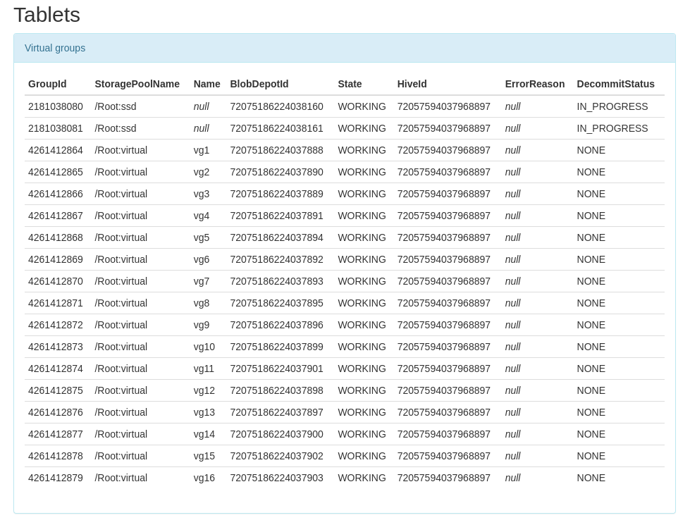

</center>

В таблице предусмотрены следующие столбцы:

Поле | Описание
---- | --------
GroupId | Номер группы.
StoragePoolName | Название пула, в котором находится группа.
Name | Название виртуальной группы; оно уникальное на весь кластер. Для декомиссуемых групп здесь будет null.
BlobDepotId | Номер таблетки блобовницы, которая отвечает за обслуживание данной группы.
State | [Состояние блобовницы](#vg-check-running); может быть NEW, WORKING, CREATED\_FAILED.
HiveId | Номер таблетки Hive, внутри которой была создана указанная блобовница.
ErrorReason | При состоянии CREATE\_FAILED содержит текстовое описание причины ошибки создания.
DecommitStatus | [Состояние декомиссии группы](#decommit-check-running); может быть NONE, PENDING, IN\_PROGRESS, DONE.

### Страница мониторинга блобовницы {#diag-blobdepot}

На странице мониторинга блобовницы представлены основные параметры работы таблетки, которые сгруппированы по вкладкам, доступным по ссылке "Contained data":

* [data](#mon-data)
* [refcount](#mon-refcount)
* [trash](#mon-trash)
* [barriers](#mon-barriers)
* [blocks](#mon-blocks)
* [storage](#mon-storage)

Кроме этого, на основной странице приведены краткие сведения о состоянии блобовницы:

<center>

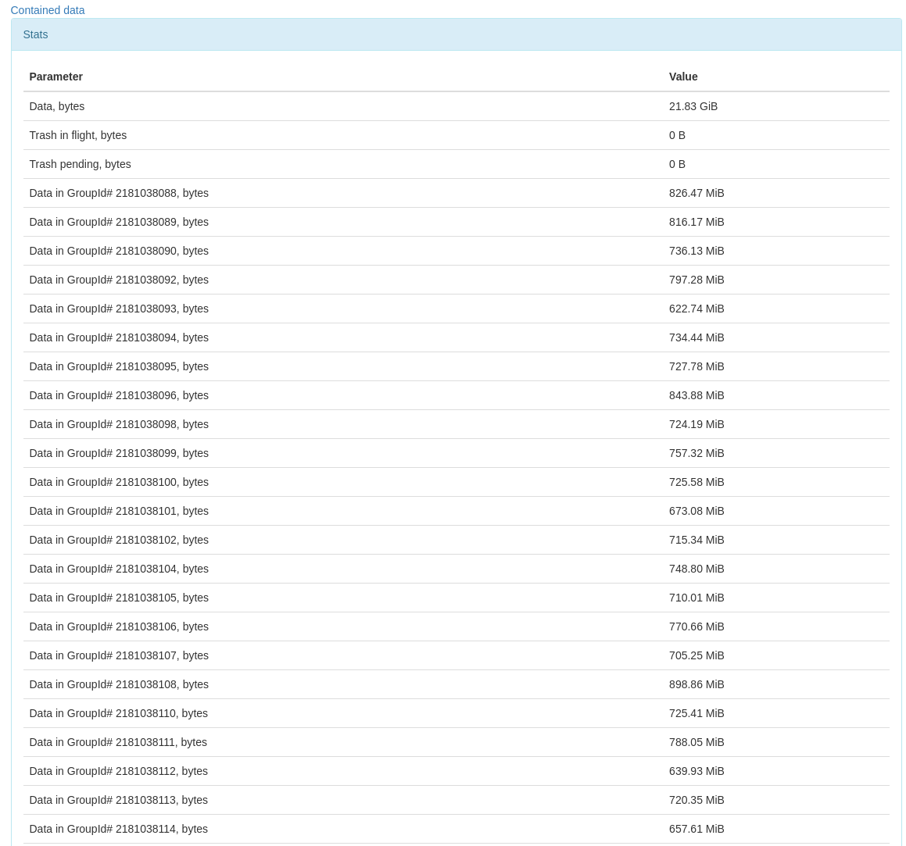

</center>

В данной таблице приведены следующие данные:

* Data, bytes — количество сохранённых байт данных ([TotalStoredDataSize](#diag-sensors)).
* Trash in flight, bytes — количество байт ненужных данных, которые ожидают завершения транзакций, чтобы стать мусором ([InFlightTrashSize](#diag-sensors)).
* Trash pending, bytes — количество байт мусора, которые ещё не переданы в сборку мусора ([TotalStoredTrashSize](#diag-sensors)).
* Data in GroupId# XXX, bytes — количество байт данных в группе XXX (как полезные данные, так и ещё не собранный мусор).

<center>

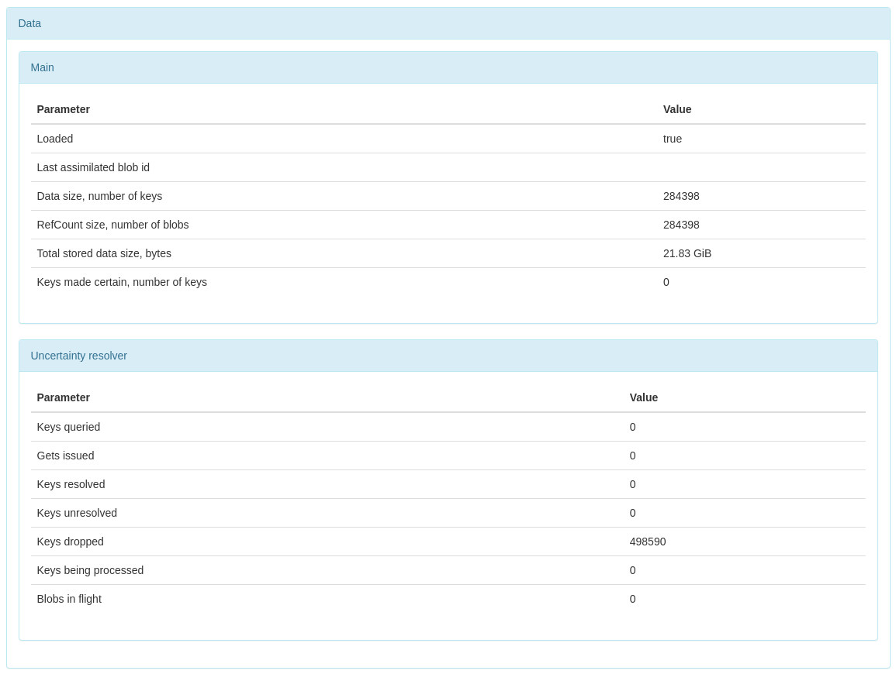

</center>

Назначения параметров следующие:

* Loaded — булевое значение, показывающее, загружены ли все метаданные из локальной базы таблетки в память.
* Last assimilated blob id — BlobId последнего вычитанного блоба (копирование метаданных при декомиссии).
* Data size, number of keys — количество сохранённых ключей данных.
* RefCount size, number of blobs — количество уникальных блобов данных, которые хранит блобовница в своём пространстве имён.
* Total stored data size, bytes — аналогично "Data, bytes" из таблицы выше.
* Keys made certain, number of keys — количество недописанных ключей, которые были затем подтверждены чтением.

Раздел "Uncertainty resolver" относится к компоненту, который работает с записанными, но не подтверждённым в блобовницу данными.

#### data {#mon-data}

<center>

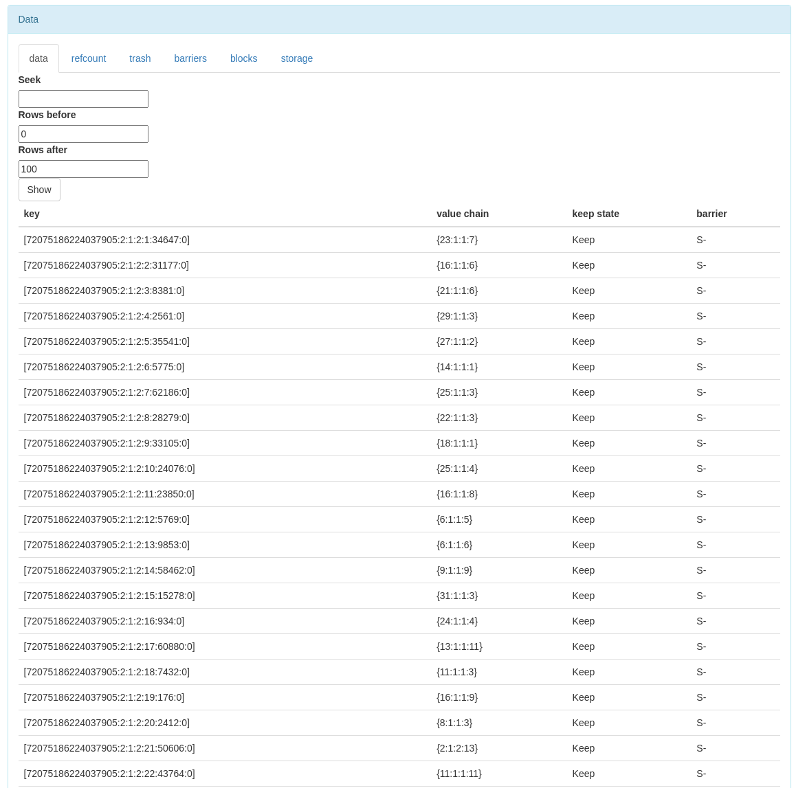

</center>

Таблица data содержит следующие столбцы:

* key — идентификатор ключа (BlobId в пространстве имён клиента);
* value chain — значение ключа, которое формируется конкатенацией фрагментов блобов из пространства имён блобовницы (в этом поле перечислены эти самые блобы);
* keep state — значение keep-флагов для данного блоба глазами клиента (Default, Keep, DoNotKeep);
* barrier — поле, показывающее, под какой барьер попадает данный блоб (S — под soft-барьер, H — под hard-барьер; фактически H никогда не бывает, т.к. блобы синхронно удаляются из таблицы в момент выставления hard-барьера).

Учитывая потенциально большой размер таблицы, на странице мониторинга показывается только её часть. Для поиска нужного блоба можно заполнить поле "seek", введя в нём BlobId искомого блоба, а затем указать число интересующих строк до этого блоба и после него и нажать кнопку "Show".

#### refcount {#mon-refcount}

<center>

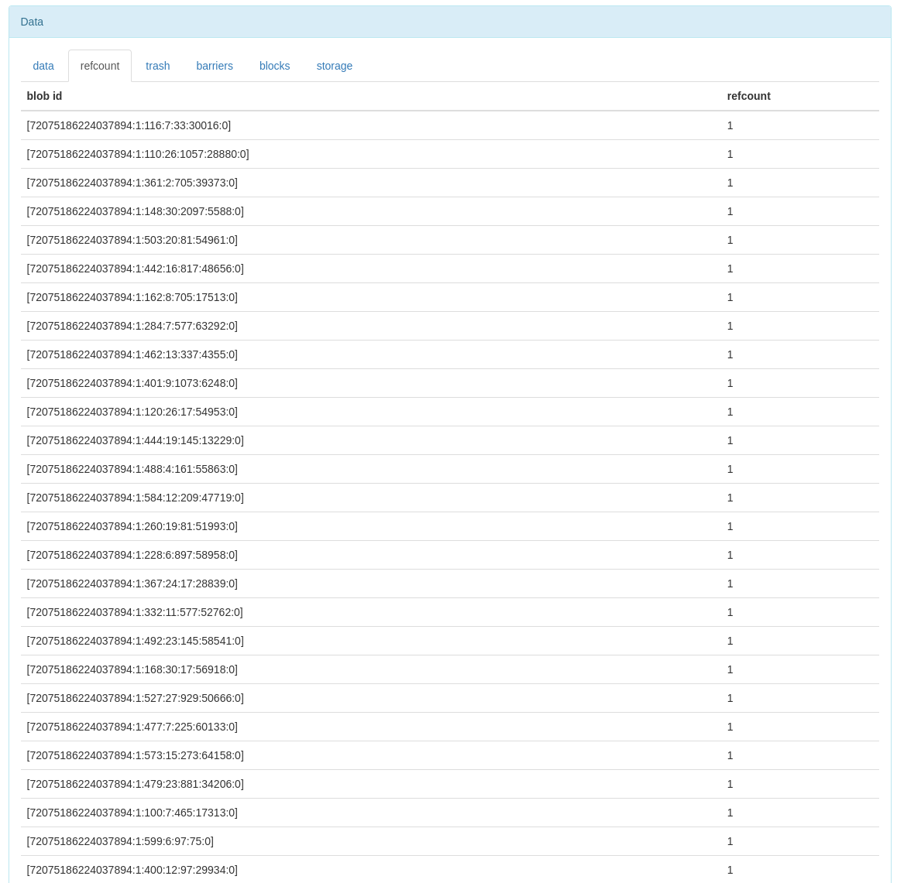

</center>

Таблица refcount содержит два столбца: "blob id" и "refcount". Blob id — это идентификатор хранимого блоба, который записан от имени блобовницы в хранилище. Refcount — количество ссылок на этот блоб из таблицы data (из столбца value chain).

Метрика TotalStoredDataSize формируется из суммы размеров всех блобов в этой таблице, каждый из которых учитывается ровно один раз, без учёта поля refcount.

#### trash {#mon-trash}

<center>

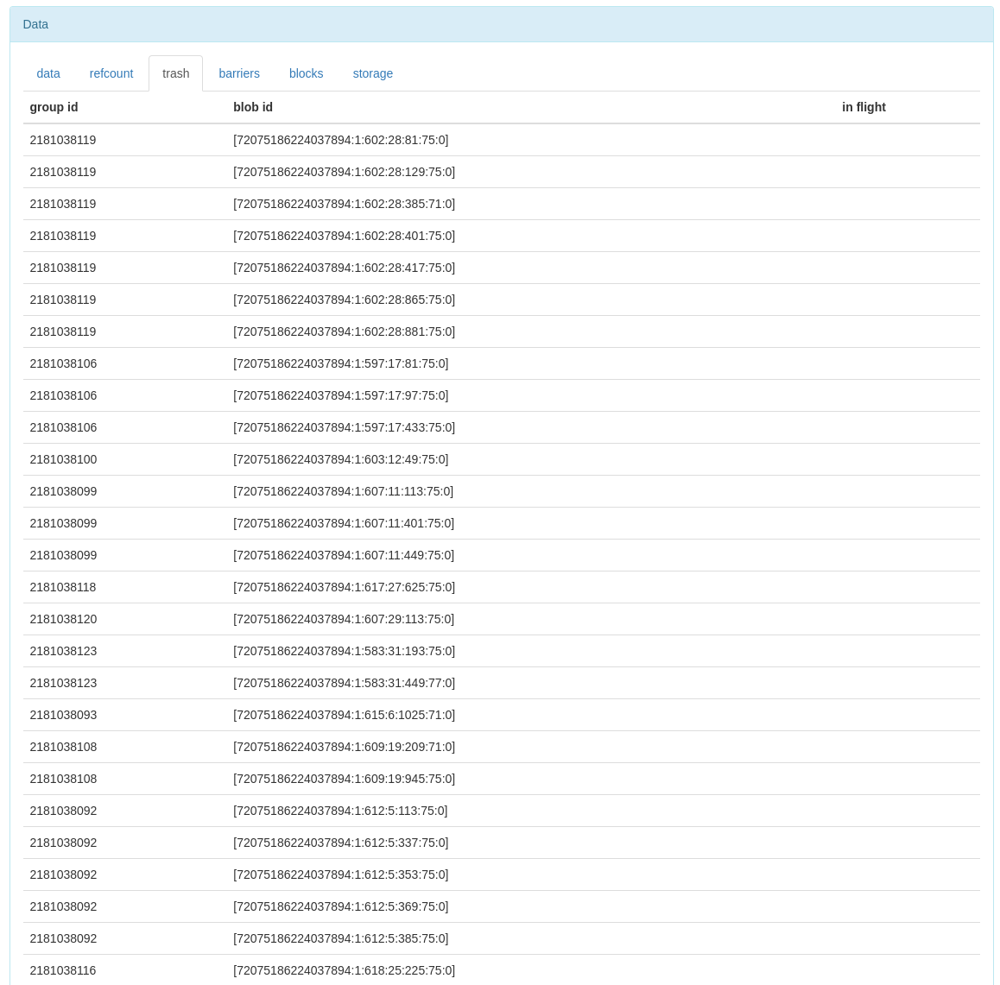

</center>

Таблица содержит три столбца: "group id", "blob id" и "in flight". Group id — номер группы, в которой сохранён более не нужный блоб. Blob id — идентификатор самого блоба. In flight — признак того, чтоб блоб ещё проходит через транзакцию, только по результатам которой его можно будет передавать в сборщик мусора.

Метрики TotalStoredTrashSize и InFlightTrashSize формируются этой этой таблицы суммированием размеров блобов без признака in flight и с ним, соответственно.

#### barriers {#mon-barriers}

<center>

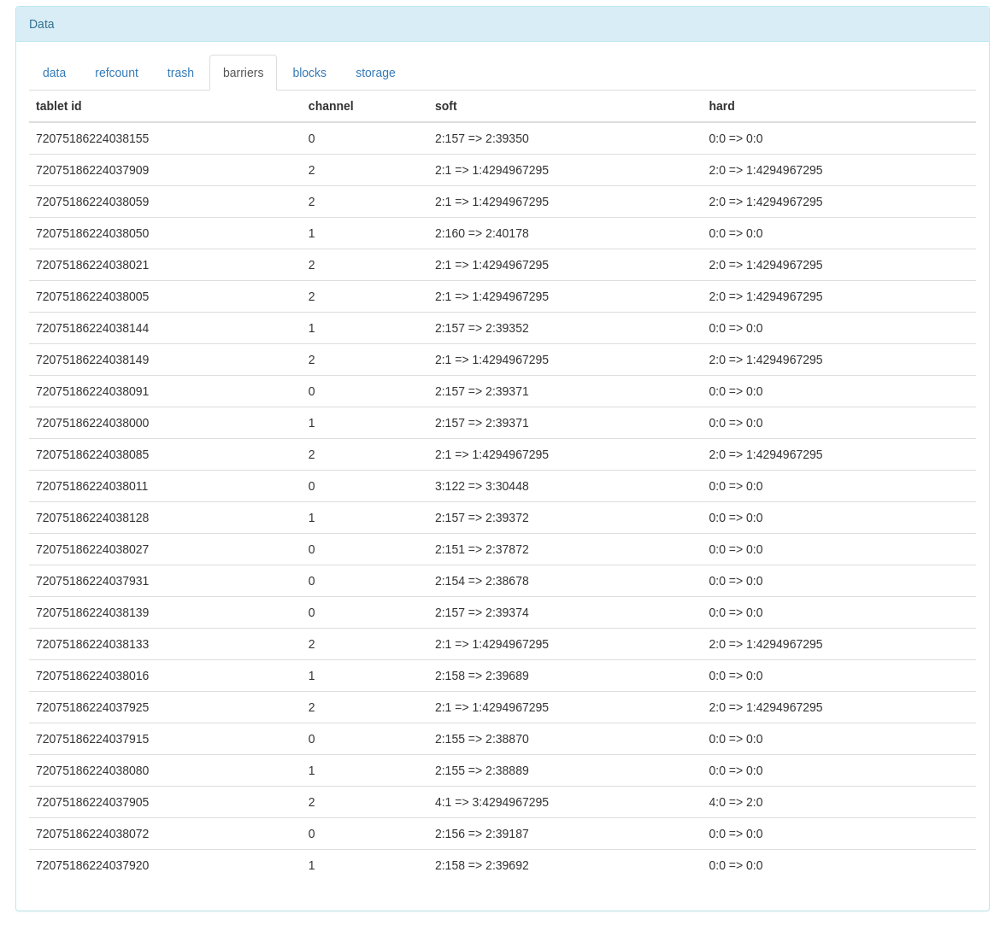

</center>

Таблица barriers содержит информацию о клиентских барьерах, которые были переданы в блобовницу. Она состоит из столбцов "tablet id" (номер таблетки), "channel" (номер канала, для которого записан барьер), а также значений барьеров: "soft" и "hard". Значение имеет формат gen:counter => collect\_gen:collect\_step, где gen — номер поколения таблетки, в котором был выставлен данный барьер, counter — порядковый номер команды сборки мусора, collect\_gen:collect\_step — значение барьера (удаляются все блобы, у которых поколение и шаг внутри поколения меньше либо равны указанному барьеру).

#### blocks {#mon-blocks}

<center>

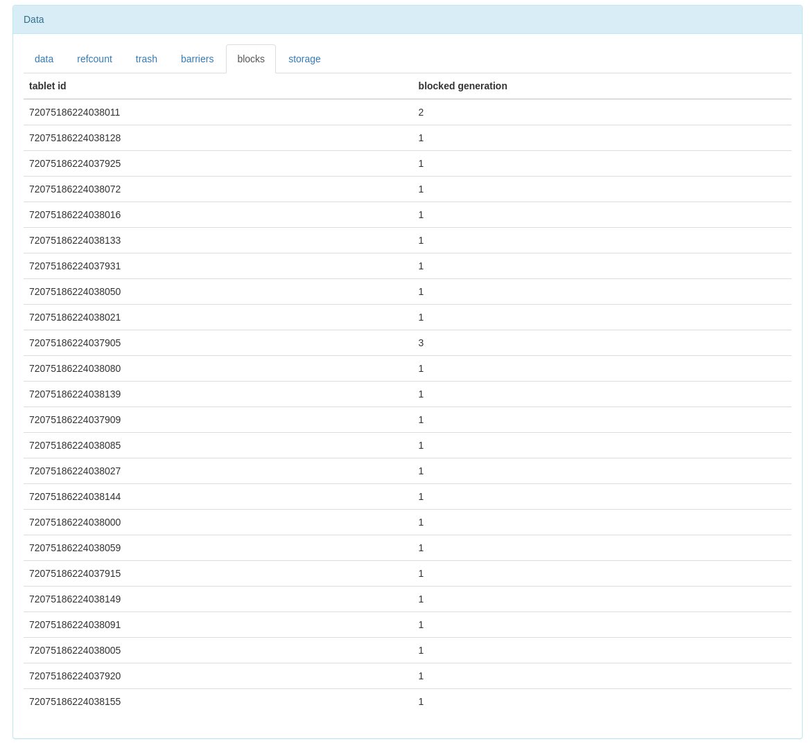

</center>

Таблица blocks содержит список блокировок клиентских таблеток и состоит из столбцов "tablet id" (номер таблетки) и "blocked generation" (номер поколения этой таблетки, в котором уже нельзя ничего писать).

#### storage {#mon-storage}

<center>

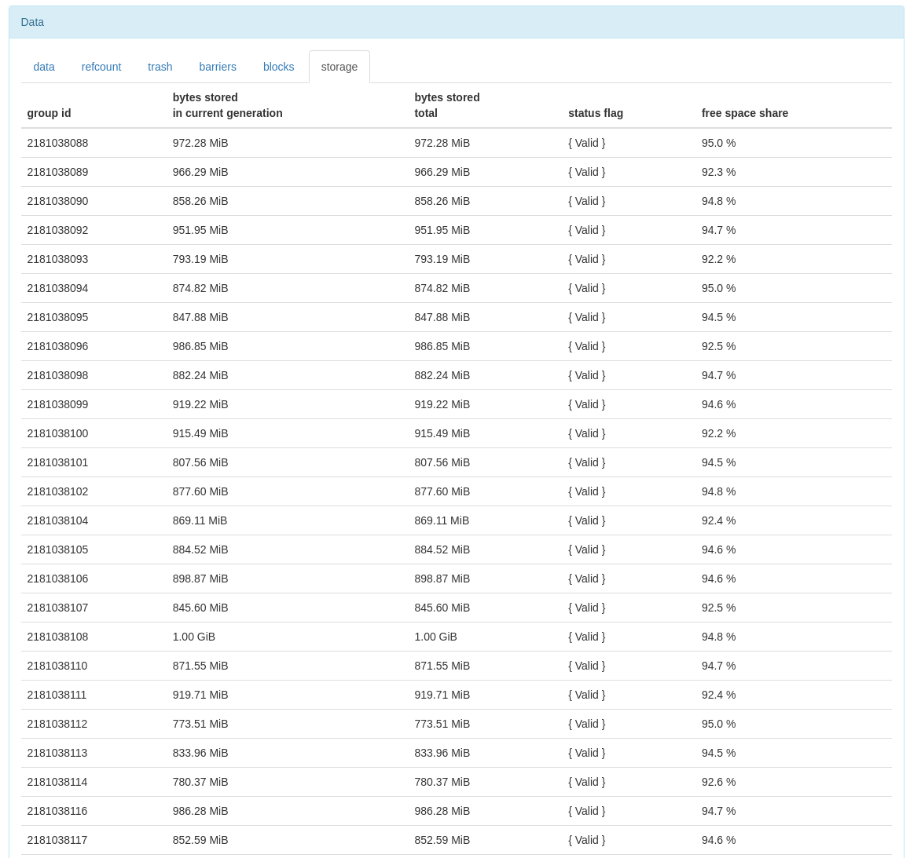

</center>

Таблица storage показывает статистику по хранимым данным для каждой группы, в которой блобовница хранит данные. Эта таблица содержит следующие столбцы:

* group id — номер группы, в которой хранятся данные;
* bytes stored in current generation — объём данных, записанных в эту группу в текущем поколении таблетки (считаются только полезные данные, без учёта мусора);
* bytes stored total — объём всех данных, сохранённых этой блобовницей в указанную группу;
* status flag — цветовые флажки состояния группы;
* free space share — показатель заполненности группы (значение 0 соответствует полностью заполненной по месту группе, 1 — полностью свободной).

### Internal viewer {#diag-viewer}

На странице мониторинга Internal viewer, показанной ниже, блобовницы можно увидеть в разделах Storage и в виде таблеток BD.

В разделе Nodes видны таблетки BD, запущенные на разных узлах системы:

<center>

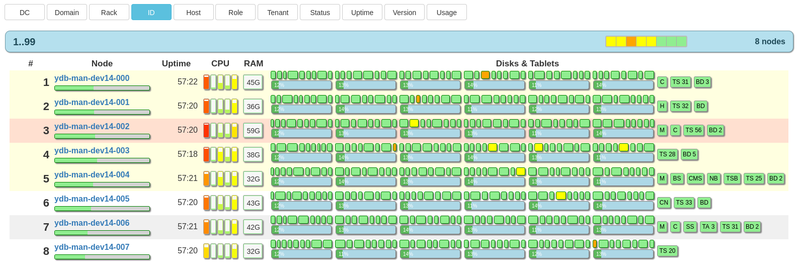

</center>

В разделе Storage можно увидеть виртуальные группы, которые работают через блобовницу. Их можно отличить ссылке с текстом BlobDepot в столбце Erasure. Ссылка в этом столбце ведёт на страницу мониторинга таблетки. В остальном виртуальные группы отображаются так же, за исключением того, что у них нет PDisk и VDisk. Однако декомиссуемые группы будут выглядеть так же, как и виртуальные, но иметь PDisk и VDisk до тех пор, пока декомиссия не закончится.

<center>

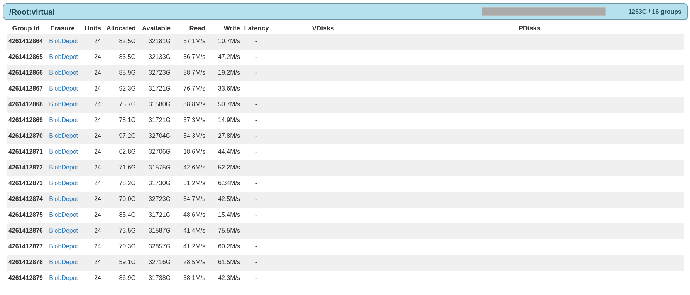

</center>

### Журнал событий {#diag-log}

Таблетка блобовницы пишет события в журнал со следующими названиями компонентов:

* BLOB\_DEPOT — компонент таблетки блобовницы.
* BLOB\_DEPOT\_AGENT — компонент агента блобовницы.
* BLOB\_DEPOT\_TRACE — специальный компонент для отладочной трассировки всех событий, связанных с данными.

BLOB\_DEPOT и BLOB\_DEPOT\_AGENT выводятся в виде структурированных записей, в которых есть поля, позволяющие идентифицировать блобовницу и группу, которую она обслуживает. Для BLOB\_DEPOT это поле Id и оно имеет формат {TabletId:GroupId}:Generation, где TabletId — номер таблетки блобовницы, GroupId — номер группы, которую она обслуживает, Generation — поколение, в котором запущенная блобовница пишет сообщения в журнал. Для BLOB\_DEPOT\_AGENT это поле назвается AgentId и имеет формат {TabletId:GroupId}.

На уровне DEBUG в журнал будут записываться большинство происходящих событий, как на стороне таблетки, так и на стороне агента. Этот режим используется для отладки и не рекомендуется в условиях production-сред из-за большого числа генерируемых событий.

### Графики {#diag-sensors}

Каждая таблетка блобовницы выдаёт следующие графики:

График               | Тип          | Описание
-------------------- | ------------ | --------
TotalStoredDataSize  | простой      | Количество сохранённых пользовательских данных нетто (если есть несколько ссылок на один блоб, он учитывается единожды).
TotalStoredTrashSize | простой      | Количество байт в мусорных данных, которые уже не нужны, но ещё не переданы в сборку мусора.
InFlightTrashSize    | простой      | Количество байт мусора, которые ещё ждут подтверждения записи в локальную базу (их ещё нельзя даже начать собирать).
BytesToDecommit      | простой      | Количество байт данных, которые осталось [декомиссовать](#decommit-progress) (в случае, если эта блобовница работает в режиме декомиссии группы).
Puts/Incoming        | кумулятивный | Скорость поступления запросов на запись (в штуках в единицу времени).
Puts/Ok              | кумулятивный | Количество успешно выполненных запросов на запись.
Puts/Error           | кумулятивный | Количество запросов на запись, завершённых с ошибкой.
Decommit/GetBytes    | кумулятивный | Скорость чтения данных при [декомиссии](#decommit-progress).
Decommit/PutOkBytes  | кумулятивный | Скорость записи данных при [декомиссии](#decommit-progress) (учитываются только успешно выполненные записи).
