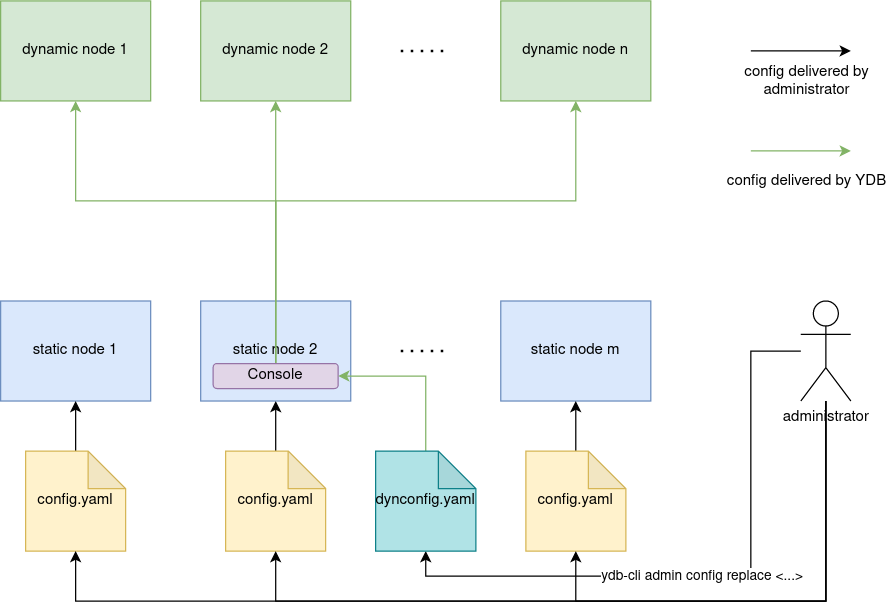

# Обзор конфигурации

Для запуска узла {{ ydb-short-name }} требуется конфигурация. Существуют два типа конфигурации:

* **Статическая** — файл в формате YAML, хранящийся на локальном диске узла.
* **Динамическая** — документ в формате YAML, хранящийся в хранилище конфигурации {{ ydb-short-name }} .

Статические узлы кластера используют статическую конфигурацию. Динамические узлы могут использовать статическую конфигурацию, динамическую конфигурацию или их комбинацию.

## Статическая конфигурация

Статическая конфигурация представляет собой YAML файл, хранимый на узлах кластера. В этом файле перечислены все настройки системы. Путь к файлу передается на вход процессу ydbd при запуске через параметр командной строки. Распространение статической конфигурации по кластеру и поддержка её в консистентном состоянии на всех узлах — ответственность администратора кластера. Подробности по использованию статической конфигурации можно найти в разделе [{#T}](../../deploy/configuration/config.md). Эта конфигурация **необходима** для запуска статических узлов.

### Базовый сценарий использования

1. Скопировать [стандартную конфигурацию](https://github.com/ydb-platform/ydb/tree/main/ydb/deploy/yaml_config_examples/) из github.
2. Изменить конфигурацию в соответствии с вашими требованиями.
3. Разместить идентичные файлы конфигурации на всех узлах кластера.
4. Запустить все узлы кластера, указав путь к файлу конфигурации явно, используя аргумент командной строки `--yaml-config`.

## Динамическая конфигурация

Динамическая конфигурация является YAML документом, надёжно сохранённом в кластере в [таблетке](../../concepts/cluster/common_scheme_ydb.md#tablets) Console. В отличие от статической её достаточно загрузить в кластер, так как за её распространение и поддержание в консистетном состоянии будет отвечать {{ ydb-short-name }}. При этом динамическая конфигурация при помощи селекторов позволяет обрабатывать, в том числе, сложные сценарии, оставаясь при этом в рамках одного файла конфигурации. Описание динамической конфигурации представлено в разделе [{#T}](./dynamic-config.md).

### Базовый сценарий использования

1. Скопировать [стандартную конфигурацию](https://github.com/ydb-platform/ydb/tree/main/ydb/deploy/yaml_config_examples/) из GitHub.
2. Изменить конфигурацию в соответствии с вашими требованиями.
3. Разместить идентичные файлы конфигурации на всех статических узлах кластера.
4. Запустить все статические узлы кластера, указав путь к файлу конфигурации явно, используя аргумент командной строки `--yaml-config`.
5. Дополнить файл конфигурации до [формата динамической конфигурации](./dynamic-config.md#example).
6. Загрузить на кластер полученную конфигурацию при помощи `{{ ydb-cli }} admin config replace -f dynconfig.yaml`.
