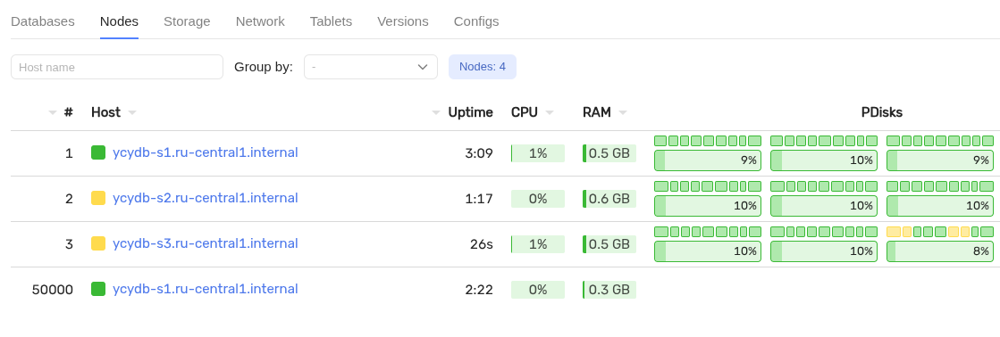
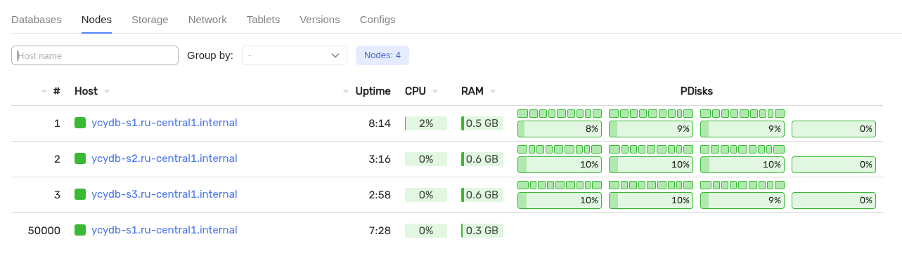
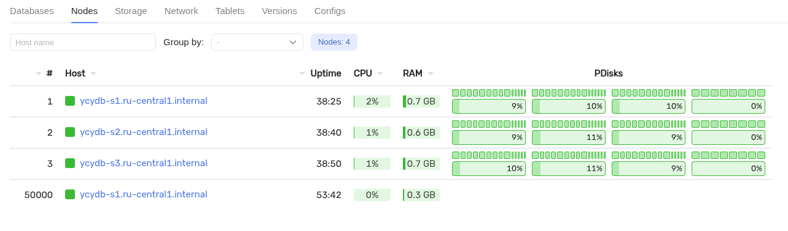

# Добавление дисков в кластеры YDB, развёрнутые вручную при помощи конфигурации V1

## Предварительные требования

Для выполнения инструкции необходимо подготовить систему в соответствии с документом [Подготовка к добавлению нового диска](disk-add-preparation.md).

## Отредактируйте конфигурационные файлы

Чтобы добавить новые диски, необходимо отредактировать конфигурационный файл на каждом из серверов кластера. По умолчанию конфигурационный файл находится в `/opt/ydb/cfg/config.yaml`. Если ваш кластер настроен в соответствии с [документацией](../../../devops/deployment-options/manual/initial-deployment/deployment-configuration-v1.md)
по ручному развертыванию, то раздел `host_configs` имеет вид:
```yaml
...
host_configs:
- drive:
  - path: /dev/disk/by-partlabel/ydb_disk_ssd_01
    type: SSD
  - path: /dev/disk/by-partlabel/ydb_disk_ssd_02
    type: SSD
  - path: /dev/disk/by-partlabel/ydb_disk_ssd_03
    type: SSD
  host_config_id: 1
...
```
Внесите следующие изменения в конфигурационный файл:
* включите в конфигурацию описание добавляемых дисков (в секции `host_configs`);
* установите номер изменения конфигурации в виде параметра `storage_config_generation`: `K` на верхнем уровне, где `K` - целое число, номер изменения (при первоначальной установке значение `K=0` или не указано, при первом расширении кластера `K=1`, при втором `K=2`, и так далее).

Пример конфигурационного файла после изменений:
```yaml
...
storage_config_generation: 1
host_configs:
- drive:
  - path: /dev/disk/by-partlabel/ydb_disk_ssd_01
    type: SSD
  - path: /dev/disk/by-partlabel/ydb_disk_ssd_02
    type: SSD
  - path: /dev/disk/by-partlabel/ydb_disk_ssd_03
    type: SSD
  - path: /dev/disk/by-partlabel/ydb_disk_ssd_04
    type: SSD
  host_config_id: 1
...
```
В примере файла выше используются следующие параметры:
* `/dev/disk/by-partlabel/ydb_disk_ssd_04` — имя размеченного диска (должно соответствовать имени из подготовительного этапа);
* `storage_config_generation: 1` — номер изменения конфигурации устанвливается `1`, в примере предполагается, что конфигурация ранее не изменялась.

Остальные секции и настройки конфигурационного файла остаются без изменений.



Если вы настраивали [динамическую конфигурацию](../../../devops/configuration-management/configuration-v1/dynamic-config.md) на кластере, её также необходимо отредактировать.





1. Получите токен аутентификации YDB CLI: {#get-auth-token}
```bash
ydb -e grpcs://<node1.ydb.tech>:2135 -d /Root --ca-file ca.crt \
    --user root auth get-token --force > auth_token
```
В примере команды выше используются следующие параметры:
* `node1.ydb.tech` — FQDN любого из серверов, на которых размещены статические узлы кластера;
* `2135` — номер порта gRPCs сервиса статических узлов;
* `ca.crt` — имя файла с сертификатом центра регистрации;
* `root` — логин пользователя с административными правами;
* `auth_token` — имя файла, в который сохраняется токен аутентификации для последующего использования.

2. Используя токен аутентификации, получите текущую динамическую конфигурацию:
```bash
ydb --ca-file ca.crt --token-file auth_token -e grpcs://<node1.ydb.tech>:2135 admin cluster config fetch > dynamic_config.yaml
```
В примере команды выше используются следующие параметры:
* `node1.ydb.tech` — FQDN любого из серверов, на которых уже размещены статические узлы кластера;
* `2135` — номер порта gRPCs сервиса статических узлов;
* `ca.crt` — имя файла с сертификатом центра регистрации;
* `dynamic_config.yaml` — имя файла, в который запишется текущая динамическая конфигурация;
* `auth_token` — имя файла, содержащего токен аутентификации.



Если результат выполнения команды `No config returned.`, то у вас не настроена динамическая конфигурация. Пропустите раздел редактирования динамической конфигурации.



3. Отредактируйте секцию `config` динамической конфигурации `dynamic_config.yaml` по аналогии со статической конфигурацией:
  * включите в конфигурацию (в секции `config`) описание добавляемых дисков (в секции `host_configs`);
  * установите номер изменения конфигурации в виде параметра `storage_config_generation`: `K` в секции `config`, где `K` - целое число, номер изменения (при первоначальной установке значение `K=0` или не указано, при первом расширении кластера `K=1`, при втором `K=2`, и так далее).

В результате редактирования секция `config` динамической конфигурации должна совпадать с содержимым файла статической конфигурации. Остальные секции и настройки динамического конфигурационного файла остаются без изменений.

4. Используя полученный токен, отправьте измененную динамическую конфигурацию в кластер YDB:
```bash
ydb -e grpcs://<node1.ydb.tech>:2135 --ca-file ca.crt --token-file auth_token admin cluster config replace -f dynamic_config.yaml
```
В примере команды выше используются следующие параметры:
* `node1.ydb.tech` — FQDN любого из серверов, на которых уже размещены статические узлы кластера;
* `2135` — номер порта gRPCs сервиса статических узлов;
* `ca.crt` — имя файла с сертификатом центра регистрации;
* `dynamic_config.yaml` — имя файла с отредактированной динамической конфигурацией;
* `auth_token` — имя файла, содержащего токен аутентификации.



## Перезапустите узлы кластера

Для применения новой конфигурации выполните [последовательный перезапуск](../node_restarting.md) узлов кластера в следующем порядке: сначала все динамические узлы, затем все статические узлы. После перезапуска каждого узла дождитесь его инициализации и восстановления работоспособности.



Если вы поднимали узлы кластера вручную через `/opt/ydb/bin/ydbd server` (без использования `systemd`), то
вам необходимо найти запущенный процесс и остановить его вручную, после чего запустить кластер
в соответствии с [документацией по развертыванию](../../../devops/deployment-options/manual/initial-deployment/deployment-configuration-v1.md).





- Перезапуск через systemd

  На каждом сервере кластера выполните следующие шаги.
  1. Получите токен аутентификации YDB CLI:
    ```bash
    /opt/ydb/bin/ydb --ca-file ca.crt -e grpcs://`hostname -f`:2135 -d /Root --user root auth get-token -f > auth_token
    ```
    В примере команды выше используются следующие параметры:
    * `2135` — номер порта gRPCs сервиса статических узлов;
    * `ca.crt` — имя файла с сертификатом центра регистрации;
    * `root` — логин пользователя с административными правами;
    * `auth_token` — имя файла, в который сохраняется токен аутентификации для последующего использования.
    Для аутентификации может быть использован ранее полученный токен, если не истекло время его действия, но его необходимо перенести на каждый сервер кластера для перезапуска узлов.
  2. Проверьте в соответствии с [документацией](../node_restarting.md), что узлы могут быть перезапущены.
  3. Выполните перезапуск с помощью команд:
    1. `sudo service ydbd-testdb restart` — на серверах с динамическими узлами;
    2. `sudo service ydbd-storage restart` — на серверах со статическими узлами;
    
    
    В качестве параметров используются имена узлов из [документации по развертыванию](../../../devops/deployment-options/manual/initial-deployment/deployment-configuration-v1.md):
    * `ydbd-storage` — для статических узлов;
    * `ydbd-testdb` — для динамических узлов.

- Утилита ydbops

  Для перезапуска кластера с помощью утилиты `ydbops` следуйте указаниям [документации](../../../devops/deployment-options/manual/maintenance.md).



## Проверьте состояние кластера

Проверьте состояние кластера после перезапуска.



## Инициализируйте конфигурацию с новыми дисками

Для инициализации конфигурации потребуется токен аутентификации, обновите его при необходимости командой выше.
На любом из серверов кластера инициализируйте конфигурацию с новым дисками командой:
```bash
export LD_LIBRARY_PATH=/opt/ydb/lib
/opt/ydb/bin/ydbd -f auth_token --ca-file ca.crt -s grpcs://`hostname -f`:2135 \
    admin blobstorage config init --yaml-file /opt/ydb/cfg/config.yaml
```
В примере команды выше используются следующие параметры:
* `2135` — номер порта gRPCs сервиса статических узлов;
* `ca.crt` — имя файла с сертификатом центра регистрации;
* `/opt/ydb/cfg/config.yaml` — путь к файлу статической конфигурации;
* `auth_token` — имя файла, содержащего токен аутентификации.

Пример результата выполнения команды:
```bash
Status {
  Success: true
}
Status {
  Success: true
}
Success: true
ConfigTxSeqNo: 13
```

После выполнения проверьте, что новые диски отображаются.


## Добавить новые группы хранения

Добавьте новые группы хранения. Это можно сделать с помощью утилиты `ydb-dstool`. Для выполнения операции потребуется токен аутентификации, обновите его при необходимости [командой выше](#get-auth-token).

1. Установите утилиту [`ydb-dstool`](../../../reference/ydb-dstool/install.md).
2. Добавьте новые группы хранения командой:
  ```bash
  ydb-dstool --verbose --token-file auth_token -e grpcs://<node1.ydb.tech> --ca-file ca.crt group add --pool-name /Root/testdb:ssd --groups 8
  ```
  В примере команды выше используются следующие параметры:
  * `node1.ydb.tech` — FQDN любого из серверов, на которых размещены статические узлы кластера;
  * `ca.crt` — имя файла с сертификатом центра регистрации;
  * `/opt/ydb/cfg/config.yaml` — путь к файлу статической конфигурации;
  * `/Root/testdb:ssd` — `база данных : пул хранения`;
  * `8` — количество новых групп хранения;
  * `auth_token` — имя файла, содержащего токен аутентификации.

Если во время добавления группы возникают ошибки, проверьте состояние PDisks командой:
```bash
ydb-dstool --verbose --token-file auth_token -e grpcs://<node1.ydb.tech> --ca-file ca.crt pdisk list
```
Если статус некоторых PDisks `INACTIVE`, измените статус дисков командой:
```bash
ydb-dstool --verbose --token-file auth_token -e grpcs://<node1.ydb.tech> --ca-file ca.crt pdisk set --pdisk-ids [1:1] [1:2] [1:3] --status ACTIVE
```
  В примере команд выше используются следующие параметры:
  * `node1.ydb.tech` — FQDN любого из серверов, на которых размещены статические узлы кластера;
  * `ca.crt` — имя файла с сертификатом центра регистрации;
  * `[1:1] [1:2] [1:3]` — список `NodeId:PDiskId` со статусом `INACTIVE` по таблице `pdisk list`;
  * `auth_token` — имя файла, содержащего токен аутентификации.

Проверьте результат добавления новых групп:
