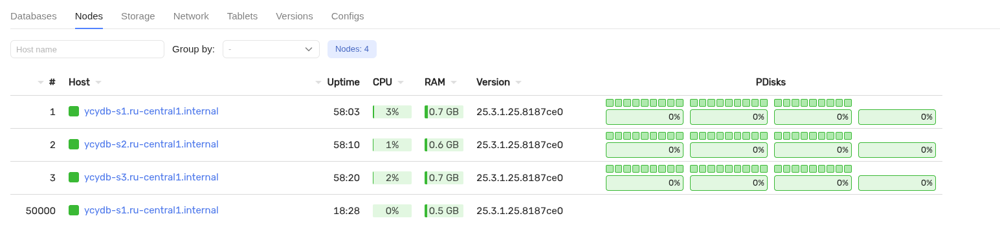
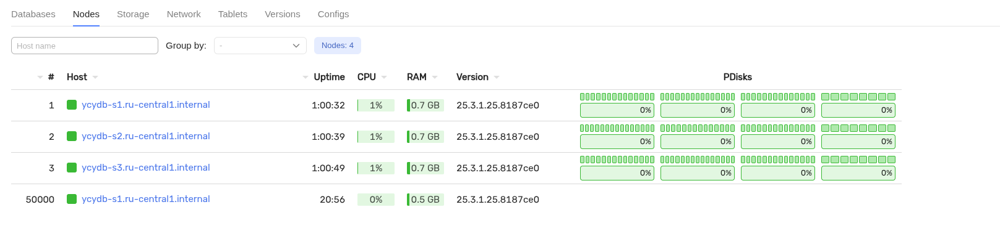

# Добавление дисков в кластеры YDB, развёрнутые вручную при помощи конфигурации V2

## Предварительные требования

Для выполнения инструкции необходимо подготовить систему в соответствии с документом [Подготовка к добавлению нового диска](disk-add-preparation.md).

## Отредактируйте конфигурационные файлы


1. Получите токен аутентификации YDB CLI: {#get-auth-token}
    ```bash
    ydb -e grpcs://<node1.ydb.tech>:2135 -d /Root --ca-file ca.crt \
        --user root auth get-token --force > auth_token
    ```
    В примере команды выше используются следующие параметры:
    * `node1.ydb.tech` — FQDN любого из серверов, на которых размещены статические узлы кластера;
    * `2135` — номер порта gRPCs сервиса статических узлов;
    * `ca.crt` — имя файла с сертификатом центра регистрации;
    * `root` — логин пользователя с административными правами;
    * `auth_token` — имя файла, в который сохраняется токен аутентификации для последующего использования.

2. Используя токен аутентификации, получите текущую [динамическую конфигурацию](../../../devops/configuration-management/configuration-v2/config-overview.md):
    ```bash
    ydb --ca-file ca.crt --token-file auth_token -e grpcs://<node1.ydb.tech>:2135 admin cluster config fetch > dynamic_config.yaml
    ```
    В примере команды выше используются следующие параметры:
    * `node1.ydb.tech` — FQDN любого из серверов, на которых уже размещены статические узлы кластера;
    * `2135` — номер порта gRPCs сервиса статических узлов;
    * `ca.crt` — имя файла с сертификатом центра регистрации;
    * `dynamic_config.yaml` — имя файла, в который запишется текущая динамическая конфигурация;
    * `auth_token` — имя файла, содержащего токен аутентификации.


3. Отредактируйте секцию `config` динамической конфигурации `dynamic_config.yaml`.
Если ваш кластер настроен в соответствии с [документацией](../../../devops/deployment-options/manual/initial-deployment/deployment-configuration-v2.md) по ручному развертыванию, то раздел `host_configs` секции `config` имеет вид:
```yaml
...
host_configs:
- host_config_id: 1
    drive:
    - path: /dev/disk/by-partlabel/ydb_disk_ssd_01
    type: SSD
    - path: /dev/disk/by-partlabel/ydb_disk_ssd_02
    type: SSD
    - path: /dev/disk/by-partlabel/ydb_disk_ssd_03
    type: SSD
...
```
Внесите следующие изменения в конфигурационный файл:
* включите в конфигурацию (в секции `config`) описание добавляемых дисков (в разделе `host_configs`).

Пример конфигурационного файла после изменений:
```yaml
...
  host_configs:
  - host_config_id: 1
    drive:
    - path: /dev/disk/by-partlabel/ydb_disk_ssd_01
      type: SSD
    - path: /dev/disk/by-partlabel/ydb_disk_ssd_02
      type: SSD
    - path: /dev/disk/by-partlabel/ydb_disk_ssd_03
      type: SSD
    - path: /dev/disk/by-partlabel/ydb_disk_ssd_04
      type: SSD
...
```
В примере файла выше используются следующие параметры:
* `/dev/disk/by-partlabel/ydb_disk_ssd_04` — имя размеченного диска (должно соответствовать имени из подготовительного этапа).

Остальные секции и настройки динамического конфигурационного файла остаются без изменений.

4. Используя полученный токен, отправьте измененную динамическую конфигурацию в кластер YDB:
```bash
ydb -e grpcs://<node1.ydb.tech>:2135 --ca-file ca.crt --token-file auth_token admin cluster config replace -f dynamic_config.yaml
```
В примере команды выше используются следующие параметры:
* `node1.ydb.tech` — FQDN любого из серверов, на которых уже размещены статические узлы кластера;
* `2135` — номер порта gRPCs сервиса статических узлов;
* `ca.crt` — имя файла с сертификатом центра регистрации;
* `dynamic_config.yaml` — имя файла с отредактированной динамической конфигурацией;
* `auth_token` — имя файла, содержащего токен аутентификации.

## Проверьте состояние кластера

Проверьте, что кластер видит новые диски после обновления конфигурации.



## Добавить новые группы хранения

Добавьте новые группы хранения с помощью утилиты `ydb-dstool`. Для выполнения операции потребуется токен аутентификации, обновите его при необходимости [командой выше](#get-auth-token).
  1. Установите утилиту [`ydb-dstool`](../../../reference/ydb-dstool/install.md).
  2. Добавьте новые узлы хранения командой:

  ```bash
  ydb-dstool --verbose --token-file auth_token -e grpcs://<node1.ydb.tech> --ca-file ca.crt group add --pool-name /Root/testdb:ssd --groups 8
  ```

  В примере команды выше используются следующие параметры:
  * `node1.ydb.tech` — FQDN любого из серверов, на которых размещены статические узлы кластера;
  * `ca.crt` — имя файла с сертификатом центра регистрации;
  * `/opt/ydb/cfg/config.yaml` — путь к файлу статической конфигурации;
  * `/Root/testdb:ssd` — `база данных : пул хранения`.
  * `8` — количество новых групп хранения.
  * `auth_token` — имя файла, содержащего токен аутентификации.

  Пример результата выполнения команды:
  ```bash
  ┌──────────────┬──────────────────┬─────────────────┬───────────────────────┬────────────────────────┬───────────────────────┬───────────┐
│ BoxId:PoolId │ PoolName         │ Affected PDisks │ Static slots on PDisk │ VSlots on PDisk before │ VSlots on PDisk after │ Result    │
├──────────────┼──────────────────┼─────────────────┼───────────────────────┼────────────────────────┼───────────────────────┼───────────┤
│ [1:1]        │ /Root/testdb:ssd │ 6               │ 1                     │ 9                      │ 14                    │ increased │
│ [1:1]        │ /Root/testdb:ssd │ 3               │ 1                     │ 9                      │ 15                    │ increased │
│ [1:1]        │ /Root/testdb:ssd │ 3               │ 0                     │ 0                      │ 8                     │ increased │
└──────────────┴──────────────────┴─────────────────┴───────────────────────┴────────────────────────┴───────────────────────┴───────────┘
```

Проверьте результат добавления новых групп:
