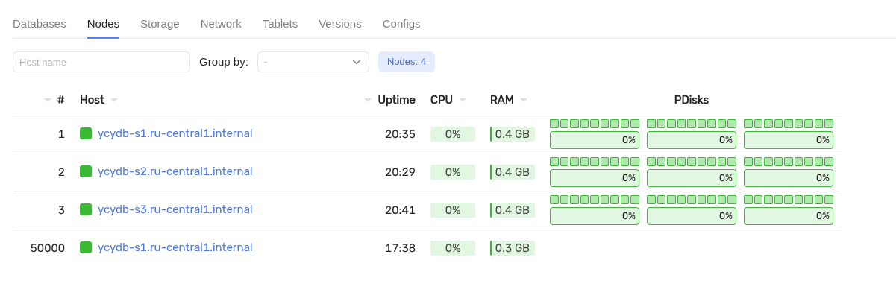

# Подготовка к добавлению нового диска

## Предварительные требования

Перед началом работы убедитесь, что выполнены условия:

* кластер YDB развернут вручную по топологии `3-nodes-mirror-3-dc`;
* на каждом сервере кластера установлен новый жесткий диск;
* у вас есть SSH доступ на все сервера.

Пример кластера по топологии `3-nodes-mirror-3-dc`:




Добавить новые диски в кластер можно с помощью вашего облачного провайдера, если стенд находится в облаке; иначе
необходимо физически добавить диски в серверы, либо смонтировать их для нужд YDB, если физически в серверах уже есть диски.





Конфигурации с дисками объемом меньше 800 ГБ или с любыми видами виртуализации системы хранения нельзя использовать для сервисов, находящихся в промышленной эксплуатации, а также для тестирования производительности системы.

Мы не рекомендуем использовать для хранения данных YDB диски, которые используются другими процессами (в том числе операционной системой).



Узнать имя подключенного диска можно командой `lsblk`:

```bash
NAME    MAJ:MIN RM  SIZE RO TYPE MOUNTPOINTS
vda     252:0    0   20G  0 disk 
├─vda1  252:1    0 19.4G  0 part /
├─vda14 252:14   0    4M  0 part 
└─vda15 252:15   0  600M  0 part /boot/efi
vdb     252:16   0   93G  0 disk 
└─vdb1  252:17   0   93G  0 part 
vdc     252:32   0   93G  0 disk 
└─vdc1  252:33   0   93G  0 part 
vdd     252:48   0   93G  0 disk 
└─vdd1  252:49   0   93G  0 part 
vde     252:64   0   93G  0 disk
```

В приведенном выше примере `vde` — имя нового диска.

## Подготовьте диски для последующего добавления в кластер



Следующая операция удалит все разделы на указанном диске! Убедитесь, что вы указали диск, на котором нет других данных!



На каждом сервере кластера создайте разделы на новых дисках и очистите диски встроенной в `ydbd` командой:

``` bash
DISK=/dev/vde
sudo parted ${DISK} mklabel gpt -s
sudo parted -a optimal ${DISK} mkpart primary 0% 100%
sudo parted ${DISK} name 1 ydb_disk_ssd_04
sudo partx --u ${DISK}
sleep 5
sudo LD_LIBRARY_PATH=/opt/ydb/lib /opt/ydb/bin/ydbd admin bs disk obliterate /dev/disk/by-partlabel/ydb_disk_ssd_04
```

В примере команды выше используются следующие параметры:

* `/dev/vde` — имя нового диска (можно узнать командой `lsblk`);
* `/dev/disk/by-partlabel/ydb_disk_ssd_04` — метка нового раздела (используется в дальнейшем при добавлении диска в конфигурационный файл);
* `/opt/ydb/bin/ydbd` — путь к исполняемому файлу `ydbd` (в примере используется путь по умлочанию).

## Проверьте подготовку дисков

Для проверки корректной разметки дисков выполните команду на каждом сервере кластера:

```bash
ls -al /dev/disk/by-partlabel/
```

В выводе команды должен быть размеченный вами диск:

```bash
lrwxrwxrwx 1 root root  10 Jul 23 11:49 ydb_disk_ssd_04 -> ../../vde1
```


## Дальнейшие действия по добавлению диска

Выберите инструкцию в соответствии с версией вашей конфигурацией:

* [Добавление диска в кластер при помощи конфигурации V1](disk-add-configuration-v1.md)
* [Добавление диска в кластер при помощи конфигурации V2](disk-add-configuration-v2.md)

Для определения версии конфигурации, можно воспользоваться [инструкцией](../../../devops/configuration-management/check-config-version.md).