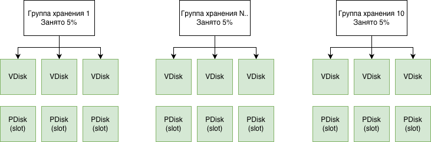
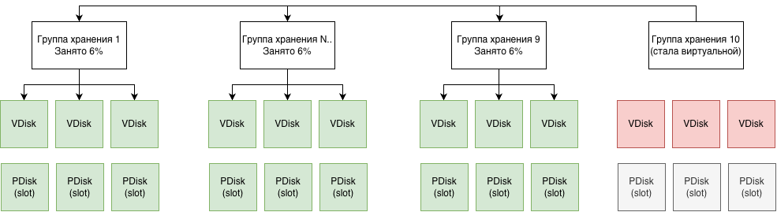

# Декомиссия групп с использованием виртуальных групп



Операция декомиссии является крайне опасной и может привести к необратимой потере данных. Перед выполнением декомиссии **обязательно** создайте резервную копию всех данных кластера.





Возможность откатить декомиссию группы хранения находится в разработке. В данный момент операция необратима. Рекомендуется использовать декомиссию только в исключительных случаях, когда требуется разово освободить ресурсы.



## Описание работы

Физические [группы хранения](../../concepts/glossary.md#storage-group) являются ограниченным ресурсом в [кластере](../../concepts/glossary.md#cluster): их количество определяется размером кластера, и их нельзя удалить, пока в них хранятся данные. Это может привести к ситуации, когда для создания новой [базы данных](../../concepts/glossary.md#database) или расширения существующей не хватает групп, а освободить пространство на физических дисках нельзя, поскольку старые группы содержат данные.

Рассмотрим пример: в базе данных используется 10 групп хранения. Каждая из этих групп содержит некоторый объём пользовательских данных, но при этом заполнены они только на 5%. Пропускная способность также используется не полностью. В результате все группы формально заняты, и при попытке создать новую базу данных новая группа хранения не может быть выделена — свободных [слотов](../../concepts/glossary.md#slot) на [PDisk](../../concepts/glossary.md#pdisk) больше нет. При этом существующие группы используются неэффективно.



В такой ситуации возникает задача освободить часть групп хранения (декомиссовать их) у текущей базы данных, чтобы вернуть их в пул доступных ресурсов для последующего использования.

Для решения этой задачи применяется механизм декомиссии групп хранения. В рамках этого механизма для исходной физической группы создаётся одна новая [виртуальная группа хранения](../../concepts/glossary.md#virtual-storage-groups), которая заменяет эту физическую группу. После выполнения операции система переходит в следующее состояние:

- Исходная физическая группа хранения заменяется на виртуальную.
- Данные копируются из исходной группы в оставшиеся физические группы кластера (увеличивая их заполненность)
- Виртуальная группа хранит данные в оставшихся физических группах кластера.
- Ресурсы, используемые исходной группой, освобождаются ([VDisk'и](../../concepts/glossary.md#vdisk) удаляются, [слоты PDisk'ов](../../concepts/glossary.md#slot) освобождаются).



## Этапы процесса декомиссии



Во время декомиссии доступ к данным сохраняется — пользователи могут читать и записывать данные, как обычно. Все перемещения данных происходят в фоновом режиме параллельно с основной работой приложения. Стоит отметить, что во во время декомиссии все же создается повышенная нагрузка на систему хранения.



**В дальнейшем под исходной физической группой будем подразумевать группу, над которой проходит процесс декомиссии.**

### Инициализация виртуальной группы хранения и блокировка записи в исходную физическую группу

**Что происходит:**

- Создается виртуальная группа.
- Блокируется запись новых данных в исходную физическую группу.
- Все новые записи начинают идти в виртуальную группу.

**Статус:** `DecommitStatus: PENDING` → `IN_PROGRESS`

**Время:** Обычно доли секунды

### Копирование метаданных

**Что происходит:**

- Копируются метаданные всех блобов (информация о том, какие данные есть, но не сами данные) из исходной физической группы в оставшиеся физические группы хранения

**Статус:** `DecommitStatus: IN_PROGRESS`

**Время:** Обычно секунды

### Копирование данных

**Что происходит:**

- Читаются данные из исходной физической группы.
- Записываются в оставшиеся физические группы кластера, через виртуальную группу.
- Данные распределяются по нескольким группам для балансировки.

**Статус:** `DecommitStatus: IN_PROGRESS`

**Время:** Зависит от объема данных (могут быть часы для больших групп)

### Освобождение ресурсов исходной физической группы

**Что происходит:**

- Все данные скопированы
- Удаляется исходная физическая группа и её VDisk'и
- Освобождаются ресурсы [PDisk](../../concepts/glossary.md#pdisk)
- Группа помечается как декомиссированная.

**Статус:** `DecommitStatus: IN_PROGRESS` → `DONE`

**Время:** Минуты (удаление VDisk)

## Предварительные требования

Инструкция по декомиссии групп работает при выполнении следующих условий:

1. Развернутый [кластер](../../concepts/glossary.md#cluster) {{ ydb-short-name }}. Инструкции по развертыванию доступны в разделе [Первоначальное развёртывание](../../devops/deployment-options/manual/initial-deployment/index.md).
2. Установленная утилита `ydb-dstool`. Инструкции по установке доступны в [документации по установке {{ ydb-short-name }} DSTool](../../reference/ydb-dstool/install.md).
3. Сгенерированный токен аутентификации для доступа к кластеру:

```bash
{{ ydb-cli }} -e grpc://<cluster-endpoint> -d <db_path> --user <user> auth get-token -f > ~/ydb_token
```

Замените `<cluster-endpoint>` на адрес вашего кластера, `<db_path>` - путь к базе данных, `<user>` на имя пользователя для авторизации.



Декомиссию можно проводить даже на пустом кластере, наличие данных не обязательно. Однако если в кластере есть данные, это позволит проверить их консистентность после декомиссии. При необходимости можно загрузить тестовые данные с помощью утилиты `ydb workload tpcc`:

```bash
{{ ydb-cli }} workload tpcc --path tpcc/10wh init -w 100
{{ ydb-cli }} workload tpcc --path tpcc/10wh import -w 100
```

И запустить тест TPC-C до и после декомиссии:

```bash
{{ ydb-cli }} workload tpcc --path tpcc/10wh run -w 100
```

Подробнее о работе с тестовой нагрузкой в [документации по ydb workload tpcc](../../reference/ydb-cli/workload-tpcc.md).



## Запуск декомиссии

### Выбор группы для декомиссии

Перед запуском декомиссии необходимо выбрать группу (group ID), которую вы хотите вывести из эксплуатации. Выбирать можно любую группу, однако рекомендуется выбирать менее занятую группу — это поможет завершить процесс декомиссии быстрее. Это можно сделать через веб-интерфейс кластера или с помощью CLI:



- UI (Веб-интерфейс)
  1. Откройте веб-интерфейс управления кластером `https://<cluster-endpoint>:8765`.
  2. Откройте вкладку `Storage`.
  3. Выберите нужную вам группу и сохраните `Group ID`.

- CLI
  1. Выполните команду получения списка групп хранения

  ```bash
  ydb-dstool -e <cluster-endpoint> \
    --ca-file <path-to-ca-cert> \
    --token-file ~/ydb_token \
    group list
  ```

  2. В выводе команды найдите нужную группу и сохраните её `Group ID`.



### Команда для запуска

Для запуска декомиссии выполните команду `ydb-dstool` с параметром `group decommit`, она автоматически создаст виртуальную группу и начнёт процесс декомиссии:

```bash
ydb-dstool -e grpcs://<cluster-endpoint>:2135 \
  --ca-file <path-to-ca-cert> \
  --token-file ~/ydb_token \
  group decommit \
  --group-ids <GROUP_ID> \
  --database /Root/<database-name> \
  --wait
```

### Параметры команды

* `-e <endpoint>` — адрес кластера (например, `grpcs://static-node-1.ydb-cluster.com:2135`);
* `--ca-file <path>` — путь к файлу сертификата CA для TLS-соединения;
* `--token-file <path>` — путь к файлу с токеном аутентификации;
* `--group-ids <GROUP_ID>` — идентификатор группы для декомиссии (можно указать несколько групп через пробел);
* `--database=<DB>` — путь к [базе данных](../../concepts/glossary.md#database) или домену, в котором выполняется декомиссия (например, `/Root/database`);
* `--wait` — дождаться запуска декомиссии; в случае возникновения ошибки запуска ошибка выводится на экран, декомиссия отменяется автоматически (только при указании этой опции).

### Пример команды

```bash
ydb-dstool -e grpcs://static-node-1.ydb-cluster.com:2135 \
  --ca-file /home/ubuntu/ansible-11-nov-244/3-nodes-mirror-3-dc/files/TLS/certs/ca.crt \
  --token-file ~/ydb_token \
  group decommit \
  --group-ids 2181038081 \
  --database=/Root/database \
  --wait
```

## Проверка статуса декомиссии

После запуска декомиссии можно проверить её статус с помощью команды:

```bash
ydb-dstool -e grpcs://<cluster-endpoint>:2135 \
  --ca-file <path-to-ca-cert> \
  --token-file ~/ydb_token \
  group list --columns GroupId PoolName \
  ErasureSpecies OperatingStatus VDisks_TOTAL BlobDepotId DecommitStatus
```

В выводе команды для групп, для которых была начата процедура декомиссии, появляется дополнительное поле `DecommitStatus`, которое может принимать одно из следующих значений:

* `NONE` — декомиссия для указанной группы не производится;
* `PENDING` — ожидается декомиссия группы, но ещё не выполняется (создаётся виртуальная группа);
* `IN_PROGRESS` — производится декомиссия группы (все записи уже попадают в виртуальную группу, чтения — в виртуальную группу и в старую группу);
* `DONE` — декомиссия завершена полностью (физическая группа превратилась в виртуальную).

### Пример вывода команды

```text
┌────────────┬────────────────────┬────────────────┬─────────────────┬──────────────┬───────────────────┬────────────────┐
│ GroupId    │ PoolName           │ ErasureSpecies │ OperatingStatus │ VDisks_TOTAL │ BlobDepotId       │ DecommitStatus │
├────────────┼────────────────────┼────────────────┼─────────────────┼──────────────┼───────────────────┼────────────────┤
│ 2181038080 │ /Root/database:ssd │ mirror-3-dc    │ FULL            │ 9            │ 0                 │ NONE           │
│ 2181038081 │ /Root/database:ssd │ mirror-3-dc    │ FULL            │ 0            │ 72075186224038889 │ DONE           │
│ 2181038082 │ /Root/database:ssd │ mirror-3-dc    │ FULL            │ 9            │ 0                 │ NONE           │
│ 2181038083 │ /Root/database:ssd │ mirror-3-dc    │ FULL            │ 9            │ 0                 │ NONE           │
│ 2181038084 │ /Root/database:ssd │ mirror-3-dc    │ FULL            │ 9            │ 0                 │ NONE           │
│ 2181038085 │ /Root/database:ssd │ mirror-3-dc    │ FULL            │ 9            │ 0                 │ NONE           │
│ 2181038086 │ /Root/database:ssd │ mirror-3-dc    │ FULL            │ 9            │ 0                 │ NONE           │
│ 2181038087 │ /Root/database:ssd │ mirror-3-dc    │ FULL            │ 9            │ 0                 │ NONE           │
└────────────┴────────────────────┴────────────────┴─────────────────┴──────────────┴───────────────────┴────────────────┘
```

Обратите внимание, что в приведённом выше примере вывода для группы `2181038081` изменилось количество VDisks (оно стало равно 0), появилась id виртуальной группы в поле `BlobDepotId`, а статус декомиссии (`DecommitStatus`) изменился на `DONE`. Это отражает успешное завершение процедуры декомиссии для данной группы.