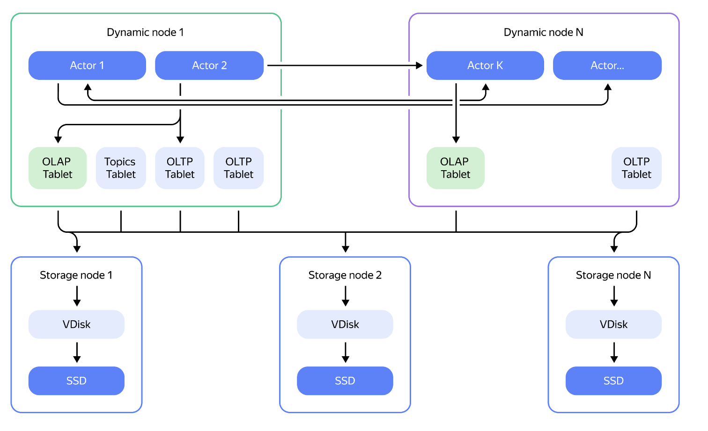
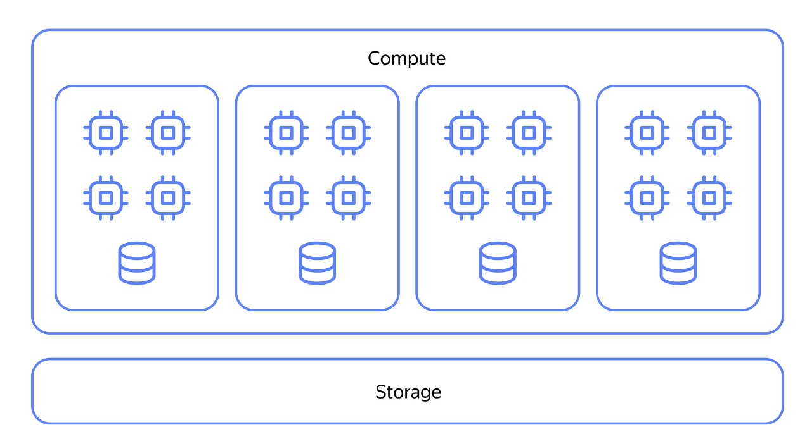
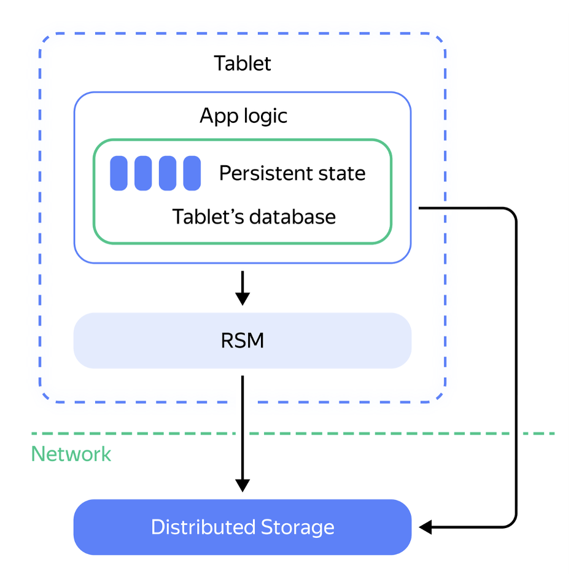
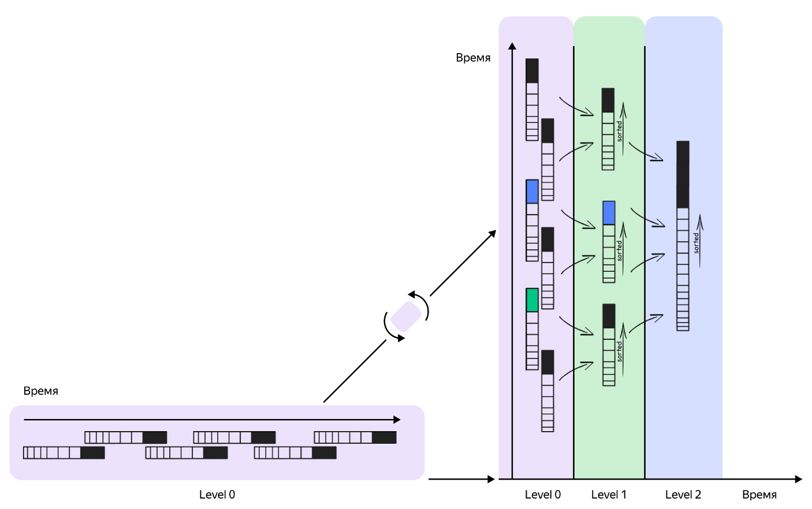
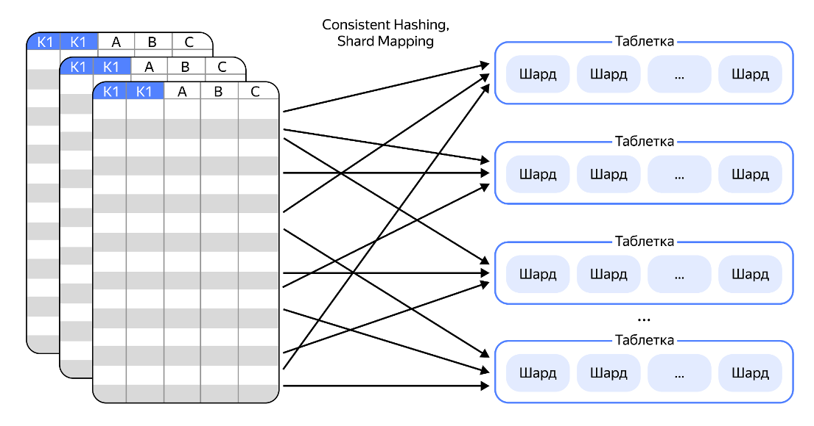

# Основные сведения про устройство кластера {{ydb-short-name}}

Кластер {{ydb-short-name}} строится на принципе разделении хранения и вычислений. Данные лежат в распределённом хранилище, а запросы выполняют отдельные вычислительные узлы.

- Хранение организовано в виде таблеток ( фрагментов таблиц) которые существуют разных типов (для аналитики, OLTP и топиков) и могут размещаться на любых узлах. Для хранения данных используется LSM-подход с постоянным compaction, compaction выполняется практически постоянно, что позволяет иметь максимально актуальную статистику.

- Вычисления выполняются в акторной модели: запрос разбивается на части, акторы запускаются на наиболее подходщях вычислительных узлах и обмениваются данными.

- Время ответа распределённой системы определяется самым медленным фрагментом, поэтому в кластере есть компонент, который перемещает таблетки между узлами для балансировки.

- Классические «перешардирования» в других СУБД могут занимать минуты/часы/дни; в YDB это смягчается за счёт разделения слоёв и переносимости таблеток.

{width=700}

## Разделение слоёв compute и storage

YDB изначально проектировался как система с разделением слоя хранения и слоя вычислений. Хранение обеспечивает надёжное распределение данных между узлами и изоляцию от вычислительных процессов. Вычисления выполняются отдельным пулом серверов (динамическими нодами), которые можно масштабировать независимо от хранилища. Такой подход повышает эластичность и отказоустойчивость: при сбое нагрузку можно мгновенно перенести на другие рабочие узлы.

{width=600}

## Таблетки

Основной строительный блок YDB — таблетка. Таблетка -- это логический фрагмент таблицы с поддержкой транзакционной обработки. Таблетки бывают разных типов (аналитические, OLTP, топиковые).

Каждая таблетка может быть перенесена на другой узел без прерывания работы кластера, с гарантиями транзакционной целостности.Переносимость таблеток лежит в основе как балансировки нагрузки, так и быстрого масштабирования.

{width=400}

## Акторная модель

Для исполнения запросов YDB использует акторную модель. Запрос разбивается на части, каждая часть исполняется актором. Акторы могут быть запущены на любом вычислительном узле. Планировщик распределяет акторы по кластеру с учетом загрузки конкретных узлов выполнения, и управляет их взаимодействием. Такая модель позволяет гибко реагировать на подключение-отключение узлов обработки данных, а также реагировать на выход отдельных вычислительных узлов из строя.

{width=600}

## Хранение данных

Данные в YDB хранятся в формате LSM-деревьев. За счет работы с LSM-форматом операции (вставка, обновление, удаление) пишутся последовательно, что повышает скорость работы с дисками. Для удаления устаревших версий строк используется процесс compaction. Compaction упорядочивает данные и оптимизирует к ним доступ.

{width=700}

## Распределение данных

Для обеспечения равномерной нагрузки на узлы обработки, данные распределяются по кластеру с помощью хэш-функций. Для уменьшения объёма применяется сжатие и формат, оптимизированный под последовательный доступ к данным отдельных колонок.

Так как в распределённой системе отклик зависит от самого медленного узла, {{ydb-short-name}} содержит компонент балансировки. Этот компонент отслеживает загрузку серверов и при необходимости переносит таблетки на менее загруженные узлы. Это позволяет снижать хвостовые (tail) задержки и поддерживать равномерное исполнение запросов.

{width=600}

Оптимизатор запросов требует актуальной статистики по данным, в {{ydb-short-name}} пересчет статистики выполняется на этапе compaction, который выполняется примерно постоянно. Таким образом:

- статистика всегда соответствует текущему состоянию,
- пересчёт не требует отдельного запуска и дополнительных ресурсов.

{width=300}

Добавление узлов в кластер традиционно требует длительного перешардирования. В {{ydb-short-name}} эта проблема решается архитектурно:

- уровень хранения и уровень исполнения разделены,
- данные разбиты на переносимые таблетки.

В результате система способна масштабироваться практически мгновенно и без существенного влияния на производительность.
