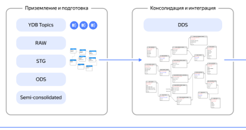

# Выполнение запросов

Скорость выполнения запросов это одно из важнейших свойств базы данных. {{ydb-short-name}} является MPP-базой данных, при начале выполнения запрос делится на части и эти части размещаются на наиболее подходящих узлах базы данных. Данные на узлах хранения хранятся сразу в формате, наиболее подходящем для обработки, поэтому для пересылки даже больших массивов данных требуются незначительные ресурсы.

Для работы с большими объема данных {{ydb-short-name}} использует:

- [{#T}](#reliability)
- [{#T}](#cbo)
- [{#T}](#gracejoin)
- [{#T}](#spilling)
- [{#T}](#workload_manager)

## Модель вычислений {#reliability}

Основной единицей выполнения вычисления в {{ydb-short-name}} является [актор](../../concepts/glossary#actor). Актор это компонент, выполняющий вычисления, который может быть запущен на любом узле базы данных.

Такое подход позволяет:

- не иметь единой точки отказа. При потере любых узлов база данных перенесет вычислительную нагрузку на другие узлы и продолжит работу.
- моментально утилизировать доступную мощность. Базу данных можно быстро расширять в часы пик, и уменьшать обратно при падении нагрузки.

## Cтоимостной оптимизатор {#cbo}

Основной задачей [стоимостного оптимизатора](../../concepts/optimizer.md) является анализ запроса, анализ статистики таблиц, участвующих в запросах, и выбор наиболее оптимального способа выполнения запроса.

{{ydb-short-name}} использует [самые современные алгоритмы](https://www.researchgate.net/publication/47862092_Dynamic_Programming_Strikes_Back) в разработке оптимизаторов, которые позволяют находить оптимальный порядок выполнения запросов даже для большого числа таблиц.

## Распределенный Join {#gracejoin}

При работе с большими объемами данных важно уметь исполнять запросы на большом количестве узлов, чтобы увеличить скорость обработки данных. Кроме этого, современные объемы данных очень велики и не умещаются в оперативную память одного узла, поэтому {{ydb-short-name}} использует распределенные алгоритмы обработки данных, в том числе распределенные алгоритмы для выполнения операция JOIN.

Возможность эффективно хранить данные и эффективно их обрабатывать - одна из основных возможностей КХД. В данном разделе описываются основные возможности {{ydb-short-name}} в области хранения и обработки данных.

## Спиллинг {#spilling}

[Спиллинг](../../concepts/spilling.md) — это механизм управления памятью, при котором промежуточные данные, возникающие в результате выполнения запросов и превышающие доступный объём оперативной памяти узла, временно выгружаются во внешнее хранилище.

Спиллинг важен для:

- обработки запросов с большими объёмами данных, когда промежуточные результаты не помещаются в оперативную память;
- выполнения сложных аналитических операций (агрегации, соединения таблиц) над большими наборами данных;
- оптимизации производительности запросов за счет промежуточной материализации части данных во внешней памяти, что в определенных сценариях может ускорить общее время выполнения.

{{ydb-short-name}} использует механизм спиллинга для надежной работы с большими объемами данных и при большом количестве одновременно выполняющихся запросов.

## Workload manager {#workload_manager}

{width=500}

Аналитическими базами данных пользуются одновременно большое число пользователей. Для того, чтобы один пользователь не занимал все ресурсы базы данных, {{ydb-short-name}} обладает встроенным компонентом - [Workload manager'ом](../../dev/resource-consumption-management), позволяющим ограничить мощности, доступные пользователям.

Можно ограничивать ряд параметров:

- Количество одновременно выполняемых запросов
- Количество вычислительной мощности на одном узле

Для управления ограничениями используются специальные правила, [классификаторы](../../concepts/glossary#resource-pool-classifier).
