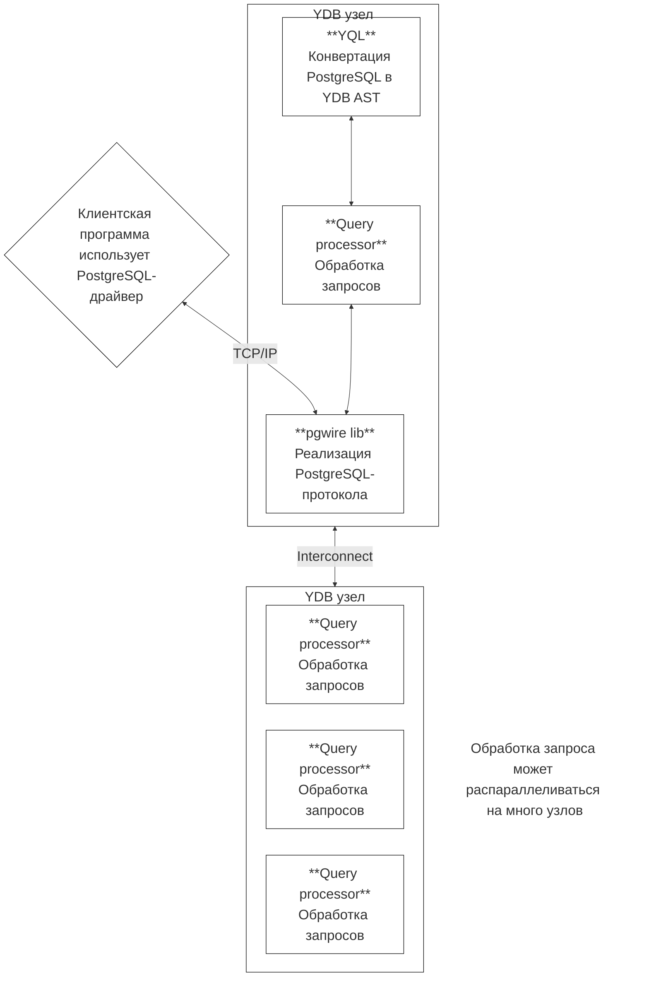

```mermaid
flowchart TD
    classDef default fill: none, stroke: black, font-size: 26
    classDef arrowText font-size: 26
    style container stroke:none, fill: none, header:none, font-size: 26
    style many_nodes stroke: none, fill: none, font-size: 26
    style YDB_node_1 fill:none, stroke:black, font-size: 26
    style YDB_node_2 fill:none, stroke:black, font-size: 26
    A{Клиентская программа использует PostgreSQL-драйвер}
    A <--<span style='font-size:26px;'>TCP/IP</span>--> C1
    subgraph YDB_node_1 ["<span style='font-size:26px;'>YDB узел</span>"]
        A1["**YQL**<br>Конвертация PostgreSQL в YDB AST"]<-->
        B1["**Query processor**<br>Обработка запросов"]<-->
        C1["**pgwire lib**<br>Реализация PostgreSQL-протокола"]
    end
    YDB_node_1 <--<span style='font-size:26px;'>Interconnect</span>--> YDB_node_2
    subgraph container[" "]
        subgraph YDB_node_2 ["<span style='font-size:26px;'>YDB узел</span>"]
            A2["**Query processor**<br>Обработка запросов"]
            B2["**Query processor**<br>Обработка запросов"]
            C2["**Query processor**<br>Обработка запросов"]
        end
        many_nodes[Обработка запроса может распараллеливаться на много узлов]
    end
```