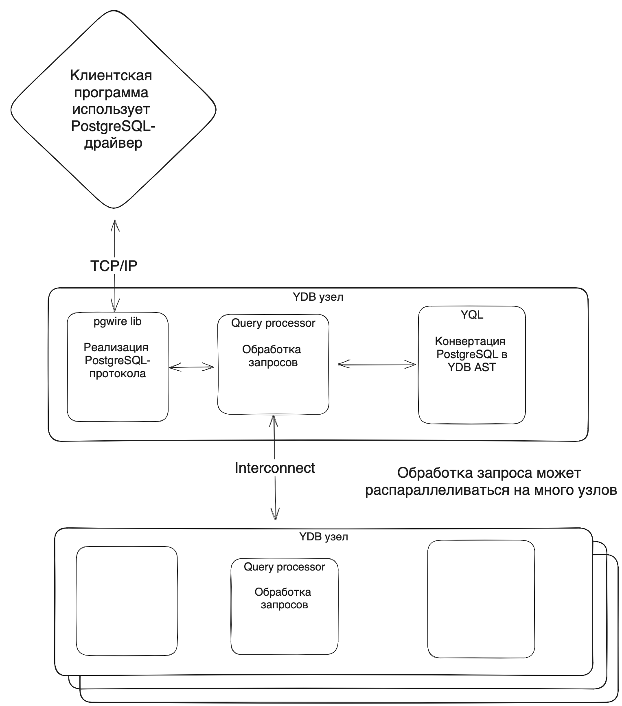

# Интероперабельность PostgreSQL и {{ydb-name}}



Поддержка исполнения запросов в {{ydb-name}} на синтаксисе PostgreSQL реализована с помощью слоя совместимости:
1. Программа отправляет запросы в YDB, где их обрабатывает компонент под названием `pgwire`. Pgwire реализует [сетевой протокол](https://postgrespro.ru/docs/postgresql/14/protocol) PostgreSQL и передает команды в query processor.
2. Query processor транслирует PostgreSQL запросы в YQL AST.
3. После обработки запросов результаты собираются и отправляются обратно в программу, отправившую запрос, по сетевому протоколу PostgreSQL. При обработке запроса он может распараллеливаться и исполняться на произвольном количестве узлов {{ydb-name}}.

Графически работу PostgreSQL совместимости можно представить так:


Такая архитектура интеграции с PostgreSQL позволяет выполнять запросы на PostgreSQL над {{ydb-name}} типами данных и наоборот, выполнять YQL-запросы над типами данных PostgreSQL, обеспечивая интероперабельность работы с данными.

Проиллюстрируем это с помощью следующего сценария:
1. Создадим таблицу {{ydb-name}} с помощью YQL-синтаксиса
    ```sql
    CREATE TABLE `test_table`(col INT, PRIMARY KEY(col));
    ```
1. Добавим туда тестовые данные
    ```sql
    INSERT INTO test_table(col) VALUES(1)
    ```
1. Прочитаем эти данные с помощью PostgreSQL-синтаксиса
    ```
    psql -h <ydb_address> -d <database_name> -U <user_name> -c "SELECT * FROM test_table"
    col
    ---
    1
    (1 row)
    ```

    Где:
    - `ydb_address` - адрес кластера ydb, к которому выполняется подключение.
    - `database_name` - название базы данных в кластере. Может быть сложным именем, например, `mycluster/tenant1/database/`.
    - `user_name` - логин пользователя.


## Соответствие типов данных {#supported_types}

Система типов данных {{ydb-name}} и PostgreSQL похожи, но при этом не совпадают.

### Использование данных таблиц, созданных в YQL синтаксисе, в синтаксисе PostgreSQL {#topg}
Типы данных из {{ydb-name}} автоматически преобразовываются в соответствующие им типы PostgreSQL.

Пример:
1. Создадим таблицу {{ydb-name}} с помощью YQL-синтаксиса
    ```sql
    CREATE TABLE `test_table`(col INT, PRIMARY KEY(col));
    ```
1. Добавим туда тестовые данные
    ```sql
    INSERT INTO test_table(col) VALUES(1)
    ```
1. Прочитаем эти данные с помощью PostgreSQL-синтаксиса. YQL-тип данных `INT` был автоматически переведен в тип `pgint4`, над которым была выполнена операция инкремента.
    ```
    psql -c "SELECT col+1 AS col FROM test_table"
    col
    ---
    2
    (1 row)
    ```

 Таблица соответствия типов данных {{ydb-name}}, при их использовании в PostgreSQL запросах:

| {{ydb-name}} | PostgreSQL | Название PostgreSQL-типа в YDB|
|---|---|---|
| `Bool` | `bool` |`pgbool` |
| `Int8` | `int2` |`pgint2` |
| `Uint8` | `int2` |`pgint2` |
| `Int16` | `int2` |`pgint2` |
| `Uint16` | `int4` |`pgint4` |
| `Int32` | `int4` |`pgint4` |
| `Uint32` | `int8` |`pgint8` |
| `Int64` | `int8` |`pgint8` |
| `Uint64` | `numeric` |`pgnumeric` |
| `Float` | `float4` |`pgfloat4` |
| `Double` | `float8` |`pgfloat8` |
| `String` | `bytea` |`pgbytea` |
| `Utf8` | `text` |`pgtext` |
| `Yson` | `bytea` |`pgbytea` |
| `Json` | `json` |`pgjson` |
| `Uuid` | `uuid` |`pguuid` |
| `JsonDocument` | `jsonb` |`pgjsonb` |
| `Date` | `date` |`pgdate` |
| `Datetime` | `timestamp` |`pgtimestamp` |
| `Timestamp` | `timestamp` |`pgtimestamp` |
| `Interval` | `interval` | `pginterval` |
| `TzDate` | `text` |`pgtext` |
| `TzDatetime` | `text` |`pgtext` |
| `TzTimestamp` | `text` |`pgtext` |
| `Date32` | `date` | `pgdate`|
| `Datetime64` | `timestamp` |`pgtimestamp` |
| `Timestamp64` | `timestamp` |`pgtimestamp` |
| `Interval64`| `interval` |`pginterval` |
| `TzDate32` | `text` |  |`pgtext` |
| `TzDatetime64` | `text` |  |`pgtext` |
| `TzTimestamp64` | `text` |  |`pgtext` |
| `Decimal` | `numeric` |`pgnumeric` |
| `DyNumber` | `numeric` |`pgnumeric` |


### Использование данных таблиц, созданных в PostgreSQL синтаксисе, в синтаксисе YQL {#frompg}

Для использования данных таблиц, созданных в PostgreSQL синтаксисе, необходимо явное преобразование типов с помощью функции [`FromPg`](./advanced.md#frompgtopg).

Пример:
1. Создадим таблицу {{ydb-name}} с помощью PostgreSQL-синтаксиса
    ```sql
    CREATE TABLE test_table_pg(col INT, PRIMARY KEY(col));
    ```
1. Добавим туда тестовые данные
    ```sql
    INSERT INTO test_table_pg(col) VALUES(10)
    ```
1. Прочитаем эти данные с помощью YQL-синтаксиса. Для чтения данных, созданных с помощью PostgreSQL синтаксиса, необходимо явное преобразование c помощью функции [`FromPg`](./advanced.md#frompgtopg).
    ```
    ydb sql -s "SELECT FromPg(col)+1 AS col FROM test_table_pg"
    col
    ---
    11
    (1 row)
    ```

Таблица соответствия типов данных PostgreSQL, при их использовании в {{ydb-name}} запросах:

| PostgreSQL | {{ydb-name}} |
|---|---|
| `bool` | `bool` |
| `int2` | `Int16` |
| `int4` | `Int32` |
| `int8` | `Int64` |
| `float4` | `Float` |
| `float8` | `Double` |
| `bytea` | `String` |
| `varchar` | `Utf8` |
| `text` | `Utf8` |
| `cstring` | `Utf8` |
| `uuid` | `Uuid` |
| `date` | `Date32` |
| `timestamp` | `Timestamp64` |

Поддерживаются только преобразования типов приведенное выше.

Если необходимо выполнить преобразование типов данных, не указанных в таблице выше, то можно использовать промежуточное преобразование через тип `text`.

Например, выполним преобразование типа данных PostgreSQL - `money`:
```sql
SELECT FromPg(PgCast(PgConst("{1234}", _PgMoney), pgtext))
```
