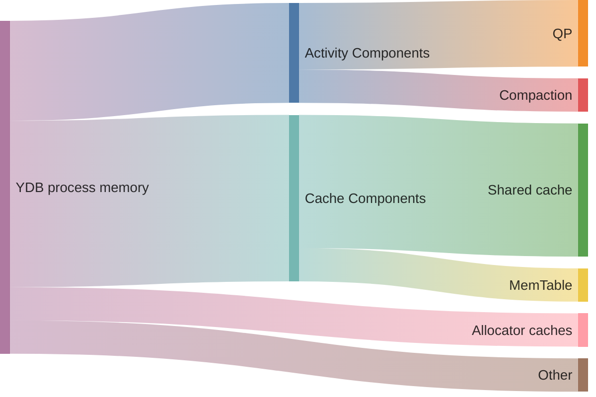

# memory_controller_config

Внутри [узлов](../../concepts/glossary.md#database-node) {{ ydb-short-name }} работают множество различных компонентов, использующих память. Большинству из них требуется фиксированное количество памяти, но некоторые из них могут гибко варьировать объём используемой памяти, тем самым улучшая производительность всей системы.

## Общий вид потребления памяти внутри узла YDB по компонентам



Если компоненты {{ ydb-short-name }} выделяют больше памяти, чем физически доступно, операционная система, вероятно, [завершит](https://en.wikipedia.org/wiki/Out_of_memory#Recovery) весь процесс {{ ydb-short-name }}, что крайне нежелательно. Цель контроллера памяти — позволить {{ ydb-short-name }} избегать ситуаций с нехваткой памяти, при этом эффективно используя имеющийся её объём.

Примеры компонентов, управляемых контроллером памяти:

- [Общий кеш](../../concepts/glossary.md#shared-cache): хранит недавно доступные страницы данных, считанные из [распределённого хранилища](../../concepts/glossary.md#distributed-storage), чтобы уменьшить количество операций ввода-вывода с диска и ускорить получение данных.
- [MemTable](../../concepts/glossary.md#memtable): содержит данные, которые ещё не были записаны в [SST](../../concepts/glossary.md#sst).
- [Query Processor](../../concepts/glossary.md#kqp): хранит промежуточные результаты обработки запросов.
- [Compaction](../../concepts/glossary.md#compaction): процесс упорядочивания и очистки данных, который выполняется автоматически (в «фоновом» режиме) для оптимизации объёма хранения данных.
- Кеши аллокатора: хранят блоки памяти, которые были освобождены, но ещё не возвращены операционной системе.

Лимиты памяти могут быть настроены для контроля общего использования памяти, обеспечивая эффективную работу базы данных в рамках доступных ресурсов.

## Жёсткий лимит памяти {#hard-memory-limit}

Жёсткий лимит памяти определяет общее количество памяти, доступное для процесса {{ ydb-short-name }}.

По умолчанию жёсткий лимит памяти для процесса {{ ydb-short-name }} равен лимиту памяти, указанному в его [cgroups](https://en.wikipedia.org/wiki/Cgroups).

В окружениях без лимита памяти cgroups значение жёсткого лимита памяти по умолчанию равно общему объёму доступной памяти хоста. Эта конфигурация позволяет базе данных использовать все доступные ресурсы, но может привести к конкуренции за ресурсы с другими процессами на том же хосте. Хотя контроллер памяти пытается учесть это внешнее потребление, такое использование не рекомендуется.

Жёсткий лимит памяти также может быть задан в конфигурации. Обратите внимание, что процесс базы данных всё равно может превысить этот лимит. Поэтому настоятельно рекомендуется использовать лимиты памяти cgroups в производственных окружениях для строгого контроля памяти.

Большинство других лимитов памяти можно настроить либо в абсолютных байтах, либо в процентах относительно жёсткого лимита памяти. Использование процентов удобно для управления кластерами с узлами разной ёмкости. Если указаны как абсолютные лимиты в байтах, так и процентные лимиты, контроллер памяти использует комбинацию обоих (максимум для нижних лимитов и минимум для верхних лимитов).

Пример секции `memory_controller_config` с указанным жёстким лимитом памяти:

```yaml
memory_controller_config:
  hard_limit_bytes: 16106127360
```

## Мягкий лимит памяти {#soft-memory-limit}

Мягкий лимит памяти определяет опасный порог, который процесс {{ ydb-short-name }} не должен превышать при нормальных обстоятельствах.

Если мягкий лимит превышен, {{ ydb-short-name }} постепенно уменьшает размер [общего кеша](../../concepts/glossary.md#shared-cache) до нуля. В таком случае следует как можно скорее добавить больше узлов баз данных в кластер или снизить лимиты памяти для отдельных компонентов.

## Целевое использование памяти {#target-memory-utilization}

Целевое использование памяти определяет порог использования памяти процессом {{ ydb-short-name }}, который считается оптимальным.

Гибкие размеры кешей рассчитываются в соответствии с их пределами, чтобы поддерживать потребление памяти процессом вблизи этого значения.

Например, в базе данных, которая расходует немного памяти на выполнение запросов, кеши используют память вблизи этого порога, а остальная память остаётся свободной. Если выполнение запросов начинает потреблять больше памяти, кеши начинают сокращать свои размеры до минимального порога.

## Лимиты памяти для отдельных компонентов

Внутри {{ ydb-short-name }} существует два разных типа компонентов.

Первый тип компонентов, или кеш-компоненты, функционируют как кеши, например, храня последние использованные данные. Каждый кеш-компонент имеет минимальный и максимальный пороговые значения лимита памяти, что позволяет ему динамически изменять свою ёмкость в зависимости от текущего потребления памяти процессом {{ ydb-short-name }}.

Второй тип компонентов, или компоненты-активности, выделяют память для конкретных задач, таких как выполнение запросов или процесс компактизации. Каждый компонент-активность имеет фиксированный лимит памяти. Также существует дополнительный общий лимит памяти для таких компонентов, из которого они пытаются получить необходимую память.

Многие другие вспомогательные компоненты и процессы работают параллельно с процессом {{ ydb-short-name }}, потребляя память. В настоящее время эти компоненты не имеют каких-либо лимитов памяти.

### Лимиты памяти для кеш-компонентов {#cache-memory-limits}

К кеш-компонентам относятся:

- Общий кеш;
- MemTable.

Лимиты каждого кеш-компонента динамически пересчитываются каждую секунду, чтобы каждый компонент потреблял память пропорционально своим предельным значениям, а общее потребление памяти оставалось около целевого использования памяти.

Минимальный порог лимита памяти кеш-компонентов не резервируется, что означает, что память остаётся доступной до тех пор, пока она не будет фактически использована. Однако, как только эта память заполнена, компоненты обычно сохраняют данные, действуя в рамках своего текущего лимита памяти. Таким образом, ожидается, что сумма минимальных лимитов памяти кеш-компонентов будет меньше целевого использования памяти.

При необходимости следует переопределить как минимальные, так и максимальные пороговые значения; в противном случае, если пороговое значение отсутствует, оно будет иметь значение по умолчанию.

Пример секции `memory_controller_config` с указанными лимитами общего кеша:

```yaml
memory_controller_config:
  shared_cache_min_percent: 10
  shared_cache_max_percent: 30
```

### Лимиты памяти для компонентов-активностей

К компонентам-активностям относятся:

- Query Processor;
- Компактизация.

Лимит памяти для каждого из компонентов-активностей указывает максимальное количество памяти, которое он может попытаться использовать. Однако, чтобы предотвратить превышение процессом {{ ydb-short-name }} мягкого лимита памяти, общее потребление компонентов-активностей ограничивается дополнительным лимитом, называемым лимитом памяти для активностей. Если общее использование памяти активными компонентами превышает этот лимит, любые дополнительные запросы на память будут отклонены. Когда выполнение запросов приближается к лимитам памяти, {{ ydb-short-name }} активирует [спиллинг](../../concepts/query_execution/spilling.md) для временного сохранения промежуточных данных на диск, предотвращая нарушение лимитов памяти.

Таким образом, хотя суммарные индивидуальные лимиты компонентов-активностей могут в совокупности превышать лимит памяти для активностей, индивидуальный лимит каждого компонента должен быть меньше этого общего предела. Кроме того, сумма минимальных лимитов памяти для кеш-компонентов плюс лимит памяти для активностей должна быть меньше мягкого лимита памяти.

Существуют и другие компоненты-активности, которые в настоящее время не имеют каких-либо индивидуальных лимитов памяти.

Пример секции `memory_controller_config` с указанным лимитом для QP:

```yaml
memory_controller_config:
  query_execution_limit_percent: 25
```

## Параметры конфигурации

Каждый параметр конфигурации применяется в контексте одного узла базы данных.

Как упоминалось ранее, ожидается, что сумма минимальных лимитов памяти для кеш-компонентов плюс лимит памяти для активностей должна быть меньше мягкого лимита памяти.

Это ограничение можно выразить в упрощённой форме:

$shared\_cache\_min\_percent + mem\_table\_min\_percent + activities\_limit\_percent < soft\_limit\_percent$

Или в детализированной форме:

$Max(shared\_cache\_min\_percent * hard\_limit\_bytes / 100, shared\_cache\_min\_bytes) + Max(mem\_table\_min\_percent * hard\_limit\_bytes / 100, mem\_table\_min\_bytes) + Min(activities\_limit\_percent * hard\_limit\_bytes / 100, activities\_limit\_bytes) < Min(soft\_limit\_percent * hard\_limit\_bytes / 100, soft\_limit\_bytes)$

| Параметры | Значение по умолчанию | Описание |
| --- | --- | --- |
| `hard_limit_bytes` | CGroup&nbsp;memory&nbsp;limit&nbsp;/<br/>Память хоста | Жёсткий лимит использования памяти. |
| `soft_limit_percent`&nbsp;/<br/>`soft_limit_bytes` | 75% | Мягкий лимит использования памяти. |
| `target_utilization_percent`&nbsp;/<br/>`target_utilization_bytes` | 50% | Целевое использование памяти. |
| `activities_limit_percent`&nbsp;/<br/>`activities_limit_bytes` | 30% | Лимит памяти для активностей. |
| `shared_cache_min_percent`&nbsp;/<br/>`shared_cache_min_bytes` | 20% | Минимальный порог для лимита памяти общего кеша. |
| `shared_cache_max_percent`&nbsp;/<br/>`shared_cache_max_bytes` | 50% | Максимальный порог для лимита памяти общего кеша. |
| `mem_table_min_percent`&nbsp;/<br/>`mem_table_min_bytes` | 1% | Минимальный порог для лимита памяти MemTable. |
| `mem_table_max_percent`&nbsp;/<br/>`mem_table_max_bytes` | 3% | Максимальный порог для лимита памяти MemTable. |
| `query_execution_limit_percent`&nbsp;/<br/>`query_execution_limit_bytes` | 20% | Лимит памяти для QP. |
| `compaction_limit_percent`&nbsp;/<br/>`compaction_limit_bytes` | 10% | Лимит памяти для компактизации. |
