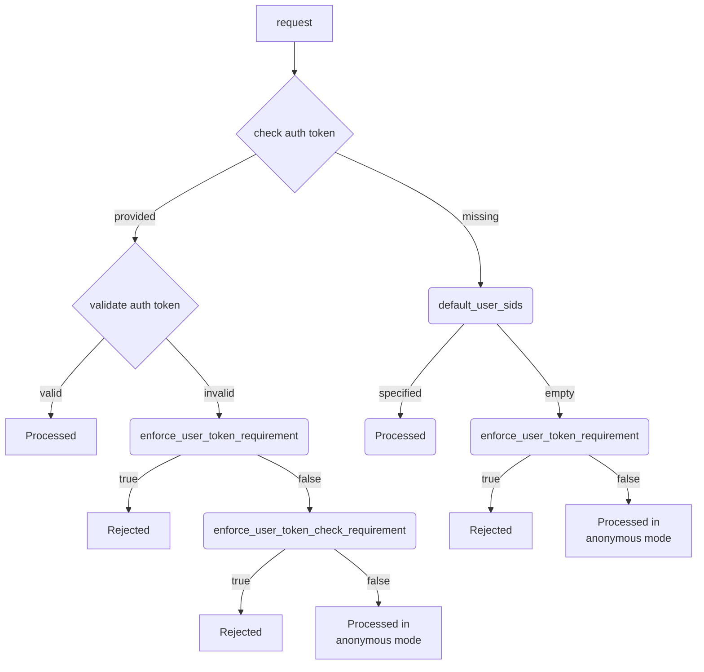

# security_config

В разделе `security_config` файла конфигурации {{ ydb-short-name }} задаются режимы [аутентификации](../../security/authentication.md), первичная конфигурация локальных [пользователей](../../concepts/glossary.md#access-user) и [групп](../../concepts/glossary.md#access-group) и их [права](../../concepts/glossary.md#access-right).

```yaml
security_config:
  # настройка режима аутентификации
  enforce_user_token_requirement: false
  enforce_user_token_check_requirement: false
  default_user_sids: <SID для анонимных запросов>
  all_authenticated_users: <имя группы всех аутентифицированных пользователей>
  all_users_group: <имя группы всех пользователей>

  # первичные настройки безопасности
  default_users: <список пользователей по умолчанию>
  default_groups: <список групп по умолчанию>
  default_access: <список прав по умолчанию на корне кластера>

  # настройки привилегий
  viewer_allowed_sids: <список SID'ов с правами просмотра состояния кластера>
  monitoring_allowed_sids: <список SID'ов с правами просмотра и изменения состояния кластера>
  administration_allowed_sids: <список SID'ов с доступом администратора кластера>
  register_dynamic_node_allowed_sids: <список SID'ов с правами регистрации узлов баз данных в кластере>

  # настройки встроенной настройки безопасности
  disable_builtin_security: false
  disable_builtin_groups: false
  disable_builtin_access: false
```

## Настройки режима аутентификации {#security-auth}

#|
|| Параметр | Описание ||
|| `enforce_user_token_requirement` | Режим обязательной [аутентификации](../../security/authentication.md).

Возможные значения:

- `true` — аутентификация обязательна, запросы к {{ ydb-short-name }} обязаны сопровождаться [аутентификационным токеном](../../concepts/glossary.md#auth-token).

    Запросы проходят аутентификацию и проверку прав.

- `false` — аутентификация опциональна, запросы к {{ ydb-short-name }} могут не сопровождаться [аутентификационным токеном](../../concepts/glossary.md#auth-token).

    Запросы без токена выполняются в [анонимном режиме](../../security/authentication.md#anonymous) и без проверки прав.

    Запросы с токеном проходят аутентификацию и проверку прав. Но в случае ошибок аутентификации, запросы не запрещаются, а выполняются в анонимном режиме.

    При `enforce_user_token_check_requirement: true` выполнение запросов с ошибкой аутентификации запрещается.

[//]: # (TODO: добавить про ошибки проверки права на доступ к базе данных, когда появится место для ссылки)

Взамен отсутствующего в запросах токена используется значение параметра `default_user_sids`, если параметр определён и не пустой (см. описание ниже). Тогда аутентификация и проверка прав проводится для [субъекта доступа](../../concepts/glossary.md#access-subject), заданного `default_user_sids`.

Значение по умолчанию: `false`.
    ||
|| `enforce_user_token_check_requirement` | Запрещает игнорировать ошибки аутентификации в режиме `enforce_user_token_requirement: false`.

Значение по умолчанию: `false`.
    ||
|| `default_user_sids` | Список [SID](../../concepts/glossary.md#access-sid)'ов для использования в процессе аутентификации в случае, когда входящий запрос не сопровождается явным [аутентификационным токеном](../../concepts/glossary.md#auth-token).

`default_user_sids` используется для анонимных запросов. Первым элементом в списке должен быть SID пользователя, за ним должны идти SID'ы групп, к которым пользователь принадлежит.

Непустой `default_user_sids` позволяет использовать режим обязательной аутентификации (`enforce_user_token_requirement: true`) вместе с анонимными запросами. Это может быть полезно в определённых сценариях тестирования {{ ydb-short-name }} или в ознакомительных целях для локальных баз данных.

Значение по умолчанию: пустой список.
    ||
|| `all_authenticated_users` | Имя виртуальной [группы](../../concepts/glossary.md#access-group), в которой состоят все аутентифицированные [пользователи](../../concepts/glossary.md#access-user).

Виртуальную группу не нужно явно создавать, она ведётся системой автоматически. Виртуальную группу нельзя удалить, нельзя получить или изменить список её членов.
Пользователь может использовать её для выдачи [прав](../../concepts/glossary.md#access-right) на [схемных объектах](../../concepts/glossary.md#scheme-object).



Информацию о правах доступа к схемным объектам можно получить из системных представлений {{ ydb-short-name }}, см. [{#T}](../../dev/system-views#informaciya-o-pravah-dostupa).



Значение по умолчанию: `all-users@well-known`.
    ||
|| `all_users_group` | Имя [группы](../../concepts/glossary.md#access-group), в которую должны добавляться все внутренние [пользователи](../../concepts/glossary.md#access-user).

Если `all_users_group` не пустая, то все локальные пользователи в момент создания будут добавляться в группу с указанным именем. В момент создания пользователей группа, указанная в этом параметре, должна существовать.

`all_users_group` автоматически конфигурируется при выполнении [встроенной настройки безопасности](../../security/builtin-security.md).

Значение по умолчанию: пустая строка.
    ||
|#

Следующая диаграмма показывает как взаимодействуют параметры настройки режима аутентификации:



## Первичные настройки безопасности {#security-bootstrap}

Параметры `default_users`, `default_groups`, `default_access` влияют на настройку кластера, осуществляемую при первом старте {{ ydb-short-name }}. При последующих запусках первичная настройка не выполняется, эти параметры игнорируются.

См. также раздел по [встроенной настройке безопасности](../../security/builtin-security.md) и влияющие на неё настройки [уровня `domains_config`](domains_config.md).

#|
|| Параметр | Описание ||
|| `default_users` | Какие [пользователи](../../concepts/glossary.md#access-user) должны быть созданы на кластере при первом запуске.

Список пар логин-пароль. Первый пользователь становится [суперпользователем](../../security/builtin-security.md#superuser).



Пароли задаются в открытом виде и оставлять их действующими на долгое время небезопасно. Поэтому после первого запуска кластера и его настройки рекомендуется пароли стартовым пользователям поменять средствами {{ ydb-short-name }} (например, [`ALTER USER`](../../yql/reference/syntax/alter-user.md)).

[//]: # (TODO: добавить про возможность блокировки этих стартовых пользователей, когда такое описание появится)



Пример:

```yaml
default_users:
- name: root
  password: <...>
- name: user1
  password: <...>
```

Ошибки в списке (повторение логинов) фиксируются в логе, но не влияют на запуск кластера.

    ||
|| `default_groups` | Какие [группы](../../concepts/glossary.md#access-group) должны быть созданы на кластере при первом запуске.

Список групп и их членов.



Эти группы создаются для всего кластера {{ ydb-short-name }}.



Пример:

```yaml
default_groups:
- name: ADMINS
  members: root
- name: USERS
  members:
  - ADMINS
  - root
  - user1
```

Порядок перечисления групп важен: группы создаются в порядке перечисления, и указанные члены группы к моменту создания группы должны существовать, иначе они не будут добавлены в группу.

Ошибки добавления членов групп фиксируются в логе, но не влияют на запуск кластера.

    ||
|| `default_access` | Какие [права](../../concepts/glossary.md#access-right) должны быть выданы на корне кластера.

Список разрешений в формате [краткой записи управления доступом](../../security/short-access-control-notation.md).

Пример:

```yaml
default_access:
- +(CDB|DDB|GAR):ADMINS
- +(ConnDB):USERS
```

    ||
|#

Ошибки в строках прав доступа фиксируются в логе, но не влияют на запуск кластера. Право доступа с ошибкой не будет добавлено.

[//]: # (TODO: требуется доработка, сейчас ошибка в формате приводит к падению процесса)

## Настройки административных и других привилегий {#security-access-levels}

Управление доступом в {{ ydb-short-name }} реализуется двумя механизмами:

- [списками прав](../../concepts/glossary.md#access-control-list) на [схемных объектах](../../concepts/glossary.md#scheme-object);
- [уровнями доступа](../../concepts/glossary.md#access-level-list), определяющими дополнительные возможности или ограничения.

Оба механизма применяются одновременно: для конкретного [субъекта](../../concepts/glossary.md#access-subject) действие оказывается доступно, если оба механизма его разрешают, и не доступно, если хотя бы один не разрешает.

Уровень доступа субъекта определяется списками разрешений, заданными в конфигурации кластера, и влияет на дополнительные возможности субъекта при работе со [схемными объектами](../../concepts/glossary.md#scheme-object), а также на возможности субъекта в контекстах, не связанных со схемными объектами.

[//]: # (TODO: добавить ссылку на справку по viewer api и требуемым правам, когда она появится)

#|
|| Параметр | Описание ||
|| `viewer_allowed_sids` | Список [SID](../../concepts/glossary.md#access-sid)'ов с доступом уровня наблюдателя.

Даёт возможность просмотра состояния системы, закрытого от публичного доступа (это большая часть страниц Embedded UI ([YDB Monitoring](../embedded-ui/ydb-monitoring.md))), без возможности делать изменения.
    ||
|| `monitoring_allowed_sids` | Список [SID](../../concepts/glossary.md#access-sid)'ов с доступом уровня оператора.

Даёт дополнительные возможности просмотра и выполнения действий, меняющих состояние системы. Например, выполнение бекапа, восстановления базы или выполнение YQL-запросов через Embedded UI.
    ||
|| `administration_allowed_sids` | Список [SID](../../concepts/glossary.md#access-sid)'ов с доступом уровня администратора.

Даёт право на выполнение административных действий с базами или кластером.
    ||
|| `register_dynamic_node_allowed_sids` | Список [SID](../../concepts/glossary.md#access-sid)'ов , для которых разрешена регистрация узлов баз данных.

По техническим причинам в этом списке также должен присутствовать субъект доступа `root@builtin`.
    ||
|#



По-умолчанию, все списки пустые.

Пустой список разрешает доступ любому пользователю (включая анонимного пользователя).

Все три пустых списка дают возможности администратора любому пользователю системы.

Для защищённого развёртывания {{ ydb-short-name }} важно заранее определить модель прав и прописать в списках соответствующие группы.



В списках могут перечисляться индивидуальные SID'ы [пользователей](../../concepts/glossary.md#access-user) или SID'ы [групп пользователей](../../concepts/glossary.md#access-group). Принадлежность пользователя к списку определяется по прямому вхождению или по вхождению в список любой его группы (рекурсивно).
Рекомендуется включать в списки `*_allowed_sids` группы и отдельные сервисные аккаунты, тогда наделение индивидуальных пользователей соответствующими возможностями не будет требовать изменения общей конфигурации кластера.



Списки разрешений — это слои дополнительных разрешений:

- Субъект, не состоящий ни в одном списке разрешений, имеет возможность просмотра публично доступной информации в системе (например, может видеть [список баз на кластере](../embedded-ui/ydb-monitoring.md#tenant_list_page) или [список узлов кластера](../embedded-ui/ydb-monitoring.md#node_list_page)).
- Списки `viewer_allowed_sids`, `monitoring_allowed_sids`, `administration_allowed_sids` последовательно наращивают возможности субъекта. Максимальные возможности требуют включения во все три списка.
- Присутствие в списке `monitoring_allowed_sids` или `administration_allowed_sids` без присутствия во `viewer_allowed_sids` не имеет смысла.

Например:

- оператор должен состоять (прямо или через группы) во `viewer_allowed_sids` и в `monitoring_allowed_sids`;
- полноценный администратор должен состоять во `viewer_allowed_sids`, `monitoring_allowed_sids` и в `administration_allowed_sids`.



## Настройки встроенной настройки безопасности

Флаги `disable_builtin_security`, `disable_builtin_groups`, `disable_builtin_access` влияют на настройку кластера, осуществляемую только при первом старте кластера {{ ydb-short-name }}.

#|
|| Параметр | Описание ||
|| `disable_builtin_security` | Не выполнять [встроенную настройку безопасности](../../security/builtin-security.md).
Встроенная настройка включает автоматическое создание суперпользователя `root`, набора встроенных пользовательских групп и выдачу прав доступа этим группам на корне кластера.

Эфемерный флаг, не попадает в конфигурацию, сохраняемую в кластере.

Значение по умолчанию: `false`.
    ||
|| `disable_builtin_groups` | Отказаться от создания [встроенных групп](../../security/builtin-security.md), даже если явные группы по умолчанию ([`security_config.default_groups`](security_config.md)) заданы.

Значение по умолчанию: `false`
    ||
|| `disable_builtin_access` | Отказаться от добавления прав на корне кластера для [встроенных групп](../../security/builtin-security.md), даже если явные права по умолчанию ([`security_config.default_access`](security_config.md)) заданы.

Значение по умолчанию: `false`
    ||
|#
