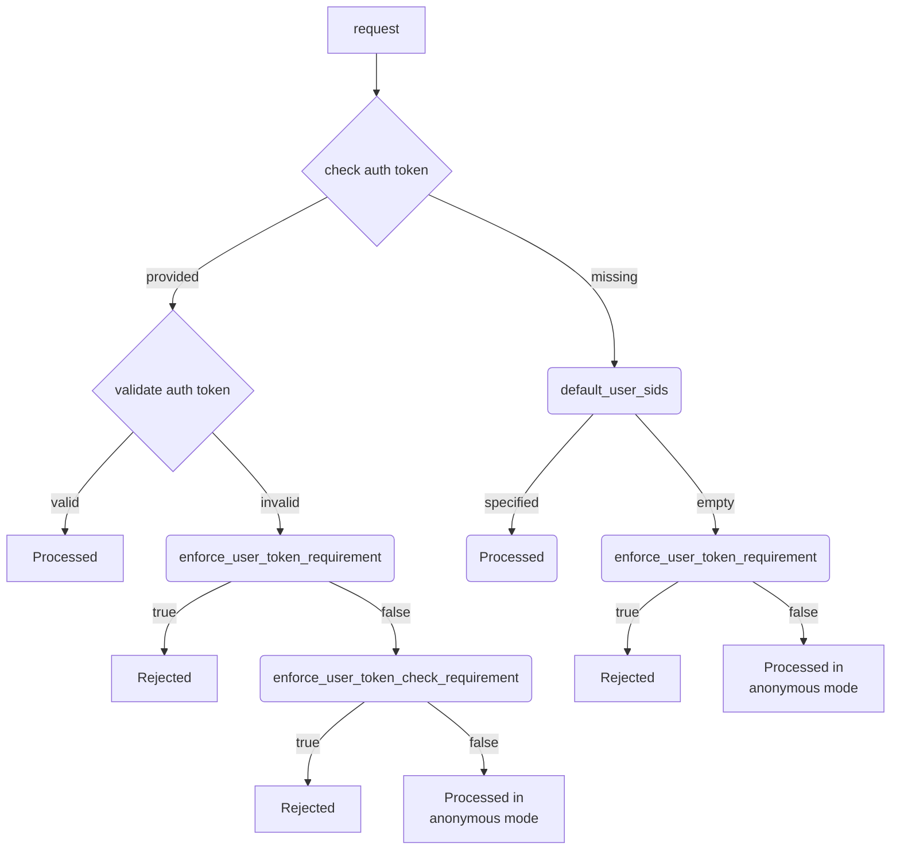

# security_config

В разделе `security_config` файла конфигурации {{ ydb-short-name }} задаются режимы [аутентификации](../../security/authentication.md), первичная конфигурация локальных [пользователей](../../concepts/glossary.md#access-user) и [групп](../../concepts/glossary.md#access-group) и их [права](../../concepts/glossary.md#access-right).

```yaml
security_config:
  # настройка режима аутентификации
  enforce_user_token_requirement: false
  enforce_user_token_check_requirement: false
  default_user_sids: <SID для анонимных запросов>
  all_authenticated_users: <имя группы всех аутентифицированных пользователей>
  all_users_group: <имя группы всех пользователей>

  # первичные настройки безопасности
  default_users: <список пользователей по умолчанию>
  default_groups: <список групп по умолчанию>
  default_access: <список прав по умолчанию на корне кластера>

  # настройки списков доступа
  database_allowed_sids: <список SID'ов, которым разрешён просмотр состояния базы данных>
  viewer_allowed_sids: <список SID'ов с правами просмотра состояния кластера>
  monitoring_allowed_sids: <список SID'ов с правами мониторинга и изменения состояния кластера>
  administration_allowed_sids: <список SID'ов с правами администрирования кластера>
  bootstrap_allowed_sids: <список SID'ов, которым разрешена начальная инициализация кластера>
  register_dynamic_node_allowed_sids: <список SID'ов с правами регистрации узлов баз данных в кластере>

  # настройки встроенной настройки безопасности
  disable_builtin_security: false
  disable_builtin_groups: false
  disable_builtin_access: false

  # настройки сокрытия ошибок доступа
  hide_authentication_failure_reasons: true
```

## Настройки режима аутентификации {#security-auth}

#|
|| Параметр | Описание ||
|| `enforce_user_token_requirement` | Режим обязательной [аутентификации](../../security/authentication.md).

Возможные значения:

- `true` — аутентификация обязательна, запросы к {{ ydb-short-name }} обязаны сопровождаться [аутентификационным токеном](../../concepts/glossary.md#auth-token).

    Запросы проходят аутентификацию и проверку прав.

- `false` — аутентификация опциональна, запросы к {{ ydb-short-name }} могут не сопровождаться [аутентификационным токеном](../../concepts/glossary.md#auth-token).

    Запросы без токена выполняются в [анонимном режиме](../../security/authentication.md#anonymous) и без проверки прав.

    Запросы с токеном проходят аутентификацию и проверку прав. Но в случае ошибок аутентификации, запросы не запрещаются, а выполняются в анонимном режиме.

    При `enforce_user_token_check_requirement: true` выполнение запросов с ошибкой аутентификации запрещается.

[//]: # (TODO: добавить про ошибки проверки права на доступ к базе данных, когда появится место для ссылки)

Взамен отсутствующего в запросах токена используется значение параметра `default_user_sids`, если параметр определён и не пустой (см. описание ниже). Тогда аутентификация и проверка прав проводится для [субъекта доступа](../../concepts/glossary.md#access-subject), заданного `default_user_sids`.

Значение по умолчанию: `false`.
    ||
|| `enforce_user_token_check_requirement` | Запрещает игнорировать ошибки аутентификации в режиме `enforce_user_token_requirement: false`.

Значение по умолчанию: `false`.
    ||
|| `default_user_sids` | Список [SID](../../concepts/glossary.md#access-sid)'ов для использования в процессе аутентификации в случае, когда входящий запрос не сопровождается явным [аутентификационным токеном](../../concepts/glossary.md#auth-token).

`default_user_sids` используется для анонимных запросов. Первым элементом в списке должен быть SID пользователя, за ним должны идти SID'ы групп, к которым пользователь принадлежит.

Непустой `default_user_sids` позволяет использовать режим обязательной аутентификации (`enforce_user_token_requirement: true`) вместе с анонимными запросами. Это может быть полезно в определённых сценариях тестирования {{ ydb-short-name }} или в ознакомительных целях для локальных баз данных.

Значение по умолчанию: пустой список.
    ||
|| `all_authenticated_users` | Имя виртуальной [группы](../../concepts/glossary.md#access-group), в которой состоят все аутентифицированные [пользователи](../../concepts/glossary.md#access-user).

Виртуальную группу не нужно явно создавать, она ведётся системой автоматически. Виртуальную группу нельзя удалить, нельзя получить или изменить список её членов.
Пользователь может использовать её для выдачи [прав](../../concepts/glossary.md#access-right) на [схемных объектах](../../concepts/glossary.md#scheme-object).



Информацию о правах доступа к схемным объектам можно получить из системных представлений {{ ydb-short-name }}, см. [{#T}](../../dev/system-views#informaciya-o-pravah-dostupa).



Значение по умолчанию: `all-users@well-known`.
    ||
|| `all_users_group` | Имя [группы](../../concepts/glossary.md#access-group), в которую должны добавляться все внутренние [пользователи](../../concepts/glossary.md#access-user).

Если `all_users_group` не пустая, то все локальные пользователи в момент создания будут добавляться в группу с указанным именем. В момент создания пользователей группа, указанная в этом параметре, должна существовать.

`all_users_group` автоматически конфигурируется при выполнении [встроенной настройки безопасности](../../security/builtin-security.md).

Значение по умолчанию: пустая строка.
    ||
|#

Следующая диаграмма показывает как взаимодействуют параметры настройки режима аутентификации:


```mermaid
flowchart TD
    request --> check-auth-token{check auth token}

        check-auth-token --> |provided| validate{validate auth token}
            validate{validate auth token} --> |valid| Processed
            validate{validate auth token} --> |invalid| invalid_enforce(enforce_user_token_requirement)
                invalid_enforce --> |true| r[Rejected]
                invalid_enforce --> |false| invalid_check_requirement(enforce_user_token_check_requirement)
                    invalid_check_requirement --> |true| Rejected
                    invalid_check_requirement --> |false| anonym[Processed in
                    anonymous mode]

        check-auth-token --> |missing| missing_default(default_user_sids)
            missing_default --> |specified| default_specified_enforce(Processed)
            missing_default --> |empty| default_empty_enforce(enforce_user_token_requirement)
                default_empty_enforce --> |true| default_empty_enforce_true[Rejected]
                default_empty_enforce --> |false| default_empty_enforce_false[Processed in
                anonymous mode]
```

## Первичные настройки безопасности {#security-bootstrap}

Параметры `default_users`, `default_groups`, `default_access` влияют на настройку кластера, осуществляемую при первом старте {{ ydb-short-name }}. При последующих запусках первичная настройка не выполняется, эти параметры игнорируются.

См. также раздел по [встроенной настройке безопасности](../../security/builtin-security.md) и влияющие на неё настройки [уровня `domains_config`](domains_config.md).

#|
|| Параметр | Описание ||
|| `default_users` | Какие [пользователи](../../concepts/glossary.md#access-user) должны быть созданы на кластере при первом запуске.

Список пар логин-пароль. Первый пользователь становится [суперпользователем](../../security/builtin-security.md#superuser).



Пароли задаются в открытом виде и оставлять их действующими на долгое время небезопасно. Поэтому после первого запуска кластера и его настройки рекомендуется пароли стартовым пользователям поменять средствами {{ ydb-short-name }} (например, [`ALTER USER`](../../yql/reference/syntax/alter-user.md)).

[//]: # (TODO: добавить про возможность блокировки этих стартовых пользователей, когда такое описание появится)



Пример:

```yaml
default_users:
- name: root
  password: <...>
- name: user1
  password: <...>
```

Ошибки в списке (повторение логинов) фиксируются в логе, но не влияют на запуск кластера.

    ||
|| `default_groups` | Какие [группы](../../concepts/glossary.md#access-group) должны быть созданы на кластере при первом запуске.

Список групп и их членов.



Эти группы создаются для всего кластера {{ ydb-short-name }}.



Пример:

```yaml
default_groups:
- name: ADMINS
  members: root
- name: USERS
  members:
  - ADMINS
  - root
  - user1
```

Порядок перечисления групп важен: группы создаются в порядке перечисления, и указанные члены группы к моменту создания группы должны существовать, иначе они не будут добавлены в группу.

Ошибки добавления членов групп фиксируются в логе, но не влияют на запуск кластера.

    ||
|| `default_access` | Какие [права](../../concepts/glossary.md#access-right) должны быть выданы на корне кластера.

Список разрешений в формате [краткой записи управления доступом](../../security/short-access-control-notation.md).

Пример:

```yaml
default_access:
- +(CDB|DDB|GAR):ADMINS
- +(ConnDB):USERS
```

    ||
|#

Ошибки в строках прав доступа фиксируются в логе, но не влияют на запуск кластера. Право доступа с ошибкой не будет добавлено.

[//]: # (TODO: требуется доработка, сейчас ошибка в формате приводит к падению процесса)

## Настройки административных и других привилегий {#security-access-levels}

Списки уровней доступа настраиваются в секции `security_config`. Подробная информация о списках уровней доступа, их иерархии и принципах работы приведена в разделе [Списки уровней доступа](../../security/authorization.md#access-level-lists) документации по авторизации.

#|
|| Параметр | Описание ||
|| `database_allowed_sids` | Список [SID](../../concepts/glossary.md#access-sid)'ов с уровнем доступа database.

Этот уровень менее привилегирован, чем viewer. Субъекты с таким уровнем могут работать только в контексте конкретной базы данных — backend-вызовы без указания базы запрещены. Запросы уровня кластера (например, получение списка узлов кластера) возвращают 403. Запросы в контексте базы данных (например, страницы базы в [Embedded UI](../embedded-ui/ydb-monitoring.md)) работают штатно.

Предназначен для приложений или пользователей, ограниченных одной базой данных.
    ||
|| `viewer_allowed_sids` | Список [SID](../../concepts/glossary.md#access-sid)'ов с уровнем доступа viewer.

Даёт возможность просматривать состояние кластера, недоступное публично (включая большую часть страниц [Embedded UI](../embedded-ui/ydb-monitoring.md)), без возможности вносить изменения.
    ||
|| `monitoring_allowed_sids` | Список [SID](../../concepts/glossary.md#access-sid)'ов с уровнем доступа monitoring.

Даёт дополнительные привилегии для мониторинга и изменения состояния кластера. Например, позволяет выполнять резервное копирование, восстановление базы данных или запускать YQL-запросы через Embedded UI.
    ||
|| `administration_allowed_sids` | Список [SID](../../concepts/glossary.md#access-sid)'ов с уровнем доступа administration.

Даёт привилегии для администрирования кластера {{ ydb-short-name }} и его баз данных.

Также используется для изменения конфигурации, схемных операций, требующих административных прав, и других административных проверок.

Пустой список означает, что любой пользователь считается администратором.
    ||
|| `bootstrap_allowed_sids` | Список [SID](../../concepts/glossary.md#access-sid)'ов, которым разрешено выполнять начальную инициализацию кластера.

Используется для первоначальной инициализации кластера из неинициализированного состояния, когда подсистема аутентификации ещё не функционирует. Начальная инициализация разрешена, если субъект входит в `bootstrap_allowed_sids` или `administration_allowed_sids`.

`bootstrap_allowed_sids` позволяет выделить отдельные идентичности для начальной инициализации без выдачи им полных административных привилегий.
    ||
|| `register_dynamic_node_allowed_sids` | Список [SID](../../concepts/glossary.md#access-sid)'ов, которым разрешена регистрация узлов баз данных.

По техническим причинам этот список должен включать `root@builtin`.
    ||
|#



По умолчанию списки уровней доступа пусты.

**Пустой** список означает «разрешить любому пользователю»: подходит любой SID, а если разрешён анонимный доступ — даже отсутствие SID. Пустой `administration_allowed_sids` даёт любому пользователю права администратора; пустой `viewer_allowed_sids` (если остальные UI-списки тоже пусты) даёт любому пользователю viewer-доступ к Embedded UI. Если все четыре иерархических списка пусты, любой пользователь получает полный административный доступ.

Для защищённого развёртывания {{ ydb-short-name }} важно заранее спланировать модель доступа и определить списки групп до первого запуска кластера.



Списки уровней доступа могут содержать SID [пользователей](../../concepts/glossary.md#access-user) или [групп](../../concepts/glossary.md#access-group). Субъект соответствует списку, если в нём присутствует его пользовательский SID или любой SID одной из его групп, включая вложенные группы — достаточно одного совпадения.

Рекомендуется включать в списки уровней доступа `*_allowed_sids` группы пользователей и отдельные сервисные аккаунты. Тогда выдача уровней доступа отдельным пользователям не потребует изменения конфигурации кластера {{ ydb-short-name }}.

**Где используются списки:**

- **`database_allowed_sids`**, **`viewer_allowed_sids`**, **`monitoring_allowed_sids`**, **`administration_allowed_sids`**
    Для доступа к Embedded UI и viewer HTTP endpoints.

- **`administration_allowed_sids`**
    Для всех административных проверок.

- **`bootstrap_allowed_sids`**
    Только для операции начальной инициализации кластера.

- **`register_dynamic_node_allowed_sids`**
    Для регистрации узлов в кластере (discovery service и подсистема cms).



Списки уровней доступа представляют собой слои дополнительных привилегий:

- Субъект доступа, не включённый ни в один список уровней доступа, может просматривать только публично доступную информацию о кластере (например, [список баз данных в кластере](../embedded-ui/ydb-monitoring.md#tenant_list_page) или [список узлов кластера](../embedded-ui/ydb-monitoring.md#node_list_page)).
- Список `database_allowed_sids` определяет роль «database»: такие пользователи менее привилегированы, чем viewers, и не могут выполнять backend-вызовы без указания базы данных; общекластерные запросы для них недоступны.
- Списки `viewer_allowed_sids`, `monitoring_allowed_sids` и `administration_allowed_sids` образуют иерархию: administration включает monitoring и viewer, а monitoring включает viewer. Субъекту достаточно находиться только в одном списке, соответствующем его роли — включение в более высокий список автоматически даёт все более низкие привилегии.

Например:

- пользователя базы данных (например, приложение, которое должно работать только в рамках одной базы) следует добавлять только в `database_allowed_sids`;
- наблюдателя следует добавлять только в `viewer_allowed_sids`;
- пользователя с уровнем monitoring следует добавлять только в `monitoring_allowed_sids` (он автоматически получает viewer-привилегии);
- администратора следует добавлять только в `administration_allowed_sids` (он автоматически получает monitoring- и viewer-привилегии).



## Настройки встроенной настройки безопасности

Флаги `disable_builtin_security`, `disable_builtin_groups`, `disable_builtin_access` влияют на настройку кластера, осуществляемую только при первом старте кластера {{ ydb-short-name }}.

#|
|| Параметр | Описание ||
|| `disable_builtin_security` | Не выполнять [встроенную настройку безопасности](../../security/builtin-security.md).
Встроенная настройка включает автоматическое создание суперпользователя `root`, набора встроенных пользовательских групп и выдачу прав доступа этим группам на корне кластера.

Эфемерный флаг, не попадает в конфигурацию, сохраняемую в кластере.

Значение по умолчанию: `false`.
    ||
|| `disable_builtin_groups` | Отказаться от создания [встроенных групп](../../security/builtin-security.md), даже если явные группы по умолчанию ([`security_config.default_groups`](security_config.md)) заданы.

Значение по умолчанию: `false`
    ||
|| `disable_builtin_access` | Отказаться от добавления прав на корне кластера для [встроенных групп](../../security/builtin-security.md), даже если явные права по умолчанию ([`security_config.default_access`](security_config.md)) заданы.

Значение по умолчанию: `false`
    ||
|#

## Настройки сокрытия ошибок доступа

#|
|| Параметр | Описание ||
|| `hide_authentication_failure_reasons` | Скрывает от пользователя причины ошибок аутентификации.

Позволяет предотвратить утечку информации о внутреннем устройстве и содержимом систем аутентификации {{ ydb-short-name }}.
Например, усложняет для злоумышленника задачу выявления существующих пользователей методом перебора.

Значение по умолчанию: `true`.
    ||
|#
