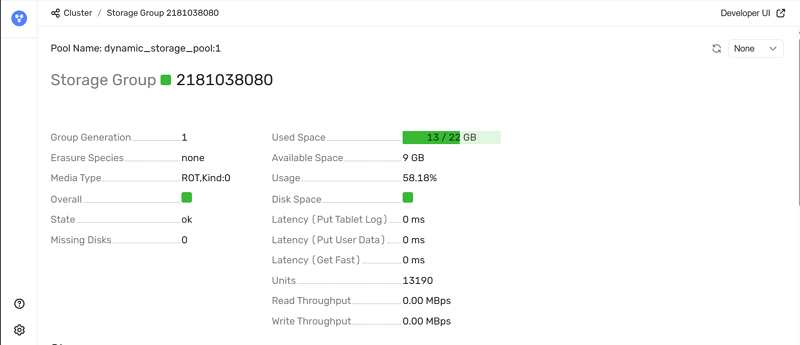
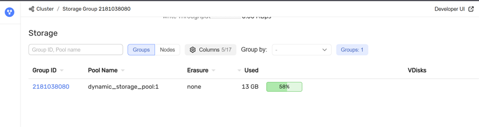

# Страница Storage {#storage_page}

Страница открывается при переходе по **Group ID** с вкладки [Storage](ydb-monitoring.md#storage_list).

На странице отображаются контекст и детальные атрибуты выбранной группы:

* **Pool Name** — имя [пула хранения](../../concepts/glossary.md#storage-pool);
* **Storage Group** — идентификатор [группы хранения](../../concepts/glossary.md#storage-group);
* **Group Generation** — поколение конфигурации группы;
* **Erasure Species** — используемая схема отказоустойчивости;
* **Media Type** — тип носителя;
* **Overall** — агрегированное состояние группы;
* **State** — текущее состояние;
* **Missing Disks** — количество недоступных дисков;
* **Used Space** — занятое пространство относительно общей ёмкости;
* **Available Space** — доступный объём;
* **Usage** — процент использования;
* **Disk Space** — состояние дискового ресурса;
* **Latency (Put Tablet Log)** — задержка записи журналов таблеток;
* **Latency (Put User Data)** — задержка записи пользовательских данных;
* **Latency (Get Fast)** — задержка быстрых чтений;
* **Units** — количество единиц хранения в группе;
* **Read Throughput** — пропускная способность чтения;
* **Write Throughput** — пропускная способность записи.

Страница также содержит таблицу в том же формате, что и на вкладке [Storage](ydb-monitoring.md#storage_list) главной страницы — сводная информация о группах хранения, в данном случае по выбранной группе.

В таблице отображаются:

* **Group ID** — идентификатор [группы хранения](../../concepts/glossary.md#storage-group);
* **Pool Name** — имя [пула хранения](../../concepts/glossary.md#storage-pool);
* **Erasure** — схема отказоустойчивости;
* **Used** — объём занятого дискового пространства и доля использования;
* **VDisks** — состояние [виртуальных дисков](../../concepts/glossary.md#vdisk), входящих в группу.
