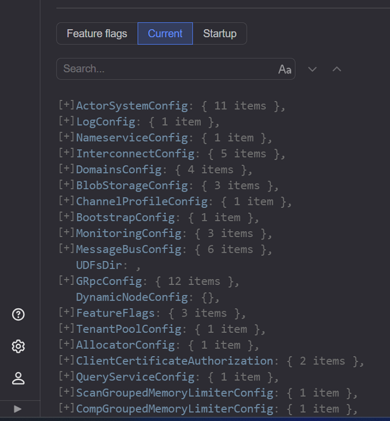
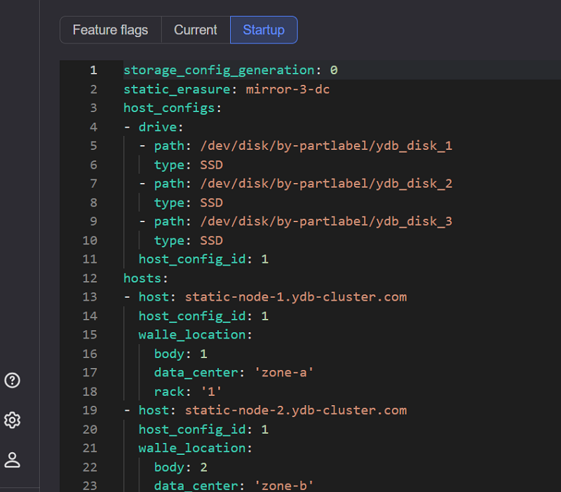

# {{ ydb-short-name }} Monitoring

{{ ydb-short-name }} Monitoring представлен набором web-страниц, отображающих состояние системы в разрезе по нескольким аспектам. На страницах приведены перечни компонент и их мгновенные параметры. Для многих компоненты приведен [цветовой индикатор](#colored_indicator) состояния перед названием.

## Главная страница {#main_page}

Страница доступна по адресу:

```text
http://<ендпоинт>:
```

Внешний вид страницы показан на скриншоте ниже.


В левом верхнем углу отображается название кластера с соответствующим [индикатором состояния](#colored_indicator) работы всего кластера.

Ниже представлена вкладка [overview](ссылка на подраздел) с [индикаторами](#colored_indicator) информации о состоянии кластера:

* **CPU** - загруженность процессора;
* **Storage** - загруженность места на дисках;
* **Memory** - загруженность оперативной памяти;
* **Network** - загруженность сетевого подключения.

Далее следуют списки, переключаемые вкладками, каждая из которых отображает определённый компонент кластера.

### Databases {#database_list}


Сверху находится вкладка с поиском по названию датабазы, справа можно выбрать **All**  - "все доступные" или **With problems** - "с проблемами",  правее отображается индикатор количества датабаз.

Ниже представлена таблица с параметрами датабазы, в которой приведены:

* **Database** - название базы данных. При нажатии можно перейти на вкладку страницы [Database](#databases_page);
* **Name** - название текущей базы данных;
* **Type** - тип базы данных;
* **State** - состояние базы данных;
* **CPU** - загрузка CPU узлами;
* **Memory** - потребление ОЗУ узлами тенанта(?);
* **Storage** - оценка объема данных, хранимых тенантом;
* **Network** - потребление сетевого трафика;
* **Nodes** - состояние узлов текущей базы данных в кластере;
* **Groups** - состояние групп хранения текущей базы данных в кластере;
* **Pools** - состояние пулов хранения текущей базы данных в кластере.



База данных типа `Domain` обслуживает системные компоненты, необходимые для обеспечения работы всех тенантов. В нее входят все `storage` узлы и системные таблетки. База данных типа `Dedicated` выполняет обслуживание базы данных.



### Nodes {#nodes_list}


Сверху находится вкладка с поиском по названию хоста, вкладка с выбором правил группировки, ниже представлен список с вкладками:

* **#** - номер узла;
* **Host** - хост, на котором располагается узел. При нажатии можно перейти на [страницу узла](#node_page);
* **Uptime** - время работы узла;
* **CPU** - загрузка CPU конкретным узлом;
* **RAM** - использование оперативной памяти конкретным узлом;
* **Version** - версия (перечень версий) на текущем узле кластера;
* **Tablets** - таблетки, работающие в данном узле

### Tablets {#tablets_list}

Многие компоненты YDB выполнены в виде таблеток. Система может перемещать таблетки между узлами. На любом из узлов может выполняться некоторое количество таблеток.


Вверху находится вкладка с поиском по **TabletID** и отображение количества таблеток на данном кластере.

Ниже представлен список:

* **Type** - тип таблетки;
* **TabletID** - ID таблетки, нажав на который, можно перейти на [страницу таблетки](#tablets_page);
* **State** - состояние таблетки;
* **NodeID** - ID узла, на котором работает таблетка;
* **NodeFQDN** -  полное доменное имя (представляет собой сетевой адрес, включающий имя хоста и домен) узла, на котором работает таблетка;
* **Generation** - поколение (номер текущей попытки запуска) таблетки;
* **Uptime** - Время работы таблетки.

### Versions {#versions_list}

Вкладка **Versions** на странице мониторинга кластера YDB показывает перечень версий YDB, которые выполняются на узлах кластера. С её помощью можно увидеть, какие версии используются в кластере, и отследить их распределение по узлам.


**Overall** - перечень всех доступных версий в кластере;
**Storage nodes** - версии, на которых располагаются узлы распределенного хранилища. На вкладке написано количество узлов. При открытии можно увидеть все узлы распределенного хранилища.

скрин

Табличка состоящая из колонок:

* **#** - номер узла;  
* **Host** - хост, на котором располагается узел распределенного хранилища;
* **Uptime** - время работы узла распределенного хранилища;
* **RAM** - использование оперативной памяти конкретным узлом распределенного хранилища;
* **CPU** - загрузка CPU конкретным узлом распределенного хранилища;
* **Load Average** - средняя загрузка узла распределенного хранилища за разные интервалы времени.

**Database nodes**
версии, на которых располагаются узлы баз данных. На вкладке тоже написано количество узлов. есть кнопка группирования по датабазе и по версии.

скрин

Табличка состоит из колонок:

* **#** - номер узла;  
* **Host** - хост, на котором располагается узел базы данных;
* **Uptime** - время работы узла базы данных;
* **RAM** - использование оперативной памяти конкретным узлом базы данных;
* **CPU** - загрузка CPU конкретным узлом базы данных;
* **Load Average** - средняя загрузка узла базы данных за разные интервалы времени.

### Configs {#configs_list}

Вкладка **Configs** в интерфейсе мониторинга YDB позволяет работать с конфигурацией кластера. В ней можно просматривать и редактировать различные параметры настройки кластера, которые влияют на его работу. Состоит из трёх подвкладок:

* **Feature flags**

Раздел **Feature flags** в динамической конфигурации кластера YDB позволяет включать или отключать экспериментальную функциональность на отдельных базах данных. С помощью feature flags можно, например, активировать поддержку федеративных запросов к внешним источникам данных — объектным хранилищам или реляционным СУБД.


* **Current**

Список конфигураций системы с количеством параметров каждой. С помощью него можно....



* **Startup**

На вкладке показана информация о хостах, топологии кластера, конфигурации хоста и дисках...



## Страница Databases {#databases_page}

Страница доступна по адресу:

```text
http://<ендпоинт>:
```

Внешний вид страницы:


Основные блоки страницы:

**Navigation**
верхняя левая часть экрана - предоставляет информацию о текущей рабочей директории и позволяет поменять директорию.

Вкладка чуть ниже **Subdomain** отображает текущую выбранную директорию с возможностью выбрать превью.

**Overview** - на вкладке отображаются сведения о текущем файле или директории:

* **Type** - тип датабазы;
* **ID** - номер ID файла (датабазы);
* **Created** - создана  .........;
* **Data size** - размер файла (датабазы);
* **row count** - количество строк в файле(датабазе);
* **partitions count** - количество разделов в файле(датабазе).

Можно переключиться на подвкладку [Schema] (ссылка на раздел) - схема тенанта, позвляет просматривать таблицы, выполнять YQL запросы, проосматривать перечень самых медленные запросов и самых нагруженных шардов;
скрин

**Query**
Три подвкладки:

* **Editor** - отображение поля, в котором создаются запросы;
* **History** - история запросов;
* **Saved** - сохраненные запросы.

**Diagnostic** - на вкладке предоставлена разная информация.


Вкладка представляет собой большую таблицу, состоящую из блоков:

* **Info**
* **Schema**  
* **Top shards**
* **Nodes**
* **Graph**
* **Tablets**
* **Hot keys**
* **Describe**
* **Acces**

## Страница Nodes {#node_page}

Страница доступна по адресу:

```text
http://<ендпоинт>:
```

Внешний вид страницы:


Вверху значок, что мы на кластере переключились на конкретный узел. Полное доменное имя текущего узла (FQDN). DC - зона доступности, в которой расположен узел. Ниже написано название узла.

Информация об узле предоставлена следующими блоками:

**Common info** — базовая информация об узле:

* **Version** — версия YDB;
* **Uptime** — время работы узла;
* **DC** — зона доступности в которой расположен узел;
* **Rack** — идентификатор стойки в которой располагается узел.
* **Links** - переход на....

**Pools** — потребление CPU в разбивке по внутренним пулам потоков, примерное предназначение пулов:

* **System** — задачи критически важных системных компонентов;
* **User** — пользовательские задачи, выполнение запросов таблетками;
* **Batch** — длительные фоновые задачи;
* **IO** — выполнение блокирующих операций ввода-вывода;
* **IC** — обработка сетевого взаимодействия.

Высокая загрузка пулов может быть причиной деградации производительности и увеличения времени отклика системы.

**Load average** — средняя загрузка CPU хоста за разные интервалы времени:

* 1 минута;
* 5 минут;
* 15 минут.

**endpoints** - информация о каждом отдельном эндпоинте сетевого соединения:

* **grpcs** - порт, по которому осуществляется протокол с шифрованием;
* **http-mon** - порт, по которому осуществляется протокол мониторинга доступности соединения;
* **IC** - порт, по которому осуществляется протокол мониторинга стабильной работы (хэлсчек) соединения.

Справа от блоков находится список **Roles**.

Внизу вкладки с компонентами и сведениями, относящимися к конкретно выбранному узлу.

## Страница Tablets {#tablets_page}

Многие компоненты {{ ydb-short-name }} выполнены в виде таблеток. Система может перемещать таблетки между узлами. На любом из узлов может выполняться некоторое количество таблеток.

Страница доступна по адресу:

```text
http://<ендпоинт>:
```

Внешний вид страницы:


Вверху написан ID таблетки.

Кнопочка Restart - перезапустить таблетку.

Таблица **Info** - информация о таблетке:

* **State** - состояние таблетки;
* **Uptime** - время работы таблетки с момента текущего запуска;
* **Generation** - поколение (номер текущей попытки запуска) таблетки;
* **Node** - номер/количество узлов, на которых работает таблетка.

Справа ссылки **Links**:

* App (на [Hive-web-viewer] (ссылка на раздел))
* Counters
* Executor DB internals
* State storage

И внизу табличка для конкретной таблетки с такими столбцами:

* **Generation** - поколение (номер текущей попытки запуска) таблетки,
* **change time** - время, когда была изменена таблетка;
* **state** - состояние таблетки;
* **tablet** - ID таблетки,
* **node ID** - ID узла, на котором работает таблетка,
* **Node FQDN** - Время работы таблетки.

## Индикаторы состояний {#colored_indicator}

Слева от названия конкретного компонента может находится цветовой индикатор его состояния.

Цвета индикаторов имеют следующее значение:

* **Зеленый** — проблем нет, компонент работает в штатном режиме;
* **Синий** — происходит репликация данных, других проблем нет;
* **Желтый** — возможны проблемы, компонент продолжает работать;
* **Красный** — имеются критические проблемы, компонент не работает или работает с ограничениями.

Если компонент включает в себя другие компоненты, то в случае отсутствия собственных проблем, его состояние определяется путем агрегирования состояний его частей.
