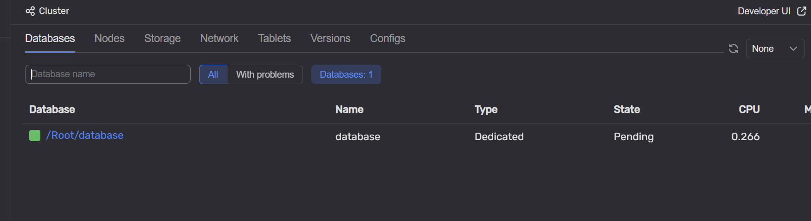
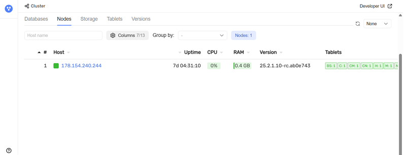
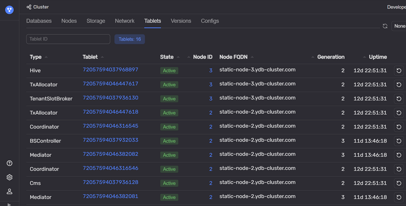
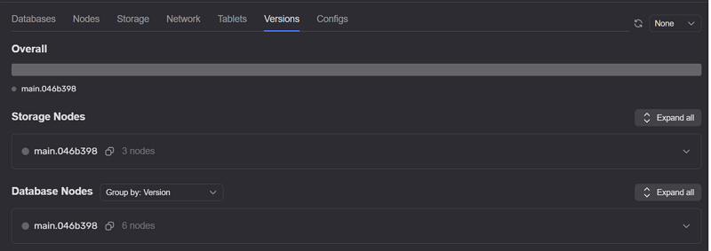
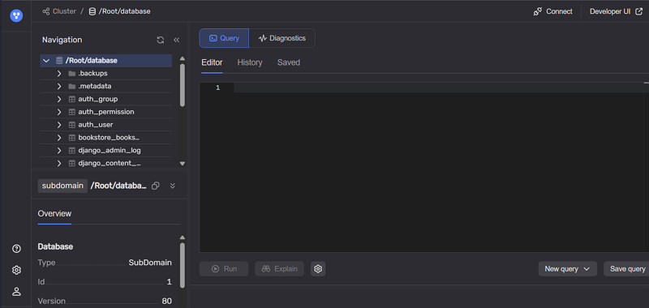
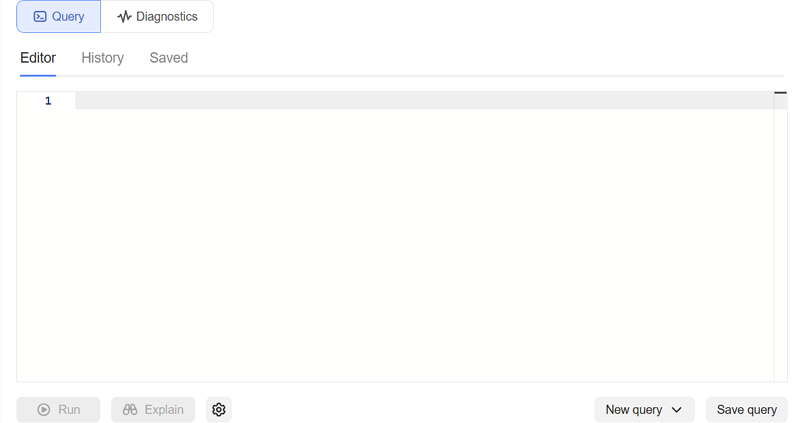
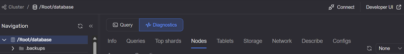
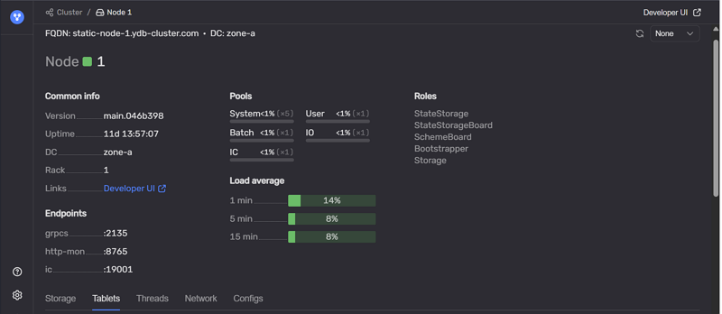
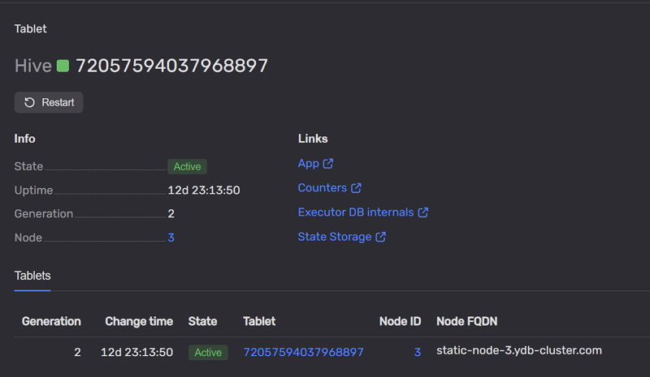

# {{ ydb-short-name }} Monitoring

{{ ydb-short-name }} Monitoring — это набор веб-страниц для мониторинга состояния кластера. На страницах отображаются компоненты системы и их текущие параметры. Для многих компонентов перед названием показывается [цветовой индикатор](#colored_indicator) состояния.

## Главная страница {#main_page}

Главная страница доступна по адресу:

```text
http://<ендпоинт>:8765/monitoring/cluster/tenants
```

Ниже показан пример главной страницы.


В верхней части страницы отображается сводная информация о кластере.

На вкладке **Overview** показаны [индикаторы состояния](#colored_indicator) по ключевым ресурсам:

* **CPU** — загрузка процессора;
* **Storage** — использование дисковой подсистемы;
* **Memory** — использование оперативной памяти;
* **Network** — использование сетевых ресурсов.

Ниже расположен набор вкладок:

* **[Databases](#database_list)** — список [баз данных](../../concepts/glossary.md#database), развернутых в кластере;
* **[Nodes](#nodes_list)** — список [узлов кластера](../../concepts/glossary.md#node);
* **Storage** — список [групп хранения](../../concepts/glossary.md#storage-group) и использование ими дискового пространства;
* **[Tablets](#tablets_list)** — список запущенных [таблеток](../../concepts/glossary.md#tablet);
* **[Versions](#versions_list)** — версии {{ ydb-short-name }}, запущенные на узлах кластера.

### Databases {#database_list}

На вкладке отображается список баз данных и их ключевые метрики.



В верхней части расположен поиск по имени базы данных, переключатель режимов (**All** / **With problems**) и счетчик баз данных.

В таблице приведены:

* **Database** — путь базы данных. По ссылке можно открыть [страницу Databases](#databases_page);
* **Name** — имя базы данных;
* **Type** — тип базы данных;
* **State** — текущее состояние;
* **CPU** — загрузка CPU узлами базы данных;
* **Memory** — потребление оперативной памяти узлами базы данных;
* **Storage** — оценка объема данных, хранимых в базе данных;
* **Network** — использование сетевых ресурсов;
* **Nodes** — состояние узлов базы данных;
* **Groups** — состояние групп хранения;
* **Pools** — состояние пулов.



База данных типа `Domain` обслуживает системные компоненты, необходимые для работы всех тенантов. В нее входят storage-узлы и системные таблетки. База данных типа `Dedicated` обслуживает конкретную пользовательскую базу данных.



### Nodes {#nodes_list}

На вкладке отображаются узлы кластера и их состояние.



В верхней части страницы есть поиск по имени хоста и элементы группировки списка.

В таблице отображаются:

* **#** — идентификатор узла;
* **Host** — хост узла. По ссылке можно перейти на [страницу узла](#node_page);
* **Uptime** — время работы узла;
* **CPU** — загрузка CPU на узле;
* **RAM** — использование оперативной памяти;
* **Version** — версия {{ ydb-short-name }}, запущенная на узле;
* **Tablets** — таблетки, работающие на узле.

### Tablets {#tablets_list}

На вкладке отображается список таблеток, работающих в кластере.



В верхней части страницы доступны поиск по **TabletID** и счетчик таблеток.

В таблице отображаются:

* **Type** — тип таблетки;
* **TabletID** — идентификатор таблетки. По ссылке можно перейти на [страницу таблетки](#tablets_page);
* **State** — состояние таблетки;
* **NodeID** — идентификатор узла, на котором работает таблетка;
* **NodeFQDN** — полное доменное имя узла;
* **Generation** — [поколение](../../concepts/glossary.md#tablet-generation) таблетки;
* **Uptime** — время работы таблетки.

### Versions {#versions_list}

Вкладка **Versions** показывает, какие версии {{ ydb-short-name }} запущены на узлах кластера и как они распределены.



* **Overall** — перечень версий в кластере;
* **Storage nodes** — версии на узлах [распределенного хранилища](../../concepts/glossary.md#distributed-storage).

Для выбранной версии отображается таблица узлов:

* **#** — идентификатор узла;
* **Host** — хост узла;
* **Uptime** — время работы узла;
* **RAM** — использование оперативной памяти;
* **CPU** — загрузка CPU;
* **Load Average** — средняя загрузка CPU за разные интервалы времени.

## Страница Databases {#databases_page}

Страница открывается при переходе по ссылке из колонки **Database** на вкладке [Databases](#database_list).

Ниже показан пример интерфейса.



СКРИНШОТ: требуется актуальный общий скриншот страницы `Databases` с видимой верхней панелью и вкладками. Текущий скриншот иллюстрирует в основном вкладку `Query`, из-за чего структуру страницы приходится описывать частично.

Основные разделы страницы:

### Navigation

В блоке **Navigation** отображается текущий путь в иерархии объектов базы данных и элементы навигации.

В разделе **Overview** отображаются метаданные выбранного объекта (файл или директория), например:

* **Type** — тип объекта;
* **ID** — идентификатор объекта;
* **Version** — версия объекта;
* **Created** — дата и время создания.

СКРИНШОТ: нужен отдельный скриншот блока `Navigation` и секции `Overview`, чтобы зафиксировать реальные названия полей и их состав.

### Query

Вкладка **Query** содержит три секции:

* **Editor** — редактор для выполнения запросов;



* **History** — история выполненных запросов;


* **Saved** — сохраненные запросы.


### Diagnostics

Вкладка **Diagnostics** отображает диагностическую информацию по выбранному объекту и его окружению.



Данные сгруппированы по тематическим разделам, например:

* **Info** — базовая информация;
* **Queries** — данные по запросам;
* **Top shards** — наиболее загруженные шарды;
* **Nodes** — узлы, связанные с объектом;
* **Tablets** — обслуживающие таблетки;
* **Storage** — данные по хранилищу;
* **Network** — параметры сетевого взаимодействия;
* **Describe** — описание объекта;
* **Configs** — конфигурационные параметры;
* **Access** — информация о правах доступа;
* **Operations** — текущие и завершенные операции.

## Страница Nodes {#node_page}

Страница доступна по адресу:

```text
http://<ендпоинт>:8765/monitoring/node/<node-id>/
```

Ниже показан пример страницы узла.



В верхней части отображается контекст выбранного узла.

Ниже представлены ключевые атрибуты:

* **FQDN** — полное доменное имя узла;
* **DC** — зона доступности (дата-центр);
* **Host name** — имя узла.

Информация об узле сгруппирована по разделам.

### Common info

Раздел содержит базовые характеристики узла:

* **Version** — версия YDB, которой принадлежит текущий узел;
* **Uptime** — время работы узла;
* **DC** — зона доступности, в которой расположен узел;
* **Rack** — идентификатор стойки, в которой располагается узел;
* **Links** — ссылки на связанные служебные страницы.

### Pools

Раздел демонстрирует, как распределяется нагрузка на CPU между внутренними пулами потоков. Также представлено ориентировочное описание сферы применения каждого пула.

* **System** — задачи критически важных системных компонентов;
* **User** — пользовательские задачи, выполнение запросов таблетками;
* **Batch** — длительные фоновые задачи;
* **IO** — выполнение блокирующих операций ввода-вывода;
* **IC** — обработка сетевого взаимодействия.

Высокая загрузка пулов может быть причиной деградации производительности и увеличения времени отклика системы.

### Load average

Средняя загрузка CPU хоста за интервалы:

* 1 минута;
* 5 минут;
* 15 минут.

### Endpoints

В таблице отображаются эндпоинты узла:

* **grpc** — порт для подключения по gRPC;
* **grpcs** — порт для подключения по gRPC с TLS;
* **http-mon** — порт веб-интерфейса мониторинга;
* **IC** — endpoint межузлового взаимодействия.

СКРИНШОТ: желательно добавить скриншот секции `Endpoints` с видимыми названиями полей. Сейчас семантика поля `IC` может различаться в зависимости от версии интерфейса.

На странице также доступны вкладки с данными по выбранному узлу:

* **Storage** — группы хранения, связанные с узлом;
* **Tablets** — таблетки, работающие на узле, с группировкой по типам;
* **Threads** — использование потоков и CPU по пулам.

## Страница Tablets {#tablets_page}

Многие компоненты {{ ydb-short-name }} реализованы в виде таблеток. Система может перемещать таблетки между узлами, поэтому на каждом узле выполняется свой набор таблеток.

Страница открывается при переходе по **TabletID** с вкладок [Tablets](#tablets_list) или [Nodes](#nodes_list).

Ниже показан пример страницы таблетки.



В верхней части отображается идентификатор таблетки.

Кнопка **Restart** позволяет инициировать перезапуск таблетки.

В разделе **Info** отображаются основные параметры:

* **State** — состояние таблетки;
* **Uptime** — время работы с момента текущего запуска;
* **Generation** — поколение (номер текущей попытки запуска);
* **Node** — идентификатор узла, на котором работает таблетка.

Справа расположен блок **Links**:

* App (на Hive-web-viewer);
* Counters;
* Executor DB internals;
* State storage.

В нижней части страницы отображается таблица с детализированными записями о состоянии таблетки.

* **Generation** — [поколение](../../concepts/glossary.md#tablet-generation) таблетки;
* **Change time** — время изменения состояния;
* **State** — текущее состояние;
* **Tablet** — идентификатор таблетки;
* **Node ID** — идентификатор узла;
* **Node FQDN** — полное доменное имя узла.

СКРИНШОТ: нужен скриншот нижней таблицы страницы `Tablets` с заголовками колонок. Это поможет верифицировать названия полей (регистр и формулировки зависят от версии интерфейса).

## Индикаторы состояний {#colored_indicator}

Слева от названия компонента может отображаться цветовой индикатор состояния.

Цвета индикаторов имеют следующее значение:

* **Зеленый** — проблем нет, компонент работает в штатном режиме;
* **Синий** — выполняется репликация данных, других проблем нет;
* **Желтый** — возможны проблемы, компонент продолжает работать;
* **Красный** — есть критические проблемы; компонент не работает или работает с ограничениями.

Если компонент включает другие компоненты и не имеет собственных проблем, его состояние вычисляется как агрегированное состояние вложенных компонентов.
