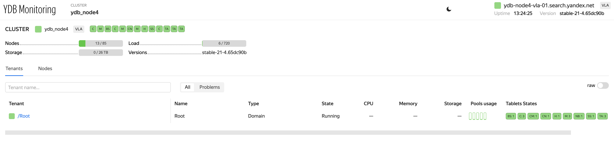

# {{ ydb-short-name }} Monitoring

{{ ydb-short-name }} Monitoring представлен набором web-страниц, отображающих состояние системы в разрезе по нескольким аспектам. На страницах приведены перечни компонент и их мгновенные параметры. Для многих компоненты приведен [цветовой индикатор](#colored_indicator) состояния перед названием.

## Главная страница {#main_page}

Страница доступна по адресу:

```
http://<ендпоинт>:8765/monitoring/cluster
```

Примерный внешний вид страницы показан на скриншоте ниже.



В правом верхнем углу страницы расположена информация об узле сформировавшем текущую страницу:

* хост;
* время работы узла;
* версия ydb исполняемая на узле.

Ниже расположена краткая сводка информации о кластере:

* имя кластера, перечень запущенных таблеток;
* **Nodes** — количество узлов;
* **Load** — суммарная загрузка CPU на всех узлах;
* **Storage** — занято/всего доступно места на дисках;
* **Versions** — перечень версий {{ ydb-short-name }} выполняемых на узлах кластера.

Далее следуют списки [тенантов](#tenant_list_page) и [узлов](#node_list_page), которые переключаются вкладками Tenants и Nodes соответственно.

### Список тенантов {#tenant_list_page}

{{ ydb-short-name }} — мультиарендная СУБД, позволяющая изолировано обрабатывать запросы к базам различных пользователей, называемых тенантами. Каждая база данных принадлежит одному тенанту.

В списке тенантов для каждого тенанта приведены:

* **Tenant** — путь тенанта;
* **Name** — имя тенанта;
* **Type** — тип тенанта;
* **State** — состояние;
* **CPU** — загрузка CPU узлами тенанта;
* **Memory** — потребление ОЗУ узлами тенанта;
* **Storage** — оценка объема данных, хранимых тенантом;
* **Pools usage** — потребление CPU узлами в разбивке по внутренним пулам потоков;
* **Tablets States** — таблетки работающие в данном тенанте.

Тенант типа `Domain` обслуживает системные компоненты, необходимые для обеспечения работы всех тенантов. В него входят все storage узлы и системные таблетки. Тенант типа `Dedicated` выполняет обслуживание базы данных.

При нажатии на путь тенанта можно перейти на [страницу тенанта](#tenant_page).

### Список узлов {#node_list_page}

В списке указаны все узлы кластера. Для каждого узла приведены:

* **#** — ID узла;
* **Host** — хост на котором располагается узел;
* **Endpoints** — прослушиваемые порты;
* **Version** — выполняемая версия {{ ydb-short-name }};
* **Uptime** — время работы узла;
* **Memory used** — используемый объем ОЗУ;
* **Memory limit** — установленное через cgroup ограничение потребления OЗУ;
* **Pools usage** — потребление CPU в разбивке по внутренним пулам потоков;
* **Load average** — средняя загрузка хоста по CPU.

При нажатии на имя хоста, можно перейти на [страницу узла](#node_page).

## Страница узла {#node_page}

Страница доступна по адресу:

```
http://<ендпоинт>:8765/monitoring/node/<node-id>/
```

Информация об узле представлена следующими блоками:

* **Pools** — потребление CPU в разбивке по внутренним пулам потоков, примерное предназначение пулов:

  * **System** — задачи критически важных системных компонентов;
  * **User** — пользовательские задачи, выполнение запросов таблетками;
  * **Batch** — длительные фоновые задачи;
  * **IO** — выполнение блокирующих операций ввода-вывода;
  * **IC** — обработка сетевого взаимодействия.

  Высокая загрузка пулов может быть причиной деградации производительности и увеличения времени отклика системы.

* **Common info** — базовая информация об узле:

  * **Version** — версия {{ ydb-short-name }};
  * **Uptime** — время работы узла;
  * **DC** — зона доступности в которой расположен узел;
  * **Rack** — идентификатор стойки в которой располагается узел.

* **Load average** — средняя загрузка CPU хоста за разные интервалы времени:

  * 1 минута;
  * 5 минут;
  * 15 минут.

На странице узла есть вкладки, Storage и Tablets содержащие [список групп хранения](#node_storage_page) и [список таблеток](#node_tablets_page) соответственно.

### Список групп хранения на узле {#node_storage_page}

Для storage узлов список содержит группы хранения, хранящие данные на диске на данном узле. Для dynamic узлов показаны группы хранения принадлежащие тенанту к которому относится узел.

Группы хранения сгруппированы по пулам хранения. Каждый пул можно развернуть в список групп.

Для каждой группа приведены:

* ID группы хранения;
* индикатор быстродействия группы;
* количество VDisk'ов в группе;
* топология хранения данных.

Каждую группу хранения также можно раскрыть в список VDisk'ов, где для каждого VDisk'а приведены:

* VDiskID;
* уникальный в пределах узла PDiskID, на котором находится VDisk;
* ID узла, на котором находится VDiks;
* свободное/доступное место на блочном устройстве;
* путь, используемый для доступа к блочному устройству.

Данный список можно использовать для идентификации групп хранения на которые оказали влияние выход из строя дисков или узлов.

### Список таблеток на узле {#node_tablets_page}

Многие компоненты {{ ydb-short-name }} выполнены в виде таблеток. Система может перемещать таблетки между узлами. На любом из узлов может выполняться некоторое количество таблеток.

В верхней части списка таблеток расположен крупный индикатор работы таблеток на данном узле. Он показывает долю полностью запущенных и работающих таблеток.

Ниже индикатора располагается список таблеток, где каждая таблетка представлена маленьким значком [цветового индикатора](#colored_indicator). При наведении на индикатор отображается краткая информация о таблетке:

* **Tablet** — ID таблетки;
* **NodeID** — ID узла, на котором работает таблетка;
* **State** — состояние таблетки;
* **Type** — тип таблетки;
* **Uptime** — время работы с момента текущего запуска таблетки;
* **Generation** — поколение (номер текущей попытки запуска) таблетки.

## Страница тенанта {#tenant_page}

```
http://<ендпоинт>:8765/monitoring/tenant/healthcheck?name=<tenant-path>
```

Так же как и предыдущие страницы, данная страница содержит краткую информацию о тенанте, но в отличии от других страниц этот блок изначально свернут.

В блоке `Tenant Info` представлена следующая информация:

* **Pools** — суммарное потребление CPU узлами тенанта в разбивке по внутренним пулам потоков (подробнее о пулах см. [страницу тенанта](#tenant_page));

* **Metrics** — Информация о потреблении таблеток данного тенанта:
  * **Memory** — используемая таблетками память;
  * **CPU** — загрузка таблетками CPU;
  * **Storage** — объем хранимых таблетками данных;
  * **Network** — примерный объем передаваемых между узлами данных;
  * **Read throughput** — поток чтений создававемый таблетками тенанта;
  * **Write throughput** — поток записи создававемый таблетками тенанта.
  
* **Tablets/running** — количество работающих таблеток.

На странице тенанта также имеются следующие вкладки:

* **HealthCheck** — отчет о проблемах кластера при их наличии;
* **Storage** — [список групп хранения](#tenant_storage_page), содержит информацию о том, какие VDisk'и на каких узлах и устройствах работают;
* **Compute** — [список узлов](#tenant_compute_page), содержит узлы и таблетки запущенные на них;
* **Schema** — [схема тенанта](#tenant_scheme), позвляет просматривать таблицы, выполнять YQL запросы, проосматривать перечень самых медленные запросов и самых нагруженных шардов;
* **Network** — [состояние сети кластера](#tenant_network).

### Список групп хранения в тенанте {#tenant_storage_page}

Данная страница по аналогии со [списком групп на ноде](#node_storage_page) показывает список групп хранения заданного тенанта. Группы хранения сгруппированы в списке по пулам хранения. Каждый пул можно развенуть в список групп.

### Список узлов принадлежащих тенанту {#tenant_compute_page}

Здесь отображен список узлов принадлежадих текущему тенанту. В случае если тенант имеет тип domain, то в список входят storage узлы.

Каждый узел представлен следующими параметрами:

* **#** — ID узла;
* **Host** — хост на котором располагается узел;
* **Uptime** — время работы узла;
* **Endpoints** — прослушиваемые порты;
* **Version** — выполняемая версия {{ ydb-short-name }};
* **Pools usage** — потребление CPU в разбивке по внутренним пулам потоков;
* **CPU** — загрузка CPU таблетками;
* **Memory** — потребление ОЗУ таблетками;
* **Network** — загрузка сети таблетками;
* **Tablets** — список сгруппированных по типу таблеток запущенных на узле;

### Схема тенанта {#tenant_scheme}

В левой части страницы показана схема объектов тенанта, позволяющая выбирать конкретные таблицы и просматривать информацию о них.

В правой части расположены вкладки:

* **Info** — информация о таблице и ее схема;
* **Preview** — превью первых элементов таблицы;
* **Graph** — различные встроенные графики c информацией о состоянии таблицы;
* **Describe** — результат выполнения соответствующей команды;
* **Query** — форма выполнения YQL запросов;
* **Tablets** — перечень таблеток обслуживающих таблицу;
* **ACL** — Access Control List, список конроля доступа;
* **Top queries** — топ запросов к таблице по времени выполнения;
* **Top shards** — топ загруженных шардов таблицы.

### Состояние сети {#tenant_network}

В левой части страницы представлены узлы тенанта в виде квадратов [индикаторов состояний](#colored_indicator).

При выборе любого узла в правой части экрана отобразится информация о состоянии сетевого соединения между этим и другими узлами.

При отметке чекбоксов ID и Racks будут также отображены ID узлов и их расположение по стойкам.

## Мониторинг статической группы {#static-group}

Чтобы проверить статус статической группы, перейдите на панель  **Storage**. По умолчанию отображается список групп, имеющих какие-либо проблемы.

В поисковой строке введите `static`. Если результат пуст, то статическая группа не имеет проблем. Если же в выдаче присутствует группа **static**, то необходимо проверить статус VDisk'ов в ней. Допустимы зеленый (проблем нет) и синий (VDisk реплицируется) состояния. Красный индикатор сигнализирует о проблеме. Наведите курсор на индикатор чтобы получить текстовое описание проблемы.

## Индикаторы состояний {#colored_indicator}

Слева от названия конкретного компонента может находится цветовой индикатор его состояния.

Цвета индикаторов имеют следующее значение:

* **Зеленый** — проблем нет, компонент работает в штатном режиме;
* **Синий** — происходит репликация данных, других проблем нет;
* **Желтый** — возможны проблемы, компонент продолжает работать;
* **Красный** — имеются критические проблемы, компонент не работает или работает с ограничениями.

Если компонент включает в себя другие компоненты, то в случае отсутствия собственных проблем, его состояние определяется путем агрегирования состояний его частей.
