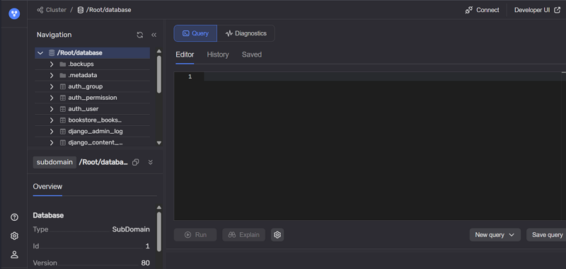
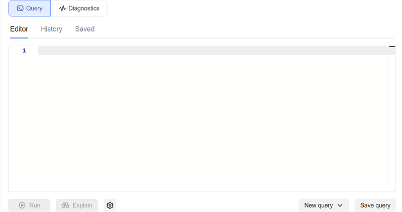
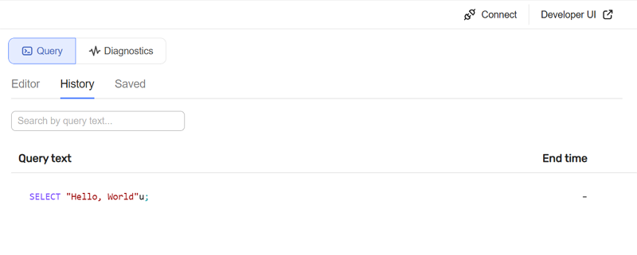
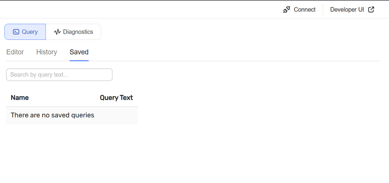
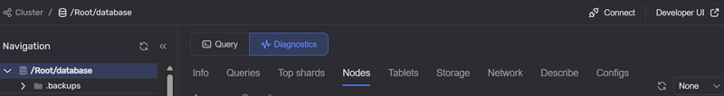

# Страница Databases

Страница открывается при переходе по ссылке из колонки **Database** на вкладке [Databases](tab-databases.md#database_list) [главной страницы](monitoring_main.md).

Пример интерфейса:

Основные разделы страницы:

## Navigation

В блоке **Navigation** отображается текущий путь в иерархии объектов базы данных и элементы навигации.

В разделе **Overview** отображаются метаданные выбранного объекта (файл или директория), например:

* **Type** — тип объекта;
* **ID** — идентификатор объекта;
* **Version** — версия объекта;
* **Created** — дата и время создания.

## Query

Вкладка **Query** содержит три секции:

* **Editor** — редактор для выполнения запросов;

* **History** — история выполненных запросов;

* **Saved** — сохраненные запросы.

## Diagnostics

Вкладка **Diagnostics** отображает диагностическую информацию по выбранному объекту и его окружению.

Данные сгруппированы по тематическим разделам, например:

* **Info** — базовая информация;
* **Queries** — данные по запросам;
* **Top shards** — наиболее загруженные шарды;
* **Nodes** — узлы, связанные с объектом; см. [вкладку Nodes](tab-nodes.md) и [страницу Nodes](nodes.md);
* **Tablets** — обслуживающие таблетки; см. [вкладку Tablets](tab-tablets.md) и [страницу Tablets](tablets.md);
* **Storage** — данные по хранилищу; см. [вкладку Storage](tab-storage.md) и [страницу Storage](storage.md);
* **Network** — параметры сетевого взаимодействия;
* **Describe** — описание объекта;
* **Configs** — конфигурационные параметры;
* **Access** — информация о правах доступа;
* **Operations** — текущие и завершенные операции.

См. также: [страница Nodes](nodes.md), [страница Storage](storage.md), [страница Tablets](tablets.md).
