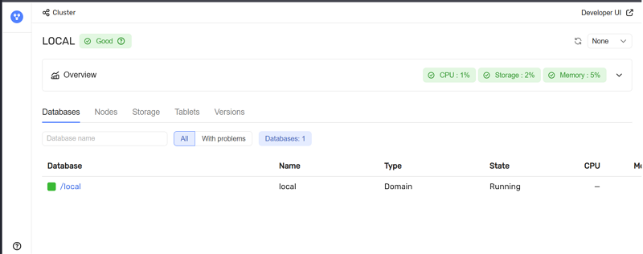
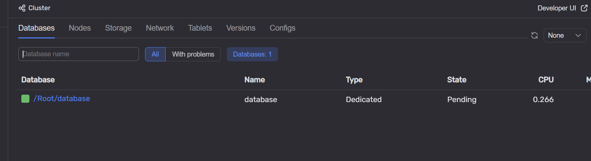
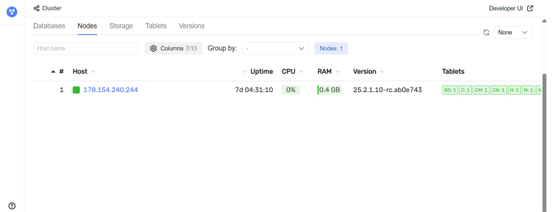
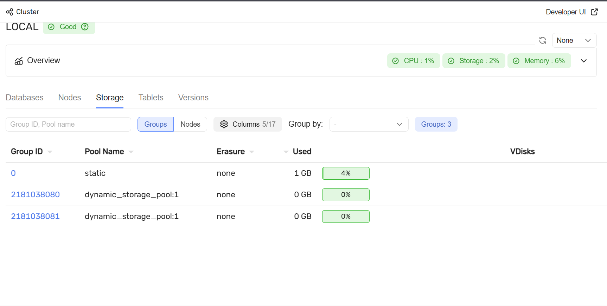
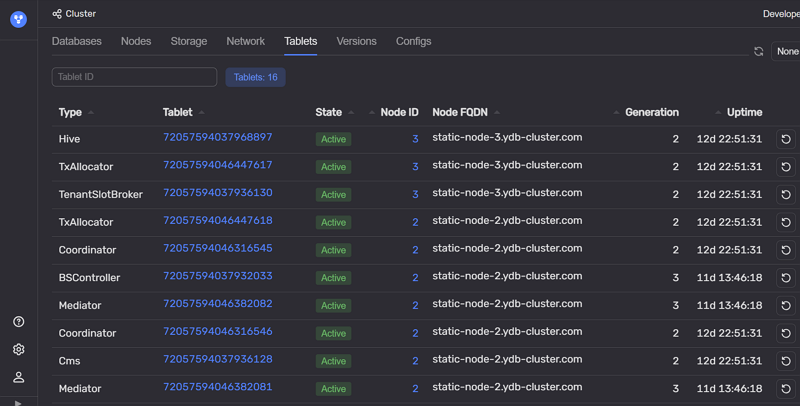

# Главная страница

Главная страница доступна по адресу:

```text
http://<ендпоинт>:8765/monitoring/cluster/tenants
```

Пример главной страницы:



На странице отображается сводная информация о кластере.

На вкладке **Overview** показаны [индикаторы состояния](index.md#colored_indicator) по ключевым ресурсам:

* **CPU** — загрузка процессора;
* **Storage** — использование дисковой подсистемы;
* **Memory** — использование оперативной памяти;
* **Network** — использование сетевых ресурсов.

Далее представлен набор вкладок:

* **[Databases](#database_list)** — список [баз данных](../../../concepts/glossary.md#database), развернутых в кластере;
* **[Nodes](#nodes_list)** — список [узлов кластера](../../../concepts/glossary.md#node);
* **[Storage](#storage_list)** — список [групп хранения](../../../concepts/glossary.md#storage-group) и использование ими дискового пространства;
* **[Tablets](#tablets_list)** — список запущенных [таблеток](../../../concepts/glossary.md#tablet);
* **[Versions](#versions_list)** — версии {{ ydb-short-name }}, запущенные на узлах кластера.

### Databases {#database_list}

На вкладке отображается список баз данных и их ключевые метрики.



Над таблицей располагаются поиск по имени базы данных, переключатель режимов (**All** / **With problems**) и счетчик баз данных.

В таблице приведены:

* **Database** — путь базы данных. По ссылке можно открыть [страницу Databases](database.md);
* **Name** — имя базы данных;
* **Type** — тип базы данных;
* **State** — текущее состояние;
* **CPU** — загрузка CPU узлами базы данных;
* **Memory** — потребление оперативной памяти узлами базы данных;
* **Storage** — оценка объема данных, хранимых в базе данных;
* **Network** — использование сетевых ресурсов;
* **Nodes** — состояние узлов базы данных;
* **Groups** — состояние групп хранения;
* **Pools** — состояние [пулов хранения](../../../concepts/glossary.md#storage-pool).



База данных типа `Domain` обслуживает системные компоненты, необходимые для работы всех тенантов. В нее входят storage-узлы и системные таблетки. База данных типа `Dedicated` обслуживает конкретную пользовательскую базу данных.



### Nodes {#nodes_list}

На вкладке отображаются узлы кластера и их состояние.



На странице доступны поиск по имени хоста и элементы группировки списка.

В таблице отображаются:

* **#** — идентификатор узла;
* **Host** — хост узла. По ссылке можно перейти на [страницу узла](nodes.md);
* **Uptime** — время работы узла;
* **CPU** — загрузка CPU на узле;
* **RAM** — использование оперативной памяти;
* **Version** — версия {{ ydb-short-name }}, запущенная на узле;
* **Tablets** — таблетки, работающие на узле.

### Storage {#storage_list}

На вкладке отображается список [групп хранения](../../../concepts/glossary.md#storage-group) и их текущее состояние.



На странице доступны:

* вкладки навигации по разделам мониторинга;
* поиск по идентификатору группы или имени пула;
* переключение режима просмотра (**Groups** / **Nodes**);
* выбор отображаемых колонок;
* группировка списка;
* счетчик найденных групп.

В таблице отображаются:

* **Group ID** — идентификатор группы хранения. По ссылке можно перейти на [страницу Storage](storage.md);
* **Pool Name** — имя [пула хранения](../../../concepts/glossary.md#storage-pool);
* **Erasure** — схема отказоустойчивости группы;
* **Used** — объем занятого дискового пространства и доля использования;
* **VDisks** — состояние [виртуальных дисков](../../../concepts/glossary.md#vdisk), входящих в группу.

### Tablets {#tablets_list}

На вкладке отображается список таблеток, работающих в кластере.



На странице доступны поиск по **TabletID** и счетчик таблеток.

В таблице отображаются:

* **Type** — тип таблетки;
* **TabletID** — идентификатор таблетки. По ссылке можно перейти на [страницу таблетки](tablets.md);
* **State** — состояние таблетки;
* **NodeID** — идентификатор узла, на котором работает таблетка;
* **NodeFQDN** — полное доменное имя узла;
* **Generation** — [поколение](../../../concepts/glossary.md#tablet-generation) таблетки;
* **Uptime** — время работы таблетки.

### Versions {#versions_list}

Вкладка **Versions** показывает, какие версии {{ ydb-short-name }} запущены на узлах кластера и как они распределены.


* **Overall** — перечень версий в кластере;
* **Storage nodes** — версии на узлах [распределенного хранилища](../../../concepts/glossary.md#distributed-storage).

Для выбранной версии отображается таблица узлов:

* **#** — идентификатор узла;
* **Host** — хост узла;
* **Uptime** — время работы узла;
* **RAM** — использование оперативной памяти;
* **CPU** — загрузка CPU;
* **Load Average** — средняя загрузка CPU за разные интервалы времени.

Подробное описание страниц, открываемых по ссылкам из вкладок:

* [Страница Databases](database.md);
* [Страница Nodes](nodes.md);
* [Страница Storage](storage.md);
* [Страница Tablets](tablets.md).
