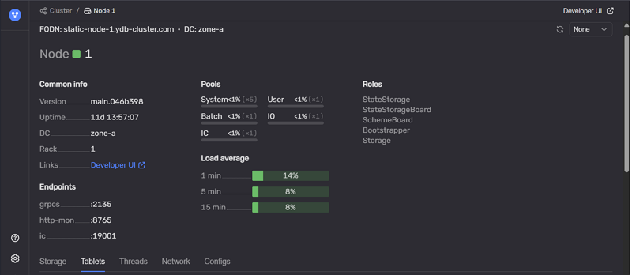

# Страница Nodes

Страница доступна по адресу:

```text
http://<ендпоинт>:8765/monitoring/node/<node-id>/
```

Страница открывается при переходе по ссылке из колонки **Host** на вкладке [Nodes](tab-nodes.md#nodes_list) [главной страницы](monitoring_main.md).

Пример страницы узла:



На странице отображается контекст выбранного узла и его ключевые атрибуты:

* **FQDN** — полное доменное имя узла;
* **DC** — [зона доступности](../../../concepts/glossary.md#regions-az) (дата-центр);
* **Host name** — имя узла.

Информация об узле сгруппирована по разделам:

### Common info

Раздел содержит базовые характеристики узла:

* **Version** — версия YDB, которой принадлежит текущий узел;
* **Uptime** — время работы узла;
* **DC** — зона доступности, в которой расположен узел;
* **Rack** — идентификатор [стойки](../../../concepts/glossary.md#rack), в которой располагается узел;
* **Links** — ссылки на связанные служебные страницы.

### Pools

Раздел демонстрирует, как распределяется нагрузка на CPU между внутренними пулами потоков. Также представлено ориентировочное описание сферы применения каждого пула.

* **System** — задачи критически важных системных компонентов;
* **User** — пользовательские задачи, выполнение запросов таблетками;
* **Batch** — длительные фоновые задачи;
* **IO** — выполнение блокирующих операций ввода-вывода;
* **IC** — обработка сетевого взаимодействия.

Высокая загрузка пулов может быть причиной деградации производительности и увеличения времени отклика системы.

### Load average

Средняя загрузка CPU хоста за интервалы:

* 1 минута;
* 5 минут;
* 15 минут.

### Endpoints

В таблице отображаются эндпоинты узла:

* **grpc** — порт для подключения по gRPC;
* **grpcs** — порт для подключения по gRPC с TLS;
* **http-mon** — порт веб-интерфейса мониторинга;
* **IC** — endpoint межузлового взаимодействия.

На странице также доступны вкладки с данными по выбранному узлу:

* **Storage** — группы хранения, связанные с узлом; см. [вкладку Storage](tab-storage.md) и [страницу Storage](storage.md);
* **Tablets** — таблетки, работающие на узле, с группировкой по типам; см. [вкладку Tablets](tab-tablets.md) и [страницу Tablets](tablets.md);
* **Threads** — использование потоков и CPU по пулам.

См. также: [страница Databases](database.md), [страница Storage](storage.md), [страница Tablets](tablets.md).
