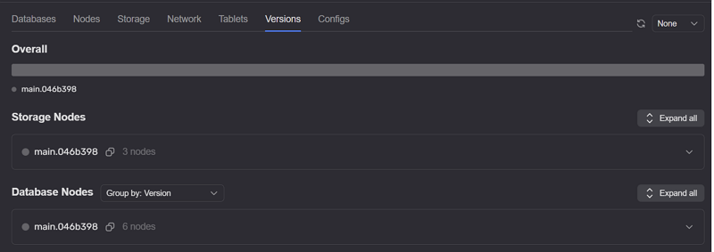

# Вкладка Versions

Вкладка **Versions** показывает, какие версии {{ ydb-short-name }} запущены на узлах кластера и как они распределены. Вкладка входит в набор вкладок [главной страницы](monitoring_main.md) вместе с [Databases](tab-databases.md), [Nodes](tab-nodes.md), [Storage](tab-storage.md) и [Tablets](tab-tablets.md).

* **Overall** — перечень версий в кластере;
* **Storage nodes** — версии на узлах [распределенного хранилища](../../../concepts/glossary.md#distributed-storage); см. [вкладку Storage](tab-storage.md) и [вкладку Nodes](tab-nodes.md).

Для выбранной версии отображается таблица узлов (подробнее о списке узлов см. [вкладку Nodes](tab-nodes.md) и [страницу Nodes](nodes.md)):

* **#** — идентификатор узла;
* **Host** — хост узла;
* **Uptime** — время работы узла;
* **RAM** — использование оперативной памяти;
* **CPU** — загрузка CPU;
* **Load Average** — средняя загрузка CPU за разные интервалы времени.
