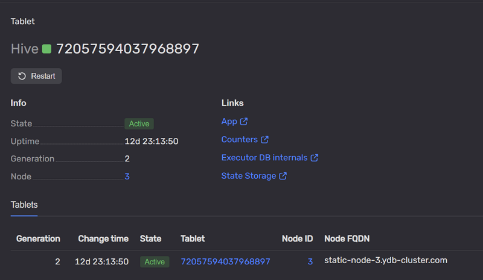

# Страница Tablets

Многие компоненты {{ ydb-short-name }} реализованы в виде [таблеток](../../../concepts/glossary.md#tablet). Система может перемещать таблетки между узлами, поэтому на каждом узле выполняется свой набор таблеток.

Страница открывается при переходе по **TabletID** с вкладок [Tablets](tab-tablets.md#tablets_list) или [Nodes](tab-nodes.md#nodes_list) [главной страницы](monitoring_main.md).

Пример страницы таблетки:

На странице отображаются идентификатор таблетки и кнопка **Restart** для инициирования перезапуска.

В разделе **Info** представлены основные параметры:

* **State** — состояние таблетки;
* **Uptime** — время работы с момента текущего запуска;
* **Generation** — поколение (номер текущей попытки запуска);
* **Node** — идентификатор узла, на котором работает таблетка; см. [вкладку Nodes](tab-nodes.md) и [страницу Nodes](nodes.md).

Справа располагается блок **Links**:

* App (на Hive-web-viewer);
* Counters;
* Executor DB internals;
* State storage.

Дополнительно на странице отображается таблица с детализированными записями о состоянии таблетки:

* **Generation** — [поколение](../../../concepts/glossary.md#tablet-generation) таблетки;
* **Change time** — время изменения состояния;
* **State** — текущее состояние;
* **Tablet** — идентификатор таблетки;
* **Node ID** — идентификатор узла;
* **Node FQDN** — полное доменное имя узла.

См. также: [страница Databases](database.md), [страница Nodes](nodes.md), [страница Storage](storage.md).
