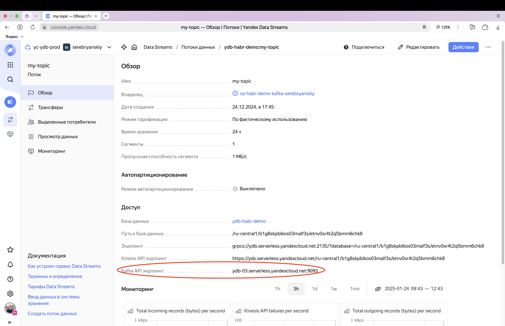

# Примеры чтения и записи по Kafka API

В этой статье приведены примеры чтения и записи в [топики](../../concepts/topic.md) с использованием Kafka API.

Перед выполнением примеров:

1. [Создайте топик](../ydb-cli/topic-create.md).
1. [Добавьте читателя](../ydb-cli/topic-consumer-add.md).
1. Если у вас включена аутентификация, [создайте пользователя](../../yql/reference/syntax/create-user.md).

## Начало работы {#how-to-try-kafka-api}

### В Docker {#how-to-try-kafka-api-in-docker}

Запустите Docker по [этой](../../quickstart#install) инструкции. Kafka API будет доступен на 9092 порте.

### В Yandex Cloud {#how-to-try-kafka-api-in-cloud}

Попробовать работу с топиками YDB по Kafka API можно без тарификации ([в небольших месячных объемах](https://yandex.cloud/ru/docs/data-streams/pricing?from=int-console-help-center-or-nav#prices)) в Yandex Cloud.
Для этого в своей [консоли Yandex Cloud](https://console.yandex.cloud):

1. Создайте [базу данных YDB](https://yandex.cloud/ru/docs/ydb/quickstart), если у вас ее еще нет.
1. Создайте [очередь Yandex Data Streams](https://yandex.cloud/ru/docs/data-streams/quickstart).
1. Создайте [сервисный аккаунт](https://yandex.cloud/ru/docs/iam/operations/sa/create), если у вас его еще нет.
1. Добавьте этому сервисному аккаунту следующие роли:

    - ydb.viewer (для чтения данных из потока);
    - ydb.editor (для записи данных в поток);
    - ydb.kafkaApi.client (для доступа к потоку данных по Kafka API).

1. Создайте [API ключ](https://yandex.cloud/ru/docs/iam/operations/sa/create-access-key) для этого сервисного аккаунта.

   - В поле **Описание** введите описание ключа.
   - В поле **Область действия** выберите `yc.ydb.topics.manage`.
   - В поле **Срок действия** укажите срок действия ключа.

Для работы с Yandex Cloud требуется аутентификация, см примеры аутентификации [ниже](#authentication-in-cloud-examples).

## Примеры работы с Kafka API

### Чтение

При чтении отличительной особенностью Kafka API являются:

- отсутствие поддержки опции [check.crcs](https://kafka.apache.org/documentation/#consumerconfigs_check.crcs);
- только одна стратегия назначения партиция - roundrobin;
- отсутствие возможности читать без предварительно созданной группы читателей.

Поэтому в конфигурации читателя всегда нужно указывать **имя группы читателей** и параметры:

- `check.crc=false`
- `partition.assignment.strategy=org.apache.kafka.clients.consumer.RoundRobinAssignor`

Ниже даны примеры чтения по Kafka протоколу для разных приложений, языков программирования и фреймворков подключения без аутентификации.
Примеры того, как настроить аутентификацию, смотри в разделе [Примеры с аутентификацией](#authentication-examples)



- Консольные утилиты Kafka

  

  

- kcat

  

- Java

  

- Spark

  

  

  

- Flink

  

  

  



#### Частые проблемы и их решение

##### Ошибка Unexpected error in join group response

Полный текст ошибки:

```txt
Unexpected error in join group response: This most likely occurs because of a request being malformed by the client library or the message was sent to an incompatible broker. See the broker logs for more details.
```

Скорее всего проблема в том, что не указано имя читателя или указанное имя читателя не существует в кластере YDB.

Решение: создайте читателя с помощью [CLI](../ydb-cli/topic-consumer-add) или [SDK](../ydb-sdk/topic#alter-topic)

### Запись



Сейчас не поддержана запись по Kafka API с использованием Kafka транзакций. Транзакции доступны только при использовании
[YDB Topic API](https://ydb.tech/docs/ru/reference/ydb-sdk/topic#write-tx).

В остальном запись в Apache Kafka и в YDB Topics через Kafka API ничем не отличается.





- Консольные утилиты Kafka

  

  

- kcat

  

- Java

  

- Spark

  

  

  

- Flink

  

  

  

- Logstash

  

- Fluent Bit

  



### Примеры с аутентификацией {#authentication-examples}

Подробнее про аутентификацию смотри в разделе [Аутентификация](./auth.md). Ниже есть примеры аутентификации в облачной базе
и в локальной базе.



Сейчас единственным доступным механизмом аутентификации с Kafka API в YDB Topics является `SASL_PLAIN`.



#### Примеры с аутентификацией в Yandex Cloud {#authentication-in-cloud-examples}

Инструкцию, как попробовать работу с Kafka API поверх YDB Topics в Яндекс облаке, смотри [выше](#how-to-try-kafka-api-in-cloud).

Для аутентификации добавьте в параметры подключения Apache Kafka следующие значения:

- `security.protocol` со значением `SASL_SSL`;
- `sasl.mechanism` со значением `PLAIN`;
- `sasl.jaas.config` со значением `org.apache.kafka.common.security.plain.PlainLoginModule required username="@<path_to_database>" password="<API Key сервисного аккаунта>";`.

Ниже приведены примеры чтения из топика облака, в которых:

- <path_to_database> - это путь к базе данных со страницы топика в YDS Yandex Cloud;
  
- <kafka_api_endpoint> - это Kafka API Endpoint со страницы описания YDS Yandex Cloud. Его нужно использовать в качестве `bootstrap.servers`;
  
- <api_key> - API Key сервисного аккаунта, у которого есть доступ к YDS.



Username не указывается. Указывается только `@`, а затем путь до вашей базы данных.





- Консольные утилиты Kafka

  

  

- kcat

  

- Java

  



#### Примеры аутентификации в самостоятельно развернутом YDB

Для того, чтобы проверить работу с аутентификацией в локальной базе:

1. Создайте пользователя. [Как это сделать в YQL](../../yql/reference/syntax/create-user.md). [Как выполнить YQL из CLI](../ydb-cli/yql.md).
2. Подключитесь к Kafka API, как в примерах ниже. Во всех примерах предполагается, что:

  - YDB запущен локально с переменной окружения YDB_KAFKA_PROXY_PORT=9092 - то есть Kafka API доступен по адресу localhost:9092. Например можно поднять YDB в докере, как указано [здесь](../../quickstart.md#install).
  - <username> - это имя пользователя, которое вы указали при создании пользователя.
  - <password> - это пароль пользователя, который вы указали при создании пользователя.

Примеры показаны для чтения, но те же самые параметры конфигурации работают и для записи в топик.



- Консольные утилиты Kafka

  

  

- kcat

  

- Java

  

