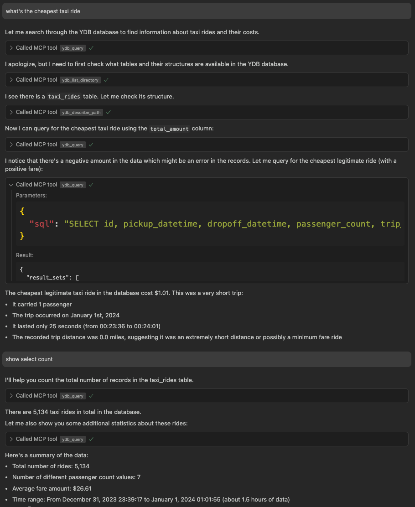

# {{ ydb-short-name }} Model Context Protocol Server

[{{ ydb-short-name }} Model Context Protocol (MCP) server](https://github.com/ydb-platform/ydb-mcp) позволяет работать с базами данных {{ ydb-short-name }} из любой [большой языковой модели (LLM)](https://ru.wikipedia.org/wiki/Большая_языковая_модель), которая поддерживает [MCP](https://modelcontextprotocol.io/introduction), используя любой из [MCP клиентов](https://modelcontextprotocol.io/clients). Эта интеграция обеспечивает работу с базами данных {{ ydb-short-name }} с помощью ИИ на естественном языке.

## Начало работы

### Предварительные требования

1. Установите [MCP-клиент](https://modelcontextprotocol.io/clients), поддерживающий MCP tools (большинство поддерживают). Примеры конфигурации ниже используют распространённый формат, поддерживаемый несколькими популярными MCP-клиентами (Claude Desktop, Cursor и др.), но вам может потребоваться адаптировать формат под требования вашего клиента.
2. MCP-сервер {{ ydb-short-name }} — это приложение на Python, которое обычно размещается вместе с MCP-клиентом. Существует несколько вариантов установки и запуска MCP-сервера {{ ydb-short-name }}, которые [описаны ниже](#server-arguments), но все они требуют предварительно установленного окружения Python 3.10+.

### Настройка MCP-клиента

#### Анонимная аутентификация



- uvx

  [uvx](https://docs.astral.sh/uv/guides/tools/) позволяет запускать приложения Python без явной установки.

  Настройте {{ ydb-short-name }} MCP в настройках вашего MCP-клиента:

  ```json
  {
    "mcpServers": {
      "ydb": {
        "command": "uvx",
        "args": [
          "ydb-mcp",
          "--ydb-endpoint", "grpc://localhost:2136/local"
        ]
      }
    }
  }
  ```

- pipx

  [pipx](https://pipx.pypa.io/stable/installation/) позволяет запускать приложения из PyPI без явной установки (сам pipx должен быть установлен заранее).

  Настройте {{ ydb-short-name }} MCP в настройках вашего MCP-клиента:

  ```json
  {
    "mcpServers": {
      "ydb": {
        "command": "pipx",
        "args": [
          "run", "ydb-mcp",
          "--ydb-endpoint", "grpc://localhost:2136/local"
        ]
      }
    }
  }
  ```

- pip

  При необходимости создайте и активируйте [виртуальное окружение Python](https://docs.python.org/3/library/venv.html). Установите {{ ydb-short-name }} MCP с помощью [pip](https://pypi.org/project/pip/):

  ```bash
  pip install ydb-mcp
  ```

  В настройках вашего MCP-клиента укажите параметры для соединения с {{ ydb-short-name }} MCP:

  ```json
  {
    "mcpServers": {
      "ydb": {
        "command": "python3",
        "args": [
          "-m", "ydb_mcp",
          "--ydb-endpoint", "grpc://localhost:2136/local"
        ]
      }
    }
  }
  ```



#### Аутентификация по логину и паролю



- uvx

  Настройте аутентификацию по логину/паролю с `uvx`:

  ```json
  {
    "mcpServers": {
      "ydb": {
        "command": "uvx",
        "args": [
          "ydb-mcp",
          "--ydb-endpoint", "grpc://localhost:2136/local",
          "--ydb-auth-mode", "login-password",
          "--ydb-login", "<ваше-имя-пользователя>",
          "--ydb-password", "<ваш-пароль>"
        ]
      }
    }
  }
  ```

- pipx

  Настройте аутентификацию по логину/паролю с `pipx`:

  ```json
  {
    "mcpServers": {
      "ydb": {
        "command": "pipx",
        "args": [
          "run", "ydb-mcp",
          "--ydb-endpoint", "grpc://localhost:2136/local",
          "--ydb-auth-mode", "login-password",
          "--ydb-login", "<ваше-имя-пользователя>",
          "--ydb-password", "<ваш-пароль>"
        ]
      }
    }
  }
  ```

- pip

  Настройте аутентификацию по логину/паролю с установленным через `pip` {{ ydb-short-name }} MCP:

  ```json
  {
    "mcpServers": {
      "ydb": {
        "command": "python3",
        "args": [
          "-m", "ydb_mcp",
          "--ydb-endpoint", "grpc://localhost:2136/local",
          "--ydb-auth-mode", "login-password",
          "--ydb-login", "<ваше-имя-пользователя>",
          "--ydb-password", "<ваш-пароль>"
        ]
      }
    }
  }
  ```



### Выполнение запросов

Задавайте вашему LLM вопросы относительно данных, хранящихся в {{ ydb-short-name }}, используя настроенного выше клиента MCP. Языковая модель увидит инструменты, доступные ей через MCP, и будет использовать их для выполнения запросов на [YQL](../../../yql/reference/index.md) и других вызовов к API {{ ydb-short-name }}. Пример того, как это может выглядеть:



## Доступные инструменты

MCP-сервер {{ ydb-short-name }} предоставляет следующие инструменты для взаимодействия с базами данных {{ ydb-short-name }}:

* `ydb_query`: Выполнение SQL-запроса к базе данных {{ ydb-short-name }}
  * Параметры:
    * `sql`: Строка SQL-запроса для выполнения

* `ydb_query_with_params`: Выполнение параметризованного SQL-запроса с JSON-параметрами
  * Параметры:
    * `sql`: Строка SQL-запроса с параметрами
    * `params`: JSON-строка, содержащая значения параметров

* `ydb_list_directory`: Просмотр содержимого директории в {{ ydb-short-name }}
  * Параметры:
    * `path`: Путь к директории {{ ydb-short-name }} для просмотра

* `ydb_describe_path`: Получение подробной информации о [схемном объекте](../../../concepts/glossary.md#scheme-object) (таблица, директория и т.д.) по указанному пути {{ ydb-short-name }}
  * Параметры:
    * `path`: Путь {{ ydb-short-name }} для описания

* `ydb_status`: Получение текущего статуса подключения к {{ ydb-short-name }}

## Аргументы командной строки и переменные окружения {#server-arguments}

Следующая таблица описывает параметры командной строки и переменные окружения MCP-сервера {{ ydb-short-name }}:

| Аргумент                | Переменная окружения | Значение по умолчанию     | Описание                                                                                         |
| ----------------------- | -------------------- | ------------------------ | ------------------------------------------------------------------------------------------------- |
| `--ydb-endpoint`        | `YDB_ENDPOINT`       | —                        | Строка подключения к {{ ydb-short-name }}, включающая протокол, имя хоста, порт и имя базы данных |
| `--ydb-login`           | `YDB_LOGIN`          | —                        | Логин {{ ydb-short-name }}                                                                        |
| `--ydb-password`        | `YDB_PASSWORD`       | —                        | Пароль {{ ydb-short-name }}                                                                       |
| `--ydb-auth-mode`       | `YDB_AUTH_MODE`      | `anonymous`              | Режим аутентификации {{ ydb-short-name }}. Возможные значения: `anonymous`, `login-password`                |
| `--log-level`           | —                    | `INFO`                   | Уровень логирования. Возможные значения: `DEBUG`, `INFO`, `WARNING`, `ERROR`, `CRITICAL`                    |



Аргументы командной строки имеют приоритет над соответствующими переменными окружения.



## Узнать больше

Для получения дополнительной информации посетите [репозиторий {{ ydb-short-name }} MCP на GitHub](https://github.com/ydb-platform/ydb-mcp).