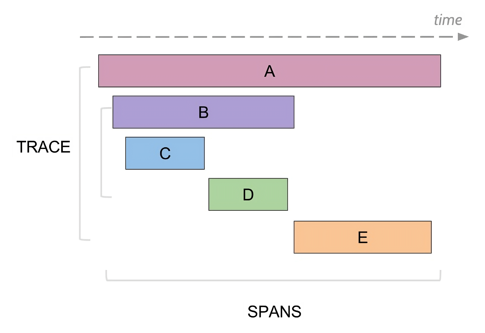

# Трассировка в {{ ydb-short-name }}



Подробно трассировка описана на сайте [opentelemetry](https://opentelemetry.io/) в разделе [observability primer](https://opentelemetry.io/docs/concepts/observability-primer/).



Трассировка – инструмент, позволяющий детально посмотреть путь следования запроса по распределенной системе. Путь следования одного запроса (трасса) описывается набором спанов. Спан является отрезком времени, обычно связанным с временем выполнения определенной операции (например запись информации на диск, выполнение транзакции). Спаны образуют дерево, часто поддерево спана является его детализацией, однако это не всегда так.



Для аггрегации разрозненных спанов в трассы они отправляются в *коллектор*. Это сервис, который аггрегирует и сохраняет получаемые спаны для последующего анализа трасс. {{ ydb-short-name }} не включает в себя этот сервис, администратор должен поднять его самостоятельно. Обычно в качестве коллектора используется [jaeger](https://www.jaegertracing.io/).

## Минимальная конфигурация

Для включения трассировки в {{ ydb-short-name }} добавьте в [конфигурацию](../../../deploy/configuration/config.md) следующую секцию:

```yaml
tracing_config:
  backend:
    opentelemetry:
      collector_url: grpc://example.com:4317
      service_name: ydb
  external_throttling:
    - max_traces_per_minute: 10
```

В ней поле `collector_url` задает url [OTLP-совместимого](https://opentelemetry.io/docs/specs/otlp/) коллектора спанов. Более подробно с описанием секции backend можно ознакомиться в [соответствующей секции](./setup.md#backend).

При данной настройке никакие запросы не сэмплируются, не более 10 запросов в минуту с [внешним trace-id](./external-traces.md) трассируются каждым узлом кластера.

## Описание секций

### Backend {#backend}

#### Пример секции

```yaml
tracing_config:
  # ...
  backend:
    opentelemetry:
      collector_url: grpc://example.com:4317
      service_name: ydb
```

#### Описание

В этой секции описывается коллектор спанов. На данный момент единственная опция – `opentelemetry`. Отправка спанов с узла кластера в коллектор происходит по push-модели, от коллектора требуется совместимость с [OTLP](https://opentelemetry.io/docs/specs/otlp/).

В секции `opentelemetry`:
* `collector_url` — URL коллектора спанов. Схема может быть либо `grpc://` для небезопасного подключения, либо `grpcs://` для TLS-подключения.
* `service_name` — имя сервиса, которым будут подписываться все спаны.

Оба параметра являются обязательными.

### Uploader {#uploader}

#### Пример секции

```yaml
tracing_config:
  # ...
  uploader:
    max_exported_spans_per_second: 30
    max_spans_in_batch: 100
    max_bytes_in_batch: 10485760 # 10 MiB
    max_export_requests_inflight: 3
    max_batch_accumulation_milliseconds: 5000
    span_export_timeout_seconds: 120
```

#### Описание

Uploader – компонент узла кластера, который отвечает за отправку спанов в коллектор. Во избежание перегрузки коллектора спанов, uploader не будет отправлять больше, чем `max_exported_spans_per_second` спанов в секунду в среднем.

В целях оптимизации uploader отправляет спаны батчами. Каждый батч содержит не более `max_spans_in_batch` спанов с суммарным сериализованным размеров не более `max_bytes_in_batch` байт. Каждый батч накапливается на протяжении не более, чем `max_batch_accumulation_milliseconds` миллисекунд. Батчи могут отправляться параллельно, максимальное количество одновременно отправляемых батчей контролируется параметром `max_export_requests_inflight`. Если с момента получения спана uploader'ом прошло больше `span_export_timeout_seconds` секунд, uploader может удалить его в пользу отправки более свежих спанов.

Значения по умолчанию:
* `max_exported_spans_per_second = inf` (отсутствуют какие-либо ограничения)
* `max_spans_in_batch = 150`
* `max_bytes_in_batch = 20000000`
* `max_batch_accumulation_milliseconds = 1000`
* `span_export_timeout_seconds = inf` (никакие спаны не удаляются uploader'ом)
* `max_export_requests_inflight = 1`

Секция `uploader` может полностью отсутствовать, в таком случае для каждого параметра будет использоваться значение по умолчанию.



Uploader – локальный для узла компонент, как следствие, описанные ограничения применяются к каждому узлу отдельно, а не ко всему кластеру в целом.



### External throttling {#external-throttling}

#### Пример секции

```yaml
tracing_config:
  # ...
  external_throttling:
    - scope:
        database: /Root/db1
      max_traces_per_minute: 60
      max_traces_burst: 3
```

#### Описание

{{ ydb-short-name }} поддерживает передачу внешних trace-id для построения цельной трассы запроса. Способ передачи внешнего trace-id описан на странице [{#T}](./external-traces.md). Для избежания перегрузки коллектора, в {{ ydb-short-name }} есть механизм ограничения количества трассируемых извне запросов. Ограничения описываются в данной секции и являются последовательностью правил, каждое правило содержит:

* `scope` – набор селекторов для фильтрации запроса.
* `max_traces_per_minute` – наибольшее среднее количество запросов в минуту, трассируемое по данному правилу. Ожидается положительное целое число.
* `max_traces_burst` – максимальный всплеск количества трассируемых извне запросов. Ожидается неотрицательное целое число.

Обязательным параметром является только `max_traces_per_minute`.

Подробное описание этих опций приведено в секции [{#T}](./setup.md#semantics)

Секция `external_throttling` не является обязательной, в случае ее отсутствия все trace-id в запросах **игнорируются** (никакие внешние трассы не продолжаются).

Данную секцию можно изменять без перезагрузки узла с помощью механизма [динамической конфигурации](../../../maintenance/manual/dynamic-config.md).

### Sampling

#### Пример секции

```yaml
tracing_config:
  # ...
  sampling:
    - fraction: 0.01
      level: 10
      max_traces_per_minute: 5
      max_traces_burst: 2
    - scope:
        request_types:
          - KeyValue.ExecuteTransaction
          - KeyValue.Read
      fraction: 0.1
      level: 15
      max_traces_per_minute: 5
      max_traces_burst: 2
```

#### Описание

Для диагностирования проблем в системе, может быть полезно посмотреть на пример трассы запроса вне зависимости от того, трассируют пользователи свои запросы, или нет. Для этого в {{ ydb-short-name }} есть механизм сэмплирования запросов. Для сэмплированного запроса генерируется случайный trace-id. Данная секция контролирует сэмплирование запросов в формате аналогичном [`external_throttling`](./setup.md#external-throttling), каждое правило имеет два дополнительные поля:

* `fraction` – доля запросов, сэмплированных по данному правилу. Ожидается дробное число от 0 до 1.
* `level` — уровень детализации трассы. Ожидается целое число от 0 до 15 включительно. Подробнее этот параметр описан в секции [{#T}](./setup.md#tracing-levels)

Оба поля являются обязательными.

Секция `sampling` не является обязательной, в случае ее отсутствия никакие запросы не будут сэмплироваться.

Данную секцию можно изменять без перезагрузки узла с помощью механизма [динамической конфигурации](../../../maintenance/manual/dynamic-config.md).

## Семантика правил {#semantics}

### Селекторы

Каждое правило включает в себя опциональное поле `scope` с набором селекторов, которые определяют, к каким запросам применяется данное правило. На данный момент поддерживаются селекторы:

* `request_types`

    Принимает список типов запросов. Запрос подходит под данный селектор если его тип содержится в списке.




- KeyValue.CreateVolume
- KeyValue.DropVolume
- KeyValue.AlterVolume
- KeyValue.DescribeVolume
- KeyValue.ListLocalPartitions
- KeyValue.AcquireLock
- KeyValue.ExecuteTransaction
- KeyValue.Read
- KeyValue.ReadRange
- KeyValue.ListRange
- KeyValue.GetStorageChannelStatus
- Table.CreateSession
- Table.KeepAlive
- Table.AlterTable
- Table.CreateTable
- Table.DropTable
- Table.DescribeTable
- Table.CopyTable
- Table.CopyTables
- Table.RenameTables
- Table.ExplainDataQuery
- Table.ExecuteSchemeQuery
- Table.BeginTransaction
- Table.DescribeTableOptions
- Table.DeleteSession
- Table.CommitTransaction
- Table.RollbackTransaction
- Table.PrepareDataQuery
- Table.ExecuteDataQuery
- Table.BulkUpsert
- Table.StreamExecuteScanQuery
- Table.StreamReadTable
- Table.ReadRows
- Query.ExecuteQuery
- Query.ExecuteScript
- Query.FetchScriptResults
- Query.CreateSession
- Query.DeleteSession
- Query.AttachSession
- Query.BeginTransaction
- Query.CommitTransaction
- Query.RollbackTransaction
- Discovery.WhoAmI
- Discovery.NodeRegistration
- Discovery.ListEndpoints



Трассировка поддерживается не только для типов запросов, приведенных выше. В этом списке перечислены типы запросов, которые поддерживатюся селектором `request_types`.





Обратите внимание, что QueryService API [экспериментальное](https://github.com/ydb-platform/ydb/blob/e3af273efaef7dfa21205278f17cd164e247820d/ydb/public/api/grpc/ydb_query_v1.proto#L9) и может быть изменено в будущем.





* `database`

    Фильтрует запросы к указанной базе данных.

Запрос подходит под правило, если он подходит под все селекторы. `scope` может отсутствовать, это равносильно пустому набору селекторов, все запросы будут попадать под это правило.

### Rate limiting

Параметры `max_traces_per_minute` и `max_traces_burst` используются для ограничения сверху на количество запросов. В случе sampling они ограничивают количество запросов, сэмплированных по данному правилу. В случае external throttling они ограничивают количество внешних трасс, которые попадают в систему.

Для ограничений используется вариация [leaky bucket](https://en.wikipedia.org/wiki/Leaky_bucket) с размером бакета равным `max_traces_burst + 1`. Например, если `max_traces_per_minute = 60` и `max_traces_burst = 0`, то при потоке в 10000 запросов в минуту будет трассироваться один запрос каждую секунду. Если же `max_traces_burst = 20`, то при поступлении аналогичного потока запросов первые 21 будут оттрассированы, далее аналогично будет трассироваться один запрос в секунду.



Ограничения на количество трассируемых запросов локальные для узла кластера. Например, если на каждом узле кластера есть правило, в котором указано `max_traces_per_minute = 1`, по этому правилу будет трассироваться не больше одного запроса в минуту **с каждого узла кластера**.



### Уровни детализации {#tracing-levels}

Как и в [случае с логами](../../../reference/embedded-ui/logs.md), для диагностирования большинства проблем с системой не требуется наличие максимально подробной трассы, поэтому в {{ ydb-short-name }} каждый спан имеет свой уровень, описываемый целым числом от 0 до 15 включительно. Каждое правило в секции `sampling` должно включать в себя уровень детализации генерируемой трассы (`level`), в нее будут включаться спаны с уровнем меньшим, либо равным `level`.

В разделе об [архитектуре {{ ydb-short-name }}](../../../concepts/_includes/index/how_it_works.md#ydb-architecture) приводится разделение системы на 5 слоев:

| Слой | Копоненты |
| ---- | --------- |
| 1 | gRPC Proxies |
| 2 | Query Processor |
| 3 | Distributes Transactions |
| 4 | Tablet, System tablet |
| 5 | Distributed Storage |

Для каждого слоя существует 7 уровней детализации:

| Уровень | Значение |
| ------- | -------- |
| `Off` | Отсутствие трассировки |
| `TopLevel` | Самая низкая детализация, не более 2 спанов на каждый запрос к компоненту |
| `Basic` | Спаны главных операций компонента |
| `Detailed` | Самая высокая детализация, применимая для диагностирования проблем в production |
| `Diagnostic` | Детальная отладочная информация для разработчиков |
| `Trace` | Очень детальная отладочная информация |

Ниже приведено распределение уровней детализации слоев системы по уровням детализации трассы:

| Уровень детализации трассы | gRPC Proxies | Query Processor | Distributed Transactions | Tablets | Distributed Storage |
| ------------------------- | ------------ | --------------- | ------------------------ | ------- | ------------------- |
|  0 | `TopLevel` | `Off` | `Off` | `Off` | `Off` |
|  1 | `TopLevel` | **`TopLevel`** | `Off` | `Off` | `Off` |
|  2 | `TopLevel` | `TopLevel` | **`TopLevel`** | `Off` | `Off` |
|  3 | `TopLevel` | `TopLevel` | `TopLevel` | **`TopLevel`** | `Off` |
|  4 | `TopLevel` | `TopLevel` | `TopLevel` | `TopLevel` | **`TopLevel`** |
|  5 | **`Basic`** | `TopLevel` | `TopLevel` | `TopLevel` | `TopLevel` |
|  6 | `Basic` | **`Basic`** | `TopLevel` | `TopLevel` | `TopLevel` |
|  7 | `Basic` | `Basic` | **`Basic`** | `TopLevel` | `TopLevel` |
|  8 | `Basic` | `Basic` | `Basic` | **`Basic`** | `TopLevel` |
|  9 | `Basic` | `Basic` | `Basic` | `Basic` | **`Basic`** |
| 10 | **`Detailed`** | **`Detailed`** | `Basic` | `Basic` | `Basic` |
| 11 | `Detailed` | `Detailed` | **`Detailed`** | `Basic` | `Basic` |
| 12 | `Detailed` | `Detailed` | `Detailed` | **`Detailed`** | `Basic` |
| 13 | `Detailed` | `Detailed` | `Detailed` | `Detailed` | **`Detailed`** |
| 14 | **`Diagnostic`** | **`Diagnostic`** | **`Diagnostic`** | **`Diagnostic`** | **`Diagnostic`** |
| 15 | **`Trace`** | **`Trace`** | **`Trace`** | **`Trace`** | **`Trace`** |

### Правила

#### External Throttling

Семантика каждого правила такова: оно выделяет квоту на количество запросов данной категории. Например, если секция `external_throttling` выглядит следующим образом:

```yaml
tracing_config:
  external_throttling:
    - max_traces_per_minute: 60
    - scope:
        request_types:
          - KeyValue.ReadRange
      max_traces_per_minute: 20
```

При достаточном потоке запросов с внешним trace-id, будут трассироваться хотя бы 60 запросов в минуту и хотя бы 20 запросов в минуту типа `KeyValue.ReadRange`. Всего трассироваться будут не более 80 запросов в минуту.

Алгоритм решения следующий: для запроса, имеющего внешний trace-id, определяется набор правил, под которые подходит данный запрос. Запрос потребляет квоту у всех правил, у которых она еще есть. Запрос не трассируется только в том случае, если ни в у одного из правил не осталось квоты.

#### Sampling

В случае сэмплирования семантика правила аналогична: при достаточно маленьком потоке запросов данной категории, будет сэплироваться хотя бы `fraction` запросов с уровнем хотя бы `level`.

Алгоритм решения аналогичный: для запроса, не имеющего внешнего trace-id (либо из-за его изначального отсутствия, либо из-за принятого ранее решения о не трассировании данного запроса), определяется набор правил, под которые подходит данный запрос. Запрос потребляет квоту у всех правил, у которых она еще есть и которые случайным образом "решили" его сэмплировать. Если ни по одному правилу запрос не нужно сэмлировать (во всех правилах, которые случайным образом "решили" сэмплировать запрос, не осталось квоты), он не сэмплируется. В противном случае уровень детализации определяется, как максимальный среди правил, в квоту которых попал запрос.

Например, при данной конфигурации `sampling`:

```yaml
tracing_config:
  sampling:
    - scope:
        database: /Root/db1
      fraction: 0.5
      level: 5
      max_traces_per_minute: 100
    - scope:
        database: /Root/db1
      fraction: 0.01
      level: 15
      max_traces_per_minute: 5
```

При достаточно маленьком потоке запросов к базе `/Root/db1`, будут сэмплироваться:

* 1% запросов с уровнем детализации 15
* 49.5% запросов с уровнем детализации 5

При достаточно большом потоке запросов к базе `/Root/db1`, будут сэмплироваться:

* 5 запросов в минуту с уровнем детализации 15
* от 95 до 100 запросов в минуту с уровнем детализации 5
