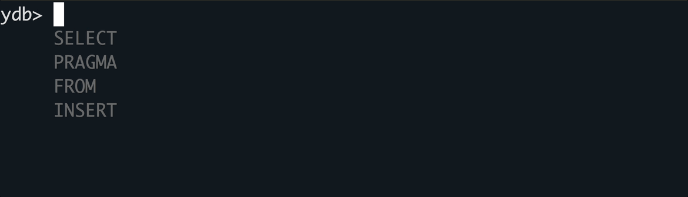

# Интерактивный режим выполнения запросов

## Общее описание

После выполнения команды `{{ ydb-cli }}` без подкоманд запускается интерактивный режим выполнения запросов. После этого можно вводить запросы напрямую в консоль или терминал. При вводе символа перевода строки запрос считается законченным, и он начинает исполняться. Текст запроса может представлять из себя как YQL запрос, так и [специальную команду](#spec-commands).

Общий вид команды:

```bash
{{ ydb-cli }} [global options...]
```

* `global options` — [глобальные параметры](commands/global-options.md).



Обратите внимание, что для работы команды должны быть заданы [параметры подключения](./connect.md). Это может быть профиль по умолчанию, явно указанный профиль и/или набор параметров подключения.



Пример использования:


Интерактивный режим выполнения запросов в {{ ydb-short-name }} CLI предоставляет следующие возможности:

* [Подсветка синтаксиса](#syntax-highlighting)
* [Горячие клавиши](#hotkeys)
* [История запросов](#query-history)
* [Автодополнение](#auto-completion)
* [Специальные команды](#spec-commands)

## Подсветка синтаксиса {#syntax-highlighting}


Интерактивный режим поддерживает цветовую подсветку синтаксиса YQL, которая помогает лучше воспринимать структуру запросов. Разными цветами выделяются следующие группы элементов:

* Ключевые слова YQL (SELECT, FROM, WHERE, INSERT, UPDATE и другие)
* Имена таблиц и столбцов
* Строковые литералы (текст в кавычках)
* Числовые литералы
* Операторы (=, <, >, +, - и другие)
* Специальные символы (скобки, запятые, точки)
* Комментарии

## Горячие клавиши {#hotkeys}

Вы можете использовать эти горячие клавиши при работе в интерактивном режиме:

Горячая клавиша | Описание
---|---
`Up arrow` | Показывает предыдущий запрос из истории.
`Down arrow` | Показывает следующий запрос из истории.
`TAB` | Дополняет текущее слово на основе синтаксиса YQL.
`CTRL + R` | Поиск запроса в истории по введенной подстроке.
`CTRL + D` | Выход из интерактивного режима.

## История запросов {#query-history}

Клавиши со стрелками вверх и вниз позволяют перемещаться по истории запросов:


История сохраняется локально и доступна между запусками CLI.

Также поддерживается функция поиска по запросам (`CTRL + R`):


## Автодополнение {#auto-completion}

Автодополнение помогает эффективнее писать запросы. Во время ввода предлагаются возможные варианты завершения текущего слова на основе синтаксиса YQL.

Также выполняется поиск имен объектов схемы в базе данных, где это возможно.

Существует два типа подсказок: автодополнение по нажатию клавиши `TAB` и интерактивные подсказки.

### Автодополнение по нажатию клавиши TAB {#auto-completion-tab}

В интерактивном режиме при нажатии клавиши `TAB` отображается список вариантов завершения текущего слова в соответствии с синтаксисом YQL.



Продолжайте набирать текст, уменьшая количество подходящих вариантов.

Если доступен только один вариант, нажатие `TAB` автоматически дополнит текущее слово до него.

Если у всех доступных вариантов общий префикс, нажатие `TAB` автоматически его подставит.

### Интерактивные подсказки {#interactive-hints}

В процессе ввода в интерактивном режиме под курсором появляется список подсказок, показывающий первые 4 варианта завершения текущего слова согласно грамматике YQL.


Эта функция предоставляет быстрые подсказки без перегрузки всеми возможными вариантами, помогая придерживаться правильного синтаксиса при написании запросов.

## Специальные команды {#spec-commands}

Специальные команды специфичны для CLI и не являются частью синтаксиса YQL. Они предназначены для выполнения различных функций, которые нельзя выполнить через YQL запрос.

Команда | Описание
---|---
`SET param = value` | Устанавливает значение [внутренней переменной](#internal-vars) `param` в `value`.
`EXPLAIN query-text` | Выводит план запроса `query-text`. Эквивалентна команде [ydb sql --explain](sql.md).
`EXPLAIN AST query-text` | Выводит план запроса `query-text` вместе с [AST](commands/explain-plan.md). Эквивалентна команде [ydb sql --explain-ast](sql.md).

### Список внутренних переменных {#internal-vars}

Внутренние переменные устанавливают поведение команд и задаются с помощью [специальной команды](#spec-commands) `SET`.

Переменная | Описание
---|---
`stats` | Режим сбора статистики для последующих запросов.<br/>Возможные значения:<ul><li>`none` (по умолчанию) — не собирать;</li><li>`basic` — собирать статистику;</li><li>`full` — собирать статистику и план запроса.</li></ul>

### Пример {#examples}

Выполнение запроса в режиме сбора статистики `full`:

```bash
$ ydb
ydb> SET stats = full
ydb> select * from table1 limit 1
┌────┬─────┬───────┐
│ id │ key │ value │
├────┼─────┼───────┤
│ 10 │ 0   │ ""    │
└────┴─────┴───────┘

Statistics:
query_phases {
  duration_us: 14987
  table_access {
    name: "/ru-central1/a1v7bqj3vtf10qjleyow/laebarufb61tguph3g22/table1"
    reads {
      rows: 9937
      bytes: 248426
    }
  }
  cpu_time_us: 2925
  affected_shards: 1
}
process_cpu_time_us: 3816
total_duration_us: 79530
total_cpu_time_us: 6741


Full statistics:
Query 0:
ResultSet
└──Limit (Limit: 1)
   TotalCpuTimeUs: 175
   TotalTasks: 1
   TotalInputBytes: 6
   TotalInputRows: 1
   TotalOutputBytes: 16
   TotalDurationMs: 0
   TotalOutputRows: 1
   └──<UnionAll>
      └──Limit (Limit: 1)
      └──TableFullScan (ReadColumns: ["id","key","value"], ReadRanges: ["key (-∞, +∞)"], Table: impex_table)
         Tables: ["table1"]
         TotalCpuTimeUs: 154
         TotalTasks: 1
         TotalInputBytes: 0
         TotalInputRows: 0
         TotalOutputBytes: 16
         TotalDurationMs: 0
         TotalOutputRows: 1
```
