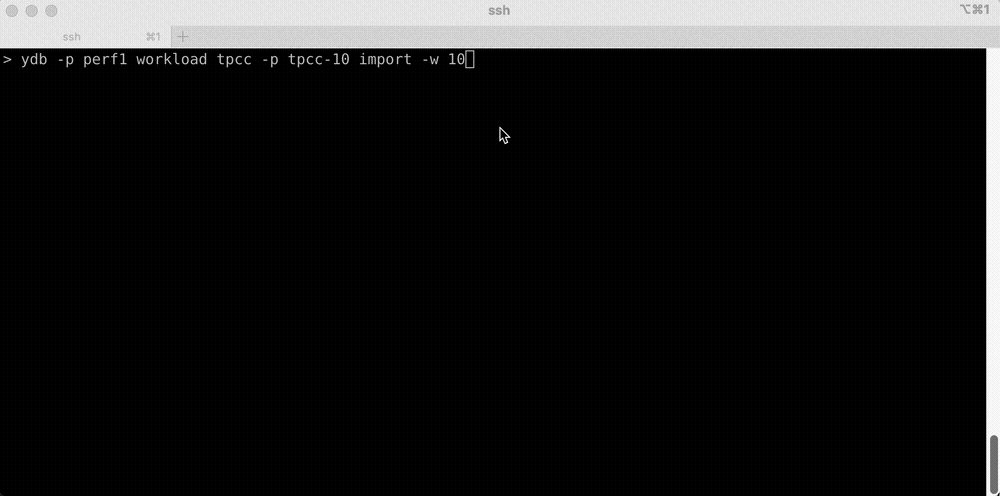
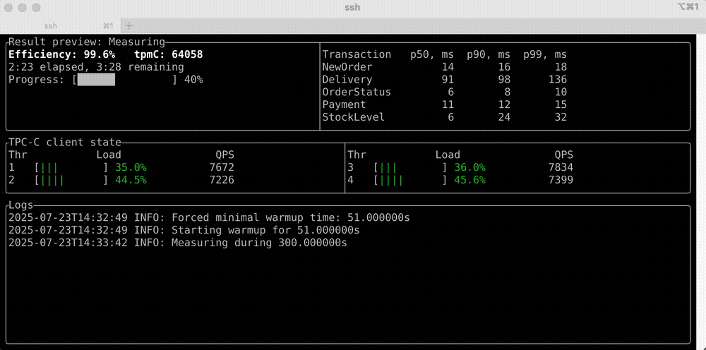

# TPC-C нагрузка

Нагрузка базируется на официальной [спецификации](https://www.tpc.org/tpc_documents_current_versions/pdf/tpc-c_v5.11.0.pdf) TPC-C. Все запросы и схемы таблиц адаптированы под {{ ydb-short-name }}.

TPC-C — это промышленный стандарт для оценки производительности систем [обработки транзакций в реальном времени (OLTP)](https://ru.wikipedia.org/wiki/OLTP).

TPC-C является промышленным стандартом для оценки производительности [обработки транзакций в реальном времени (OLTP)](https://ru.wikipedia.org/wiki/OLTP). Он моделирует работу розничной компании с настраиваемым числом складов. Каждый склад включает 10 районов, в каждом районе — 3000 клиентов. На складах хранятся товары, клиенты размещают заказы с несколькими позициями. Компания отслеживает платежи, доставку, историю заказов и периодически проводит инвентаризацию.

В результате создаётся нагрузка из распределённых транзакций различных типов и сложности, выполняемых параллельно.

Пример использования TPC-C:

```bash
{{ ydb-cli }} workload tpcc --path tpcc/10wh init -w 10
{{ ydb-cli }} workload tpcc --path tpcc/10wh import -w 10
{{ ydb-cli }} workload tpcc --path tpcc/10wh run -w 10
```

По умолчанию, если команды `import` и `run` запускаются в интерактивном терминале, они отображают прогресс выполнения с помощью [текстового пользовательского интерфейса (TUI)](https://en.wikipedia.org/wiki/Text-based_user_interface).

## Общие параметры команд

Все команды поддерживают общий параметр `--path`, задающий путь к каталогу в базе данных с таблицами бенчмарка:

```bash
{{ ydb-cli }} workload tpcc --path tpcc/10wh ...
```

### Доступные параметры {#common_options}

| Имя                | Описание                                             | Значение по умолчанию |
|--------------------|------------------------------------------------------|-----------------------|
| `--path` или `-p`  | Путь к каталогу с таблицами бенчмарка в базе данных. | `/`                   |

## Инициализация нагрузочного теста {#init}

Перед запуском бенчмарка создайте таблицы:

```bash
{{ ydb-cli }} workload tpcc --path tpcc/10wh init --warehouses 10
```

Подробнее о параметрах команды:

```bash
{{ ydb-cli }} workload tpcc init --help
```

### Доступные параметры {#init_options}

| Имя                     | Описание                      | Значение по умолчанию |
|-------------------------|-------------------------------|-----------------------|
| `--warehouses` или `-w` | Количество складов TPC-C.     | 10                    |

## Загрузка данных в таблицу { #load }

Данные будут сгенерированы и загружены в таблицы непосредственно {{ ydb-cli }}:

```bash
{{ ydb-cli }} workload tpcc --path tpcc/10wh import --warehouses 10
```

Пример использования:



Подробнее о параметрах команды:

```bash
{{ ydb-cli }} workload tpcc import --help
```

### Доступные параметры { #load_options }

| Имя                     | Описание                                                                 | Значение по умолчанию |
|-------------------------|--------------------------------------------------------------------------|-----------------------|
| `--warehouses` или `-w` | Количество складов TPC-C.                                                | 10                    |
| `--threads`             | Количество потоков для загрузки данных TPC-C в базу данных.              | 10                    |
| `--no-tui`              | Отключить TUI (по умолчанию включен при интерактивном запуске).          |                       |

Оптимальное количество потоков загрузки зависит от размера и конфигурации кластера YDB. В качестве ориентира: для кластеров с несколькими сотнями ядер CPU разумно начать примерно с 50 потоков загрузки. При необходимости это число можно увеличить.

Однако на клиентской стороне рекомендуется ограничивать число потоков загрузки 50–75% от общего количества доступных ядер процессора.

## Запуск нагрузочного теста { #run }

Запустите нагрузку:

```bash
{{ ydb-cli }} workload tpcc --path tpcc/10wh run
```

Во время теста TUI отображает предварительные результаты и статистику нагрузки на стороне клиента:


Подробнее о параметрах команды:

```bash
{{ ydb-cli }} workload tpcc run --help
```

### Доступные параметры { #run_options }

| Имя                      | Описание                                                                 | Значение по умолчанию |
|--------------------------|--------------------------------------------------------------------------|-----------------------|
| `--warehouses` или `-w`  | Количество складов TPC-C.                                                | 10                    |
| `--warmup`               | Время прогрева. Например: 10s, 5m, 1h.                                   | 30m                   |
| `--time` или `-t`        | Время выполнения. Например: 10s, 5m, 1h.                                 | 2h                    |
| `--max-sessions` или `-m`| Мягкое ограничение на количество сессий БД.                              | 100                   |
| `--threads`              | Количество потоков, выполняющих запросы.                                 | auto                  |
| `--format` или `-f`      | Формат вывода: 'Pretty', 'Json'.                                         | Pretty                |
| `--no-tui`               | Отключить TUI (по умолчанию включен при интерактивном запуске).          |                       |

Оптимальное количество сессий зависит от размера и конфигурации кластера YDB. В качестве ориентира: умножьте общее количество ядер CPU, выделенных для вычислительных узлов YDB (dynnodes), на 5–10.

Мы рекомендуем начинать с коэффициента 5. Если во время выполнения бенчмарка ресурсы YDB используются недостаточно, можно увеличить число сессий.

### Результаты

Результаты теста включают tpmC, эффективность и задержки по типам транзакций. Согласно спецификации:

> «Показателем производительности TPC-C является “деловая пропускная способность”, измеряемая количеством новых заказов, обработанных в минуту. Каждая единица нагрузки состоит из нескольких транзакций, имитирующих деловую активность, каждая из которых должна укладываться в определённое время отклика. Показатель измеряется в “транзакциях в минуту-C” (tpmC)».

Спецификация ограничивает теоретическую максимальную производительность одним складом: 12.86 tpmC. Чтобы увеличить общую нагрузку и итоговый tpmC, масштабируйте количество складов.

Формула расчёта эффективности:
$$
\text{эффективность} = \frac{\text{tpmC}}{12.86 \times \text{склады}} \times 100
$$

## Очистка данных теста { #cleanup }

Удаление таблиц бенчмарка:

```bash
{{ ydb-cli }} workload tpcc --path tpcc/10wh clean
```

Команда не имеет параметров.

## Проверка целостности данных { #consistency_check }

Команда `check` проверяет консистентность данных TPC-C после команды `import` или `run`. Её основное назначение — помощь в разработке, для конечных пользователей она не представляет особого интереса.

Пример:

```bash
{{ ydb-cli }} workload tpcc --path tpcc/10wh check
```

Подробнее о параметрах команды:

```bash
{{ ydb-cli }} workload tpcc check --help
```

### Доступные параметры { #check_options }

| Имя                     | Описание                                                                                                  | Значение по умолчанию |
|-------------------------|-----------------------------------------------------------------------------------------------------------|-----------------------|
| `--warehouses` или `-w` | Количество складов TPC-C.                                                                                 | 10                    |
| `--just-imported`       | Включает дополнительные проверки. Используется только сразу после импорта, до запуска каких-либо тестов.  |                       |
