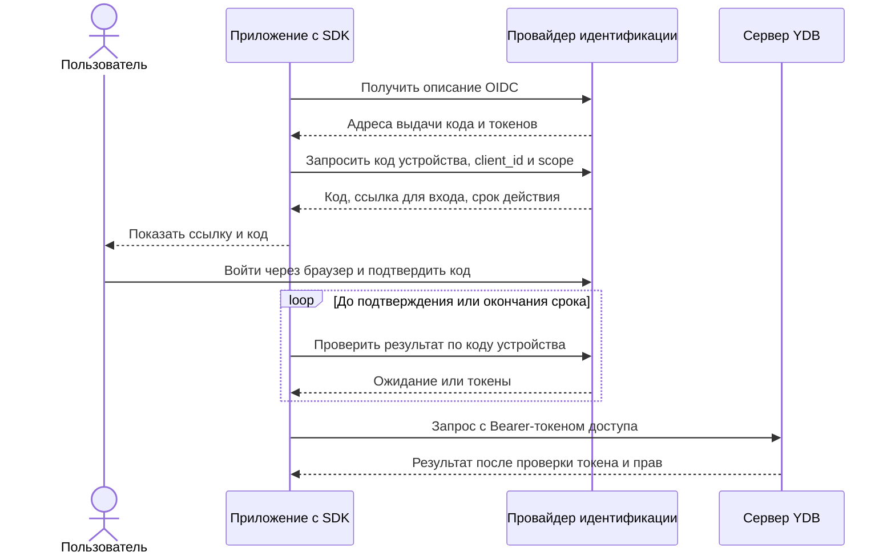

# Аутентификация в SDK

Как описано в статье о [подключении к серверу {{ ydb-short-name }}](../../../concepts/connect.md), клиент с каждым запросом должен отправить [аутентификационный токен](../../../security/authentication.md). Аутентификационный токен проверяется сервером и, в случае успешной аутентификации, запрос авторизуется и выполняется, иначе возвращается ошибка `Unauthenticated`.

{{ ydb-short-name }} SDK использует объект, отвечающий за генерацию таких токенов. SDK предоставляет встроенные cпособы получения такого объекта:

1. Методы с явной передачей параметров, каждый из методов реализует один из [режимов аутентификации](../../../security/authentication.md).
2. Метод определения режима аутентификации и необходимых параметров из переменных окружения.

Обычно объект генерации токенов создается перед инициализацией драйвера {{ ydb-short-name }} и передается параметром в его конструктор. C++ и Go SDK дополнительно позволяют через один драйвер работать с несколькими БД и объектами генерации токенов.

Если объект генерации токенов не определен, драйвер не будет добавлять в запросы какой-либо аутентификационной информации. Такой подход позволяет успешно соединиться с локально развернутыми кластерами {{ ydb-short-name }} без настроенной обязательной аутентификации. Если обязательная аутентификация настроена, то запросы к базе данных без аутентификационного токена будут отклоняться с выдачей ошибки аутентификации.

## Методы создания объекта генерации токенов {#auth-provider}

На приведенные ниже методы можно кликнуть, чтобы перейти к исходному коду релевантного примера в репозитории. Также можно ознакомиться с [рецептами кода Аутентификации](../../../recipes/ydb-sdk/auth.md).



- C++

  Режим | Метод
  ----- | -----
  Anonymous | [NYdb::CreateInsecureCredentialsProviderFactory()](https://github.com/ydb-platform/ydb-cpp-sdk/blob/main/include/ydb-cpp-sdk/client/types/credentials/credentials.h)
  Access Token | [NYdb::TDriverConfig::SetAuthToken(token)](https://github.com/ydb-platform/ydb-cpp-sdk/blob/main/include/ydb-cpp-sdk/client/driver/driver.h) или [NYdb::CreateOAuthCredentialsProviderFactory(token)](https://github.com/ydb-platform/ydb-cpp-sdk/blob/main/include/ydb-cpp-sdk/client/types/credentials/credentials.h)
  Metadata | [NYdb::CreateIamCredentialsProviderFactory(NYdb::TIamHost{...})](https://github.com/ydb-platform/ydb-cpp-sdk/blob/main/include/ydb-cpp-sdk/client/iam/iam.h)
  Service Account Key | [NYdb::CreateIamJwtFileCredentialsProviderFactory(NYdb::TIamJwtFilename{...})](https://github.com/ydb-platform/ydb-cpp-sdk/blob/main/include/ydb-cpp-sdk/client/iam/iam.h) или [NYdb::CreateIamJwtParamsCredentialsProviderFactory(NYdb::TIamJwtContent{...})](https://github.com/ydb-platform/ydb-cpp-sdk/blob/main/include/ydb-cpp-sdk/client/iam/iam.h), вспомогательно [NYdb::CreateFromSaKeyFile(saKeyFile, connectionString)](https://github.com/ydb-platform/ydb-cpp-sdk/blob/main/include/ydb-cpp-sdk/client/helpers/helpers.h)
  Static Credentials | [NYdb::CreateLoginCredentialsProviderFactory(NYdb::TLoginCredentialsParams{...})](https://github.com/ydb-platform/ydb-cpp-sdk/blob/main/include/ydb-cpp-sdk/client/types/credentials/credentials.h)
  OIDC | [NYdb::NOidc::CreateOidcProviderFactory(config)](#oidc)
  OAuth 2.0 token exchange | [NYdb::CreateOauth2TokenExchangeCredentialsProviderFactory(NYdb::TOauth2TokenExchangeParams{...})](https://github.com/ydb-platform/ydb-cpp-sdk/blob/main/include/ydb-cpp-sdk/client/types/credentials/oauth2_token_exchange/credentials.h), [NYdb::CreateOauth2TokenExchangeFileCredentialsProviderFactory(configFilePath, tokenEndpoint)](https://github.com/ydb-platform/ydb-cpp-sdk/blob/main/include/ydb-cpp-sdk/client/types/credentials/oauth2_token_exchange/from_file.h)
  Определяется по переменным окружения | [NYdb::CreateFromEnvironment(connectionString)](https://github.com/ydb-platform/ydb-cpp-sdk/blob/main/include/ydb-cpp-sdk/client/helpers/helpers.h)

- Python

  Режим | Метод
  ----- | -----
  Anonymous | [ydb.AnonymousCredentials()](https://github.com/yandex-cloud/ydb-python-sdk/tree/master/examples/anonymous-credentials)
  Access Token | [ydb.AccessTokenCredentials(token)](https://github.com/yandex-cloud/ydb-python-sdk/tree/master/examples/access-token-credentials)
  Metadata | [ydb.iam.MetadataUrlCredentials()](https://github.com/yandex-cloud/ydb-python-sdk/tree/master/examples/metadata-credentials)
  Service Account Key | [ydb.iam.ServiceAccountCredentials.from_file(<br/>key_file, iam_endpoint=None, iam_channel_credentials=None)](https://github.com/yandex-cloud/ydb-python-sdk/tree/master/examples/service-account-credentials)
  Static Credentials | [ydb.StaticCredentials.from_user_password(user, password)](https://github.com/ydb-platform/ydb-python-sdk/blob/main/examples/static-credentials/example.py)
  OAuth 2.0 token exchange | [ydb.oauth2_token_exchange.Oauth2TokenExchangeCredentials()](https://github.com/ydb-platform/ydb-python-sdk/blob/main/ydb/oauth2_token_exchange/token_exchange.py),<br/>[ydb.oauth2_token_exchange.Oauth2TokenExchangeCredentials.from_file(cfg_file, iam_endpoint=None)](https://github.com/ydb-platform/ydb-python-sdk/blob/main/ydb/oauth2_token_exchange/token_exchange.py)
  Определяется по переменным окружения | `ydb.credentials_from_env_variables()`

- Go

  Режим | Пакет | Метод
  ----- | ----- | ----
  Anonymous | [ydb-go-sdk/v3](https://github.com/ydb-platform/ydb-go-sdk/)| [ydb.WithAnonymousCredentials()](https://github.com/ydb-platform/ydb-go-examples/tree/master/auth/anonymous_credentials)
  Access Token | [ydb-go-sdk/v3](https://github.com/ydb-platform/ydb-go-sdk/) | [ydb.WithAccessTokenCredentials(token)](https://github.com/ydb-platform/ydb-go-examples/tree/master/auth/access_token_credentials)
  Metadata | [ydb-go-yc](https://github.com/ydb-platform/ydb-go-yc/) | [yc.WithMetadataCredentials(ctx)](https://github.com/ydb-platform/ydb-go-examples/tree/master/auth/metadata_credentials)
  Service Account Key | [ydb-go-yc](https://github.com/ydb-platform/ydb-go-yc/) | [yc.WithServiceAccountKeyFileCredentials(key_file)](https://github.com/ydb-platform/ydb-go-examples/tree/master/auth/service_account_credentials)
  Static Credentials | [ydb-go-sdk/v3](https://github.com/ydb-platform/ydb-go-sdk/) | [ydb.WithStaticCredentials(user, password)](https://github.com/ydb-platform/ydb-go-examples/tree/master/auth/static_credentials)
  OAuth 2.0 token exchange | [ydb-go-sdk/v3](https://github.com/ydb-platform/ydb-go-sdk/) | [ydb.WithOauth2TokenExchangeCredentials(options...)](https://github.com/ydb-platform/ydb-go-sdk/blob/master/options.go),<br/>[ydb.WithOauth2TokenExchangeCredentialsFile(configFilePath)](https://github.com/ydb-platform/ydb-go-sdk/blob/master/options.go)
  Определяется по переменным окружения | [ydb-go-sdk-auth-environ](https://github.com/ydb-platform/ydb-go-sdk-auth-environ/) | [environ.WithEnvironCredentials(ctx)](https://github.com/ydb-platform/ydb-go-examples/tree/master/auth/environ)

- Java

  Режим | Метод
  ----- | -----
  Anonymous | [tech.ydb.core.auth.NopAuthProvider.INSTANCE](https://github.com/ydb-platform/ydb-java-examples/tree/master/auth/anonymous_credentials)
  Access Token | [new tech.ydb.core.auth.TokenAuthProvider(accessToken);](https://github.com/ydb-platform/ydb-java-examples/tree/master/auth/access_token_credentials)
  Metadata | [tech.ydb.auth.iam.CloudAuthHelper.getMetadataAuthProvider();](https://github.com/ydb-platform/ydb-java-examples/tree/master/auth/metadata_credentials)
  Service Account Key | [tech.ydb.auth.iam.CloudAuthHelper.getServiceAccountFileAuthProvider(saKeyFile);](https://github.com/ydb-platform/ydb-java-examples/tree/master/auth/service_account_credentials)
  OAuth 2.0 token exchange | [tech.ydb.auth.OAuth2TokenExchangeProvider.fromFile(cfgFile);](https://github.com/ydb-platform/ydb-java-sdk/blob/master/auth-providers/oauth2-provider/src/main/java/tech/ydb/auth/OAuth2TokenExchangeProvider.java)
  Определяется по переменным окружения | [tech.ydb.auth.iam.CloudAuthHelper.getAuthProviderFromEnviron();](https://github.com/ydb-platform/ydb-java-examples/tree/master/auth/environ)

- C#

  Режим | Метод
  ----- | -----
  Anonymous | Ничего передавать для этого режима не нужно
  Access Token | [new TokenProvider(accessToken)](https://github.com/ydb-platform/ydb-dotnet-sdk/blob/main/src/Ydb.Sdk/src/Auth/TokenProvider.cs)
  Metadata | [new Ydb.Sdk.Auth.MetadataProvider()](https://github.com/ydb-platform/ydb-dotnet-yc/blob/main/src/Ydb.Sdk.Yc.Auth/src/MetadataProvider.cs)
  Service Account Key | [new Ydb.Sdk.Auth.ServiceAccountProvider(saKeyFile);](https://github.com/ydb-platform/ydb-dotnet-yc/blob/main/src/Ydb.Sdk.Yc.Auth/src/ServiceAccountProvider.cs)
  OAuth 2.0 token exchange | Не поддерживается
  Определяется по переменным окружения | Не поддерживается


- JavaScript

  Режим | Метод
  ----- | -----
  Anonymous | [AnonymousCredentialsProvider()](https://github.com/ydb-platform/ydb-js-sdk/blob/main/packages/auth/src/anonymous.ts)
  Access Token | [AccessTokenCredentialsProvider({ token })](https://github.com/ydb-platform/ydb-js-sdk/blob/main/packages/auth/src/access-token.ts)
  Metadata | [MetadataCredentialsProvider()](https://github.com/ydb-platform/ydb-js-sdk/blob/main/packages/auth/src/metadata.ts)
  Service Account Key | [ServiceAccountCredentialsProvider.fromFile(saKeyFile)](https://github.com/ydb-platform/ydb-js-sdk/tree/main/examples/auth-yandex-cloud)
  Static Credentials | [StaticCredentialsProvider({ username, password }, endpoint)](https://github.com/ydb-platform/ydb-js-sdk/blob/main/packages/auth/src/static.ts)
  Определяется по переменным окружения | [EnvironCredentialsProvider(connectionString)](https://github.com/ydb-platform/ydb-js-sdk/tree/main/examples/environ)

- Rust

  Режим | Метод
  ----- | -----
  Anonymous | ydb::AnonymousCredentials or ydb::AccessTokenCredentials::from("")
  Access Token | [ydb::AccessTokenCredentials::from("token")](https://github.com/ydb-platform/ydb-rs-sdk/blob/master/ydb/examples/auth-token.rs)
  Metadata | [ydb::MetadataUrlCredentials](https://github.com/ydb-platform/ydb-rs-sdk/blob/master/ydb/examples/auth-ycloud-metadata.rs)
  Service Account Key | [ydb::ServiceAccountCredentials](https://github.com/ydb-platform/ydb-rs-sdk/blob/master/ydb/examples/auth-ycloud-serviceaccount.rs)
  Static Credentials | [ydb::StaticCredentialsAuth](https://github.com/ydb-platform/ydb-rs-sdk/blob/master/ydb/examples/auth-static-credentials.rs)
  Определяется по переменным окружения | [ydb::FromEnvCredentials](https://github.com/ydb-platform/ydb-rs-sdk/blob/master/ydb/examples/auth-ycloud-serviceaccount.rs)
  Выполнение внешней команды | [ydb::CommandLineCredentials](https://github.com/ydb-platform/ydb-rs-sdk/blob/master/ydb/examples/auth-yc-cmdline.rs) (например, для авторизации с помощью [IAM-токена](https://cloud.yandex.ru/docs/iam/concepts/authorization/iam-token) {{ yandex-cloud }} с компьютера разработчика ```ydb::CommandLineCredentials.from_cmd("yc iam create-token")```)

- PHP

  Режим | Метод
  ----- | -----
  Anonymous | [AnonymousAuthentication()](https://github.com/ydb-platform/ydb-php-sdk#anonymous)
  Access Token | [AccessTokenAuthentication($accessToken)](https://github.com/ydb-platform/ydb-php-sdk#access-token)
  Oauth Token | [OAuthTokenAuthentication($oauthToken)](https://github.com/ydb-platform/ydb-php-sdk#oauth-token)
  Metadata | [MetadataAuthentication()](https://github.com/ydb-platform/ydb-php-sdk#metadata-url)
  Service Account Key | [JwtWithJsonAuthentication($jsonFilePath)](https://github.com/ydb-platform/ydb-php-sdk#jwt--json-file)  или [JwtWithPrivateKeyAuthentication($key_id, $service_account_id, $privateKeyFile)](https://github.com/ydb-platform/ydb-php-sdk#jwt--private-key)
  Определяется по переменным окружения | [EnvironCredentials()](https://github.com/ydb-platform/ydb-php-sdk#determined-by-environment-variables)
  Static Credentials | [StaticAuthentication($user, $password)](https://github.com/ydb-platform/ydb-php-sdk#static-credentials)



## Порядок определения режима и параметров аутентификации из окружения {#env}

Выполняется следующий алгоритм, одинаковый для всех SDK:

1. Если задано значение переменной окружения `YDB_SERVICE_ACCOUNT_KEY_FILE_CREDENTIALS`, то используется режим аутентификации **System Account Key**, а ключ загружается из файла, указанного в данной переменной.
2. Иначе, если задано значение переменной окружения `YDB_ANONYMOUS_CREDENTIALS`, равное 1, то используется анонимный режим аутентификации.
3. Иначе, если задано значение переменной окружения `YDB_METADATA_CREDENTIALS`, равное 1, то используется режим аутентификации **Metadata**.
4. Иначе, если задано значение переменной окружения `YDB_ACCESS_TOKEN_CREDENTIALS`, то используется режим аутентификации **Access token**, в который передается значение данной переменной.
5. Иначе, если задано значение переменной окружения `YDB_OAUTH2_KEY_FILE`, то используется режим аутентификации **OAuth 2.0 token exchange**, а настройки загружаются из [JSON файла](#oauth2-key-file-format), указанного в данной переменной.
6. Иначе используется режим аутентификации **Metadata**.

Наличие последним пунктом алгоритма выбора режима **Metadata** позволяет развернуть рабочее приложение на виртуальных машинах и в Cloud Functions {{ yandex-cloud }} без задания каких-либо переменных окружения.

## Формат файла настроек для режима аутентификации OAuth 2.0 token exchange {#oauth2-key-file-format}

Описание полей JSON файла настроек метода аутентификации **OAuth 2.0 token exchange**. Набор полей зависит от типа исходного токена, `JWT` или `FIXED`.

В таблице ниже `creds_json` обозначает JSON с параметрами для исходного токена, обмениваемого на access token.

Поля, не описанные в этой таблице, игнорируются.

Поле | Тип | Описание | Значение по умолчанию/опциональность
:----:|:---:|:--------:|:------------------------------------:
`grant-type`|string|Grant type|`urn:ietf:params:oauth:grant-type:token-exchange`
`res`|string \| list of strings|Resource|опциональное
`aud`|string \| list of strings|Опция audience для [запроса обмена токена](https://www.rfc-editor.org/rfc/rfc8693)|опциональное
`scope`|string \| list of strings|Scope|опциональное
`requested-token-type`|string|Тип получаемого токена|`urn:ietf:params:oauth:token-type:access_token`
`subject-credentials`|creds_json|Subject credentials|опциональное
`actor-credentials`|creds_json|Actor credentials|опциональное
`token-endpoint`|string|Token endpoint. В случае с {{ ydb-short-name }} CLI перезаписывается опцией `--iam-endpoint`.|опциональное
**Описание полей `creds_json` (JWT)** | — | — | —
`type`|string|Тип источника токена. Нужно задать константу `JWT`|—
`alg`|string|Алгоритм подписи JWT. Поддерживаются следующие алгоритмы: ES256, ES384, ES512, HS256, HS384, HS512, PS256, PS384, PS512, RS256, RS384, RS512|—
`private-key`|string|(Приватный) ключ в формате PEM (для алгоритмов `ES*`, `PS*`, `RS*`) или Base64 (для алгоритмов `HS*`) для подписи|—
`kid`|string|Стандартное поле JWT `kid` (key id)|опциональное
`iss`|string|Стандартное поле JWT `iss` (issuer)|опциональное
`sub`|string|Стандартное поле JWT `sub` (subject)|опциональное
`aud`|string|Стандартное поле JWT `aud` (audience)|опциональное
`jti`|string|Стандартное поле JWT `jti` (JWT id)|опциональное
`ttl`|string|Время жизни JWT токена|`1h`
**Описание полей `creds_json` (FIXED)** | — | — | —
`type`|string|Тип источника токена. Нужно задать константу `FIXED`|—
`token`|string|Значение токена|—
`token-type`|string|Значение типа токена. Это значение попадёт в параметр `subject_token_type/actor_token_type` в [запросе обмена токена](https://www.rfc-editor.org/rfc/rfc8693)|—

Пример файла и его подключения приведён в рецепте [настройки OAuth 2.0 token exchange через окружение](../../../recipes/ydb-sdk/auth-env.md#oauth2-key-file).

## Аутентификация OIDC в SDK {#oidc}

[OIDC](../../../concepts/glossary.md#oidc)-провайдер учётных данных в SDK получает токены доступа у [внешнего провайдера идентификации (IdP)](https://csrc.nist.gov/glossary/term/identity_provider), обновляет их и передаёт драйверу {{ ydb-short-name }}. IdP является отдельным сервисом: он подтверждает личность пользователя или приложения и выпускает токены для доступа к другим сервисам.

### Поддерживаемые способы получения токена {#oidc-flows}

OIDC-провайдер SDK поддерживает три режима. Режим выбирает, как приложение получает первоначальные учётные данные:

| Режим и тип конфигурации SDK | Как работает | Спецификация |
| --- | --- | --- |
| Готовый токен, `TStaticOidcConfig` | Приложение передаёт уже полученный токен, SDK не обращается к IdP и не обновляет токен. | Передача токена предъявителем, [Bearer Token, RFC 6750](https://www.rfc-editor.org/rfc/rfc6750.html#section-1.2). Это способ использования готового токена, а не отдельный протокол его получения. |
| Секрет приложения, `TClientOidcConfig` | Сервис получает токен по собственным идентификатору и секрету, без участия пользователя. | [Client Credentials Grant, RFC 6749, раздел 4.4](https://www.rfc-editor.org/rfc/rfc6749.html#section-4.4). В запросе способ обозначается `grant_type=client_credentials`. |
| Код устройства, `TDeviceOidcConfig` | Пользователь подтверждает вход в браузере по показанному коду, а SDK ожидает токен от IdP. | [Device Authorization Grant, RFC 8628](https://www.rfc-editor.org/rfc/rfc8628.html). В запросе токена используется `grant_type=urn:ietf:params:oauth:grant-type:device_code`. |

Параметр `grant_type` указывает способ получения токена в протоколе OAuth 2.0. Его не следует путать со способом проверки самого приложения: например, в режиме секрета приложения SDK использует [аутентификацию `client_secret_basic`](#oidc-client-flow). Условия обновления уже полученного токена описаны [отдельно](#oidc-refresh).

Код подключения для каждого режима приведён в [рецептах OIDC](../../../recipes/ydb-sdk/auth-oidc.md).

### Участники и токены {#oidc-participants}

В обмене участвуют следующие стороны, их роли соответствуют [терминологии OAuth 2.0](https://www.rfc-editor.org/rfc/rfc6749.html#section-1.1):

- **Приложение с SDK** является клиентом: запрашивает токен у IdP и отправляет запросы к базе данных.
- **IdP** выполняет роль сервера авторизации: выдаёт токены, проверив приложение или вход пользователя.
- **Сервер {{ ydb-short-name }}** является сервером ресурсов: проверяет токен и права на объекты базы данных.
- **Пользователь** подтверждает вход у IdP при использовании кода устройства. В режиме секрета приложения его участие не требуется.

Таким образом, SDK обменивается с IdP запросами получения и обновления токенов, а с сервером {{ ydb-short-name }} обменивается запросами к базе данных и их результатами. Пользователь взаимодействует с IdP через браузер. Это разные соединения, поэтому получение токена не означает успешного подключения к базе.

[Токен доступа `access_token`](https://www.rfc-editor.org/rfc/rfc6749.html#section-1.4) служит учётными данными для запросов к базе данных. Необязательный [токен обновления `refresh_token`](https://www.rfc-editor.org/rfc/rfc6749.html#section-1.5) используется только для получения нового токена у IdP и не передаётся серверу {{ ydb-short-name }}.

[Токен результата аутентификации `id_token`](https://openid.net/specs/openid-connect-core-1_0.html#IDToken) содержит сведения о входе пользователя, текущая реализация его не использует. SDK также не реализует [обмен кода авторизации `authorization_code`](https://www.rfc-editor.org/rfc/rfc6749.html#section-4.1), [приём перенаправления браузера локальным HTTP-сервером](https://www.rfc-editor.org/rfc/rfc8252.html#section-7.3) и [проверку `id_token`](https://openid.net/specs/openid-connect-core-1_0.html#IDTokenValidation).

### Предварительная настройка {#oidc-prerequisites}

Перед первым подключением настройте взаимодействие приложения с IdP и проверку токена на сервере {{ ydb-short-name }}:

1. **Зарегистрируйте приложение в IdP.** Для `TClientOidcConfig` разрешите получение токена по секрету приложения ([`client_credentials`](https://www.rfc-editor.org/rfc/rfc6749.html#section-4.4)) и способ проверки секрета [`client_secret_basic`](#oidc-client-flow). Для `TDeviceOidcConfig` разрешите [вход по коду устройства](https://www.rfc-editor.org/rfc/rfc8628.html#section-3) для приложения без секрета. Названия соответствующих настроек зависят от IdP. Для `TStaticOidcConfig` получите токен вне SDK.
2. **Проверьте доступность OIDC Discovery-документа** по HTTPS, если SDK должен получать или обновлять токены. Discovery-документ - это JSON-документ с описанием IdP: его идентификатором, адресами служб и поддерживаемыми способами аутентификации. Формат определяет [OpenID Connect Discovery](https://openid.net/specs/openid-connect-discovery-1_0.html#ProviderConfig), используемые SDK поля перечислены в [разделе об обнаружении адресов](#oidc-discovery).
3. **Проверьте, что IdP выпускает токен доступа** в формате [JWT](https://www.rfc-editor.org/rfc/rfc7519.html#section-3), пригодный для встроенной проверки внешнего IdP в {{ ydb-short-name }}. JWT содержит именованные утверждения, например об издателе и сроке действия. Для этой интеграции он должен быть защищён подписью. Термины пояснены [ниже](#oidc-jwt), а требования сервера перечислены в разделе [«Требования к токену и ключам»](../../../security/authentication.md#trebovaniya-k-tokenu-i-klyucham).
4. **Настройте [проверку внешнего IdP](../../configuration/auth_config.md#external-idp-auth-config) и [права доступа](../../../security/authorization.md) на сервере {{ ydb-short-name }}**. В частности, согласуйте значения издателя и ожидаемого получателя токена с настройками IdP.

После настройки проверьте подключение и выполнение запроса по [рецепту для SDK](../../../recipes/ydb-sdk/auth-oidc.md#client-application). Если токен получен, но запрос к базе отклонён, отдельно проверьте [требования к токену и ключам](../../../security/authentication.md#trebovaniya-k-tokenu-i-klyucham), [параметры серверной проверки](../../configuration/auth_config.md#external-idp-auth-config) и [назначенные права доступа](../../../security/authorization.md).

#### Подпись и утверждения JWT {#oidc-jwt}

При настройке IdP и сервера используются следующие понятия:

| Термин | Значение и спецификация |
| --- | --- |
| Подпись | Криптографическая защита, позволяющая проверить происхождение токена и отсутствие изменений. Формат подписанных данных определён в [JSON Web Signature, RFC 7515](https://www.rfc-editor.org/rfc/rfc7515.html#section-3). Сервер {{ ydb-short-name }} использует открытые ключи IdP для проверки. |
| Утверждения, claims | Именованные сведения внутри JWT о субъекте и условиях действия токена, например, издатель, получатель и срок действия. См. [RFC 7519, раздел 4](https://www.rfc-editor.org/rfc/rfc7519.html#section-4). |
| Издатель, `iss` | Сторона, выпустившая JWT. В этой интеграции значение должно совпадать с настроенным идентификатором IdP. См. [RFC 7519, раздел 4.1.1](https://www.rfc-editor.org/rfc/rfc7519.html#section-4.1.1). |
| Получатель, `aud` | Сервис или набор сервисов, которым предназначен токен. Для {{ ydb-short-name }} ожидаемое значение задаётся серверным параметром `audience`. См. [RFC 7519, раздел 4.1.3](https://www.rfc-editor.org/rfc/rfc7519.html#section-4.1.3). |
| Субъект, `sub` | Идентификатор того, о ком выпущен токен, например пользователя. См. [RFC 7519, раздел 4.1.2](https://www.rfc-editor.org/rfc/rfc7519.html#section-4.1.2). |
| Срок действия, `exp` | Момент, начиная с которого JWT нельзя принимать, в секундах от начала эпохи Unix. См. [RFC 7519, раздел 4.1.4](https://www.rfc-editor.org/rfc/rfc7519.html#section-4.1.4). |

Получение токена у IdP и проверка его подлинности разделены: SDK получает токен и планирует обновление, а [сервер проверяет подпись и утверждения](../../../security/authentication.md#external-idp).

### Подключение провайдера {#oidc-setup}

После [установки SDK](../install.md) подключите заголовок `ydb-cpp-sdk/client/types/credentials/oidc/credentials.h`. Публичные типы OIDC находятся в пространстве имён `NYdb::NOidc`.

Функция `CreateOidcProviderFactory(const TOidcConfig&)` возвращает фабрику учётных данных. Передайте её в `NYdb::TDriverConfig::SetCredentialsProviderFactory()` до создания драйвера.

Фабрика сразу проверяет локальную конфигурацию: HTTPS URL издателя, обязательные данные выбранного режима и синтаксис областей доступа. Некорректная конфигурация вызывает `std::invalid_argument`. При создании провайдера учётных данных, в том числе драйвером, запускается отдельный рабочий поток. Он обращается к IdP, когда требуется получить или обновить токен. Режим готового токена и использование пригодного кеша могут обойтись без сетевых запросов к IdP.



Публичная фабрика SDK принимает структуру `TOidcConfig`, приложение самостоятельно читает свои настройки и заполняет её поля. `NYdb::CreateFromEnvironment()` не создаёт этот OIDC-провайдер: его необходимо подключить явно. SDK также не создаёт файловое хранилище токенов автоматически. Для этого реализуйте [интерфейс `ITokenCacher`](#oidc-cacher).



### Структура конфигурации {#oidc-configuration}

`TOidcConfig` объединяет идентификатор [издателя](#oidc-jwt), один из [поддерживаемых способов получения токена](#oidc-flows) и необязательные обработчики приложения:

| Поле или метод | Тип | Назначение |
| --- | --- | --- |
| `Issuer` | `std::string` | HTTPS URL и [идентификатор издателя](https://openid.net/specs/openid-connect-discovery-1_0.html#ProviderMetadata), отдельный от адреса базы данных. Должен точно совпадать с `issuer` [Discovery-документа](#oidc-discovery). Обязателен для всех режимов. |
| `FlowConfig` | `TFlowConfig` | Вариант из [`TStaticOidcConfig`](#oidc-static-example), [`TClientOidcConfig`](#oidc-client-example) или [`TDeviceOidcConfig`](#oidc-device-example). Задайте нужный режим явно. |
| `.Cacher(...)` | `std::shared_ptr<ITokenCacher>` | Объект чтения и записи токенов по [контракту `ITokenCacher`](#oidc-cacher). По умолчанию отсутствует. |
| `.Acceptor(...)` | `std::shared_ptr<IAuthAcceptor>` | [Обработчик `IAuthAcceptor`](#oidc-acceptor), который показывает ссылку и код устройства. Нужен, когда SDK начинает новый вход пользователя. |

У выбранного режима есть собственные поля конфигурации:

| Структура | Поля |
| --- | --- |
| [`TStaticOidcConfig`](#oidc-static-example) | Непустой [токен доступа](#oidc-participants) `AccessToken`. Необязательный [срок действия](#oidc-static-example) `ExpiresAt` типа `std::optional<TInstant>`. |
| [`TClientOidcConfig`](#oidc-client-example) | Непустые `ClientId` и `ClientSecret`. Список `Scopes` типа `std::vector<std::string>`. |
| [`TDeviceOidcConfig`](#oidc-device-example) | Непустой `ClientId`. Список `Scopes` типа `std::vector<std::string>`. |

`ClientId` содержит [идентификатор зарегистрированного приложения `client_id`](https://www.rfc-editor.org/rfc/rfc6749.html#section-2.2). Это не идентификатор пользователя. `ClientSecret` содержит [секрет приложения `client_secret`](https://www.rfc-editor.org/rfc/rfc6749.html#section-2.3.1), используемый для его проверки на стороне IdP. Режим готового токена отличается от [аутентификации по логину и паролю](../../../security/authentication.md#static-credentials), которая в других частях справочника SDK называется `Static Credentials`.

`Scopes` задаёт запрашиваемые [области доступа, `scope`](https://www.rfc-editor.org/rfc/rfc6749.html#section-3.3): именованные разрешения, смысл которых определяет IdP. Каждый элемент списка содержит одну область доступа. Несколько областей нельзя объединять пробелом в одном элементе. Пустые значения, пробельные и управляющие символы, не-ASCII символы, кавычка `"` и обратная косая черта `\` отклоняются. SDK добавляет [`openid`](https://openid.net/specs/openid-connect-core-1_0.html#AuthRequest), обозначающий запрос OpenID Connect, если его нет в списке, в том числе в режиме секрета приложения. Проверьте, что IdP разрешает эту область для выбранного приложения. [`offline_access`](https://openid.net/specs/openid-connect-core-1_0.html#OfflineAccess) запрашивает доступ без присутствия пользователя с помощью токена обновления. Эта и другие области автоматически не добавляются: задайте их явно, если они нужны и поддерживаются IdP для выбранного режима. Например, [`profile`](https://openid.net/specs/openid-connect-core-1_0.html#ScopeClaims) запрашивает сведения профиля. Набор утверждений именно в токене доступа зависит от IdP.

Поля `audience` для выбора [получателя токена](#oidc-jwt) и [`resource` для указания целевого сервиса](https://www.rfc-editor.org/rfc/rfc8707.html#section-2), переопределение адресов IdP и настройки его HTTP-транспорта в `TOidcConfig` отсутствуют. Нужные получатели и утверждения токена настраиваются в IdP. Параметры TLS драйвера относятся к соединению с {{ ydb-short-name }} и не меняют HTTPS-соединение OIDC. Для другого механизма обмена токенов см. [OAuth 2.0 token exchange](#oauth2-key-file-format). Его конфигурация отличается от OIDC.

### Обнаружение адресов IdP {#oidc-discovery}

SDK получает адреса служб IdP из **Discovery-документа**, JSON-описания провайдера по стандарту [OpenID Connect Discovery](https://openid.net/specs/openid-connect-discovery-1_0.html#ProviderConfig). Документ позволяет приложению найти нужные службы по одному заранее известному идентификатору издателя `issuer`. Когда требуется сетевое получение или обновление токена, клиент выполняет `GET` к `/.well-known/openid-configuration` относительно `issuer`. Например, для `https://idp.example.com/realms/ydb` адресом запроса будет `https://idp.example.com/realms/ydb/.well-known/openid-configuration`.

Из документа используются следующие поля:

| Поле | Проверка и использование |
| --- | --- |
| [`issuer`](https://openid.net/specs/openid-connect-discovery-1_0.html#ProviderMetadata) | Идентификатор издателя. Обязательная непустая строка, которая должна в точности совпадать с настроенным `Issuer`, включая завершающий `/`. |
| [`token_endpoint`](https://www.rfc-editor.org/rfc/rfc6749.html#section-3.2) | Адрес службы получения и обновления токенов. Обязателен. |
| [`device_authorization_endpoint`](https://www.rfc-editor.org/rfc/rfc8628.html#section-4) | Адрес службы выдачи кода устройства. Обязателен для начала нового входа пользователя по коду устройства. |
| [`token_endpoint_auth_methods_supported`](https://openid.net/specs/openid-connect-discovery-1_0.html#ProviderMetadata) | Список способов проверки приложения службой выдачи токенов. При использовании секрета приложения должен включать [`client_secret_basic`](#oidc-client-flow). Если поле отсутствует, SDK использует этот способ без дополнительной проверки списка. Если поле присутствует, SDK требует массив строк. |

Завершающие `/` убираются только при построении URL запроса Discovery. Это не делает `https://idp.example.com/realm` и `https://idp.example.com/realm/` эквивалентными идентификаторами издателя.

Все адреса IdP, включая ссылки для входа пользователя, должны использовать HTTPS. В них запрещены имя пользователя, пароль и фрагмент URL. У `issuer` дополнительно запрещены параметры запроса. Для HTTPS проверяется сертификат сервера. Настройки TLS соединения с базой данных не передаются HTTP-клиенту OIDC.

Полученные адреса сохраняются внутри экземпляра провайдера учётных данных. При последующих обновлениях он использует их повторно. Изменение адресов в Discovery-документе требует создания нового экземпляра. Режим готового токена не обращается к Discovery, пригодный токен из кеша также может быть использован без этого запроса.

### Приложение с секретом {#oidc-client-example}

Для сервиса без интерактивного входа используйте `TClientOidcConfig`.

#### Получение токена {#oidc-client-flow}

В режиме `TClientOidcConfig` SDK отправляет запрос `POST` на [адрес выдачи токенов `token_endpoint`](#oidc-discovery). Тело использует [формат HTML-формы `application/x-www-form-urlencoded`](https://www.rfc-editor.org/rfc/rfc6749.html#appendix-B) и содержит способ получения токена `grant_type=client_credentials` и список областей доступа `scope`.

Способ [`client_secret_basic`](https://openid.net/specs/openid-connect-core-1_0.html#ClientAuthentication) проверяет приложение по его идентификатору и секрету с помощью HTTP Basic. Идентификатор `client_id` и секрет `client_secret` по отдельности кодируются для формы, соединяются через двоеточие, преобразуются в Base64 и передаются в заголовке `Authorization` со схемой `Basic`. Этот порядок определён в [RFC 6749, раздел 2.3.1](https://www.rfc-editor.org/rfc/rfc6749.html#section-2.3.1).

Другие [способы проверки приложения](https://openid.net/specs/openid-connect-core-1_0.html#ClientAuthentication), например `client_secret_post` (секрет в теле запроса) и подписанное JWT-утверждение клиента (`client_secret_jwt` или `private_key_jwt`), этим API не реализованы. Настройте приложение в IdP на `client_secret_basic`.

В [успешном ответе](https://www.rfc-editor.org/rfc/rfc6749.html#section-5.1) SDK требует непустой токен доступа `access_token` и поле типа токена `token_type` со значением [`Bearer`](https://www.rfc-editor.org/rfc/rfc6750.html#section-1.2) без учёта регистра. Bearer означает, что токен используется предъявителем без отдельного доказательства владения ключом.

Поле `expires_in` задаёт срок действия токена доступа в секундах. Если IdP вернул токен обновления `refresh_token`, SDK также учитывает его срок из поля `refresh_expires_in`. Последнее является расширением ответа, которое поддерживает эта реализация (в RFC 6749 оно не определено). Подробные правила приведены в разделе [обновления токенов](#oidc-refresh).

Примеры подключения находятся в рецептах: [создание драйвера с секретом приложения](../../../recipes/ydb-sdk/auth-oidc.md#client-secret) и [полное приложение с запросом к базе](../../../recipes/ydb-sdk/auth-oidc.md#client-application).

### Готовый токен {#oidc-static-example}

Если приложение получает токен самостоятельно, используйте `TStaticOidcConfig`. Создание фабрики и подключение драйвера показаны в [рецепте готового токена](../../../recipes/ydb-sdk/auth-oidc.md#static-token).

В `AccessToken` передавайте **только значение токена без префикса `Bearer` и отделяющего его пробела**. Публичная фабрика SDK не удаляет этот префикс из входного значения и добавляет его сама при выдаче данных аутентификации.

`ExpiresAt` является абсолютным моментом времени. Например, `TInstant::Seconds()` создаёт его из целого числа секунд Unix. Явный срок имеет приоритет над [утверждением `exp` в JWT](#oidc-jwt). При неизвестном сроке SDK не может самостоятельно определить момент истечения, сервер всё равно проверяет токен по своим правилам.

Статический провайдер не читает токен из `ITokenCacher`: источником служит `AccessToken`. Если cacher задан, провайдер может записать в него переданный токен без токена обновления. Автоматического обновления нет. При известном истёкшем сроке провайдер возвращает ошибку, не обращаясь к IdP. Изменение исходной структуры после создания фабрики также не меняет её настройки: для новых учётных данных создайте новую фабрику.

### Вход пользователя по коду устройства {#oidc-device-example}

Для пользовательского входа задайте `TDeviceOidcConfig` и обработчик `IAuthAcceptor`. Обработчик получает ссылку и код, а SDK самостоятельно продолжает опрос IdP.

#### Обмен с IdP {#oidc-device-flow}

Режим `TDeviceOidcConfig` использует [вход по коду устройства](https://www.rfc-editor.org/rfc/rfc8628.html). Пользователь подтверждает вход в браузере, а провайдер ждёт результат у IdP. Пароль пользователя в приложение с SDK не передаётся.



Сначала клиент отправляет идентификатор приложения `client_id` и области доступа `scope` на [адрес выдачи кода устройства](#oidc-discovery). Поля ответа определены в [RFC 8628, раздел 3.2](https://www.rfc-editor.org/rfc/rfc8628.html#section-3.2):

| Поле | Значение |
| --- | --- |
| `device_code` | Служебный код, по которому SDK запрашивает результат входа у IdP. Обязателен. |
| `user_code` | Код для ввода пользователем в браузере. Обязателен. |
| `verification_uri` | Адрес страницы подтверждения входа. Обязателен. |
| `verification_uri_complete` | Необязательная ссылка с уже включённым кодом пользователя или эквивалентными данными для входа. |
| `expires_in` | Положительный срок действия кодов в секундах. Обязателен. |
| `interval` | Необязательный интервал опроса результата в секундах. |

Для показа `user_code`, `verification_uri` и необязательной готовой ссылки `verification_uri_complete` SDK вызывает [обработчик `IAuthAcceptor`](#oidc-acceptor). Обработчик должен вернуться, чтобы провайдер продолжил опрос IdP.

После этого клиент опрашивает `token_endpoint`, передавая `grant_type=urn:ietf:params:oauth:grant-type:device_code`, `device_code` и `client_id`. Первый опрос начинается после ожидания интервала. По умолчанию интервал равен 5 секундам. IdP может указать другое положительное целое число секунд.

Коды ответа при входе по устройству определены в [RFC 8628, раздел 3.5](https://www.rfc-editor.org/rfc/rfc8628.html#section-3.5). SDK обрабатывает результаты опроса так:

| Результат | Поведение |
| --- | --- |
| `authorization_pending` | Вход ещё не подтверждён, опрос продолжается с тем же интервалом. |
| `slow_down` | Интервал увеличивается на 5 секунд для последующих запросов. |
| Временная ошибка сети или повторяемый HTTP-статус | Интервал удваивается. |
| Постоянная ошибка `access_denied` | Попытка завершается ошибкой: пользователь или IdP отказал во входе. |
| Постоянная ошибка `expired_token` или истечение локального срока кода | Попытка завершается ошибкой. |
| Успешный ответ с токеном | Токен становится доступен для запросов к {{ ydb-short-name }}. |

Ожидание ограничено сроком действия кода. После отказа или истечения срока новый код автоматически не запрашивается. Для повторной попытки создайте новый провайдер учётных данных.

Ошибки с повторяемым HTTP-статусом, например `503`, считаются временными даже при коде `access_denied` или `expired_token` в ответе. Локальное истечение срока кода всегда завершает попытку.

Код обработчика `IAuthAcceptor`, фабрики и драйвера приведён в [рецепте входа по коду устройства](../../../recipes/ydb-sdk/auth-oidc.md#device-code).

#### Контракт обработчика входа {#oidc-acceptor}

Метод `IAuthAcceptor::Accept(const TDeviceAuthInfo&)` получает следующие данные:

| Поле | Содержание |
| --- | --- |
| `UserCode` | Код, который пользователь вводит на странице IdP. |
| `VerificationUrl` | Адрес страницы подтверждения. |
| `VerificationUrlComplete` | Необязательная готовая ссылка для входа. |
| `ExpiresAt` | Абсолютный срок действия кода. |

`Accept()` вызывается синхронно на рабочем потоке провайдера. Он должен быстро вернуться: не ждите внутри завершения входа пользователя. Для графического интерфейса скопируйте `info`, передайте копию потоку интерфейса и верните управление. Исключение из обработчика завершает попытку аутентификации ошибкой.

Один обработчик может вызываться одновременно разными провайдерами. Синхронизируйте доступ к общим данным. Ссылка на `info` действительна только в пределах вызова, хранить её для дальнейшей работы нельзя.

Отсутствие `Acceptor` не мешает создать фабрику для входа по коду устройства или использовать пригодный кеш. Но если потребуется новый вход, например после истечения токена обновления, провайдер вернёт ошибку `device authorization requires an auth acceptor`. Поэтому приложение с пользовательским входом должно предоставлять обработчик на весь срок работы.

После отказа пользователя или истечения кода текущий провайдер не начинает новую попытку сам. Создайте новый провайдер. При использовании `CreateProvider()` без аргументов нужна новая фабрика, поскольку старая повторно возвращает прежний экземпляр.

### Передача токена серверу {#oidc-ticket}

Провайдер учётных данных возвращает строку из префикса `Bearer`, одного пробела и токена доступа. При работе по gRPC SDK помещает эту строку в метаданные [`x-ydb-auth-ticket`](../grpc-headers.md). Обмен с IdP и запросы к базе данных используют разные соединения.

Клиент не проверяет [подпись и утверждения JWT](#oidc-jwt), в том числе `iss` и `aud`. Он может извлечь из JWT срок действия для планирования обновления, но решение о подлинности и допустимости токена принимает сервер. В частности, клиент допускает токен, внутреннее содержимое которого он не может разобрать. Это не означает, что такой токен будет принят настроенной серверной проверкой внешнего IdP.

### Срок действия и обновление {#oidc-refresh}

Для токена, полученного у IdP, срок определяется в следующем порядке:

1. Если в ответе есть `expires_in`, используется это положительное целое число секунд. Отсчёт начинается перед отправкой запроса токена.
2. Иначе клиент пытается прочитать целочисленное поле `exp` из JWT.
3. Если определить срок не удалось, он считается неизвестным. Это не гарантирует бессрочность токена на сервере.

При известном сроке провайдеры, созданные с `TClientOidcConfig` или `TDeviceOidcConfig`, планируют обновление примерно через половину оставшегося времени, с минимальной задержкой 1 мс. Пока текущий токен действителен по клиентским данным, запросы могут продолжать использовать его.

При обновлении клиент сначала использует пригодный `refresh_token`, отправляя `grant_type=refresh_token` и сам токен обновления по [RFC 6749, раздел 6](https://www.rfc-editor.org/rfc/rfc6749.html#section-6). Если токен обновления отсутствует, истёк или IdP отклонил его постоянной ошибкой [`invalid_grant`](https://www.rfc-editor.org/rfc/rfc6749.html#section-5.2) (недействительные данные для получения токена), клиент повторяет исходный режим: запрос с секретом приложения либо вход по коду устройства. Другие постоянные ошибки, например [`invalid_client`](https://www.rfc-editor.org/rfc/rfc6749.html#section-5.2) (не удалось проверить приложение), не запускают новый режим.

Если IdP выдал новый `refresh_token`, он заменяет прежний. Если ответ на обновление не содержит нового токена обновления, прежний сохраняется. Поле `refresh_expires_in` задаёт его срок, нулевое значение означает неизвестный срок.

Для готового токена действуют отдельные [правила статического режима](#oidc-static-example): его автоматическое обновление не выполняется.

#### Токен с неизвестным сроком {#oidc-unknown-expiry}

После получения токена без `expires_in` и извлекаемого `exp` фоновое обновление не планируется, даже если IdP выдал токен обновления. Клиентская проверка срока продолжает считать такой токен пригодным, сервер может его отклонить.

При запуске нового провайдера есть особенность чтения кеша: если срок кешированного токена доступа неизвестен, но есть токен обновления, SDK сначала пытается обновить учётные данные. Если токена обновления нет, он использует кешированный токен доступа как есть.

### Хранение токенов {#oidc-cacher}

Интерфейс `ITokenCacher` позволяет приложению повторно использовать токены между провайдерами или запусками. SDK предоставляет контракт хранения: место хранения и защиту данных выбирает приложение.

Метод `Read() const` возвращает `std::optional<TTokenCache>`, а `Write(const TTokenCache&)` сохраняет новый набор. `TTokenCache` содержит:

| Поле | Тип и назначение |
| --- | --- |
| `AccessToken` | `TOAuthToken` с токеном доступа. |
| `RefreshToken` | `std::optional<TOAuthToken>` с токеном обновления. |
| `TOAuthToken::Token` | Непустая строка без префикса `Bearer` и отделяющего его пробела. |
| `TOAuthToken::ExpiresAt` | Необязательный абсолютный срок `TInstant`. Отсутствие означает неизвестный срок, а не гарантированную бессрочность. |

Реализация кеша в памяти и его подключение к конфигурации показаны в [рецепте хранения токенов](../../../recipes/ydb-sdk/auth-oidc.md#token-cache). Для повторного использования токенов после завершения процесса приложению требуется постоянное хранилище.

Реализация кеша должна соблюдать следующие условия:

- `Read()` и `Write()` потокобезопасны, поскольку один объект может обслуживать несколько провайдеров.
- Методы синхронно выполняются на рабочем потоке провайдера и быстро возвращают управление.
- Кеш разделён по настройкам IdP, приложения и пользовательским сессиям. SDK не проверяет, для какого издателя или пользователя собственная реализация кеша вернула токен.
- Секреты защищены от постороннего чтения. Сообщения об ошибках хранения не содержат значения токенов.
- Ошибка чтения означает отсутствие кеша. Ошибка записи не делает уже полученный токен непригодным в памяти. Исключения кеша SDK подавляет, поэтому реализация сама сообщает о проблемах сохранения.

В режимах секрета приложения и кода устройства кеш читается при запуске провайдера, а не перед каждым запросом. Пригодный токен доступа с известным сроком можно использовать без нового входа и запроса Discovery. Истёкший токен доступа с пригодным токеном обновления позволяет получить новый токен без браузера. Для токена с неизвестным сроком действуют [отдельные правила](#oidc-unknown-expiry).

Внешнее изменение хранилища не заменяет автоматически токен уже работающего экземпляра. Новые токены записываются после успешного получения или обновления. Без постоянного кеша новый процесс получает токен заново. Для входа по коду устройства это обычно означает повторный вход пользователя.

Клиентский кеш содержит данные для отправки запросов. Он отличается от [кеша результатов аутентификации на сервере](../../../security/caching-authentication-results.md), который хранит результат проверки полученного токена.

Общий кеш не объединяет одновременные входы нескольких провайдеров и не обеспечивает межпроцессную координацию обновления. При необходимости сериализации таких операций её реализует приложение.

### Получение учётных данных и ожидание {#oidc-async}

Обычно драйвер сам запрашивает токен у провайдера. При самостоятельной работе с `ICredentialsProvider` доступны:

| Метод | Поведение |
| --- | --- |
| `GetAuthInfoAsync()` | Возвращает `NThreading::TFuture<std::string>` со строкой из `Bearer`, пробела и токена доступа либо исключением. Если токен ещё получается, возвращает ожидающий результат. |
| `GetAuthInfo()` | Блокируется до результата `GetAuthInfoAsync()`. При пользовательском входе ожидание может занять всё время подтверждения. |
| `IsValid()` | Показывает состояние провайдера, но не гарантирует, что токен уже получен: до первой ошибки может возвращать `true` и во время начального входа. |

Несколько одновременных обращений к одному провайдеру используют общее получение токена. При наличии пригодного токена результат выдаётся сразу. При фоновом обновлении старый токен продолжает использоваться до истечения известного срока.

Временная ошибка IdP может завершить ожидающий результат исключением, хотя рабочий поток продолжит повторные попытки. После успешного обновления сохранённая ошибка сбрасывается и новые обращения получают токен. Не считайте единственную ошибку ожидающего результата подтверждением остановки фоновых повторов. Их правила описаны в разделе [ошибок OIDC](#oidc-errors).

При использовании драйвера ошибка получения учётных данных может привести к [клиентскому статусу](../error_handling.md#status-codes) `CLIENT_UNAUTHENTICATED`. Ожидание токена также учитывает срок и отмену конкретного удалённого вызова (RPC). Например, запрос может завершиться `CLIENT_DEADLINE_EXCEEDED`, пока пользователь ещё входит. Планируйте первоначальный вход отдельно от коротких прикладных запросов или задавайте подходящие сроки запросов.

### Ошибки и ограничения {#oidc-errors}

Для получения и обновления токенов повторяемыми считаются ошибки транспорта и HTTP-статусы `408`, `429`, `500`, `502`, `503`, `504`. Вне опроса кода устройства пауза начинается с 200 мс, удваивается до 30 секунд и сбрасывается после успеха. При опросе кода применяется [отдельное правило увеличения интервала](#oidc-device-flow).

Поведение ожидающих запросов при фоновом обновлении описано в разделе [получения учётных данных](#oidc-async).

Некорректный ответ, несовпадение `issuer`, неподдерживаемый тип токена и постоянные ошибки IdP завершают обновление. Ответы протокола должны иметь HTTP-статус `200` и содержать JSON-объект. Перенаправление HTTP не заменяет корректный ответ конечного адреса.

Размер ответа IdP ограничен 1 МиБ, глубина JSON ограничена 32 уровнями. Для HTTP установлены тайм-ауты сокета 5 секунд и соединения 30 секунд. При обмене кода устройства они уменьшаются до оставшегося времени. Эти ограничения не задают единый предельный срок всей операции: разрешение DNS зависит от системного резолвера, а тайм-аут сокета относится к отдельным операциям ввода-вывода.

### Фабрика и время жизни {#oidc-lifetime}

Фабрика хранит копию конфигурации и разделяемые указатели на обработчики. Способ создания провайдера влияет на повторное использование:

| Вызов | Результат |
| --- | --- |
| `factory->CreateProvider()` | Лениво создаёт один провайдер с собственной служебной инфраструктурой SDK и возвращает его при последующих вызовах. Фабрика сохраняет этот экземпляр. |
| `factory->CreateProvider(facility)` | Каждый раз создаёт независимый провайдер, связанный с переданным объектом `ICoreFacility`, который обслуживает очереди SDK. Этот вариант используется при интеграции с драйвером. Объект `facility` должен оставаться живым. |

Разные провайдеры могут независимо начать вход по коду устройства, даже если используют общий cacher. Для разных пользователей создавайте отдельные хранилища и обработчики. `GetClientIdentity()` фабрики возвращает непрозрачный отпечаток конфигурации: это не [субъект `sub`](#oidc-jwt) из токена и не идентификатор пользователя. Разные экземпляры пользовательских cacher или acceptor участвуют в разделении идентичности фабрик. Не используйте такую идентичность как постоянный идентификатор сессии между процессами.

При уничтожении провайдер прекращает опрос IdP и дожидается завершения рабочего потока. Уже выполняющийся HTTP-запрос не прерывается мгновенно: завершение может ждать сетевых тайм-аутов. Также требуется возврат из синхронно вызванного `Accept()`, `Read()` или `Write()`. Ограничения времени HTTP описаны в разделе [ошибок и ограничений](#oidc-errors).

Сохраняйте владельцев провайдера и фабрики до возврата пользовательских обработчиков и обработчиков завершения будущих результатов. Синхронное уничтожение этих владельцев из такого обработчика не поддерживается. Остановку организуйте из внешнего по отношению к обработчику кода.

Публичный OIDC API не предоставляет методов принудительного обновления, перезапуска или отмены отдельной попытки входа. После постоянной ошибки или изменения настроек создайте новую фабрику и используйте её в новом контексте подключения.

### См. также {#oidc-see-also}

- [Проверка внешнего IdP на сервере](../../../security/authentication.md#external-idp).
- [Рецепты аутентификации OIDC](../../../recipes/ydb-sdk/auth-oidc.md).
- [Пример OIDC в исходном коде SDK](https://github.com/ydb-platform/ydb/blob/main/ydb/public/sdk/cpp/examples/auth/oidc/main.cpp).

## Особенности {{ ydb-short-name }} Python SDK v2 (устаревшая версия)



Поведение {{ ydb-short-name }} Python SDK v2 (устаревшая версия) отличается от описанного выше.



* Алгоритм работы функции `construct_credentials_from_environ()` {{ ydb-short-name }} Python SDK v2:

  - Если задано значение переменной окружения `USE_METADATA_CREDENTIALS`, равное 1, то используется режим аутентификации **Metadata**
  - Иначе, если задано значение переменной окружения `YDB_TOKEN`, то используется режим аутентификации **Access Token**, в который передается значение данной переменной
  - Иначе, если задано значение переменной окружения `SA_KEY_FILE`, то используется режим аутентификации **System Account Key**, а ключ загружается из файла, имя которого указано в данной переменной
  - Иначе в запросах не будет добавлена информация об аутентификации.

* В случае, если при инициализации драйвера не передан никакой объект, отвечающий за генерацию токенов, то применяется [общий порядок](#env) чтения значений переменных окружения.
