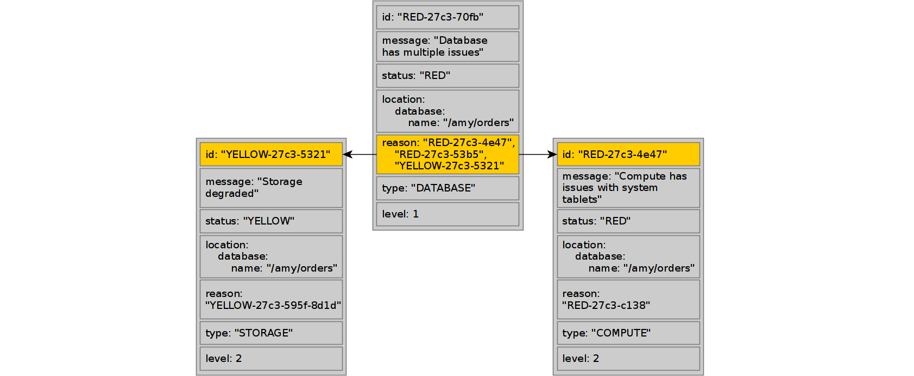
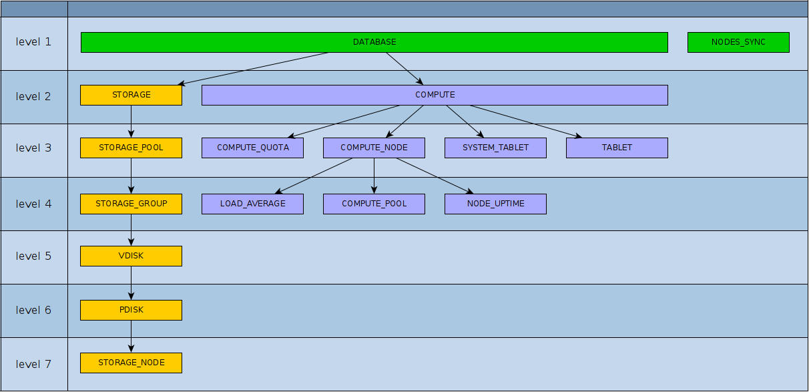

# Health Check API

{{ ydb-short-name }} имеет встроенную систему самодиагностики, с помощью которой можно получить краткий отчет о состоянии базы данных и информацию об имеющихся проблемах.

Чтобы инициировать проверку, вызовите метод `SelfCheck` из пространства имен `NYdb::NMonitoring` в SDK. Также необходимо передать имя проверяемой БД стандартным способом.



- C++

  Пример кода приложения для создания клиента:

  ```cpp
  auto client = NYdb::NMonitoring::TMonitoringClient(driver);
  ```

  Вызов метода `SelfCheck`:

  ```c++
  auto settings = TSelfCheckSettings();
  settings.ReturnVerboseStatus(true);
  auto result = client.SelfCheck(settings).GetValueSync();
  ```



## Параметры вызова {#call-parameters}

`SelfCheck` возвращает информацию в форме [списка проблем](#example-emergency), каждая из которых может выглядеть так:

```json
{
  "id": "RED-27c3-70fb",
  "status": "RED",
  "message": "Database has multiple issues",
  "location": {
    "database": {
      "name": "/slice"
    }
  },
  "reason": [
    "RED-27c3-4e47",
    "RED-27c3-53b5",
    "YELLOW-27c3-5321"
  ],
  "type": "DATABASE",
  "level": 1
}
```

Это короткое сообщение об одной из проблем. Все параметры вызова могут влиять на размер информации, которая содержится в ответе.

Полный список дополнительных параметров представлен ниже:



- C++

  ```c++
  struct TSelfCheckSettings : public TOperationRequestSettings<TSelfCheckSettings>{
      FLUENT_SETTING_OPTIONAL(bool, ReturnVerboseStatus);
      FLUENT_SETTING_OPTIONAL(EStatusFlag, MinimumStatus);
      FLUENT_SETTING_OPTIONAL(ui32, MaximumLevel);
  };
  ```



| Поле | Тип | Описание |
|:----|:----|:----|
| `ReturnVerboseStatus` | `bool`         | Если задано, ответ также будет содержать сводку общего состояния базы данных в поле `database_status` ([Пример](#example-verbose)). По умолчанию — `false`. |
| `MinimumStatus`       | [EStatusFlag](#issue-status) | Каждая проблема содержит поле `status`. Если `minimum_status` определён, проблемы с менее серьёзным статусом будут отброшены. По умолчанию будут перечислены все проблемы. |
| `MaximumLevel`        | `int32`        | Каждая проблема содержит поле `level`. Если `maximum_level` определён, более серьёзные проблемы будут отброшены. По умолчанию будут перечислены все проблемы. |

## Структура ответа {#response-structure}

Полную структуру ответа можно посмотреть в файле [ydb_monitoring.proto](https://github.com/ydb-platform/ydb/public/api/protos/ydb_monitoring.proto) в Git репозитории {{ ydb-short-name }}.
В результате вызова этого метода будет возвращена следующая структура:

```protobuf
message SelfCheckResult {
    SelfCheck.Result self_check_result = 1;
    repeated IssueLog issue_log = 2;
    repeated DatabaseStatus database_status = 3;
    LocationNode location = 4;
}
```

Если обнаружены проблемы, поле `issue_log` будет содержать описания этих проблем со следующей структурой:

```protobuf
message IssueLog {
    string id = 1;
    StatusFlag.Status status = 2;
    string message = 3;
    Location location = 4;
    repeated string reason = 5;
    string type = 6;
    uint32 level = 7;
}
```

### Описание полей в ответе {#fields-Описание}

| Поле | Описание |
|:----|:----|
| `self_check_result` | Перечисляемое поле, содержащее [результат проверки базы данных](#selfcheck-result). |
| `issue_log` | Набор элементов, каждый из которых описывает проблему в системе на определённом уровне. |
| `issue_log.id` | Уникальный идентификатор проблемы в этом ответе. |
| `issue_log.status` | Перечисляемое поле, содержащее [статус проблемы](#issue-status). |
| `issue_log.message` | Текст, описывающий проблему. |
| `issue_log.location` | Местоположение проблемы. Это может быть физическое местоположение или контекст выполнения. |
| `issue_log.reason` | Набор элементов, каждый из которых описывает причину проблемы в системе на определённом уровне. |
| `issue_log.type` | Категория проблемы. Каждый тип находится на определённом уровне и связан с другими через [жёсткую иерархию](#issues-hierarchy) (как показано на изображении выше). |
| `issue_log.level` | [Глубина вложенности](#issues-hierarchy) проблемы. |
| `database_status` | Если в настройках задан параметр `verbose`, то поле `database_status` будет заполнено. Оно предоставляет сводку общего состояния базы данных и используется для быстрой оценки состояния базы данных и выявления серьёзных проблем на высоком уровне. [Пример](#example-verbose). Полную структуру ответа можно посмотреть в файле [ydb_monitoring.proto](https://github.com/ydb-platform/ydb/public/api/protos/ydb_monitoring.proto) в Git репозитории {{ ydb-short-name }}. |
| `location` | Содержит информацию о хосте, на котором был вызван сервис `HealthCheck`. |

### Иерархия проблем {#issues-hierarchy}

Эти проблемы можно организовать в иерархию с помощью полей `id` и `reason`, что помогает визуализировать, как проблемы в отдельном модуле влияют на состояние системы в целом. Все проблемы организованы в иерархию, где верхние уровни могут зависеть от вложенных:



Каждая проблема имеет уровень вложенности `level` — чем выше `level`, тем глубже проблема находится в иерархии. Проблемы одного и того же типа (поле `type`) всегда имеют одинаковый `level`, и их можно представить в виде иерархии.



### Результат проверки базы данных {#selfcheck-result}

Наиболее общий статус базы данных может принимать следующие значения:

| Поле | Описание |
|:----|:----|
| `GOOD` | Проблем не обнаружено. |
| `DEGRADED` | Обнаружена деградация одной из систем базы данных, но база данных всё ещё функционирует (например, допустимая потеря диска). |
| `MAINTENANCE_REQUIRED` | Обнаружена значительная деградация, есть риск потери доступности, требуется обслуживание. |
| `EMERGENCY` | Обнаружена серьёзная проблема в базе данных с полной или частичной потерей доступности. |

#### Статус проблемы {#issue-status}

Статус (серьёзность) текущей проблемы:

| Поле | Описание |
|:----|:----|
| `GREY` | Обнаружена деградация одной из систем базы данных, но база данных всё ещё функционирует (например, допустимая потеря диска). |
| `GREEN` | Проблем не обнаружено. |
| `BLUE` | Временная небольшая деградация, не влияющая на доступность базы данных. Ожидается переход системы в `GREEN`. |
| `YELLOW` | Небольшая проблема, нет рисков для доступности. Рекомендуется продолжать мониторинг проблемы. |
| `ORANGE` | Серьёзная проблема, мы в шаге от потери доступности. Может потребоваться обслуживание. |
| `RED` | Компонент неисправен или недоступен. |

## Возможные проблемы {#issues}

### DATABASE

#### Database has multiple issues, Database has compute issues, Database has storage issues

**Описание:** Зависит от нижележащих слоёв `COMPUTE` и `STORAGE`. Это самый общий статус базы данных.

### STORAGE

#### There are no storage pools

**Описание:** Нет информации о пулах хранения. Скорее всего, пулы хранения не настроены.

#### Storage degraded, Storage has no redundancy, Storage failed

**Описание:** Зависит от нижележащего слоя `STORAGE_POOLS`.

#### System tablet BSC didn't provide information

**Описание:** Информация о распределённом хранилище недоступна.

#### Storage usage over 75%, Storage usage over 85%, Storage usage over 90%

**Описание:** Необходимо увеличить дисковое пространство.

### STORAGE_POOL

#### Pool degraded, Pool has no redundancy, Pool failed

**Описание:** Зависит от нижележащего слоя `STORAGE_GROUP`.

### STORAGE_GROUP

#### Group has no vslots

**Описание:** Эта ошибка не ожидается. Внутренняя ошибка.

#### Group degraded

**Описание:** В группе недоступно допустимое число дисков.
**Логика работы:** `HealthCheck` проверяет различные параметры (режим отказоустойчивости, количество отказавших дисков, статус дисков и т. д.) и в зависимости от этого устанавливает соответствующий статус группы.
**Действия при срабатывании:** В [YDB Embedded UI](../embedded-ui/ydb-monitoring.md) перейти на страницу базы данных, выбрать вкладку `Storage`, установить фильтры `Groups` и `Degraded`, по известному `id` группы проверить доступность нод и дисков на нодах.

#### Group has no redundancy

**Описание:** Группа хранения потеряла избыточность. Ещё один сбой в работе диска может привести к потере группы.
**Логика работы:** `HealthCheck` проверяет различные параметры (режим отказоустойчивости, количество отказавших дисков, статус дисков и т. д.) и в зависимости от этого устанавливает соответствующий статус группы.
**Действия при срабатывании:** В [YDB Embedded UI](../embedded-ui/ydb-monitoring.md) перейти на страницу базы данных, выбрать вкладку `Storage`, установить фильтры `Groups` и `Degraded`, по известному `id` группы проверить доступность нод и дисков на нодах.

#### Group failed

**Описание:** Группа хранения потеряла целостность и неработоспособна. Данные недоступны.
**Логика работы:** `HealthCheck` проверяет различные параметры (режим отказоустойчивости, количество отказавших дисков, статус дисков и т. д.) и в зависимости от этого устанавливает соответствующий статус группы.
**Действия при срабатывании:** В [YDB Embedded UI](../embedded-ui/ydb-monitoring.md) перейти на страницу базы данных, выбрать вкладку `Storage`, установить фильтры `Groups` и `Degraded`, по известному `id` группы проверить доступность нод и дисков на нодах.

### VDISK

#### System tablet BSC didn't provide known status

**Описание:** Эта ошибка не ожидается. Внутренняя ошибка.

#### VDisk is not available

**Описание:** Виртуальный диск отсутствует.
**Действия при срабатывании:** В [YDB Embedded UI](../embedded-ui/ydb-monitoring.md) перейти на страницу базы данных, выбрать вкладку `Storage`, установить фильтры `Groups` и `Degraded`. По связанному issue `STORAGE_GROUP` можно узнать `id` группы. Навести на нужный vdisk — будет видно, на какой ноде проблема. Проверить доступность нод и дисков на нодах.

#### VDisk is being initialized

**Описание:** Инициализация виртуального диска в процессе.
**Действия при срабатывании:** В [Embedded UI](../embedded-ui/ydb-monitoring.md) перейти на страницу базы данных, выбрать вкладку `Storage`, установить фильтры `Groups` и `Degraded`. По связанному issue `STORAGE_GROUP` можно узнать `id` группы. Навести на нужный vdisk — будет видно, на какой ноде проблема. Проверить доступность нод и дисков на нодах.

#### Replication in progress

**Описание:** Диск в процессе репликации, но может принимать запросы.
**Действия при срабатывании:** В [Embedded UI](../embedded-ui/ydb-monitoring.md) перейти на страницу базы данных, выбрать вкладку `Storage`, установить фильтры `Groups` и `Degraded`. По связанному issue `STORAGE_GROUP` можно узнать `id` группы. Навести на нужный vdisk — будет видно, на какой ноде проблема. Проверить доступность нод и дисков на нодах.

#### VDisk have space issue

**Описание:** Зависит от нижележащего слоя `PDISK`.

### PDISK

#### Unknown PDisk state

**Описание:** `HealthCheck` не может определить состояние PDisk. Внутренняя ошибка.

#### PDisk state is

**Описание:** Сообщает состояние физического диска.
**Действия при срабатывании:** В [Embedded UI](../embedded-ui/ydb-monitoring.md) перейти на страницу базы данных, выбрать вкладку `Storage`, установить фильтры `Nodes` и `Degraded`. По известным `id` ноды и pDisk проверить доступность нод и дисков на нодах.

#### Available size is less than 12%, Available size is less than 9%, Available size is less than 6%

**Описание:** На физическом диске заканчивается свободное место.
**Действия при срабатывании:** В [Embedded UI](../embedded-ui/ydb-monitoring.md) перейти на страницу базы данных, выбрать вкладку `Storage`, установить фильтры `Nodes` и `Out of Space`, по известным `id` ноды и PDisk просмотреть доступное место.

#### PDisk is not available

**Описание:** Физический диск отсутствует.
**Действия при срабатывании:** В [Embedded UI](../embedded-ui/ydb-monitoring.md) перейти на страницу базы данных, выбрать вкладку `Storage`, установить фильтры `Nodes` и `Degraded`, по известным `id` ноды и PDisk проверить доступность нод и дисков на нодах.

### STORAGE_NODE

#### Storage node is not available

**Описание:** Стореджовая нода отсутствует. Эта информация помогает при диагностике верхнего слоя `PDISK`.

### COMPUTE

#### There are no compute nodes

**Описание:** В базе данных отсутствуют ноды для запуска таблеток. Невозможно определить уровень `COMPUTE_NODE` ниже.

#### Compute has issues with system tablets

**Описание:** Зависит от нижележащего слоя `SYSTEM_TABLET`.

#### Some nodes are restarting too often

**Описание:** Зависит от нижележащего слоя `NODE_UPTIME`.

#### Compute is overloaded

**Описание:** Зависит от нижележащего слоя `COMPUTE_POOL`.

#### Compute quota usage

**Описание:** Зависит от нижележащего слоя `COMPUTE_QUOTA`.

#### Compute has issues with tablets

**Описание:** Зависит от нижележащего слоя `TABLET`.

### COMPUTE_QUOTA

#### Paths quota usage is over than 90%, Paths quota usage is over than 99%, Paths quota exhausted, Shards quota usage is over than 90%, Shards quota usage is over than 99%, Shards quota exhausted

**Описание:** Квоты исчерпаны.
**Действия при срабатывании:** Проверить количество объектов (таблицы, топики) в базе данных, удалить лишние.

### SYSTEM_TABLET

#### System tablet is unresponsive, System tablet response time over 1000ms, System tablet response time over 5000ms

**Описание:** Системная таблетка не отвечает или отвечает с задержкой.
**Действия при срабатывании:** В [Embedded UI](../embedded-ui/ydb-monitoring.md) на вкладке `Storage` установить фильтр `Nodes`. Проверить `Uptime` нод и их статус. Если `Uptime` небольшой, проверить по логам причины рестарта нод.

### TABLET

#### Tablets are restarting too often

**Описание:** Таблетки слишком часто перезапускаются.
**Действия при срабатывании:** В [Embedded UI](../embedded-ui/ydb-monitoring.md) перейти на вкладку `Nodes`. Проверить `Uptime` нод и их статус. Если `Uptime` небольшой, необходимо проверить логи для определения причин частых рестартов нод.

#### Tablets are dead, Followers are dead

**Описание:** Таблетки не запущены (или не могут быть запущены).
**Действия при срабатывании:** В [Embedded UI](../embedded-ui/ydb-monitoring.md) перейти на вкладку `Nodes`. Проверить `Uptime` нод и их статус. Если `Uptime` небольшой, необходимо проверить логи для определения причин рестарта нод.

### LOAD_AVERAGE

#### LoadAverage above 100%

**Описание:** Физический хост перегружен ([Load](https://ru.wikipedia.org/wiki/%D0%A1%D1%80%D0%B5%D0%B4%D0%BD%D1%8F%D1%8F_%D0%B7%D0%B0%D0%B3%D1%80%D1%83%D0%B7%D0%BA%D0%B0)) . Это указывает на то, что система работает на пределе, скорее всего, из-за большого количества процессов, ожидающих операций ввода-вывода.

**Логика работы:**
Информация о нагрузке:

- Источник: `/proc/loadavg`
- Информация о логических ядрах:

  - Основной источник: `/sys/fs/cgroup/cpu.max`
  - Дополнительный источник: `/sys/fs/cgroup/cpu/cpu.cfs_quota_us`, `/sys/fs/cgroup/cpu/cpu.cfs_period_us`

- Количество ядер вычисляется путём деления квоты на период (`quota / period`).

**Действия при срабатывании:** Проверить загруженность нод по CPU.

### COMPUTE_POOL

#### Pool usage is over than 90%, Pool usage is over than 95%, Pool usage is over than 99%

**Описание:** Один из CPU-пулов перегружен.
**Действия при срабатывании:** Добавить ядра в конфигурацию акторной системы соответствующего CPU-пула.

### NODE_UPTIME

#### The number of node restarts has increased

**Описание:** Количество рестартов ноды превысило порог. По умолчанию это 10 рестартов в час.
**Действия при срабатывании:** Проверить причины рестарта процесса по логам.

#### Node is restarting too often

**Описание:** Узлы слишком часто перезапускаются. По умолчанию это 30 рестартов в час.
**Действия при срабатывании:** Проверить причины рестарта процесса по логам.

### NODES_TIME_DIFFERENCE

#### Node is ... ms behind peer [id], Node is ... ms ahead of peer [id]

**Описание:** Расхождение времени на узлах, что может приводить к проблемам с координацией распределённых транзакций. Проблема начинает проявляться при расхождении в 5 ms.
**Действия при срабатывании:** Проверить расхождение системного времени между нодами, перечисленными в алерте, и проверить работу процесса синхронизации времени.

## Примеры ответа {#examples}

Самый короткий ответ сервиса будет выглядеть следующим образом. Он возвращается, если с базой данных всё в порядке:

```json
{
  "self_check_result": "GOOD"
}
```

### Пример verbose {#example-verbose}

Ответ `GOOD` при использовании параметра `verbose`:

```json
{
    "self_check_result": "GOOD",
    "database_status": [
        {
            "name": "/amy/db",
            "overall": "GREEN",
            "storage": {
                "overall": "GREEN",
                "pools": [
                    {
                        "id": "/amy/db:ssdencrypted",
                        "overall": "GREEN",
                        "groups": [
                            {
                                "id": "2181038132",
                                "overall": "GREEN",
                                "vdisks": [
                                    {
                                        "id": "9-1-1010",
                                        "overall": "GREEN",
                                        "pdisk": {
                                            "id": "9-1",
                                            "overall": "GREEN"
                                        }
                                    },
                                    {
                                        "id": "11-1004-1009",
                                        "overall": "GREEN",
                                        "pdisk": {
                                            "id": "11-1004",
                                            "overall": "GREEN"
                                        }
                                    },
                                    {
                                        "id": "10-1003-1011",
                                        "overall": "GREEN",
                                        "pdisk": {
                                            "id": "10-1003",
                                            "overall": "GREEN"
                                        }
                                    },
                                    {
                                        "id": "8-1005-1010",
                                        "overall": "GREEN",
                                        "pdisk": {
                                            "id": "8-1005",
                                            "overall": "GREEN"
                                        }
                                    },
                                    {
                                        "id": "7-1-1008",
                                        "overall": "GREEN",
                                        "pdisk": {
                                            "id": "7-1",
                                            "overall": "GREEN"
                                        }
                                    },
                                    {
                                        "id": "6-1-1007",
                                        "overall": "GREEN",
                                        "pdisk": {
                                            "id": "6-1",
                                            "overall": "GREEN"
                                        }
                                    },
                                    {
                                        "id": "4-1005-1010",
                                        "overall": "GREEN",
                                        "pdisk": {
                                            "id": "4-1005",
                                            "overall": "GREEN"
                                        }
                                    },
                                    {
                                        "id": "2-1003-1013",
                                        "overall": "GREEN",
                                        "pdisk": {
                                            "id": "2-1003",
                                            "overall": "GREEN"
                                        }
                                    },
                                    {
                                        "id": "1-1-1008",
                                        "overall": "GREEN",
                                        "pdisk": {
                                            "id": "1-1",
                                            "overall": "GREEN"
                                        }
                                    }
                                ]
                            }
                        ]
                    }
                ]
            },
            "compute": {
                "overall": "GREEN",
                "nodes": [
                    {
                        "id": "50073",
                        "overall": "GREEN",
                        "pools": [
                            {
                                "overall": "GREEN",
                                "name": "System",
                                "usage": 0.000405479
                            },
                            {
                                "overall": "GREEN",
                                "name": "User",
                                "usage": 0.00265229
                            },
                            {
                                "overall": "GREEN",
                                "name": "Batch",
                                "usage": 0.000347933
                            },
                            {
                                "overall": "GREEN",
                                "name": "IO",
                                "usage": 0.000312022
                            },
                            {
                                "overall": "GREEN",
                                "name": "IC",
                                "usage": 0.000945925
                            }
                        ],
                        "load": {
                            "overall": "GREEN",
                            "load": 0.2,
                            "cores": 4
                        }
                    },
                    {
                        "id": "50074",
                        "overall": "GREEN",
                        "pools": [
                            {
                                "overall": "GREEN",
                                "name": "System",
                                "usage": 0.000619053
                            },
                            {
                                "overall": "GREEN",
                                "name": "User",
                                "usage": 0.00463859
                            },
                            {
                                "overall": "GREEN",
                                "name": "Batch",
                                "usage": 0.000596071
                            },
                            {
                                "overall": "GREEN",
                                "name": "IO",
                                "usage": 0.0006241
                            },
                            {
                                "overall": "GREEN",
                                "name": "IC",
                                "usage": 0.00218465
                            }
                        ],
                        "load": {
                            "overall": "GREEN",
                            "load": 0.08,
                            "cores": 4
                        }
                    },
                    {
                        "id": "50075",
                        "overall": "GREEN",
                        "pools": [
                            {
                                "overall": "GREEN",
                                "name": "System",
                                "usage": 0.000579126
                            },
                            {
                                "overall": "GREEN",
                                "name": "User",
                                "usage": 0.00344293
                            },
                            {
                                "overall": "GREEN",
                                "name": "Batch",
                                "usage": 0.000592347
                            },
                            {
                                "overall": "GREEN",
                                "name": "IO",
                                "usage": 0.000525747
                            },
                            {
                                "overall": "GREEN",
                                "name": "IC",
                                "usage": 0.00174265
                            }
                        ],
                        "load": {
                            "overall": "GREEN",
                            "load": 0.26,
                            "cores": 4
                        }
                    }
                ],
                "tablets": [
                    {
                        "overall": "GREEN",
                        "type": "SchemeShard",
                        "state": "GOOD",
                        "count": 1
                    },
                    {
                        "overall": "GREEN",
                        "type": "SysViewProcessor",
                        "state": "GOOD",
                        "count": 1
                    },
                    {
                        "overall": "GREEN",
                        "type": "Coordinator",
                        "state": "GOOD",
                        "count": 3
                    },
                    {
                        "overall": "GREEN",
                        "type": "Mediator",
                        "state": "GOOD",
                        "count": 3
                    },
                    {
                        "overall": "GREEN",
                        "type": "Hive",
                        "state": "GOOD",
                        "count": 1
                    }
                ]
            }
        }
    ]
}
```

### Пример EMERGENCY {#example-emergency}

Ответ в случаи проблем может выглядеть так:

```json
{
  "self_check_result": "EMERGENCY",
  "issue_log": [
    {
      "id": "RED-27c3-70fb",
      "status": "RED",
      "message": "Database has multiple issues",
      "location": {
        "database": {
          "name": "/slice"
        }
      },
      "reason": [
        "RED-27c3-4e47",
        "RED-27c3-53b5",
        "YELLOW-27c3-5321"
      ],
      "type": "DATABASE",
      "level": 1
    },
    {
      "id": "RED-27c3-4e47",
      "status": "RED",
      "message": "Compute has issues with system tablets",
      "location": {
        "database": {
          "name": "/slice"
        }
      },
      "reason": [
        "RED-27c3-c138-BSController"
      ],
      "type": "COMPUTE",
      "level": 2
    },
    {
      "id": "RED-27c3-c138-BSController",
      "status": "RED",
      "message": "System tablet is unresponsive",
      "location": {
        "compute": {
          "tablet": {
            "type": "BSController",
            "id": [
              "72057594037989391"
            ]
          }
        },
        "database": {
          "name": "/slice"
        }
      },
      "type": "SYSTEM_TABLET",
      "level": 3
    },
    {
      "id": "RED-27c3-53b5",
      "status": "RED",
      "message": "System tablet BSC didn't provide information",
      "location": {
        "database": {
          "name": "/slice"
        }
      },
      "type": "STORAGE",
      "level": 2
    },
    {
      "id": "YELLOW-27c3-5321",
      "status": "YELLOW",
      "message": "Storage degraded",
      "location": {
        "database": {
          "name": "/slice"
        }
      },
      "reason": [
        "YELLOW-27c3-595f-8d1d"
      ],
      "type": "STORAGE",
      "level": 2
    },
    {
      "id": "YELLOW-27c3-595f-8d1d",
      "status": "YELLOW",
      "message": "Pool degraded",
      "location": {
        "storage": {
          "pool": {
            "name": "static"
          }
        },
        "database": {
          "name": "/slice"
        }
      },
      "reason": [
        "YELLOW-27c3-ef3e-0"
      ],
      "type": "STORAGE_POOL",
      "level": 3
    },
    {
      "id": "RED-84d8-3-3-1",
      "status": "RED",
      "message": "PDisk is not available",
      "location": {
        "storage": {
          "node": {
            "id": 3,
            "host": "man0-0026.ydb-dev.nemax.nebiuscloud.net",
            "port": 19001
          },
          "pool": {
            "group": {
              "vdisk": {
                "pdisk": [
                  {
                    "id": "3-1",
                    "path": "/dev/disk/by-partlabel/NVMEKIKIMR01"
                  }
                ]
              }
            }
          }
        }
      },
      "type": "PDISK",
      "level": 6
    },
    {
      "id": "RED-27c3-4847-3-0-1-0-2-0",
      "status": "RED",
      "message": "VDisk is not available",
      "location": {
        "storage": {
          "node": {
            "id": 3,
            "host": "man0-0026.ydb-dev.nemax.nebiuscloud.net",
            "port": 19001
          },
          "pool": {
            "name": "static",
            "group": {
              "vdisk": {
                "id": [
                  "0-1-0-2-0"
                ]
              }
            }
          }
        },
        "database": {
          "name": "/slice"
        }
      },
      "reason": [
        "RED-84d8-3-3-1"
      ],
      "type": "VDISK",
      "level": 5
    },
    {
      "id": "YELLOW-27c3-ef3e-0",
      "status": "YELLOW",
      "message": "Group degraded",
      "location": {
        "storage": {
          "pool": {
            "name": "static",
            "group": {
              "id": [
                "0"
              ]
            }
          }
        },
        "database": {
          "name": "/slice"
        }
      },
      "reason": [
        "RED-27c3-4847-3-0-1-0-2-0"
      ],
      "type": "STORAGE_GROUP",
      "level": 4
    }
  ],
  "location": {
    "id": 5,
    "host": "man0-0028.ydb-dev.nemax.nebiuscloud.net",
    "port": 19001
  }
}
```
