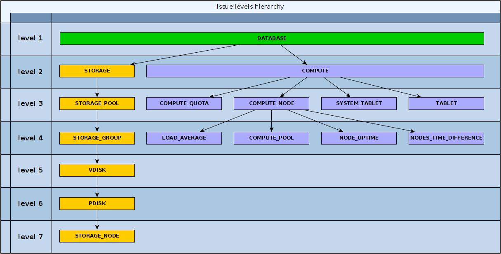

# Health Check API

{{ ydb-short-name }} имеет встроенную систему самодиагностики, с помощью которой можно получить краткий отчет о состоянии базы данных и информацию об имеющихся проблемах.

Для инициации проверки необходимо сделать вызов метода `SelfCheck` из сервиса `Ydb.Monitoring`. Также необходимо передать имя проверяемой БД стандартным способом.

В результате вызова этого метода будет возвращена следующая структура:

```protobuf
message SelfCheckResult {
    SelfCheck.Result self_check_result = 1;
    repeated IssueLog issue_log = 2;
}
```

Самый короткий ответ сервиса будет выглядеть следующим образом. Он возвращается, если с базой данных все в порядке:

```protobuf
SelfCheckResult {
    self_check_result: GOOD
}
```
Если обнаружены проблемы, поле `issue_log` будет содержать описания проблем со следующей структурой:

```protobuf
message IssueLog {
    string id = 1;
    StatusFlag.Status status = 2;
    string message = 3;
    Location location = 4;
    repeated string reason = 5;
    string type = 6;
    uint32 level = 7;
}
```

Эти проблемы можно организовать в иерархию с помощью полей `id` и `reason`, что помогает визуализировать, как проблемы в отдельном модуле влияют на состояние системы в целом. Все проблемы организованы в иерархию, где верхние уровни могут зависеть от вложенных:


Каждая проблема имеет уровень вложенности `level` — чем выше `level`, тем глубже проблема находится в иерархии. Проблемы с одинаковым типов (поле `type`) всегда имеют одинаковый `level`, и их можно представить ввиде иерархии.



| Поле | Описание |
|:----|:----|
| `self_check_result` | содержит результат проверки БД:<ul><li>`GOOD`: Проблем не обнаружено.</li><li>`DEGRADED`: Обнаружена деградация одной из систем базы данных, но база данных все еще функционирует (например, допустимая потеря диска).</li><li>`MAINTENANCE_REQUIRED`: Обнаружена значительная деградация, есть риск потери доступности, требуется обслуживание.</li><li>`EMERGENCY`: Обнаружена серьезная проблема в базе данных с полной или частичной потерей доступности.</li></ul> |
| `issue_log` | Это набор элементов, каждый из которых описывает проблему в системе на определенном уровне. |
| `issue_log.id` | Уникальный идентификатор проблемы в этом ответе. |
| `issue_log.status` | Статус (серьезность) текущей проблемы.<br/>Может принимать одно из следующих значений:<ul><li>`RED`: Компонент неисправен или недоступен.</li><li>`ORANGE`: Серьезная проблема, мы в шаге от потери доступности. Может потребоваться обслуживание.</li><li>`YELLOW`: Небольшая проблема, нет рисков для доступности. Рекомендуется продолжать мониторинг проблемы.</li><li>`BLUE`: Временная небольшая деградация, не влияющая на доступность базы данных. Ожидается переход системы в `GREEN`.</li><li>`GREEN`: Проблем не обнаружено.</li><li>`GREY`: Не удалось определить статус (проблема с механизмом самодиагностики).</li></ul> |
| `issue_log.message` | Текст, описывающий проблему. |
| `issue_log.location` | Местоположение проблемы. |
| `issue_log.reason` | Это набор элементов, каждый из которых описывает причину проблемы в системе на определенном уровне. |
| `issue_log.type` | Категория проблемы. |
| `issue_log.level` | Глубина вложенности проблемы. |
| `database_status` | Если в настройках содержится параметр `verbose`, то поле `database_status` будет заполнено.<br/>Оно предоставляет сводку общего состояния базы данных.<br/>Используется для быстрой оценки состояния базы данных и выявления серьезных проблем на высоком уровне. |
| `location` | Содержит информацию о хосте, на котором был вызван сервис `HealthCheck`. |


## Call parameters {#call-parameters}
Полный список дополнительных параметров представлен ниже:
```c++
struct TSelfCheckSettings : public TOperationRequestSettings<TSelfCheckSettings>{
    FLUENT_SETTING_OPTIONAL(bool, ReturnVerboseStatus);
    FLUENT_SETTING_OPTIONAL(EStatusFlag, MinimumStatus);
    FLUENT_SETTING_OPTIONAL(ui32, MaximumLevel);
};
```

| Параметр | Описание |
|:----|:----|
| `ReturnVerboseStatus` | Как было сказано ранее, этот параметр влияет на заполнение поля `database_status`. |
| `MinimumStatus` | Минимальный статус, который будет указан в ответе. Проблемы с лучшим статусом будут отброшены. |
| `MaximumLevel` | Максимальная глубина проблем в ответе. Более глубокие уровни будут отброшены. |

## Возможные проблемы {#problems}

| Сообщение | Описание |
|:----|:----|
| **DATABASE** ||
| `Database has multiple issues`</br>`Database has compute issues`</br>`Database has storage issues` | Зависит от нижележащих слоев `COMPUTE` и `STORAGE`. Это самый общий статус базы данных. |
| **STORAGE** ||
| `There are no storage pools` | Недоступна информация по пулам на уровне `STORAGE_POOLS`. |
| `Storage degraded`</br>`Storage has no redundancy`</br>`Storage failed` | Зависит от нижележащего слоя `STORAGE_POOLS`. |
| `System tablet BSC didn't provide information` | Информация о сторадже не доступна. |
| `Storage usage over 75%/85%/90%` | Необходимо увеличить дисковое пространство. |
| **STORAGE_POOL** ||
| `Pool degraded/has no redundancy/failed` | Зависит от нижележащего слоя `STORAGE_GROUP`. |
| **STORAGE_GROUP** ||
| `Group has no vslots` ||
| `Group degraded` | В группе недоступно допустимое число дисков. |
| `Group has no redundancy` | Группа хранения потеряла избыточность. |
| `Group failed` | Группа хранения потеряла целостность. |
|| `HealthCheck` проверяет различные параметры (режим отказоустойчивости, количество отказавших дисков, статус дисков и т. д.) и в зависимости от этого устанавливает соответствующий статус у группы. |
| **VDISK** ||
| `System tablet BSC didn't provide known status` | Эта ошибка не ожидается. Внутренняя ошибка. |
| `VDisk is not available` | Отсутствует виртуальный диск. |
| `VDisk is being initialized` | Инициализация виртуального диска в процессе. |
| `Replication in progress` | Диск в процессе репликации, но может принимать запросы. |
| `VDisk have space issue` | Зависит от нижележащего слоя `PDISK`. |
| **PDISK** ||
| `Unknown PDisk state` | `HealthCheck` не может разобрать состояние PDisk. Внутренняя ошибка. |
| `PDisk is inactive/PDisk state is FAULTY/BROKEN/TO_BE_REMOVED` | Cообщает о проблемах с физическим диском. |
| `Available size is less than 12%/9%/6%` | Заканчивается свободное место на физическом диске. |
| `PDisk is not available` | Отсутствует физический диск. |
| **STORAGE_NODE** ||
| `Storage node is not available` | Отсутствует нода с дисками. |
| **COMPUTE** ||
| `There are no compute nodes` | В базе нет нод для запуска таблеток. </br>Невозможно определить уровень `COMPUTE_NODE` ниже. |
| `Compute has issues with system tablets` | Зависит от нижележащего слоя `SYSTEM_TABLET`. |
| `Some nodes are restarting too often` | Зависит от нижележащего слоя `NODE_UPTIME`. |
| `Compute is overloaded` | Зависит от нижележащего слоя `COMPUTE_POOL`. |
| `Compute quota usage` | Зависит от нижележащего слоя `COMPUTE_QUOTA`. |
| `Compute has issues with tablets` | Зависит от нижележащего слоя `TABLET`. |
| **COMPUTE_QUOTA** ||
| `Paths quota usage is over than 90%/99%/Paths quota exhausted` </br>`Shards quota usage is over than 90%/99%/Shards quota exhausted` | Квоты исчерпаны. |
| **COMPUTE_NODE** | *Нет сообщений на этом уровне.* |
| **SYSTEM_TABLET** ||
| `System tablet is unresponsive / response time over 1000ms/5000ms` | Системная таблетка не отвечает или отвечает долго |
| **TABLET** ||
| `Tablets are restarting too often` | Таблетки слишком часто перезапускаются. |
| `Tablets/Followers are dead` | Таблетки не запущены (или не могут быть запущены). |
| **LOAD_AVERAGE** ||
| `LoadAverage above 100%` | Физический хост перегружен. </br>Сервис `Healthcheck`  мониторит системную нагрузку, оценивая ее в терминах выполняющихся, ожидающих процессов (load) и сравнивая её с общим числом логических ядер на хосте (cores). Например, если у системы 8 логических ядер и текущая нагрузка составляет 16, нагрузка считается равной 200%. </br>`Healthcheck` проверяет только превышение нагрузки над количеством ядер (load > cores) и сообщает на основе этого предупреждение. Это указывает на то, что система работает на пределе, скорее всего из-за большого количества процессов, ожидающих операций ввода-вывода. </br></br>Информация о нагрузке: </br>Источник: </br>`/proc/loadavg` </br>Информация о логических ядрах </br></br>Количество логических ядер: </br>Основной источник: </br>`/sys/fs/cgroup/cpu.max` </br></br>Дополнительный источник: </br>`/sys/fs/cgroup/cpu/cpu.cfs_quota_us` </br>`/sys/fs/cgroup/cpu/cpu.cfs_period_us` </br>Количество ядер вычисляется путем деления квоты на период (quota / period) |
| **COMPUTE_POOL** ||
| `Pool usage is over than 90/95/99%` | один из CPU пулов перегружен. |
| **NODE_UPTIME** ||
| `Node is restarting too often` | Узлы слишком часто перезапускаются. |
| `The number of node restarts has increased` | Количество рестартов ноды превысило порог. |
| **NODES_SYNC** ||
| `The nodes have a time difference of ... ms` | Расхождение времени на узлах, что может приводить к возможным проблемам с координацией распределённых транзакций. |
