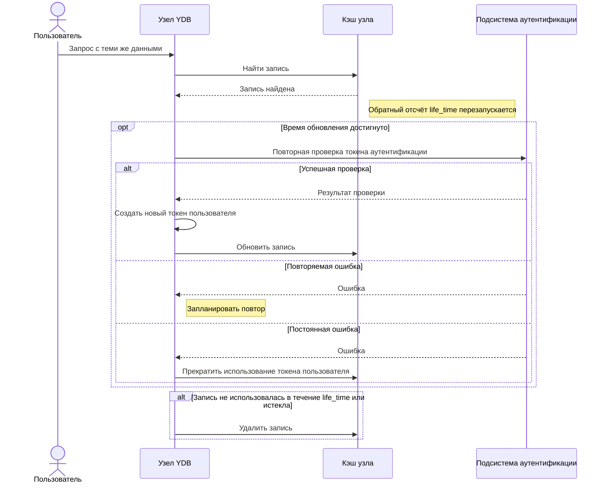

```mermaid
sequenceDiagram
    actor user as Пользователь
    participant node as Узел YDB
    participant cache as Кэш узла
    participant auth as Подсистема аутентификации

    user->>node: Запрос с теми же данными
    node->>cache: Найти запись
    cache-->>node: Запись найдена
    Note right of cache: Обратный отсчёт life_time перезапускается

    opt Время обновления достигнуто
        node->>auth: Повторная проверка токена аутентификации
        alt Успешная проверка
            auth-->>node: Результат проверки
            node->>node: Создать новый токен пользователя
            node->>cache: Обновить запись
        else Повторяемая ошибка
            auth-->>node: Ошибка
            Note right of node: Запланировать повтор
        else Постоянная ошибка
            auth-->>node: Ошибка
            node->>cache: Прекратить использование токена пользователя
        end
    end

    alt Запись не использовалась в течение life_time или истекла
        node->>cache: Удалить запись
    end
```
