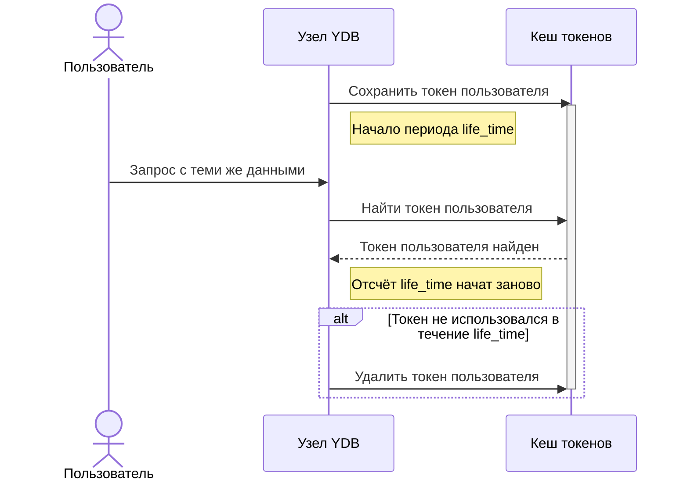

```mermaid
sequenceDiagram
    actor user as Пользователь
    participant node as Узел YDB
    participant cache as Кеш токенов

    node->>cache: Сохранить токен пользователя
    activate cache
    Note right of node: Начало периода life_time

    user->>node: Запрос с теми же данными
    node->>cache: Найти токен пользователя
    cache-->>node: Токен пользователя найден
    Note right of node: Отсчёт life_time начат заново

    alt Токен не использовался в течение life_time
    node->>cache: Удалить токен пользователя
    deactivate cache
    end
```
