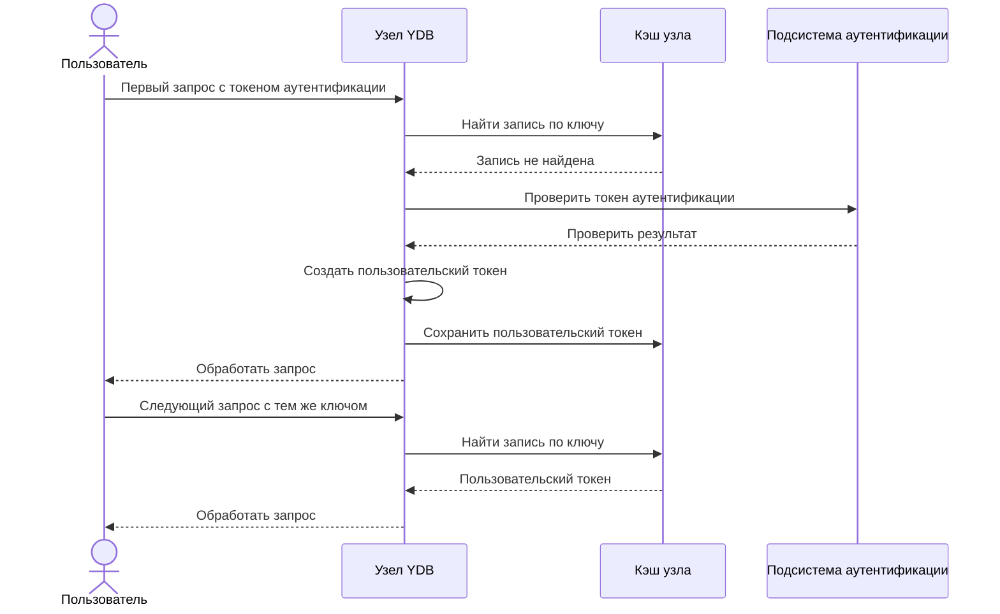

```mermaid
sequenceDiagram
    actor user as Пользователь
    participant node as Узел YDB
    participant cache as Кэш узла
    participant auth as Подсистема аутентификации

    user->>node: Первый запрос с токеном аутентификации
    node->>cache: Найти запись по ключу
    cache-->>node: Запись не найдена
    node->>auth: Проверить токен аутентификации
    auth-->>node: Проверить результат
    node->>node: Создать пользовательский токен
    node->>cache: Сохранить пользовательский токен
    node-->>user: Обработать запрос

    user->>node: Следующий запрос с тем же ключом
    node->>cache: Найти запись по ключу
    cache-->>node: Пользовательский токен
    node-->>user: Обработать запрос
```
