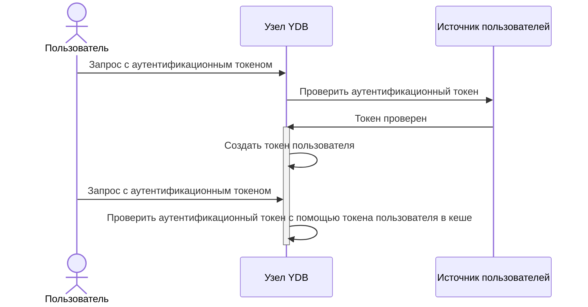
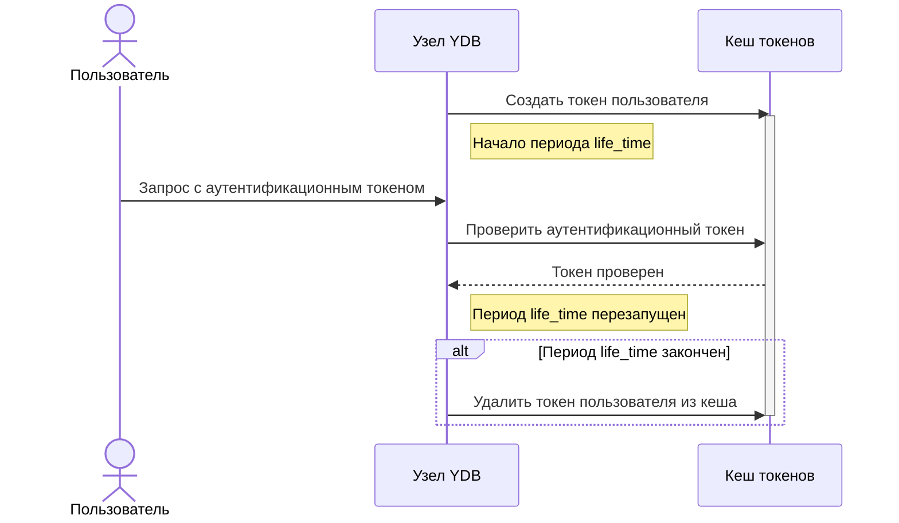

# Настройки кеширования результатов аутентификации

В процессе аутентификации пользовательская сессия получает [аутентификационный токен](../concepts/glossary.md#auth-token), который передаётся вместе с каждым запросом к кластеру {{ ydb-short-name }}. Поскольку {{ ydb-short-name }} — распределённая система, пользовательские запросы в конечном итоге обрабатываются на одном или нескольких [узлах {{ ydb-short-name }}](../concepts/glossary.md#node). Узел, получивший запрос от пользователя, выполняет верификацию аутентификационного токена и в случае успешной проверки генерирует **токен пользователя**.

Токен пользователя действует **только внутри текущего узла {{ ydb-short-name }}** и используется для аутентификации операций, запрошенных пользователем. Благодаря этому последующие запросы пользователя (с тем же аутентификационным токеном на том же узле) не требуют повторной проверки аутентификационного токена, поскольку они обрабатываются с помощью токена пользователя из кеша узла {{ ydb-short-name }}.

Время жизни токена пользователя и другие ключевые аспекты его работы настраиваются в [секции `auth_config` конфигурации {{ ydb-short-name }}](../reference/configuration/auth_config.md#caching-auth-results).

## Время жизни токена пользователя

Время жизни токена пользователя в кеше узла {{ ydb-short-name }} ограничивается двумя параметрами:

- Временем, прошедшим с момента создания токена пользователя.

    Период хранения токена пользователя в кеше узла {{ ydb-short-name }}, после которого токен удаляется из кеша. Задаётся параметром `auth_config.expire_time`. Значение по умолчанию — `24h`.

    

    Если сторонняя система получила токен пользователя на узле {{ ydb-short-name }}, посылает запросы на тот же узел чаще, чем истекает интервал `life_time` и по какой-то причине не обновляет токен пользователя (выставлено слишком большое значение `refresh_time` или недоступна система аутентификации), {{ ydb-short-name }} удалит токен пользователя только по истечении срока `expire_time`. До этого времени сторонняя система будет пользоваться правами, которые имелись на момент создания или последнего обновления токена пользователя, и не определит изменения в аккаунте пользователя.

    В данном случае под изменениями понимаются удаление аккаунта локального или внешнего пользователя либо изменения в принадлежности аккаунта к [группам пользователей](./authorization.md#group).

    [Права доступа](../concepts/glossary.md#access-right) в {{ ydb-short-name }} привязываются к [объекту доступа](../concepts/glossary.md#access-object) и выдаются в списках прав — [ACL](../concepts/glossary.md#access-control-list) (Access Control List) — как пользователям, так и группам.

    Например, [ACL](../concepts/glossary.md#access-control-list) таблицы `Tbl1` содержит информацию о предоставлении права на запись группе пользователей `Grp1`. Если одного пользователя удалить из этой группы, он лишится соответствующих прав, а если другого добавить — его права расширятся. При этих условиях обновление прав произойдёт только по истечении срока, указанного в `expire_time`.

    

    Чем короче указанный период, тем чаще узел {{ ydb-short-name }} заново проверяет аутентификационные токены пользователей и обновляет информацию об их принадлежности к группам. Однако чрезмерно частая проверка замедляет работу {{ ydb-short-name }}, особенно при аутентификации внешних пользователей. Установка этого параметра в секундах нивелирует работу кеша токенов пользователей.

- Временем, прошедшим с момента последнего запроса пользователя с тем же аутентификационным токеном, что использовался при создании токена пользователя.

    Период хранения токена пользователя в кеше узла {{ ydb-short-name }} с момента его последнего использования задаётся параметром `auth_config.life_time`. Значение по умолчанию — `1h`.

    Значение этого параметра должно быть меньше значения `expire_time`.

## Обновление токенов пользователя

Узлы {{ ydb-short-name }} регулярно обновляют токены пользователей в своём кеше. Периодичность обновления задаётся параметром `auth_config.refresh_time`, значение по умолчанию — `1h`.

При обновлении токена пользователя выполняется повторная проверка аутентификационного токена во внешней системе аутентификации и обновляется информация о списке групп, в которые пользователь входит согласно данным этой системы.

Конкретное время обновления попадает в интервал от `refresh_time/2` до `refresh_time`.

Если при обновлении токена пользователя возникает ошибка (временный сбой), узел {{ ydb-short-name }} повторяет попытку с задержкой, задаваемой параметрами `min_error_refresh_time` и `max_error_refresh_time`. Первая задержка равна `min_error_refresh_time`, каждая последующая удваивается до достижения `max_error_refresh_time`. Попытки обновления продолжаются до успешного результата или удаления токена из кеша по истечении `expire_time` или `life_time`.



Количество ошибок при обновлении токена пользователя можно увидеть в [метриках](../reference/observability/metrics/index.md) `auth.TicketParser.TicketsErrors`, `auth.TicketParser.TicketsErrorsPermanent` и `auth.TicketParser.TicketsErrorsRetryable` или в поле `Error` на странице **Developer UI** > **Actors** > **Ticket Parser** (`https://<ydb-server-address>:<embedded-ui-port>/actors/ticket_parser`).

Ошибки могут возникать из-за следующих проблем:

- узел {{ ydb-short-name }} не может связаться с внешней системой аутентификации из-за сетевых проблем;
- не работает внешняя система аутентификации;
- сильно перегружен узел {{ ydb-short-name }} (наименее вероятная причина).


