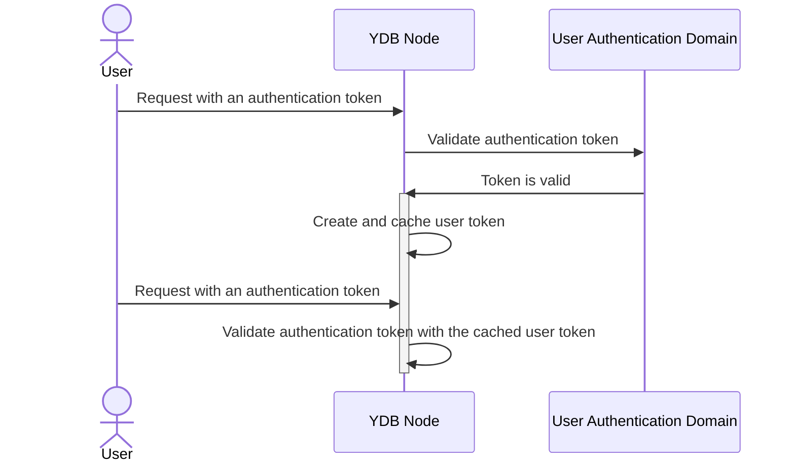
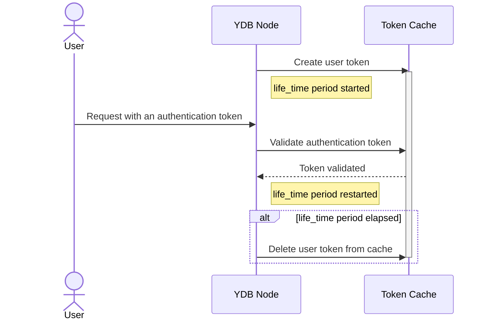

# Настройки кеширования результатов аутентификации

В процессе аутентификации пользовательская сессия получает [аутентификационной токен](../concepts/glossary.md#auth-token), который передается вместе с каждым запросом к кластеру {{ ydb-short-name }}. Так как {{ ydb-short-name }} — это распределённая система, то пользовательские запросы будут в конечном итоге обрабатываться на одном или нескольких [узлах {{ ydb-short-name }}](../concepts/glossary.md#node). Каждый узел {{ ydb-short-name }}, получив запрос от пользователя, проводит верификацию аутентификационного токена, и в случае успешной проверки, генерирует **токен пользователя**.

Токен пользователя действует **только внутри текущего узла {{ ydb-short-name }}** и используется для авторизации запрошенных пользователем действий. Таким образом, следующие запросы от пользователя (с тем же самым аутентификационным токеном на этот же узел {{ ydb-short-name }}) уже не требуют проверки аутентификационного токена, так как проверяются с помощью токена пользователя в кеше узла {{ ydb-short-name }}.

Время жизни и другие важные аспекты работы токена пользователя настраиваются в секции `auth_config` [конфигурации YDB](../reference/configuration/auth_config.md#caching-auth-results).

## Время жизни токена пользователя

Время жизни токена пользователя в кеше узла {{ ydb-short-name }} ограничено двумя параметрами:

- Временем, прошедшим с момента создания токена пользователя.

    Период хранения токена пользователя в кэше узла {{ ydb-short-name }}, после которого токен удаляется из кэша узла {{ ydb-short-name }}. Задаётся в параметре `auth_config.expire_time`. Значение по умолчанию этого параметра равно `24h`.

    

    Если сторонняя система успешно аутентифицировалась на узле {{ ydb-short-name }} и с регулярностью чаще интервала `life_time` посылает запросы на тот же узел, {{ ydb-short-name }} гарантированно определит изменения в аккаунте пользователя только по истечении срока `expire_time`.

    В данном случае под  изменениями понимаются удаление аккаунта пользователя или изменения в принадлежности аккаунта к [группам пользователей](./authorization.md#group).

    [Права доступа](../concepts/glossary.md#access-right) в {{ ydb-short-name }} привязываются к [объекту доступа](../concepts/glossary.md#access-object) и выдаются как пользователям, так и группам в списках прав — [ACL](../concepts/glossary.md#access-control-list) (Access Control List).

    Пример. Пусть [ACL](../concepts/glossary.md#access-control-list) объекта доступа содержит информацию о предоставлении конкретного права для определённой группы пользователей. Допустим одного пользователя удалили из данной группы, лишив таким образом его некоторых прав доступа, а другого пользователя, наоборот, добавили в эту группу расширив тем самым ему права доступа. Так вот обновление указанных прав произойдёт только по истечении срока `expire_time`. 

    

    Чем короче указанный период, тем чаще узел {{ ydb-short-name }} заново аутентифицирует пользователей и обновляет информацию об их принадлежности к группам. Однако, чрезмерно частое повторение аутентификации пользователей замедляет работу {{ ydb-short-name }}, особенно если речь идёт о внешних пользователях. Установка значения этого параметра в секундах нивелирует работу кэша для токенов пользователей.

- Временем, прошедшим с последнего запроса пользователя с тем же самым аутентификационным токеном, который использовался при создании токена пользователя.

    Период хранения токена пользователя в кэше узла {{ ydb-short-name }} с момента его последнего использования задаётся в параметре `auth_config.life_time`, значение по умолчанию которого равно `1h`.

    Значение этого параметра должно быть ниже значения `expire_time`.

## Обновление токенов пользователя

Узлы {{ ydb-short-name }} регулярно обновляют токены пользователей в своём кеше. Периодичность обновления задаётся в параметре `auth_config.refresh_time`. Значение по умолчанию этого параметра равно `1h`.

Конкретное время обновления будет лежать в интервале от `refresh_time/2` до `refresh_time`.

Если при обновлении токена пользователя происходит ошибка (временный сбой), узел {{ ydb-short-name }} повторяет попытку с задержкой, заданной в параметрах `min_error_refresh_time` и `max_error_refresh_time`. Каждая последующая задержка увеличивается, пока не достигнет значения `max_error_refresh_time`. Попытки обновить токен пользователя продолжаются до успешного обновления или до тех пор, пока токен не будет удалён из кеша по истечению периода `expire_time` или `life_time`.