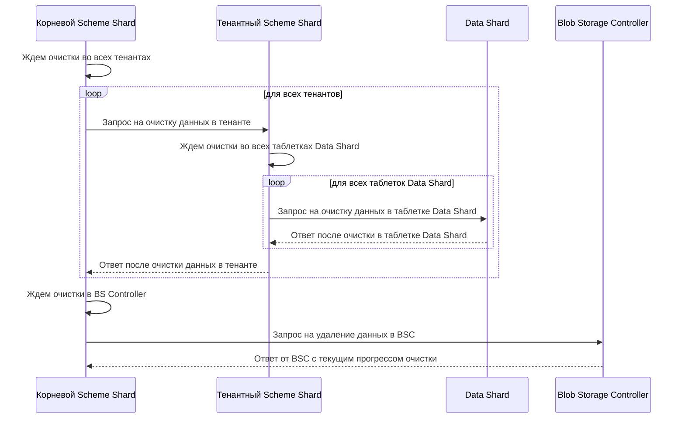

# Очистка данных с диска

В базе данных часто приходится удалять данные из таблиц. Для более эффективной работы такой операции данные на диске физически не удаляются, а просто помечаются как удалённые. При попытке обращения к таким данным {{ ydb-short-name }} эмулирует ситуацию, когда эти данные отсутствуют в реальности.
Чтобы удалённые данные были физически очищены с диска, {{ ydb-short-name }} предоставляет возможность запустить специализированную процедуру, которая удалит все следы таких данных с диска.

## Процесс очистки данных

За запуск и управление очисткой данных отвечает таблетка корневого [Scheme Shard](../concepts/glossary.md#scheme-shard). Эта таблетка, в зависимости от настроек [конфигурации](#конфигурация-configuration), планирует запуск очистки. После того, как наступил момент начать очистку, корневой Scheme Shard отправляет запросы всем тенантным Scheme Shard, которые обслуживают конкретные базы данных, для выполнения очистки данных в каждой базе. В свою очередь тенантный Scheme Shard инициирует очистку в таблетках [Data Shard](../concepts/glossary.md#data-shard). Так как таблетки Data Shard управляют сегментами строковых таблиц, они обладают информацией обо всех удаленных данных и этим таблеткам необходимо очистить все внутренние структуры от удаленной информации.
После очистки внутренних структур всех таблеток Data Shard определенного тенанта Scheme Shard посылает ответное сообщение в корневой Scheme Shard об окончании очистки. Корневой Scheme Shard дожидается сообщений об окончании очистки от всех тенантов, в которых была запущена очистка. После завершения очистки данных во всех тенантах корневой Scheme Shard совершает запрос в BS controller, который физически удаляет данные с дисков.

### Шаги алгоритма

1. Корневой Scheme Shard запускает очистку по расписанию настроенному в [конфигурации](#конфигурация-configuration).
2. Корневой Scheme Shard собирает информацию о всех имеющихся тенантах и отсылает в их Scheme Shard событие начать очистку данных в тенанте.
3. Тенантный Scheme Shard добавляет в очередь все таблетки с типом Data Shard. (На данный момент Scheme Shard посылает событие начать очистку только таблеткам Data Shard). Далее запускается очистка данных путем посылки сообщений в Data Shard.
4. Data Shard выполняет очистку внутренних структур от данных, которые помечены как удаленные. Надо упомянуть, что после удаления данные ещё продолжают храниться некоторый время для MVCC, и очистка их не очистит, если будет запущена в этот период. Продолжительность периоду задается в параметре конфигурации `data_shard_config.keep_snapshot_timeout`.
5. Тенантный Scheme Shard дожидается выполнения очистки для каждой таблетки в очереди и отсылает событие завершения очистки данных в корневой Scheme Shard.
6. Корневой Scheme Shard дожидается сообщений о завершении очистки данных от каждого тенанта и после этого отсылает событие начать очистку в BS controller.
7. Корневой Scheme Shard дожидается завершения очистки в BS controller и после этого планирует время новой очистки.

### Диаграмма алгоритма очистки



## Конфигурация {#configuration}

```yaml
data_erasure_config:
  max_rate: 0
  inflight_limit: 10
  timeout_seconds: 15
  data_erasure_interval_seconds: 604800
  blob_storage_controller_request_interval_seconds: 600
  tenant_data_erasure_config:
    max_rate: 0
    inflight_limit: 10
    timeout_seconds: 15
```

|Параметр|Описание|
|:---|:---|
|`max_rate`|Максимальная частота, с которой посылаются запросы на очистку данных в тенанты|
|`inflight_limit`|Максимальное число тенантов, для которых в данный момент может быть запущена очистка данных|
|`timeout_seconds`|Время в секундах, за которое отдельный тенант должен выполнить очистку данных|
|`data_erasure_interval_seconds`|Максимальный интервал времени, через который запускаются очистки.|
|`blob_storage_controller_request_interval_seconds`|Интервал времени, через который выполняются запросы в BS controller для получения прогресса очистки|
|`tenant_data_erasure_config.max_rate`|Максимальная частота, с которой посылаются запросы на очистку данных в таблетки Data Shard|
|`tenant_data_erasure_config.inflight_limit`|Максимальное число таблеток Data Shard, для которых в данный момент может быть запущена очистка данных|
|`tenant_data_erasure_config.timeout_seconds`|Время в секундах, за которое таблетка Data Shard должна выполнить очистку данных|
