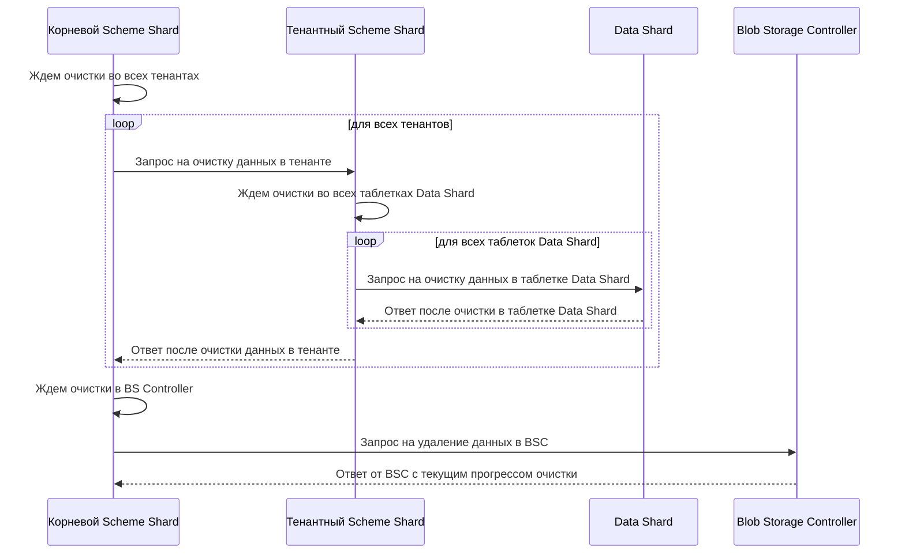

# Очистка данных с диска

В базе данных часто приходится удалять данные из таблиц. Для более эффективной работы такой операции данные на диске физически не удаляются, а просто помечаются как удалённые. При попытке обращения к таким данным {{ ydb-short-name }} эмулирует ситуацию, когда эти данные отсутствуют в реальности.
Чтобы удалённые данные были физически очищены с диска, {{ ydb-short-name }} предоставляет возможность запустить специализированную процедуру, которая удалит все следы таких данных с диска.

## Процесс очистки данных

За запуск и управление очисткой данных отвечает таблетка корневого [Scheme Shard](../concepts/glossary.md#scheme-shard). Эта таблетка, в зависимости от настроек [конфигурации](#configuration), планирует запуск очистки. Когда наступает момент начать очистку, корневой Scheme Shard отправляет запросы всем тенантным Scheme Shard, которые обслуживают конкретные базы данных, для выполнения очистки данных в каждой базе. В свою очередь, тенантный Scheme Shard инициирует очистку в таблетках [Data Shard](../concepts/glossary.md#data-shard). Поскольку таблетки Data Shard управляют сегментами строковых таблиц, они обладают информацией обо всех удалённых данных, и им необходимо очистить все внутренние структуры от удалённой информации.
После завершения очистки внутренних структур всех таблеток Data Shard определённого тенанта Scheme Shard отправляет ответное сообщение в корневой Scheme Shard об окончании очистки. Корневой Scheme Shard дожидается сообщений об окончании очистки от всех тенантов, в которых она была запущена.После завершения очистки данных во всех тенантах корневой Scheme Shard отправляет запрос в BS controller, который физически удаляет данные с дисков.

### Шаги алгоритма

1. Корневой Scheme Shard запускает очистку по расписанию, настроенному в [конфигурации](#конфигурация-configuration).
2. Корневой Scheme Shard собирает информацию обо всех имеющихся тенантах и отправляет в их Scheme Shard событие о начале очистки данных в тенанте.
3. Тенантный Scheme Shard добавляет в очередь все таблетки с типом Data Shard (на данный момент Scheme Shard посылает событие о начале очистки только таблеткам Data Shard). Затем запускается процесс очистки данных путём отправки сообщений в Data Shard.
4. Data Shard выполняет очистку внутренних структур от данных, помеченных как удалённые. Стоит отметить, что после удаления данные продолжают храниться некоторое время для MVCC, и очистка их не затронет, если будет запущена в этот период. Продолжительность этого периода задаётся в параметре конфигурации `data_shard_config.keep_snapshot_timeout`.
5. Тенантный Scheme Shard дожидается завершения очистки для каждой таблетки в очереди и отправляет событие о завершении очистки данных в корневой Scheme Shard.
6. Корневой Scheme Shard дожидается сообщений о завершении очистки данных от каждого тенанта, после чего отправляет событие о начале очистки в BS controller.
7. Корневой Scheme Shard дожидается завершения очистки в BS controller и затем планирует время следующей очистки.

### Диаграмма алгоритма очистки



## Конфигурация {#configuration}

```yaml
data_erasure_config:
  max_rate: 0
  inflight_limit: 10
  timeout_seconds: 15
  data_erasure_interval_seconds: 604800
  blob_storage_controller_request_interval_seconds: 600
  tenant_data_erasure_config:
    max_rate: 0
    inflight_limit: 10
    timeout_seconds: 15
```

| Параметр | Описание |
|:---|:---|
| `max_rate` | Максимальная частота отправки запросов на очистку данных в тенанты. |
| `inflight_limit` | Максимальное число тенантов, для которых в данный момент может быть запущена очистка данных. |
| `timeout_seconds` | Время в секундах, за которое отдельный тенант должен выполнить очистку данных. |
| `data_erasure_interval_seconds` | Максимальный интервал времени между запусками очистки. |
| `blob_storage_controller_request_interval_seconds` | Интервал времени, через который выполняются запросы в BS controller для получения прогресса очистки. |
| `tenant_data_erasure_config.max_rate` | Максимальная частота отправки запросов на очистку данных в таблетки Data Shard. |
| `tenant_data_erasure_config.inflight_limit` | Максимальное число таблеток Data Shard, для которых в данный момент может быть запущена очистка данных. |
| `tenant_data_erasure_config.timeout_seconds` | Время в секундах, за которое таблетка Data Shard должна выполнить очистку данных. |
