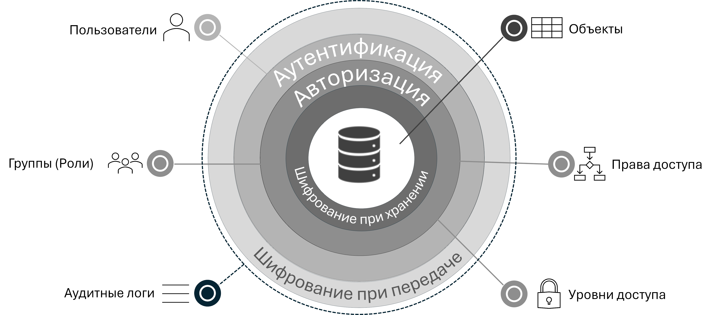

# {{ ydb-short-name }} для инженеров по безопасности

В этом разделе документации {{ ydb-short-name }} рассматриваются аспекты работы с {{ ydb-short-name }}, связанные с безопасностью. Также он будет полезен для целей обеспечения compliance.

## Основные элементы и концепции безопасности {{ ydb-short-name }}

Система безопасности {{ ydb-short-name }} оперирует следующими понятиями:

- **Субъекты доступа**:

    - **Пользователи**. {{ ydb-short-name }} позволяет работать как с локальными [пользователями](./authorization.md#user), так и с пользователями из внешних источников (LDAP-каталоги, IAM-системы и пр).

    - **Группы**. {{ ydb-short-name }} позволяет объединять пользователей в именованные множества. Состав пользователей в группе можно изменять в дальнейшем. Группа может быть и пустой — не содержать ни одного пользователя.

- **Объекты доступа**. В {{ ydb-short-name }} объектами доступа являются объекты схемы (таблицы, системные представления и т.п.), для которых настраиваются права доступа.

- **Права доступа**. С помощью **прав доступа** в {{ ydb-short-name }} определяется перечень допустимых операций с объектами доступа для конкретного пользователей или группы.

    Права доступа — это возможность выполнять определенные действия (создание, удаление, чтение, обновление и т.п.) над объектом доступа.

    Права доступа могут быть выданы конкретному пользователю, или группе. Пользователь, которого включили в группу, наделяется правами, выданными ранее этой группе, на время нахождения в этой группе.

    Подробнее о правах доступа см. в разделе [{#T}](./authorization.md#right).

- **Уровни доступа**. С помощью **уровней доступа** в {{ ydb-short-name }} определяется доступ к дополнительным возможностям по управлению кластером для конкретного пользователя или группы. {{ ydb-short-name }} использует три уровня доступа:

    - **наблюдатель** даёт возможность просмотра состояния системы, закрытого от публичного доступа;
    - **оператор** даёт дополнительные возможности просмотра и выполнения действий, изменяющих состояние системы;
    - **администратор** даёт право на выполнение административных действий с базами или кластером.

    Как и права доступа, один или несколько уровней доступа могут быть выданы конкретному пользователю или группе. Субъект доступа, не имеющий ни одного уровня доступа, может просматривать публично доступную информацию в системе. Уровни доступа последовательно наращивают возможности субъекта доступа. Чтобы получить максимальные возможности, субъект доступа должен иметь все три уровня доступа.

    Подробнее об уровнях доступа см. в разделе [{#T}](../reference/configuration/security_config.md#security-access-levels).

- **[Аутентификация](./authentication.md) и [авторизация](./authorization.md)**. Система управления доступом в {{ ydb-short-name }} предоставляет механизм защиты данных в кластере {{ ydb-short-name }}. Только аутентифицированные [субъекты доступа](../concepts/glossary.md#access-subject) (пользователи и группы) могут работать с данными, а доступ к данным может ограничиваться.

    - **Аутентификация**. При доступе к кластеру {{ ydb-short-name }} [пользователи](../concepts/glossary.md#access-user) проходят [аутентификацию](./authentication.md) — процесс проверки, подтверждающий подлинность пользователя. {{ ydb-short-name }} поддерживает различные механизмы аутентификации, их детальное описание можно найти в соответствующем разделе [аутентификации](./authentication.md).

        Важно отметить,что независимо от используемого механизма, в результате успешной аутентификации пользователи получают идентификатор (SID) и аутентификационный токен.

        - Идентификатор в виде [SID](./authorization.md#sid) используется для идентификации пользователя в {{ ydb-short-name }}. Например, в качестве SID для локальных пользователей выступает login пользователя. Для внешних пользователей SID также содержит информацию об источнике пользователя. SID пользователя также можно встретить в [системных представлениях](../dev/system-views.md#auth), описывающих текущие настройки безопасности.

        - Аутентификационный токен используется узлами {{ ydb-short-name }} для авторизации доступа пользователя перед обработкой его запросов.

            Полученный аутентификационный токен пользователь может многократно использовать в дальнейшем в своей работе при выполнении запросов к кластеру {{ ydb-short-name }}. Более подробную информацию про аутентификационный токен, например о параметрах кеширования и т.п., см. в разделе [{#T}](../reference/configuration/auth_config.md).

    - **Авторизация**. На основе аутентификационных данных проводится [авторизация](./authorization.md) — процесс проверки наличия определённых [прав доступа](../concepts/glossary.md#access-right) и [уровней доступа](../concepts/glossary.md#access-level) для выполнения пользователем запрошенной операции.

- **Аудитные логи**. Действия, направленные на изменение настроек безопасности, дополнительно логируются в отдельный журнал, называемый [аудитный лог](./audit-log.md). Данный журнал, в первую очередь, будет интересен для тех, кто отвечает за безопасность информации. В аудитный лог попадают такие действия как создание или удаление объектов доступа, создание или удаление пользователей, смена паролей, выдача или отзыв прав доступа и т.п.

- **Шифрование**. {{ ydb-short-name }} является распределённой системой, обычно работающей на кластерах, расположенных в нескольких датацентрах. Для защиты пользовательских данных {{ ydb-short-name }} предоставляет механизмы:

    - [шифрования данных при передаче](./encryption/data-in-transit.md) для обеспечения безопасности данных, передаваемых между клиентом и {{ ydb-short-name }}, между узлами самого кластера {{ ydb-short-name }};
    - [шифрования данных при хранении](./encryption/data-at-rest.md).

