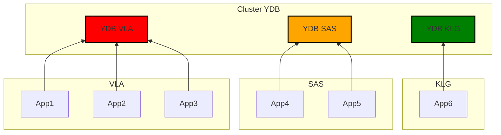

# `PreferLocalDC`

Семейство алгоритмов клиентской балансировки `Prefer...DC` (`PreferLocalDC`, `PreferNearestDC`, `PreferDC("VLA")` и т.п.) предназначено для локализации трафика запросов в один из датацентров {{ ydb-short-name }}. Клиенты тем самым уменьшают накладные расходы на сетевые походы между датацентрами. При этом возникает риск инцидентов. Рекомендовано в исключительных случаях по договоренности с командой {{ ydb-short-name }}.

## Проблема

Алгоритмы `Prefer...DC` локализуют трафик в один ДЦ, что может привести к неравномерному распределению нагрузки между всеми датацентрами и к проблемам с доступностью во время учений или обновлений. Особенно это проявляется, когда большинство клиентов расположены в одном датацентре, что вызывает перегрузку одного ДЦ и недогрузку остальных.
Кроме того, при высокой нагрузке на узлы локального ДЦ таблетки даташардов (процессы, обслуживающие запросы к отдельным партициям таблиц) из него могут "выехать", и тогда все запросы _на самом деле_ станут кросс-ДЦ, только этот поход будет не между клиентом и {{ ydb-short-name }}, а между обработчиком запросов в {{ ydb-short-name }} и даташардом.

В целом использовать предпочтение локального ДЦ не очень осмысленно, если вы не используете реплики (они же фолловеры) и одновременно специальные режимы запросов, которые позволяют реплики использовать. Только в этом случае вы сможете достичь значительного сокращения времени ответа.



### Симптомы
- Неравномерное распределение сессий по ДЦ
- Увеличение задержек ответа из перегруженного ДЦ
- Перегрузка по CPU узлов в отдельном ДЦ

### Последствия
- Деградация производительности приложения из-за перегрузки локального ДЦ
- Повышенный риск недоступности сервиса при проблемах в перегруженном ДЦ
- Нерациональное использование ресурсов кластера {{ ydb-short-name }}
- Проблемы с доступностью во время плановых обновлений

### Когда возникает
- В кластере {{ ydb-short-name }} менее двух узлов в каждом дата-центре
- Идёт подготовка к учениям или выход из них (при этом сессии могут прилипнуть к немногочисленным узлам и перегрузить их)
- Высокая нагрузка на систему от клиентов в одном ДЦ

## Решение

Использовать настройки балансировки по умолчанию - равномерное распределение запросов между всеми узлами {{ ydb-short-name }} (`RandomChoice()`). 

## Дополнительные ресурсы

### Внутренняя документация
- [Предпочитать ближайший дата-центр - Балансировка - {{ ydb-short-name }}](https://ydb.tech/docs/ru/recipes/ydb-sdk/balancing-prefer-local)
- [Обзор - Балансировка - {{ ydb-short-name }}](https://ydb.tech/docs/ru/recipes/ydb-sdk/balancing)
- [Равномерный случайный выбор - Балансировка - {{ ydb-short-name }}](https://ydb.tech/docs/ru/recipes/ydb-sdk/balancing-random-choice)

### Полезные статьи
- [Влияние клиентской балансировки на появление ошибок BAD_SESSION при rolling restart'e](https://stackoverflow.yandex-team.ru/questions/5858)
- [Влияние расположения подов по ДЦ на скорость работы с {{ ydb-short-name }}](https://stackoverflow.yandex-team.ru/questions/6539)




- Go

  
  ```go
db, err := ydb.Open(ctx,
  os.Getenv("YDB_CONNECTION_STRING"),
  ydb.WithBalancer(
    balancers.PreferLocalDC(),
  ),
)
  ```
  

  
  ```go
db, err := ydb.Open(ctx,
  os.Getenv("YDB_CONNECTION_STRING"),
  // ydb.WithBalancer(
  //  balancers.PreferLocalDC(),
  // ),
)
  ```
  

- Python

  
  ```python
# Плохой пример кода
with ydb.Driver(
    endpoint=endpoint,
    database=database,
    use_all_nodes=False,
    credentials=ydb.credentials.AccessTokenCredentials(os.environ['YDB_TOKEN']),
) as driver:
  ```
  

  
  ```python
# Хороший пример кода
with ydb.Driver(
    endpoint=endpoint,
    database=database,
    credentials=ydb.credentials.AccessTokenCredentials(os.environ['YDB_TOKEN']),
) as driver:
  ```
  

- C++

  
  ```cpp
auto driverConfig = NYdb::TDriverConfig(connectionString)
  .SetBalancingPolicy(NYdb::TBalancingPolicy::UsePreferableLocation());
  ```
  

  
  ```cpp
// Хороший пример кода
auto driverConfig = NYdb::TDriverConfig(connectionString);
NYdb::TDriver driver(driverConfig);
  ```
  


