# Пример диагностики перегруженных шардов и нехватки ресурса CPU

Как и в [предыдущей статье](./overloaded-shard-simple-case.md), здесь мы рассматриваем пример диагностики перегруженных шардов и решения этой проблемы. Но в этом случае ситуация осложняется недостатком ресурсов CPU.

Дополнительную информацию о проблемах, диагностируемых в этой статье, смотри в следующих материалах:

- [{#T}](../../performance/schemas/overloaded-shards.md);
- [{#T}](../../performance/hardware/cpu-bottleneck.md).

Статья начинается с [описания возникшей проблемы](#initial-issue). Затем мы проанализируем графики в Grafana и информацию на вкладке **Diagnostics** в [Embedded UI](../../../reference/embedded-ui/index.md), чтобы [найти решение](#solution), и проверим [его эффективность](#aftermath).

В конце статьи приводятся шаги по [воспроизведению проблемы](#testbed).

## Описание первоначальной проблемы {#initial-issue}

Вас уведомили о задержках при обработке пользовательских запросов в вашей системе.



Речь идёт о запросах к [строковой таблице](../../../concepts/datamodel/table.md#row-oriented-tables), управляемой [data shard](../../../concepts/glossary.md#data-shard)'ом.



Рассмотрим графики **Latency** на панели мониторинга Grafana [DB overview](../../../reference/observability/metrics/grafana-dashboards.md#dboverview) и определим, имеет ли отношение наша проблема к кластеру {{ ydb-short-name }}:

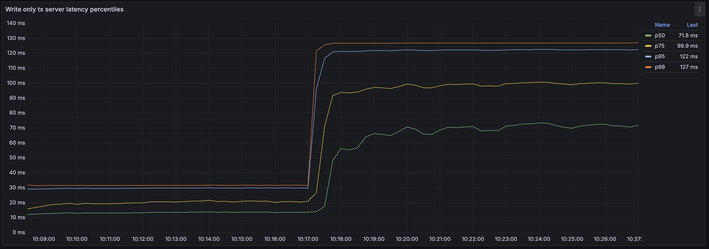



График отображает процентили задержек транзакций на запись данных. Примерно в ##10:17:00## эти значения выросли в три-четыре раза.



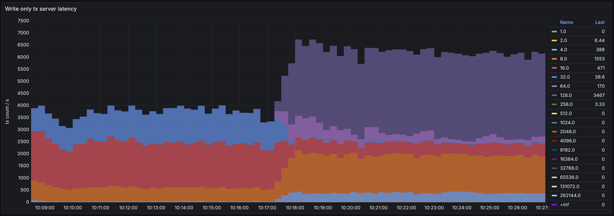



График отображает тепловую карту (heatmap) задержек транзакций на запись. Транзакции группируются на основании их задержек, каждая группа (bucket) окрашивается в свой цвет. Таким образом, этот график показывает как количество транзакций, обрабатываемых {{ ydb-short-name }} в секунду (по вертикальной оси), так и распределение задержек среди транзакций (цветовая дифференциация).

К ##10:18:00## доля транзакций с задержками от 2 до 4 секунд (`Группа 4.0`, голубой) выросла примерно в десять раз. Доля транзакций с задержками от 4 до 8 секунд (`Группа 8.0`, жёлтый) увеличилась в три раза. Доля транзакций с задержками от 8 до 16 секунд (`Группа 16.0`, красный) уменьшилась в три раза. Доля транзакций с задержками от 16 до 32 секунд (`Группа 32.0`, синий) практически исчезла. А также выделились новые группы транзакций с ещё более высокими задержками — `Группа 64.0` и `Группа 128.0`.



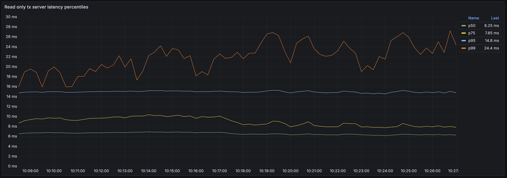



График отображает процентили задержек транзакций на чтение данных и демонстрирует рост значений p99.



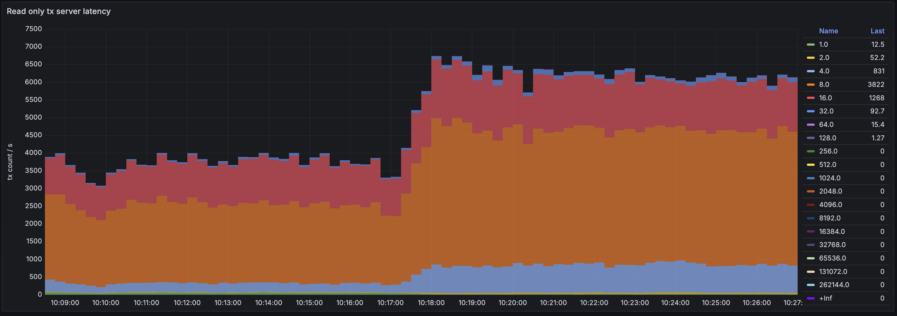



График отображает тепловую карту (heatmap) задержек транзакций на чтение данных. Транзакции группируются на основании их задержек, каждая группа (bucket) окрашивается в свой цвет. Таким образом, этот график показывает как количество транзакций, обрабатываемых {{ ydb-short-name }} в секунду (по вертикальной оси), так и распределение задержек среди транзакций (цветовая дифференциация).

К ##10:18:00## мы видим рост количества транзакций на запись начиная с `Группы 4.0`, но соотношения между группами транзакций остаются примерно одинаковыми.



Таким образом, мы видим, что задержки действительно выросли. Теперь нам необходимо локализовать проблему.

### Диагностика {#diagnostics}

Давайте определим причину роста задержек. Могли ли они увеличиться из-за возросшей нагрузки? Посмотрим на график **Requests** в секции **API details** панели мониторинга Grafana [DB overview](../../../reference/observability/metrics/grafana-dashboards.md#dboverview):

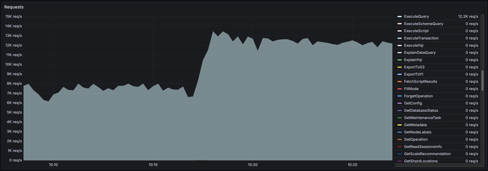

Количество пользовательских запросов выросло приблизительно с 8 000 до 13 000 в ##10:20:00##. Но может ли {{ ydb-short-name }} справиться с увеличившейся нагрузкой без дополнительных аппаратных ресурсов?

Загрузка CPU увеличилась, что видно на графике **CPU by execution pool**.

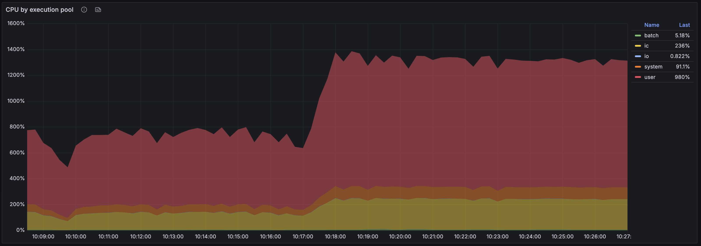

Мы видим рост нагрузки на CPU [в пуле ресурсов пользователей (красный) и интерконнекта (жёлтый)](../../../concepts/glossary.md#actor-system-pool)

Мы также можем взглянуть на общее использование CPU на вкладке **Diagnostics** в [Embedded UI](../../../reference/embedded-ui/index.md):

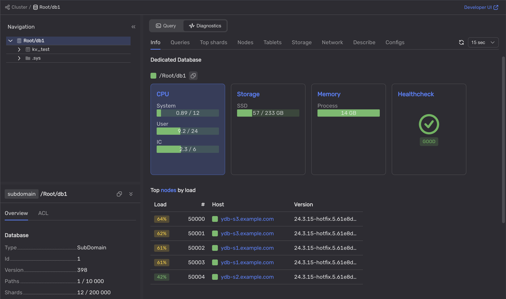

Кластер {{ ydb-short-name }} не использует все ресурсы CPU.

Взглянув на секцию **DataShard details** на панели мониторинга Grafana [DB overview](../../../reference/observability/metrics/grafana-dashboards.md#dboverview), мы увидим, что после роста нагрузки на кластер один из data shard'ов был перегружен (нагрузка на него выросла до 73%).

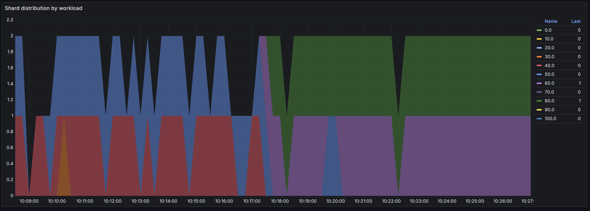



Этот график отображает тепловую карту распределения data shard'ов по нагрузке. Каждый data shard потребляет от 0% до 100% ядра CPU. Data shard'ы делятся на десять групп по занимаемой ими доле ядра CPU — 0-10%, 10-20% и т.д. Эта тепловая карта показывает количество data shard'ов в каждой группе.

График показывает два data shard'а, нагрузка на которые изменилась примерно в ##10:18:00## — один data shard перешёл в `Группу 80`, содержащую шарды, нагруженные на 70–80%, а второй — в `Группу 60` .



Чтобы определить, какую таблицу обслуживает перегруженный data shard, откроем вкладку **Diagnostics > Top shards** во встроенном UI:

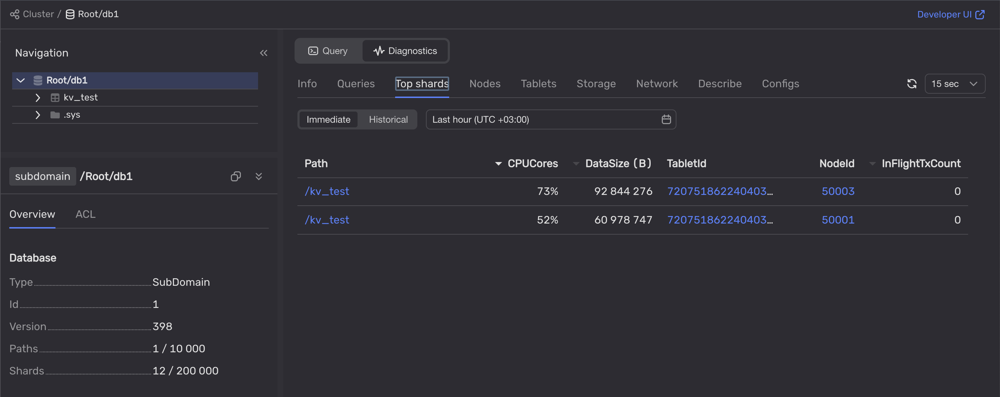

Мы видим, что один из data shard'ов, обслуживающих таблицу `kv_test`, нагружен на 73%.

Далее давайте взглянем на информацию о таблице `kv_test` на вкладке **Info**:

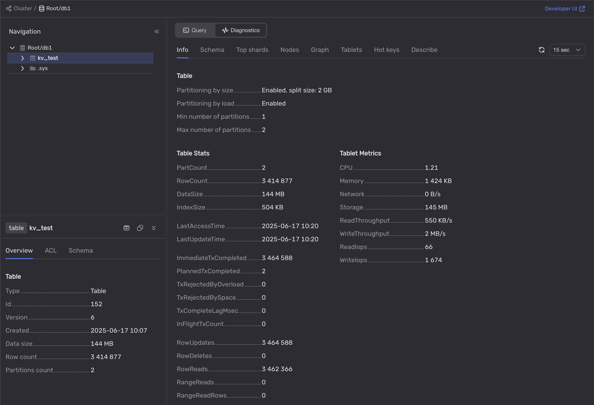



Таблица `kv_test` была создана с включённым партиционированием по нагрузке, но максимальное количество партиций ограничено двумя.

Это означает, что все запросы к этой таблице обрабатывают два data shard'а. Учитывая, что data shard'ы — это однопоточные компоненты, обрабатывающие за раз только один запрос, такой подход неэффективен.



### Решение {#solution}

Нам необходимо увеличить лимит на максимальное количество партиций для таблицы `kv_test`:

1. Во встроенном UI выберите базу данных.
2. Откройте вкладку **Query**.
3. Выполните следующий запрос:

    ```yql
    ALTER TABLE `kv_test` SET (
        AUTO_PARTITIONING_MAX_PARTITIONS_COUNT = 1000
    );
    ```

### Результат {#aftermath}

После увеличения максимального лимита на количество партиций для таблицы `kv_test` перегруженные data shard'ы начали делиться и их количество выросло до шести.

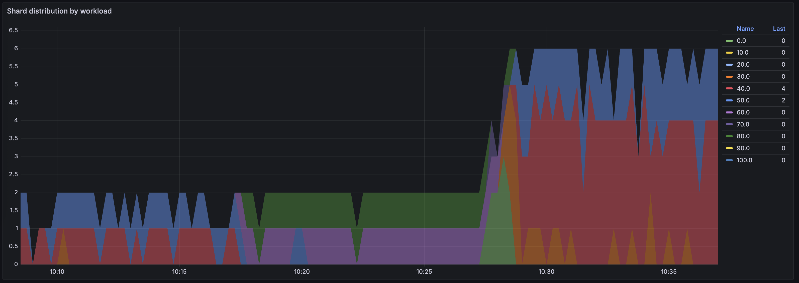



График показывает, что количество data shard'ов выросло примерно в ##10:29:00##. Судя по цвету групп, их нагрузка не превышает 50%.



Теперь шесть data shard'ов обрабатывают запросы к таблице `kv_test`, и ни один из них не перегружен:

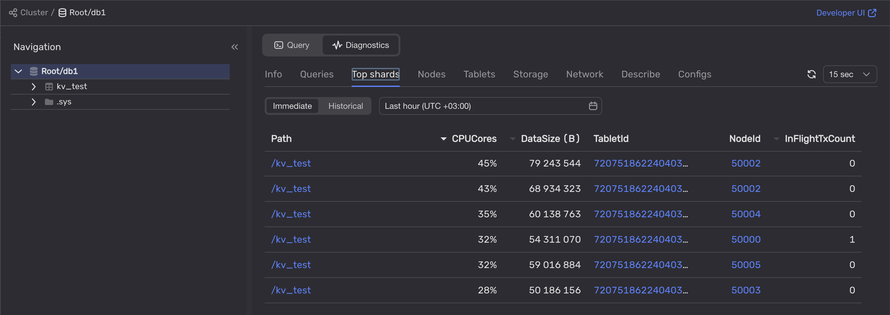

Давайте убедимся, что задержки транзакций вернулись к прежним значениям:

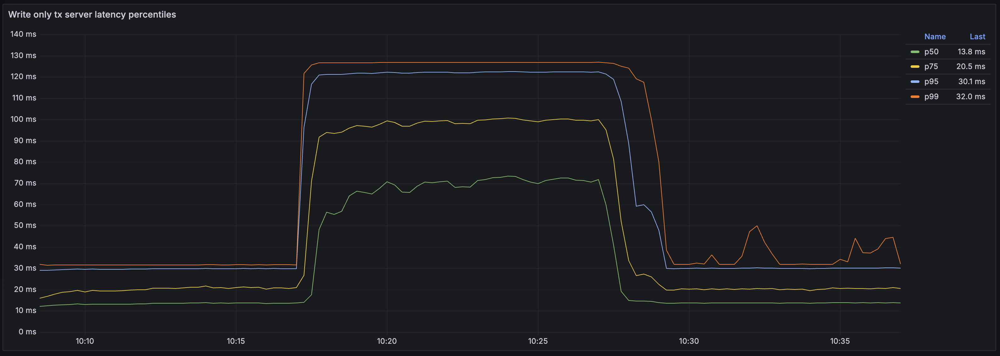



Примерно в ##10:29:00## процентили задержек упали практически до прежних значений.



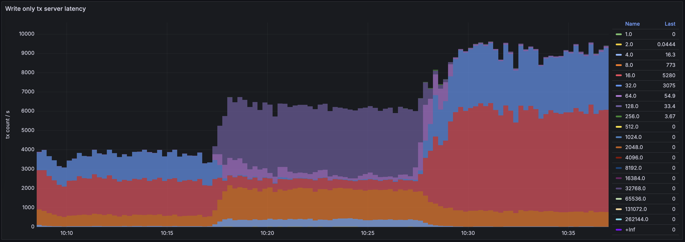



Транзакции на этом графике теперь распределены по трём основным группам:

- `Группа 8.0` — примерно 8% транзакций выполняется с задержкой от 4 до 8 миллисекунд.
- `Группа 16.0` — примерно 58% транзакций выполняется с задержкой от 8 до 16 миллисекунд.
- `Группа 32.0` — примерно 34% транзакций выполняется с задержкой от 16 до 32 миллисекунд.

Размеры остальных групп незначительны.



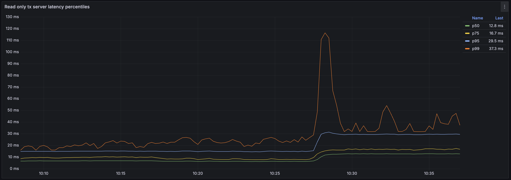

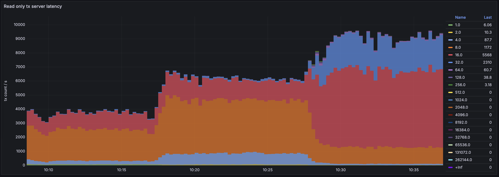

## Проблема с недостаточным количеством ядер CPU

Однако, если мы откроем диагностику во встроенном UI, то мы увидим предупреждение о том, что кластеру {{ ydb-short-name }} не хватает ресурсов процессора в пользовательском пуле:

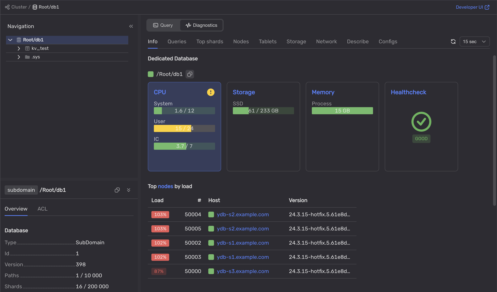

Загрузка CPU еще раз увеличилась, что видно на графике **CPU by execution pool**.

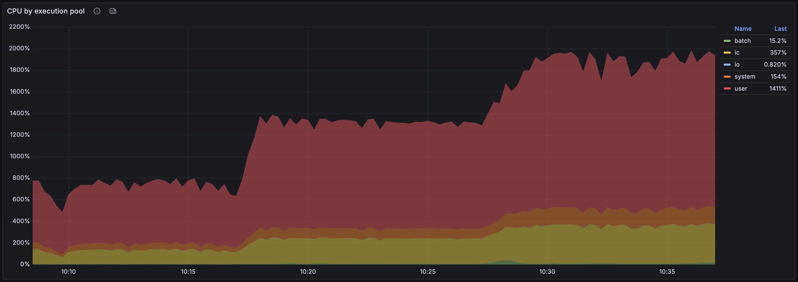

Количество пользовательских запросов выросло приблизительно с 13 000 до 18 000 в 10:30:00.

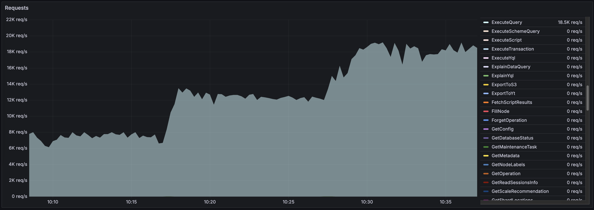

### Решение проблемы с нехваткой ресурсов CPU {#solution-cpu}

TODO: Как узнать, хватает ли ядер на сервере, какие рекомендации?

Проблему недостатка ресурсов CPU можно решить несколькими способами:

- Увеличить количество ядер для серверов, на которых запущены узлы {{ ydb-short-name }}.
- Увеличить количество ядер, доступных акторной системе узлов кластера {{ ydb-short-name }}, в конфигурации кластера.
- Добавить новые узлы в кластер {{ ydb-short-name }}.

В нашем примере мы увеличим количество ядер CPU на серверах {{ ydb-short-name }} и затем увеличим количество ядер в пуле ресурсов узлов кластера {{ ydb-short-name }} на каждом сервере:

1. Увеличить количество ядер CPU выделенных серверам {{ ydb-short-name }}. В нашем случае мы увеличили количество ядер с 16 до 24.

1. На каждом сервере {{ ydb-short-name }} изменить [динамическую конфигурацию](../../../devops/configuration-management/configuration-v1/dynamic-config.md) кластера:

    1. Открыть файл конфигурации `/opt/ydb/cfg/ydbd-config-dynamic.yaml` в текстовом редакторе:

        ```shell
        sudo vim /opt/ydb/cfg/ydbd-config-dynamic.yaml
        ```

    1. Увеличить количество ядер в параметре `cpu_count` раздела `actor_system_config`:

        ```yaml
        actor_system_config:
            use_auto_config: true
            node_type: COMPUTE
            cpu_count: 16
        ```

1. Чтобы применить новую конфигурацию, перезапустить узлы YDB с помощью утилиты [ydbops](../../../reference/ydbops/rolling-restart-scenario.md), [ansible](../../../devops/deployment-options/ansible/restart.md) или вручную.

### Результат {#aftermath-cpu}

После увеличения количества ядер CPU в кластере {{ ydb-short-name }} предупреждение о недостатке ресурсов CPU пропало:

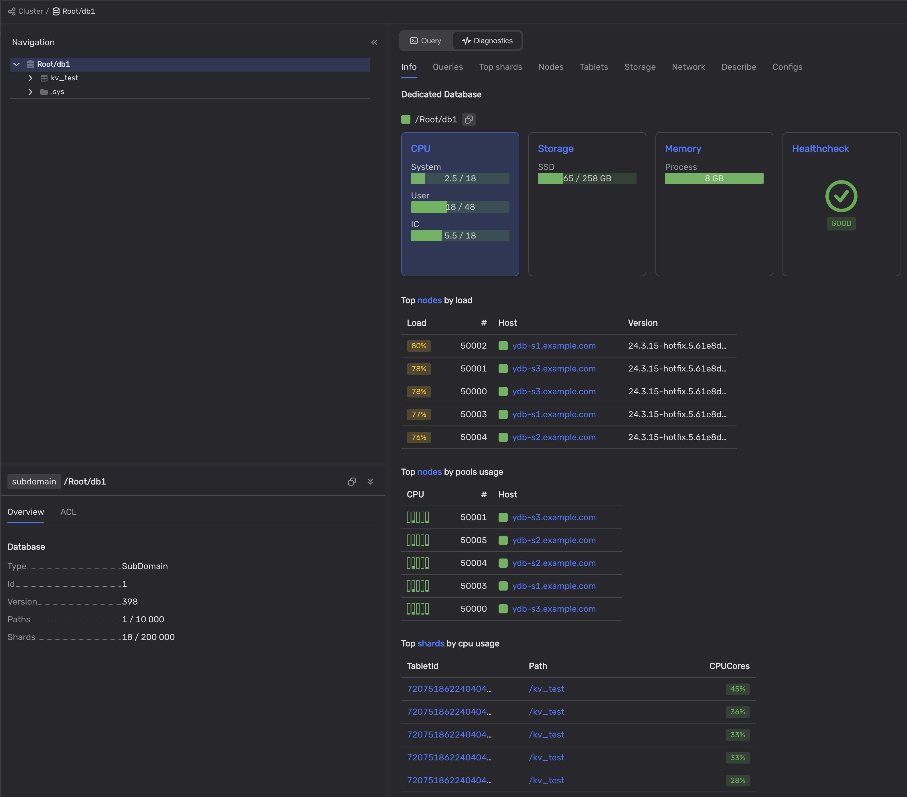

А теперь давайте проверим производительность.

Количество обрабатываемых запросов увеличилось примерно до 14-15 тысяч в секунду.

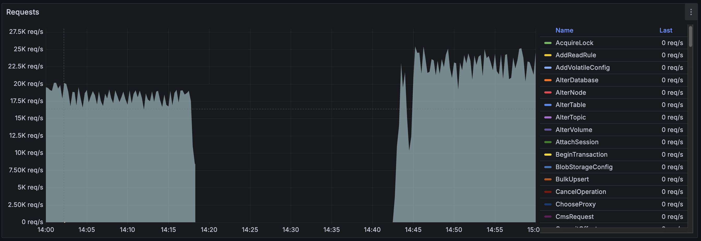

Помогло ли увеличение ядер CPU с задержками? Как мы видим, ситуация с задержками также улучшилась.

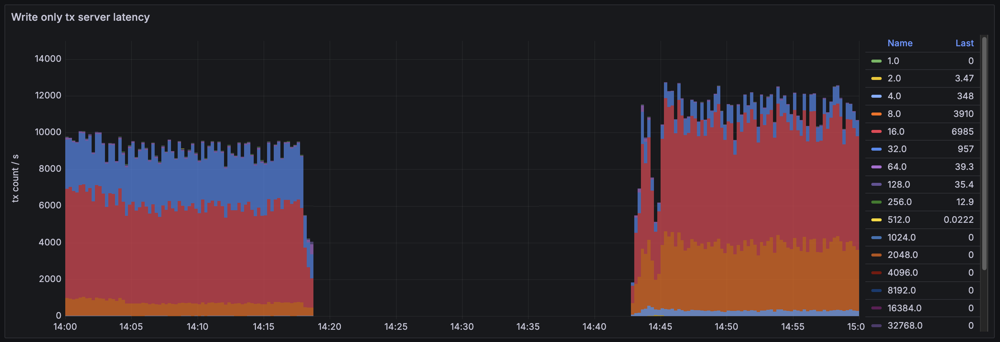



На графике опять появилась `Группа 4.0` с задержками от 4 до 2 миллисекунд. `Группа 8.0` выросла в три раза. `Группа 16.0` изменилась незначительно. Практически пропала `Группа 32.0`.



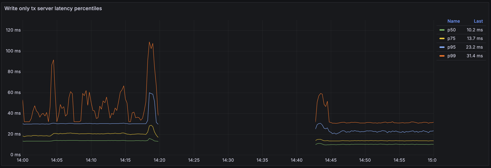



Процентили задержек на запись немного снизились, а также прекратились всплески p99.



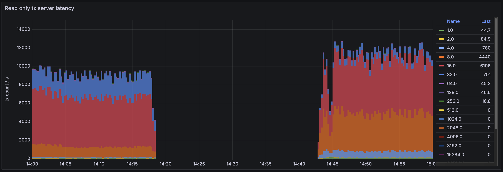



График задержек транзакций на чтение стал очень похож на график пишущих транзакций. Вернулась `Группа 4.0` с задержками от 4 до 2 миллисекунд, чья дола оказалась еще больше, чем при записи. `Группа 4.0` выросла в три раза. `Группа 16.0` изменилась незначительно. Практически пропала `Группа 32.0`.



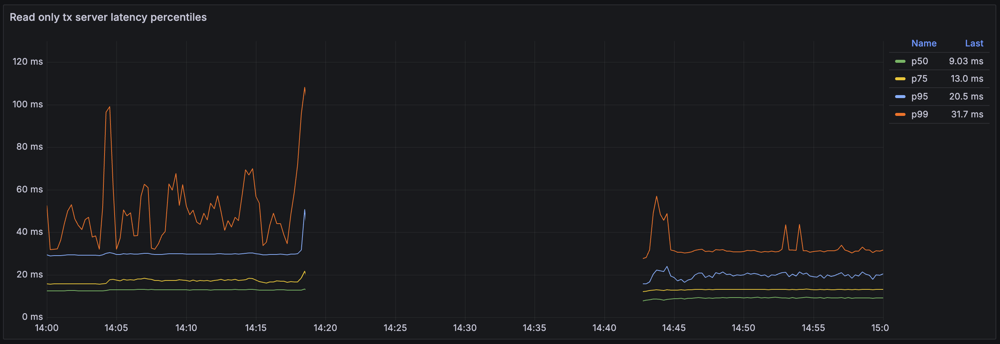



Процентили задержек на чтение тоже снизились, а также практически исчезли всплески p99.



## Тестовый стенд {#testbed}

### Топология

Для этого примера мы использовали кластер {{ ydb-short-name }} из трёх серверов на Ubuntu 22.04 LTS. На каждом сервере был запущен один [узел хранения](../../../concepts/glossary.md#storage-node) и три [узла баз данных](../../../concepts/glossary.md#database-node), обслуживающих одну и ту же базу данных.

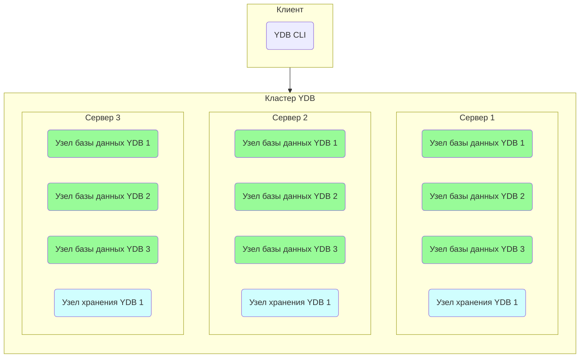
```mermaid
flowchart

subgraph client[Клиент]
    cli(YDB CLI)
end

client-->cluster

subgraph cluster["Кластер YDB"]
    direction TB
    subgraph S1["Сервер 1"]
        node1(Узел базы данных YDB 1)
        node2(Узел базы данных YDB 2)
        node3(Узел базы данных YDB 3)
        node4(Узел хранения YDB 1)
    end
    subgraph S2["Сервер 2"]
        node5(Узел базы данных YDB 1)
        node6(Узел базы данных YDB 2)
        node7(Узел базы данных YDB 3)
        node8(Узел хранения YDB 1)
    end
    subgraph S3["Сервер 3"]
        node9(Узел базы данных YDB 1)
        node10(Узел базы данных YDB 2)
        node11(Узел базы данных YDB 3)
        node12(Узел хранения YDB 1)
    end
end

classDef storage-node fill:#D0FEFE
classDef database-node fill:#98FB98
class node4,node8,node12 storage-node
class node1,node2,node3,node5,node6,node7,node9,node10,node11 database-node
```

### Аппаратная конфигурация

Аппаратные ресурсы серверов (виртуальных машин) приведены ниже:

- Платформа: Intel Broadwell
- Гарантированный уровень производительности vCPU: 100%
- vCPU: 16
- Память: 32 GB
- Диски:
    - 3 × 93 GB SSD на каждом узле {{ ydb-short-name }}
    - 20 GB HDD для операционной системы


### Тест

Нагрузка на кластер {{ ydb-short-name }} была запущена с помощью команды CLI `ydb workload`. Дополнительную информацию см. в статье [{#T}](../../../reference/ydb-cli/commands/workload/index.md).

Чтобы воспроизвести нагрузку, выполните следующие шаги:

1. Проинициализируйте таблицы для нагрузочного тестирования:

    ```shell
    ydb workload kv init --min-partitions 1
    ydb yql -s 'ALTER TABLE `kv_test` SET (
        AUTO_PARTITIONING_MAX_PARTITIONS_COUNT = 2
    );'
    ```

    Мы намеренно ограничиваем максимальное количество партиций в таблице `kv_test` до 2 после инициализации.

1. Воспроизведите стандартную нагрузку на кластер {{ ydb-short-name }}:

    ```shell
    ydb workload kv run mixed -s 600 -t 250 --rate 8000
    ```

    Мы запустили простую нагрузку, используя базу данных {{ ydb-short-name }} как Key-Value хранилище. Точнее, мы использовали нагрузку `mixed`, которая одновременно пишет и читает данные, дополнительно проверяя что все записанные данные успешно читаются.

    Параметр `-t 250` используется для запуска нагрузочного тестирования в 250 потоков. Параметр `--rate 8000` используется для ограничение максимального количества запросов до 8000 запросов в секунду.

3. Создайте перегрузку на кластере {{ ydb-short-name }}:

    ```shell
    ydb workload kv run mixed -s 600 -t 400
    ```

    Как только первый тест завершился, мы немедленно запустили тот же самый тест в 400 потоков без ограничения максимального количества запросов в секунду, чтобы создать перегрузку.

## Смотрите также

- [{#T}](../../performance/index.md)
- [{#T}](../../performance/schemas/overloaded-shards.md)
- [{#T}](../../../concepts/datamodel/table.md#row-oriented-tables)
