# Пример диагностики перегруженных шардов

В этой статье описывается пример диагностики перегруженных шардов и решение этой проблемы.

Дополнительную информацию о перегруженных шардах и причинах их перегрузки см. в статье [{#T}](../../performance/schemas/overloaded-shards.md).

Статья начинается с [описания возникшей проблемы](#initial-issue). Затем мы проанализируем графики в Grafana и информацию на вкладке **Diagnostics** в [Embedded UI](../../../reference/embedded-ui/index.md) для [решения проблемы](#solution) и проверим [решение проблемы в действии](#aftermath).

В конце статьи приводятся шаги по [воспроизведению проблемы](#testbed).

## Описание проблемы {#initial-issue}

Вас уведомили о задержках при обработке пользовательских запросов в вашей системе.



Речь идёт о запросах к [строковой таблице](../../../concepts/datamodel/table.md#row-oriented-tables), управляемой [data shard](../../../concepts/glossary.md#data-shard)'ом.



Рассмотрим графики **Latency** на панели мониторинга Grafana [DB overview](../../../reference/observability/metrics/grafana-dashboards.md#dboverview) и определим, имеет ли отношение наша проблема к кластеру {{ ydb-short-name }}:

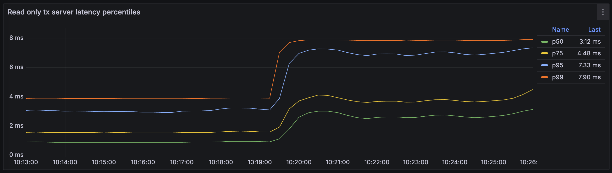



График отображает процентили задержек транзакций. Примерно в ##10:19:30## эти значения выросли в два-три раза.



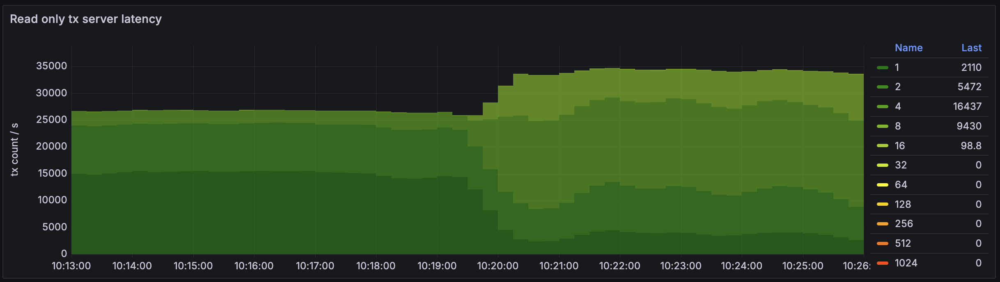



График отображает тепловую карту (heatmap) задержек транзакций. Транзакции группируются на основании показаний их задержек, каждая группа (bucket) окрашивается в свой цвет. Таким образом этот график показывает как количество транзакций, обрабатываемых {{ ydb-short-name }} в секунду (по вертикальной оси), так и распределение задержек среди транзакций (цветовая дифференциация).

К ##10:20:30## доля транзакций с минимальными задержками (`Группа 1`, тёмно-зеленый) упала в четыре-пять раз. `Группа 4` выросла примерно в пять раз, а также выделилась новая группа транзакций с еще более высокими задержками – `Группа 8`.



Таким образом мы видим, что задержки действительно выросли. Теперь нам необходимо локализовать проблему.

## Диагностика {#diagnostics}

Давайте определим причину роста задержек. Могли ли задержки вырасти из-за увеличившейся нагрузки? Посмотрим на график **Requests** в секции **API details** панели мониторинга Grafana [DB overview](../../../reference/observability/metrics/grafana-dashboards.md#dboverview):

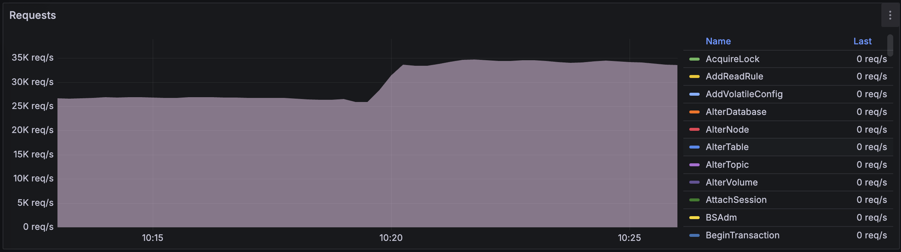

Количество пользовательских запросов выросло приблизительно с 27,000 до 35,000 в ##10:20:00##. Но может ли {{ ydb-short-name }} справиться с увеличившейся нагрузкой без дополнительных аппаратных ресурсов?

Загрузка CPU увеличилась, это видно на графике **CPU by execution pool**.

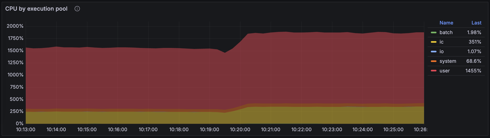



Графики на панели мониторинга Grafana **CPU** показывают рост нагрузки на CPU [в пуле ресурсов пользователей и интерконнекта](../../../concepts/glossary.md#actor-system-pool):

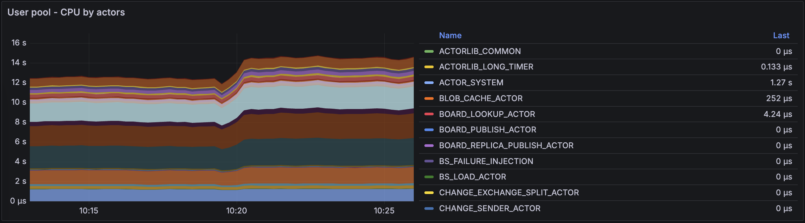

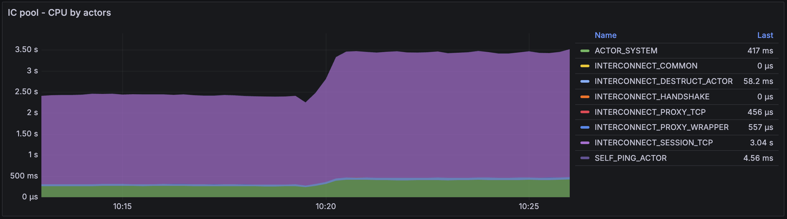

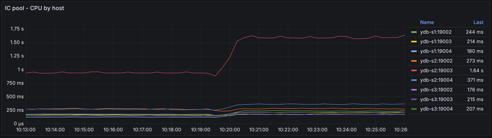



Мы также можем взглянуть на общее использование CPU на вкладке **Diagnostics** в [Embedded UI](../../../reference/embedded-ui/index.md):

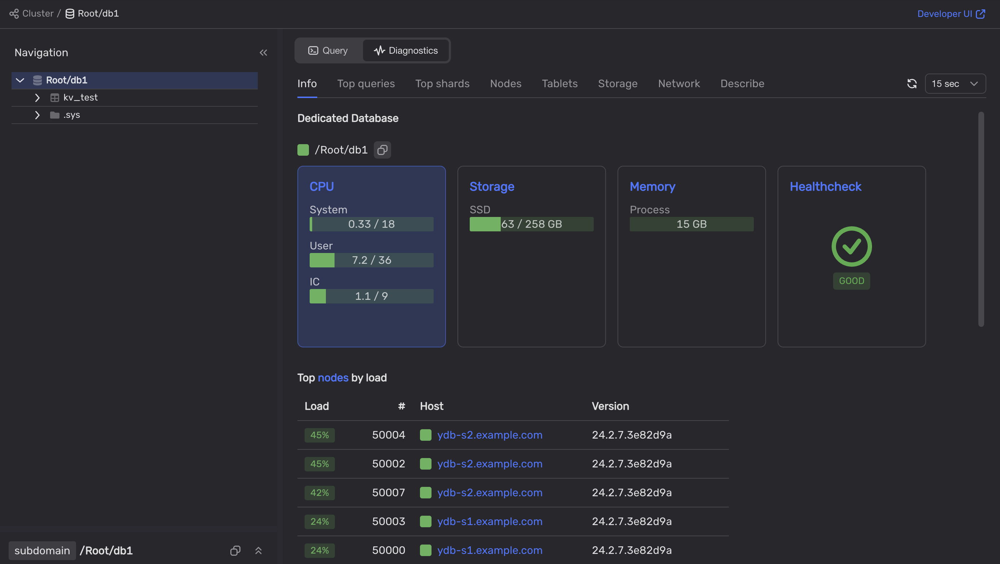

Кластер {{ ydb-short-name }} не использует все ресурсы CPU.

Взглянув на секции **DataShard** и **DataShard details** на панели мониторинга Grafana [DB overview](../../../reference/observability/metrics/grafana-dashboards.md#dboverview) мы увидим, что после роста нагрузки на кластер, один из data shard'ов был перегружен.

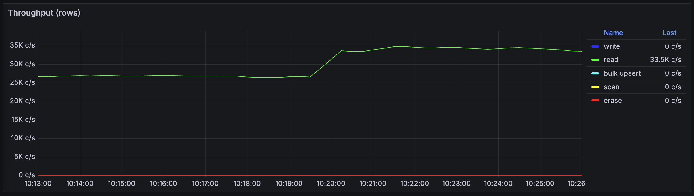



Этот график показывает, что количество читаемых строк в базе данных {{ ydb-short-name }} увеличилось от ~26,000 до ~33,500 строк в секунду.



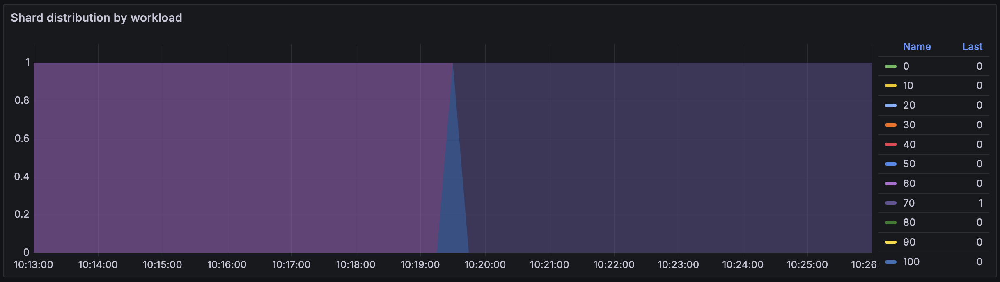



Этот график отображает тепловую карту распределения data shard'ов по нагрузке. Data shard'ы делятся на десять групп на основании доли их текущей нагрузки в общей вычислительной мощности. Эта тепловая карта позволяет увидеть сколько data shard'ов выполняется на вашем кластере {{ ydb-short-name }} и какова их нагрузка.

График показывает только один data shard, нагрузка на который изменилась примерно в ##10:19:30## — data shard перешёл в `Группу 70`, которая содержит шарды, нагруженные на 60-70%.



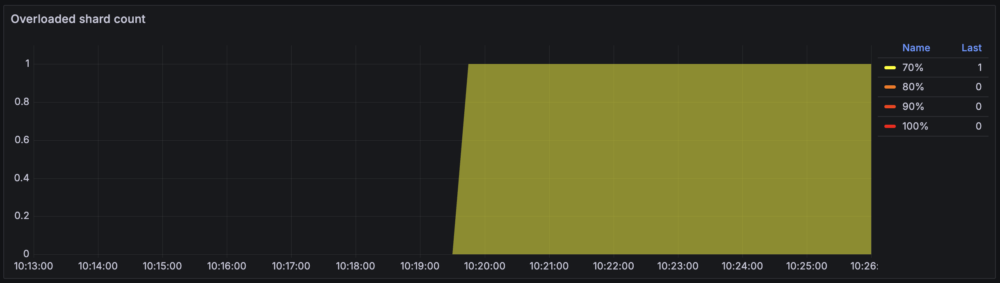



По аналогии с предыдущим графиком, **Overloaded shard count** – это тепловая карта распределения data shard'ов по нагрузке. Но этот график показывает только data shard'ы с нагрузкой, превышающей 60%.

График показывает, что нагрузка на один data shard увеличилась до 70% примерно в ##10:19:30##.



Чтобы определить какую таблицу обслуживает перегруженный data shard, откроем вкладку **Diagnostics > Top shards** во встроенном UI:

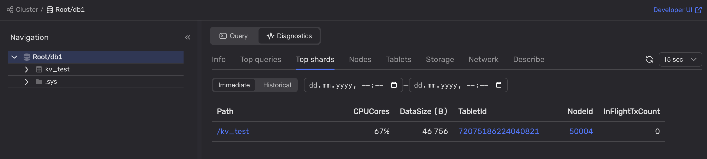

Мы видим, что один из data shard'ов обслуживающих таблицу `kv_test` нагружен на 67%.

Далее, давайте взглянем на информацию о таблице `kv_test` на вкладке **Info**:

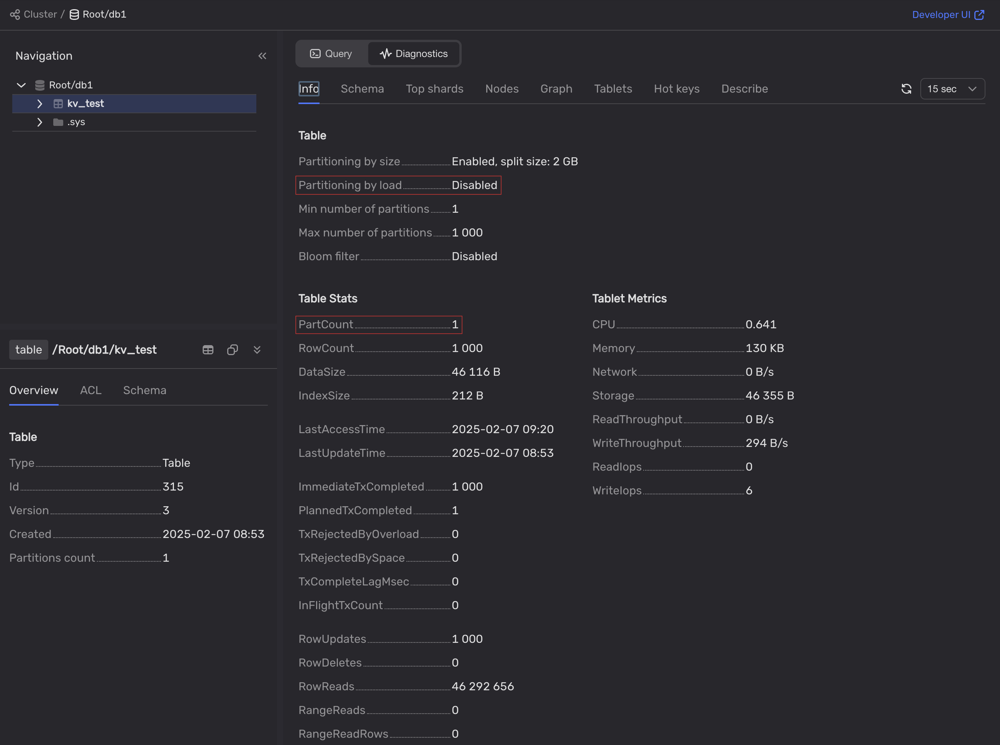



Таблица `kv_test` была создана с отключенным партиционированием по нагрузке и содержит только одну партицию.

Это означает, что только один data shard обрабатывает все запросы к этой таблице. Учитывая, что data shard'ы – это однопоточные компоненты и обрабатывают за раз только один запрос, это плохая идея.



## Решение {#solution}

Нам необходимо включить партиционирование по нагрузке для таблицы `kv_test`:

1. Во встроенном UI, выберите базу данных.
2. Откройте вкладку **Query**.
3. Выполните следующий запрос:

    ```yql
    ALTER TABLE kv_test SET (
        AUTO_PARTITIONING_BY_LOAD = ENABLED
    );
    ```

## Результат {#aftermath}

После включения автоматического партиционирования для таблицы `kv_test`, перегруженный data shard разделился на два.

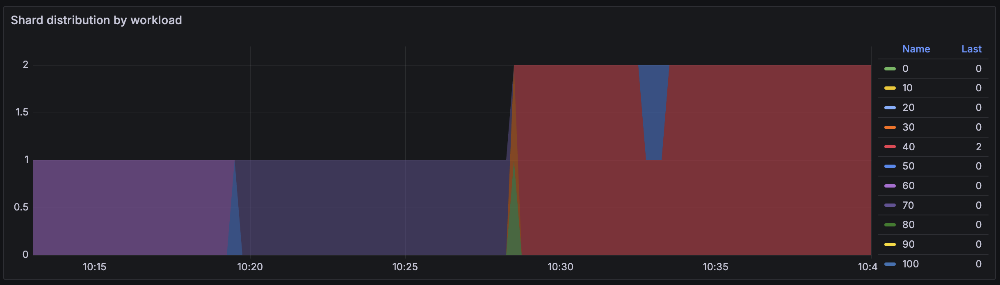



График показывает, что количество data shard'ов выросло примерно в ##10:28:00##. Судя по цвету групп, их нагрузка не превышает 40%.



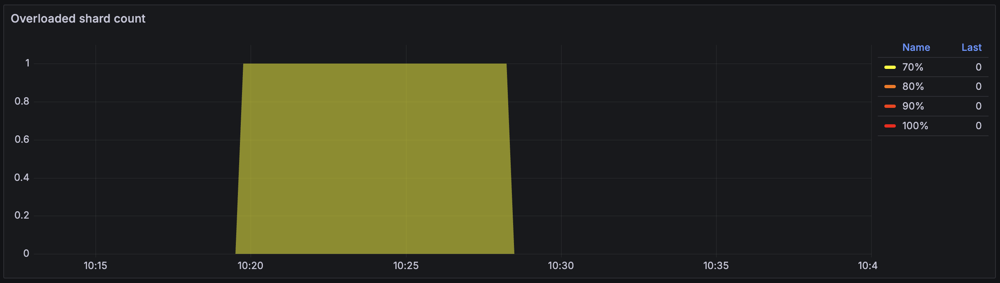



Перегруженный шард пропал на графике примерно в ##10:28:00##.



Теперь два data shard'а обрабатывают запросы к таблице `kv_test` и ни один из них не перегружен:

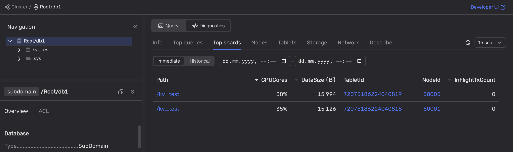

Давайте убедимся что задержки транзакций вернулись к прежним значениям:

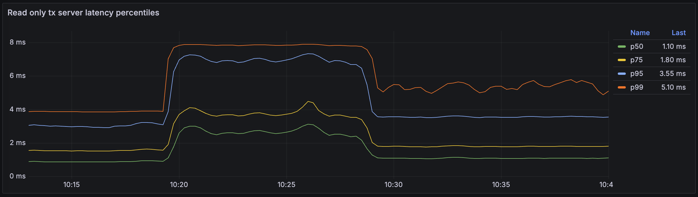



Примерно в ##10:28:00##, процентили задержек p50, p75 и p95 упали практически до прежних значений. Задержки p99 упали не настолько значительно, но всё равно, сократились в два раза.



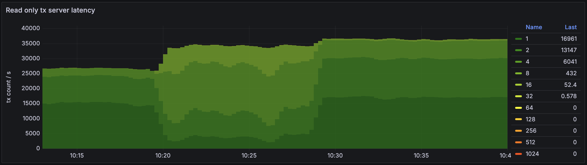



Транзакции на этом графике теперь разбились на шесть групп. Примерно половина транзакций вернулись в `Группу 1`, то есть их задержки не превышают одну миллисекунду. Больше чем треть транзакций находятся в `Группе 2` с задержками между одной и двумя миллисекундами. Одна шестая транзакций – в `Группе 4`. Размеры других групп незначительны.



Задержки почти вернулись на уровень до увеличения нагрузки. Мы не увеличили расходы на приобретение дополнительных аппаратных ресурсов. Мы просто включили автоматическое партиционирование по нагрузке, что позволило более эффективно использовать доступные ресурсы.

#|
|| Имя группы
| Задержки, мс
|
Один перегруженный data shard,
транзакций в секунду
|
Несколько data shard'ов,
транзакций в секунду
||
|| 1
| 0-1
| 2110
| <span style="color:teal">▲</span> 16961
||
|| 2
| 1-2
| 5472
| <span style="color:teal">▲</span> 13147
||
|| 4
| 2-4
| 16437
| <span style="color:navy">▼</span> 6041
||
|| 8
| 4-8
| 9430
| <span style="color:navy">▼</span> 432
||
|| 16
| 8-16
| 98.8
| <span style="color:navy">▼</span> 52.4
||
|| 32
| 16-32
| —
| <span style="color:teal">▲</span> 0.578
||
|#

## Тестовый стенд {#testbed}

### Топология

Для этого примера мы использовали кластер {{ ydb-short-name }} из трёх серверов на Ubuntu 22.04 LTS. На каждом сервере был запущен один [узел хранения](../../../concepts/glossary.md#storage-node) и три [узла баз данных](../../../concepts/glossary.md#database-node), обслуживающих одну и ту же базу данных.

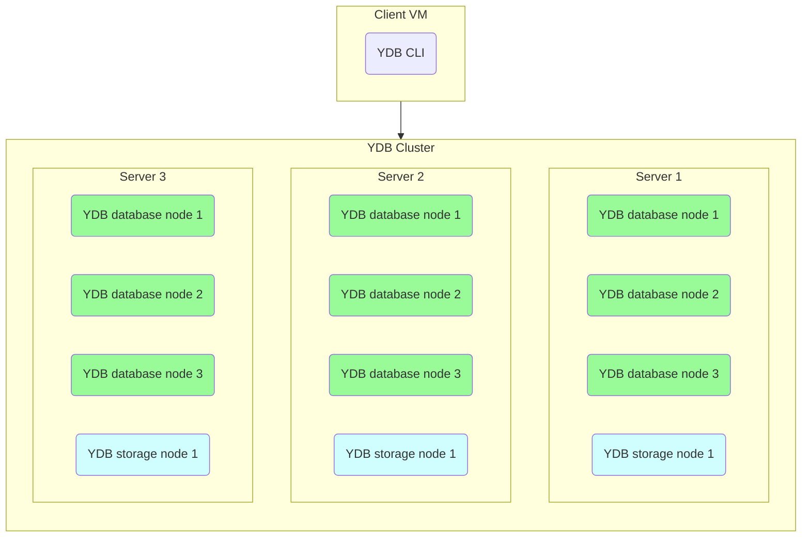

### Аппаратная конфигурация

Аппаратные ресурсы серверов (виртуальных машин) приведены ниже:

- Платформа: Intel Broadwell
- Гарантированный уровень производительности vCPU: 100%
- vCPU: 28
- Память: 32 GB
- Диски:
    - 3 x 93 GB SSD на каждом узле {{ ydb-short-name }}
    - 20 GB HDD для операционной системы


### Тест

Нагрузка на кластер {{ ydb-short-name }} была запущена с помощью команды CLI `ydb workload`. Дополнительную информацию см. в статье [{#T}](../../../reference/ydb-cli/commands/workload/index.md).

Чтобы воспроизвести нагрузку, выполните следующие шаги:

1. Проинициализируйте таблицы для нагрузочного тестирования:

    ```shell
    ydb workload kv init --min-partitions 1 --auto-partition 0
    ```

    Мы намеренно отключаем автоматическое партиционирование для создаваемых таблиц используя опции `--min-partitions 1 --auto-partition 0`.

1. Воспроизведите стандартную нагрузку на кластер {{ ydb-short-name }}:

    ```shell
    ydb workload kv run select -s 600 -t 100
    ```

    Мы запустили простую нагрузку с использованием базы данных {{ ydb-short-name }} как Key-Value хранилище. Точнее, мы использовали нагрузку `select` для создания SELECT-запросов, возвращающих строки по точному совпадению primary ключа.

    Параметр `-t 100` используется для запуска нагрузочного тестирования в 100 потоков.

3. Создайте перегрузку на кластере {{ ydb-short-name }}:

    ```shell
    ydb workload kv run select -s 1200 -t 250
    ```

    Как только первый тест завершился мы немедленно запустили тот-же самый тест в 250 потоков, чтобы создать перегрузку.

## Смотрите также

- [{#T}](../../performance/index.md)
- [{#T}](../../performance/schemas/overloaded-shards.md)
- [{#T}](../../../concepts/datamodel/table.md#row-oriented-tables)