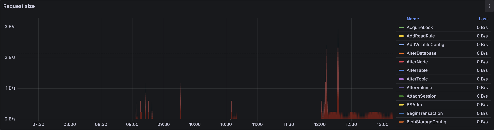

1. Используйте вкладку **Diagnostics** во [встроенном UI](../../../../reference/embedded-ui/index.md) для анализа загрузки процессора во всех пулах ресурсов:

    1. Откройте [встроенный UI](../../../../reference/embedded-ui/index.md), перейдите на вкладку **Databases** и нажмите на требуемую базу данных.

    1. На вкладке **Navigation** убедитесь, что требуемая база данных выбрана.

    1. Откройте вкладку **Diagnostics**.

    1. На вкладке **Info** нажмите на кнопку **CPU** и проверьте уровни загрузки процессора во всех пулах ресурсов.

        
1. Проанализируйте загрузку процессора во всех пулах ресурсов на графиках Grafana:

    1. Откройте панель мониторинга **[CPU](../../../../reference/observability/metrics/grafana-dashboards.md#cpu)** в Grafana.

    1. Проверьте наличие скачков на следующих графиках:

        - **CPU by execution pool**

            

        - **User pool - CPU by host**

            

        - **System pool - CPU by host**

            

        - **Batch pool - CPU by host**

            

        - **IC pool - CPU by host**

            

        - **IO pool - CPU by host**

            

1. Если скачки потребления ресурсов процессора обнаружены в пользовательском пуле ресурсов (user pool), проанализируйте изменения пользовательской нагрузки, которые могли бы вызвать недостаток ресурсов процессора. Проверьте следующие графики на панели мониторинга **DB overview** в Grafana:

    - **Requests**

        

    - **Request size**

        

    - **Response size**

        

    Также проверьте все графики в секции **Operations** на панели мониторинга **DataShard**.

1. Если скачки потребления ресурсов процессора обнаружены в пакетном пуле ресурсов (batch pool), проверьте, не запущены ли процессы резервного копирования (backups).
