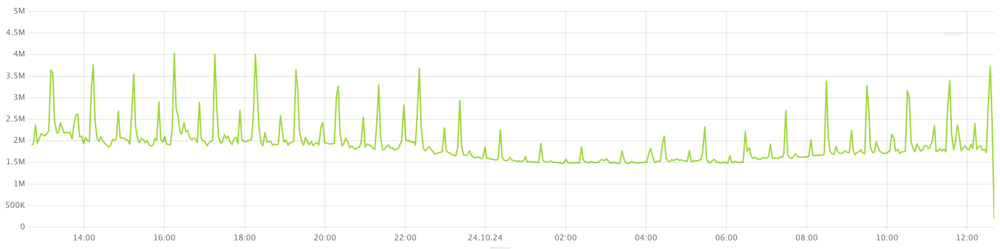

1. Откройте панель мониторинга **[Distributed Storage Overview](../../../../reference/observability/metrics/grafana-dashboards.md)** в Grafana.

1. На графике **DiskTimeAvailable and total Cost relation** проверьте, пересекают ли всплески **Total Cost** уровень **DiskTimeAvailable**.

    

    Этот график показывает ориентировочную суммарную пропускную способность системы хранения в условных единицах (зелёный) и суммарную стоимость использования в условных единицах (синий). Когда суммарная стоимость использования системы хранения превышает суммарную пропускную способность, система хранения {{ ydb-short-name }} перегружается, и задержки выполнения запросов растут.

1. На графике **Total burst duration** проверьте наличие всплесков в системе хранения. Этот график показывает микровсплески нагрузки на систему хранения, в микросекундах.

    

    

    Этот график может выявить микровсплески нагрузки, которые не проявляются на графике со средней стоимостью использования **Cost and DiskTimeAvailable relation**.

    
