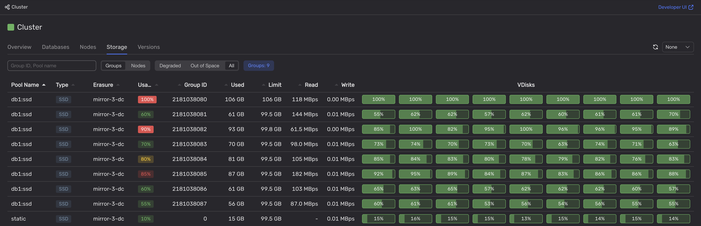

# Недостаточное дисковое пространство

Нехватка места на диске может привести к невозможности сохранения новых данных, когда база переходит в режим только для чтения. Эта проблема может также приводить к замедлению работы, когда система пытается освободить дисковое пространство, активнее приводя данные к более компактному виду в фоне.

## Диагностика

1. Проверьте наличие скачков на графиках панели мониторинга **[DB overview > Storage](../../../reference/observability/metrics/grafana-dashboards.md#dboverview)** в Grafana.

1. Во [встроенном UI](../../../reference/embedded-ui/index.md) на вкладке **Storage** проанализируйте список доступных групп хранения и их потребление места на диске.

    

    Используйте фильтр **Out of Space**, чтобы отображать только группы хранения с заполненными дисками.

    

    



Чтобы получить эту информацию, можно также использовать [Healthcheck API](../../../reference/ydb-sdk/health-check-api.md).



## Рекомендации

Добавьте больше [групп хранения](../../../concepts/glossary.md#storage-group) в базу данных.

Если у кластера нет свободных групп хранения, необходимо их предварительно сконфигурировать. При необходимости добавьте дополнительные [узлы хранения](../../../concepts/glossary.md#storage-node).
