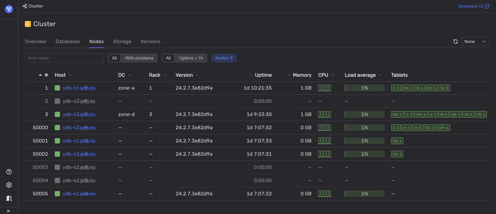

Чтобы установить недоступность одного из датацентров кластера {{ ydb-short-name }}, выполните следующие шаги:

1. Откройте [Встроенный UI](../../../../reference/embedded-ui/index.md).

1. На вкладке **Nodes** проанализируйте [индикаторы состояния](../../../../reference/embedded-ui/ydb-monitoring.md#colored_indicator) в колонках **Host** и **DC**.

    

    Если все узлы в одном из датацентров недоступны, то в этом датацентре, скорее всего, произошёл сбой.

    В противном случае, посмотрите на колонку **Rack** и проверьте статус узлов {{ ydb-short-name }} в каждой серверной стойке. Эта информация поможет определить недоступность отдельных серверных стоек, что можно классифицировать как частичный сбой в работе датацентра.
