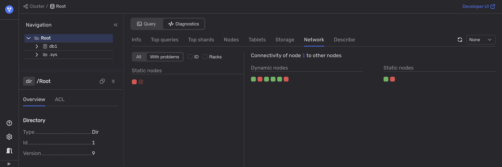

Для диагностики сетевых проблем используйте опцию healthcheck во [Встроенном UI](../../../../reference/embedded-ui/index.md):

1. Откройте [Встроенный UI](../../../../reference/embedded-ui/index.md):

    1. Перейдите во вкладку **Databases** и выберите необходимую базу данных.

    1. На вкладке **Navigation** убедитесь, что выбрана нужная база данных.

    1. Откройте вкладку **Diagnostics**.

    1. На вкладке **Network** включите фильтр **With problems**.

        

2. Используйте другие доступные инструменты для мониторинга таких метрик сети как задержки, джиттер, потеря пакетов, пропускная способность и др.
