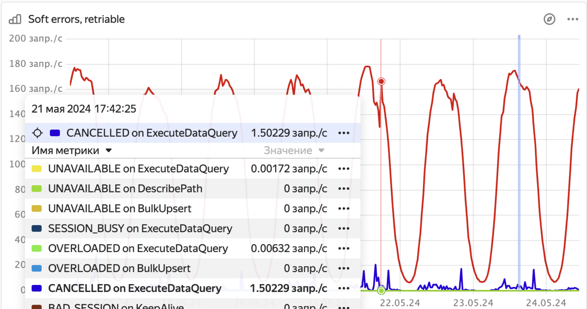

1. Откройте панель мониторинга Grafana **[DB overview](../../../../reference/observability/metrics/grafana-dashboards.md#dboverview)**.

1. В разделе **API details** проверьте, есть ли всплески частоты запросов со статусом `OVERLOADED` на диаграмме **Soft errors (retriable)**.

    

1. Чтобы проверить, не связаны ли всплески ошибок `OVERLOADED` с превышением лимита в 15000 запросов на партицию таблицы:

    1. Во [Встроенном UI](../../../../reference/embedded-ui/index.md) перейдите на вкладку **Databases** и нажмите на базу данных.

    1. На вкладке **Navigation** убедитесь, что требуемая база данных выбрана.

    1. Откройте вкладку **Diagnostics**.

    1. Откройте вкладку **Top shards**.

    1. На вкладках **Immediate** и **Historical** отсортируйте таблетки по столбцу **InFlightTxCount** и проверьте, не превышают ли максимальные значения лимит в 15000 запросов.

1. Чтобы проверить, не связаны ли всплески ошибок `OVERLOADED` со слишком частыми слияниями и разделениями таблеток, см. [{#T}](../../schemas/splits-merges.md).

1. Чтобы проверить, не связаны ли всплески ошибок `OVERLOADED` с превышением лимита в 1000 открытых сессий, см. диаграмму **Session count by host** на панели мониторинга Grafana **[DB status](../../../../reference/observability/metrics/grafana-dashboards.md#dbstatus)**.

1. См. статью [{#T}](../../schemas/overloaded-shards.md).
