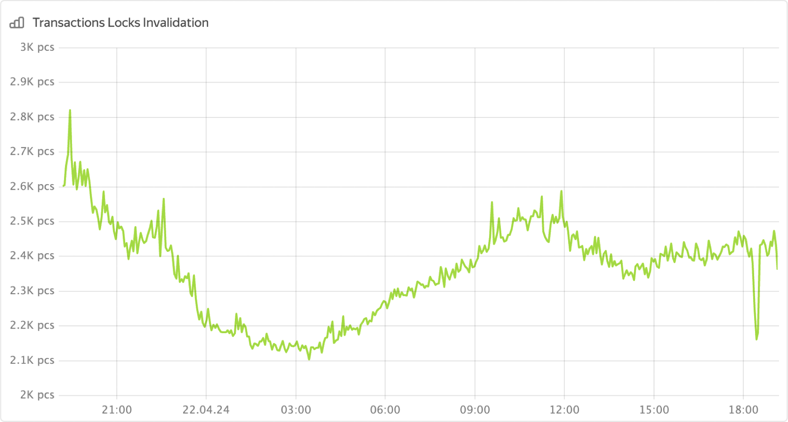

1. Откройте панель мониторинга **[DB overview](../../../../reference/observability/metrics/grafana-dashboards.md#dboverview)** в Grafana.

1. Проверьте, есть ли всплески количества ошибок на диаграмме **Transaction Locks Invalidation**.

    

    Эта диаграмма отображает количество запросов в секунду, возвращаемых с ошибкой «transaction locks invalidation».
